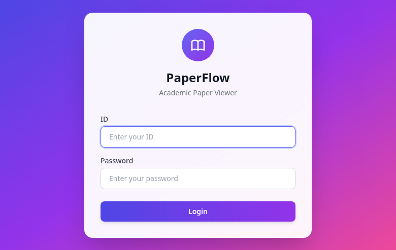
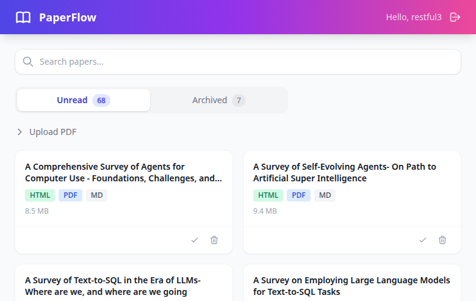
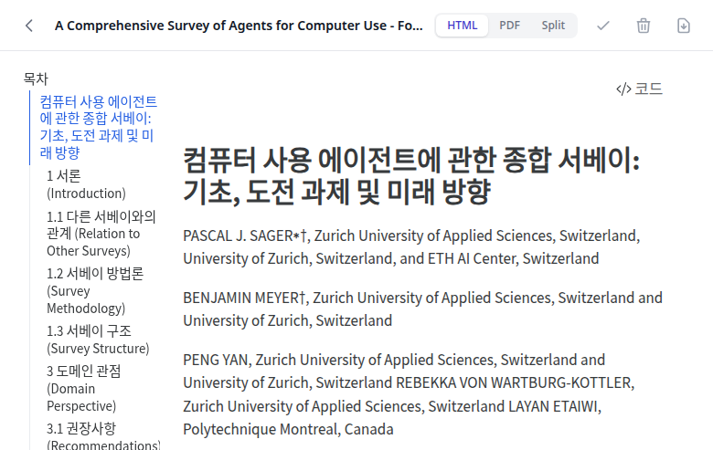
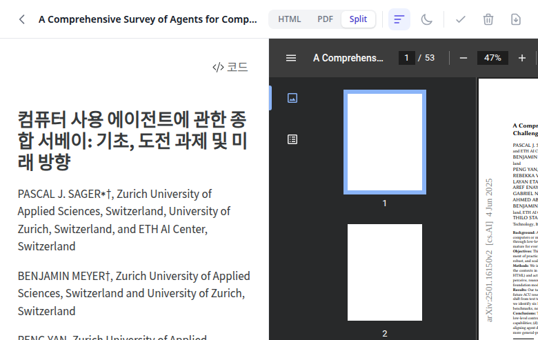
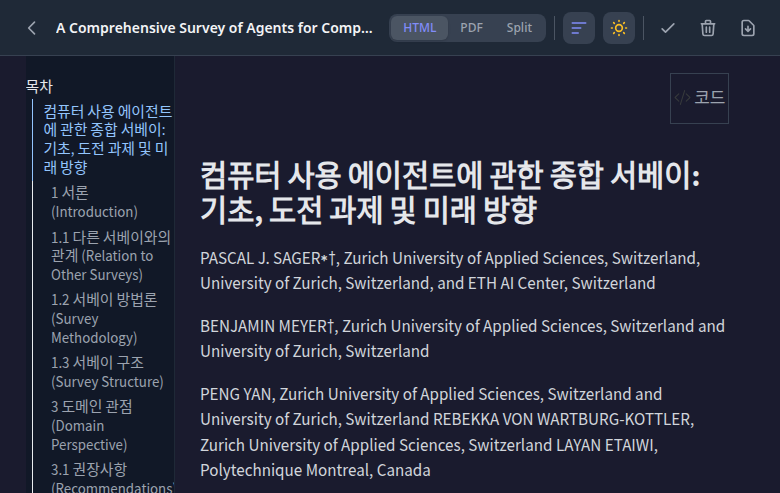

# PaperFlow

<div align="center">


**PDF 학술 논문을 Markdown으로 변환하고, 한국어로 번역한 후, HTML로 렌더링하는 완전 로컬 자동화 파이프라인**

[📖 프로젝트 개요](#-프로젝트-개요) • [📸 스크린샷](#-스크린샷) • [✨ 주요 기능](#-주요-기능) • [🚀 빠른 시작](#-빠른-시작) • [⚙️ 설정](#%EF%B8%8F-설정) • [🏗️ 아키텍처](#%EF%B8%8F-아키텍처) • [🔧 문제 해결](#-문제-해결)

</div>

---

## 📖 프로젝트 개요

PaperFlow는 세 개의 핵심 컴포넌트로 구성됩니다:

| 컴포넌트 | 위치 | 역할 |
|----------|------|------|
| **PDF 변환기** | `main_terminal.py` | PDF → Markdown → 한국어 → HTML 변환 파이프라인 |
| **웹 뷰어** | `viewer/` | FastAPI + TailwindCSS + Alpine.js 기반 논문 열람/관리 UI |
| **Streamlit 뷰어** (레거시) | `app.py` | Streamlit 기반 기존 뷰어 |

**기술 스택**:
- **변환**: marker-pdf (PDF→MD), Ollama (로컬 LLM 번역), Quarto (HTML 렌더링)
- **뷰어**: FastAPI, Jinja2, TailwindCSS (CDN), Alpine.js (CDN), JWT 인증

**✨ 완전 로컬 처리**: 외부 API 호출 없이 모든 처리가 로컬 머신에서 실행됩니다.

## 📸 스크린샷

<details>
<summary><b>웹 뷰어 UI (클릭하여 펼치기)</b></summary>

### 로그인 페이지


### 논문 목록 (Unread/Archived 탭)


### 논문 뷰어 - 단일 보기 (Korean HTML)


### 논문 뷰어 - 분할 보기 (Korean HTML + English PDF)


### 다크 모드 + TOC


</details>

## 🔄 처리 파이프라인

```
PDF (원본)
  | marker-pdf (GPU, CUDA/MPS)
  v
Markdown (영문) + 이미지(JPEG) + 메타데이터(JSON)
  | Ollama (로컬 LLM, 구조 인식 청킹)
  v
Markdown (한국어) + YAML 헤더
  | Quarto (자동 폴백 포함)
  v
HTML (자체 완결형, 이미지/CSS 임베딩)
```

### 파이프라인 상세

1. **PDF → Markdown** (`convert_pdf_to_md()`): marker-pdf 라이브러리로 텍스트, 이미지, 메타데이터 추출. GPU 전용 (CUDA/MPS). 변환 후 ~4-8GB VRAM 해제.
2. **Markdown 청킹** (`split_markdown_by_structure()`): markdown-it-py로 헤더, 코드 블록, 수식을 보존하며 구조 인식 분할. 파싱 실패 시 토큰 기반 분할로 폴백.
3. **한국어 번역** (`translate_md_to_korean()`): Ollama API로 청크 단위 번역. 재시도 로직 포함. 번역 후 `keep_alive: 0`으로 ~22GB VRAM 해제.
4. **HTML 렌더링** (`render_md_to_html()`): Quarto로 자체 완결형 HTML 생성. YAML 파싱 실패 시 단순화된 헤더로 자동 재시도.

## ✨ 주요 기능

### 🔄 PDF 변환기
- **🧠 GPU 메모리 관리**: PDF→MD 후 ~4-8GB, 번역 후 ~22GB VRAM 해제하는 2단계 클린업 패턴
- **👁️ Watch 모드**: PDF당 별도 Python 프로세스로 실행해 CUDA 컨텍스트 오염 방지 (5초 간격 폴링)
- **🔧 Quarto 자동 폴백**: YAML 파싱 실패 시 단순화된 헤더로 재시도하여 HTML 생성 보장
- **📐 구조 인식 청킹**: 마크다운 구조를 파싱해 번역 품질 유지
- **⚙️ 파이프라인 단계별 제어**: config.json에서 변환/번역/렌더링 개별 활성화 가능
- **🧹 자동 정리**: 처리 완료된 PDF를 `newones/`에서 출력 디렉토리로 자동 이동

### 🌐 웹 뷰어 (FastAPI)
- **🎨 모던 UI**: TailwindCSS + Alpine.js 기반 반응형 인터페이스 (빌드 스텝 불필요, CDN 사용)
- **🔐 JWT 인증**: HTTP-only 쿠키 기반 30일 만료 세션, 미인증 시 로그인 페이지 리다이렉트
- **📚 논문 목록**: 검색 필터링, Unread/Archived 탭 (카운트 표시), 카드 그리드 레이아웃
- **📖 논문 뷰어**: HTML/PDF/Split 보기 전환, 전체 화면 iframe 렌더링
- **📁 논문 관리**: 아카이브/복원/삭제 (확인 모달 포함), 용량 표시
- **📤 PDF 업로드**: 드래그 앤 드롭 지원, `newones/`에 자동 저장
- **📝 처리 로그**: 접이식 터미널 스타일 로그 뷰어
- **💬 토스트 알림**: 성공/에러/경고 자동 소멸 알림
- **🐳 Docker 지원**: python:3.12-slim 경량 이미지, GPU 불필요

## 📋 요구사항

### 필수
- **Python 3.12+** (Linux), **Python 3.11+** (Mac)
- **CUDA GPU** (Linux) 또는 **Apple Silicon** (Mac) - ⚠️ CPU 폴백 없음 (변환기만 해당)
- **Ollama** - 로컬 LLM 서버 ([설치 가이드](https://ollama.com/))
- **Quarto** - 문서 변환 도구 ([설치 가이드](https://quarto.org/docs/get-started/))

### Python 패키지 (자동 설치)

**변환기**:
- `marker-pdf` - PDF to Markdown 변환 (>=0.2.17 Linux, >=1.10.0 Mac)
- `torch>=2.0.0` - GPU 가속
- `markdown-it-py>=3.0.0` - 마크다운 구조 파싱
- `requests>=2.32.5` - Ollama API 통신

**웹 뷰어** (`viewer/requirements.txt`):
- `fastapi>=0.115.0` - 웹 프레임워크
- `uvicorn[standard]>=0.32.0` - ASGI 서버
- `python-jose[cryptography]>=3.3.0` - JWT 인증
- `jinja2>=3.1.0` - 템플릿 엔진
- `pydantic-settings>=2.0.0` - 환경변수 설정

### 플랫폼 지원

| 플랫폼 | GPU | marker-pdf | 스크립트 |
|--------|-----|------------|----------|
| Linux (CUDA) | NVIDIA CUDA | >=0.2.17 | `run_batch.sh`, `setup_venv.sh` |
| Mac (Apple Silicon) | MPS | >=1.10.0 | `run_batch_mac.sh`, `setup_venv_mac.sh` |
| Docker | NVIDIA CUDA 12.1 | >=0.2.17 | `docker-compose.yml` |

## 🚀 빠른 시작

### 1️⃣ 설치

```bash
git clone <repository-url>
cd PaperFlow

# 가상환경 설정 및 패키지 설치
./setup_venv.sh          # Linux
./setup_venv_mac.sh      # Mac
```

### 2️⃣ Ollama 모델 설치

```bash
ollama serve                              # 서비스 시작
ollama pull qwen3-vl:30b-a3b-instruct     # 번역 모델 다운로드 (다른 터미널에서)
```

### 3️⃣ PDF 변환 실행

**Watch 모드 (권장)** - 새 PDF 자동 감지 및 처리:
```bash
./run_batch_watch.sh                # 터미널 1: Watch 모드 실행

cp your_paper.pdf newones/          # 터미널 2: PDF 추가 -> 자동 처리 시작
cp another_paper.pdf newones/       # 계속 추가 가능
# 종료: Ctrl+C
```

**일회성 배치 처리**:
```bash
cp your_paper.pdf newones/
./run_batch.sh
```

### 4️⃣ 결과 확인

**웹 뷰어 (권장)** 🌟:
```bash
cd viewer
pip install -r requirements.txt
uvicorn app.main:app --reload --port 8090
# 브라우저에서 http://localhost:8090 접속
```

**파일로 직접 열기**:
```bash
firefox outputs/your_paper/your_paper_ko.html
```

### 🐳 Docker 실행 (권장)

`.env` 파일 설정:
```env
LOGIN_ID=your_id
LOGIN_PASSWORD=your_password
JWT_SECRET_KEY=your-secret-key
```

실행:
```bash
docker compose up -d
cp your_paper.pdf newones/    # PDF 추가 -> 자동 처리
# 브라우저에서 http://localhost:8090 접속
```

Docker Compose는 두 서비스를 동시에 실행합니다:

| 서비스 | 컨테이너 | 포트 | 역할 |
|--------|----------|------|------|
| `paperflow-converter` | `paperflow_converter` | - | PDF 변환 (GPU, Watch 모드) |
| `paperflow-viewer` | `paperflow_viewer` | 8090 | 웹 뷰어 (경량, GPU 불필요) |

Ollama는 호스트에서 실행되어야 하며, 변환 컨테이너는 `host.docker.internal:11434`로 접속합니다.

## 📦 출력 구조

```
outputs/your_paper/
  ├── your_paper.pdf           # 원본 PDF (newones/에서 자동 이동)
  ├── your_paper.md            # 영문 마크다운
  ├── your_paper_ko.md         # 한국어 마크다운
  ├── your_paper_ko.html       # 한국어 HTML (최종 결과물)
  ├── your_paper.json          # 메타데이터
  └── *.jpeg                   # 추출된 이미지

archives/                      # "Archive" 버튼으로 이동된 논문 (동일 구조)
```

HTML 파일은 이미지와 CSS가 내장된 자체 완결형 파일입니다 (`embed-resources: true`).

## ⚙️ 설정

### config.json

```json
{
  "ollama_url": "http://localhost:11434",
  "model_name": "qwen3-vl:30b-a3b-instruct",
  "Chunk_size": 5,
  "timeout": 400,
  "retries": 100,
  "retry_delay": 10,
  "temperature": 0.2,
  "processing_pipeline": {
    "convert_to_markdown": true,
    "translate_to_korean": false,
    "render_to_html": false
  }
}
```

| 설정 | 권장값 | 설명 |
|------|--------|------|
| `Chunk_size` | 3-5 | 번역 청크 크기 (10 이상 비권장, 맥락 손실) |
| `temperature` | 0.2-0.4 | 낮을수록 번역 일관성 증가 |
| `timeout` | 200-400 | Ollama API 타임아웃 (초) |
| `processing_pipeline` | - | 단계별 활성화 (HTML 활성화 시 번역도 자동 활성화) |

환경 변수 `OLLAMA_URL`, `MODEL_NAME`으로 오버라이드 가능 (Docker 환경 지원).

### .env

```env
# 로그인 인증
LOGIN_ID=your_id
LOGIN_PASSWORD=your_password

# JWT 시크릿 (변경 필수)
JWT_SECRET_KEY=your-random-secret-key
```

### 추천 모델

1. **qwen3-vl:30b-a3b-instruct** - 최고 품질, 빠른 속도, 안정적
2. **gpt-oss:20b** - 빠르고 안정적, 가끔 불완전
3. **qwen3:30b** - 번역 품질 우수, 상대적으로 느림

### 기타 설정 파일

- **prompt.md**: 번역 프롬프트 (LaTeX→Typst 수식 변환, 마크다운 구조 보존 규칙)
- **header.yaml**: Quarto HTML 포맷 (테마: cosmo, TOC: 왼쪽 사이드바, embed-resources)

## 🏗️ 아키텍처

### 시스템 구성

```
                        ┌─────────────────────────────────────────────┐
  newones/              │  paperflow-converter (Docker, GPU)          │
  ┌──────┐  watch mode  │  PDF → MD → Korean → HTML                  │
  │ PDFs ├─────────────>│  main_terminal.py + marker-pdf + Ollama    │
  └──────┘              └──────────────────┬──────────────────────────┘
                                           │ outputs/
                                           v
                        ┌─────────────────────────────────────────────┐
  Browser               │  paperflow-viewer (Docker, lightweight)     │
  ┌──────┐  port 8090   │  FastAPI + TailwindCSS + Alpine.js         │
  │ User ├<────────────>│  JWT Auth, Paper List, Viewer, Upload      │
  └──────┘              └─────────────────────────────────────────────┘
```

### 웹 뷰어 구조

```
viewer/
  app/
    main.py              # FastAPI 앱 팩토리
    config.py            # pydantic-settings (환경변수)
    auth.py              # JWT 생성/검증, HTTP-only 쿠키
    dependencies.py      # 인증 의존성 (API: 401, Page: 리다이렉트)
    routers/
      api.py             # JSON API (로그인, 논문 CRUD, 파일 서빙, 업로드, 통계, 로그)
      pages.py           # HTML 페이지 (/, /login, /papers, /viewer/{name})
    services/
      papers.py          # 논문 스캔, 아카이브/복원/삭제, 업로드, 로그
    templates/
      base.html          # 레이아웃 (TailwindCSS CDN, Alpine.js CDN, 토스트)
      login.html         # 로그인 (그라디언트 배경, 중앙 카드)
      papers.html        # 논문 목록 (검색, 탭, 카드 그리드, 업로드, 로그)
      viewer.html        # 논문 뷰어 (HTML/PDF/Split, iframe)
    static/
  Dockerfile             # python:3.12-slim
  requirements.txt
```

### API 엔드포인트

| Method | Path | 설명 |
|--------|------|------|
| POST | `/api/login` | 로그인 (JWT 쿠키 설정) |
| POST | `/api/logout` | 로그아웃 (쿠키 삭제) |
| GET | `/api/papers?tab=unread\|archived` | 논문 목록 |
| GET | `/api/papers/{name}/info` | 논문 파일 정보 |
| POST | `/api/papers/{name}/archive` | 아카이브로 이동 |
| POST | `/api/papers/{name}/restore` | 읽을 논문으로 복원 |
| DELETE | `/api/papers/{name}` | 영구 삭제 |
| POST | `/api/upload` | PDF 업로드 (newones/) |
| GET | `/api/papers/{name}/html` | HTML 파일 서빙 |
| GET | `/api/papers/{name}/pdf` | PDF 파일 서빙 |
| GET | `/api/stats` | 논문 개수 통계 |
| GET | `/api/logs/latest` | 최신 로그 내용 |

### GPU 메모리 관리

배치 처리의 핵심 설계. PDF당 최대 ~30GB VRAM을 사용하며, 2단계 클린업으로 연속 처리를 가능하게 합니다:

```
PDF 1 시작
  ├─ marker-pdf 로드 (+4-8GB VRAM)
  ├─ PDF → MD 변환
  ├─ [1단계 클린업] del models + torch.cuda.empty_cache() (-4-8GB)
  ├─ Ollama 번역 시작 (+~22GB VRAM, Ollama 서버에서)
  ├─ 청크 번역 완료
  ├─ [2단계 클린업] keep_alive: 0 으로 모델 언로드 (-22GB)
  ├─ Quarto HTML 렌더링 (VRAM 미사용)
  └─ PDF → output 디렉토리로 이동
PDF 2 시작 (별도 프로세스)
  └─ ...
```

### Watch 모드 프로세스 격리

`run_batch_watch.sh`는 PDF당 별도 Python 프로세스를 실행합니다:
- CUDA 컨텍스트 오염 방지 (메모리 누수 차단)
- 프로세스 종료 시 모든 GPU 리소스 자동 해제
- 5초 간격 `newones/` 디렉토리 폴링

### Quarto 자동 폴백

```
quarto render filename_ko.md  (커스텀 YAML 헤더)
  ├─ 성공 → filename_ko.html 생성
  └─ 실패 (YAML 파싱 오류)
       └─ quarto render filename_ko_temp.md  (단순화된 YAML)
            └─ 성공 → filename_ko.html 생성 (스타일링 축소)
```

## 📁 프로젝트 구조

```
PaperFlow/
├── main_terminal.py         # PDF 변환기 (Linux/CUDA)
├── main_terminal_mac.py     # PDF 변환기 (Mac/Apple Silicon)
├── app.py                   # Streamlit 웹 뷰어 (레거시)
├── config.json              # Ollama/모델 설정
├── header.yaml              # Quarto HTML 포맷
├── prompt.md                # 번역 프롬프트
├── .env                     # 인증 정보 (LOGIN_ID, LOGIN_PASSWORD, JWT_SECRET_KEY)
├── requirements.txt         # Python 패키지 (Linux, 변환기용)
├── requirements_mac.txt     # Python 패키지 (Mac, 변환기용)
│
├── run_batch.sh             # 배치 처리 (Linux, 일회성)
├── run_batch_watch.sh       # Watch 모드 (Linux, 연속)
├── run_app.sh               # Streamlit 뷰어 (Linux, 레거시)
├── setup_venv.sh            # 설치 (Linux)
├── run_batch_mac.sh         # 배치 처리 (Mac)
├── run_batch_watch_mac.sh   # Watch 모드 (Mac)
├── run_app_mac.sh           # Streamlit 뷰어 (Mac, 레거시)
├── setup_venv_mac.sh        # 설치 (Mac)
│
├── viewer/                  # 웹 뷰어 (FastAPI)
│   ├── app/
│   │   ├── main.py          #   FastAPI 앱 팩토리
│   │   ├── config.py        #   환경변수 설정
│   │   ├── auth.py          #   JWT 인증
│   │   ├── dependencies.py  #   인증 의존성
│   │   ├── routers/
│   │   │   ├── api.py       #   JSON API 엔드포인트
│   │   │   └── pages.py     #   HTML 페이지 라우트
│   │   ├── services/
│   │   │   └── papers.py    #   논문 관리 로직
│   │   └── templates/       #   Jinja2 HTML 템플릿
│   ├── Dockerfile           #   python:3.12-slim
│   └── requirements.txt     #   FastAPI, uvicorn, python-jose 등
│
├── Dockerfile               # 변환기 Docker 이미지 (CUDA 12.1 + Python 3.12)
├── docker-compose.yml       # Docker 서비스 구성 (converter + viewer)
├── entrypoint.sh            # 변환기 Docker 엔트리포인트
│
├── newones/                 # 입력: PDF 파일 넣는 곳
├── outputs/                 # 출력: 읽을 논문
├── archives/                # 출력: 읽은 논문 (아카이브)
└── logs/                    # 처리 로그 (타임스탬프)
```

## 🔧 문제 해결

### Ollama 연결 실패
```bash
ollama serve              # 서비스 시작
ollama list               # 모델 확인
ollama pull qwen3-vl:30b-a3b-instruct   # 모델 다운로드
```

### GPU 메모리 부족
```bash
watch -n 1 nvidia-smi     # GPU 상태 모니터링
# 다른 GPU 프로세스 종료 후 재시도
```

### Quarto 설치
```bash
# Ubuntu/Debian
sudo apt install quarto

# 또는 https://quarto.org/docs/get-started/ 에서 설치
which quarto               # 설치 확인
```

### 번역 실패
- `config.json`에서 `timeout`, `retries` 값 증가
- `Chunk_size`를 3-5로 줄이기
- 더 작은/빠른 모델 사용

### 로그 확인
```bash
tail -f logs/paperflow_*.log          # 실시간 로그
grep "GPU memory" logs/paperflow_*.log  # GPU 메모리 정보
```

### Docker 포트 충돌
뷰어 기본 포트(8090)가 사용 중이면 `docker-compose.yml`에서 변경:
```yaml
ports:
  - "원하는포트:8000"
```

## 📄 라이선스

이 프로젝트는 MIT 라이선스 하에 배포됩니다.

## 🙏 Acknowledgments

이 프로젝트는 다음 오픈소스 도구를 활용합니다:
- [Marker-pdf](https://github.com/datalab-to/marker) - PDF to Markdown 변환
- [Ollama](https://ollama.com/) - 로컬 LLM 서버
- [Quarto](https://quarto.org/) - 문서 렌더링
- [FastAPI](https://fastapi.tiangolo.com/) - 웹 프레임워크
- [TailwindCSS](https://tailwindcss.com/) - CSS 프레임워크
- [Alpine.js](https://alpinejs.dev/) - 경량 JS 프레임워크

## 🤝 Contributing

기여를 환영합니다! 다음과 같은 방법으로 기여할 수 있습니다:

1. **이슈 제보**: 버그 발견 시 [GitHub Issues](https://github.com/your-repo/paperflow/issues)에 제보
2. **기능 제안**: 새로운 기능에 대한 아이디어 공유
3. **코드 기여**:
   - Fork 생성
   - Feature 브랜치 생성 (`git checkout -b feature/AmazingFeature`)
   - 변경사항 커밋 (`git commit -m 'Add some AmazingFeature'`)
   - 브랜치에 Push (`git push origin feature/AmazingFeature`)
   - Pull Request 생성

## 📧 Contact

프로젝트 관련 문의나 제안이 있으시면 이슈를 생성해 주세요.

---

<div align="center">
Made with ❤️ for researchers and paper readers
</div>
