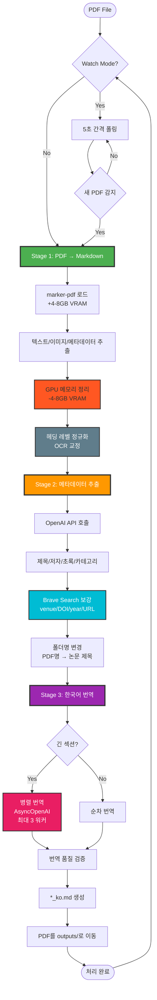
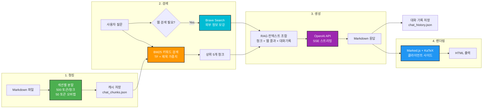
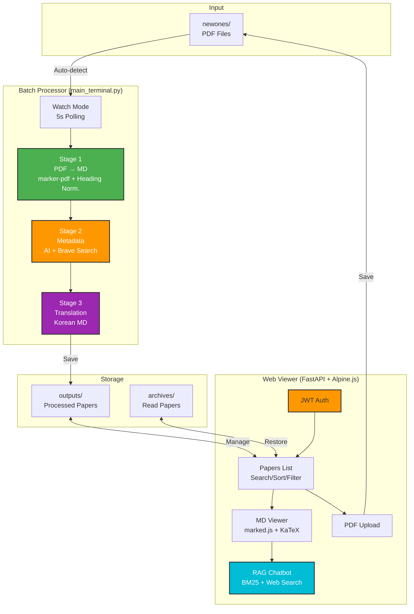
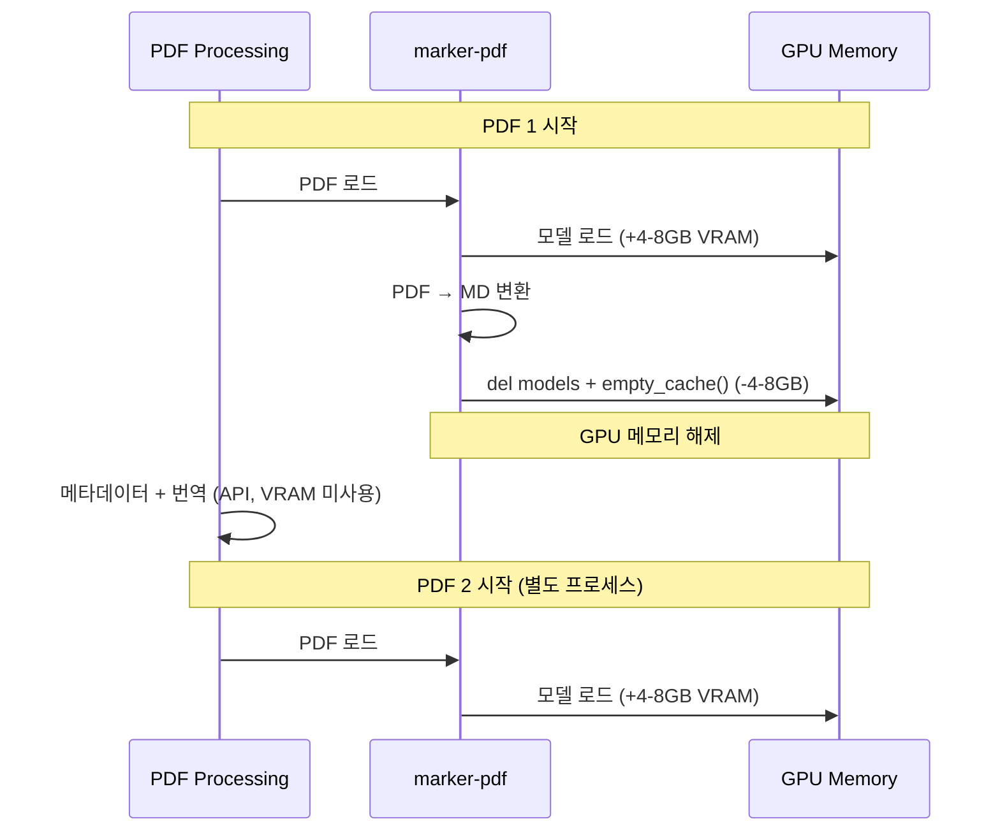
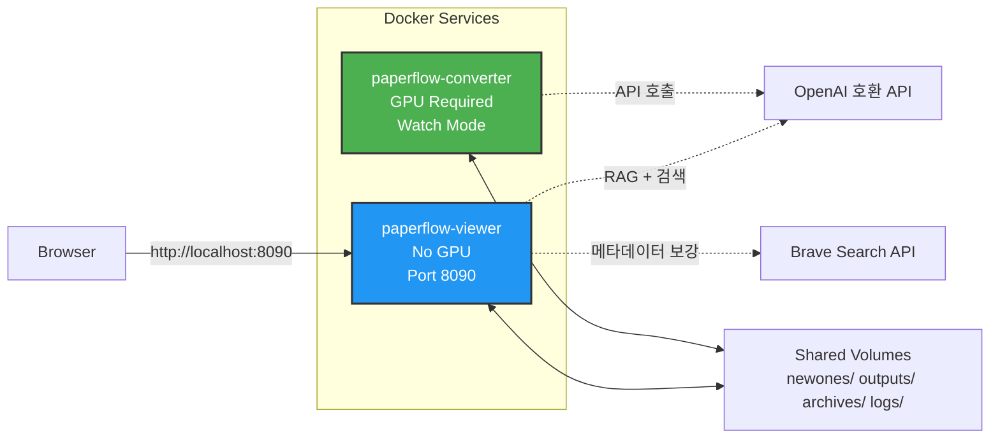

# PaperFlow v2.5

<div align="center">


**GPU 가속 학술 논문 PDF → Markdown 변환 + AI 번역 + 웹 뷰어**

[개요](#-프로젝트-개요) | [파이프라인](#-처리-파이프라인) | [특징](#-주요-특징) | [시작하기](#-빠른-시작) | [아키텍처](#%EF%B8%8F-아키텍처) | [설정](#%EF%B8%8F-설정) | [문제해결](#-문제-해결)

</div>

---

## 프로젝트 개요

PaperFlow는 학술 논문 PDF를 구조화된 Markdown으로 변환하고, AI로 메타데이터 추출 및 한국어 번역을 수행하는 로컬 자동화 시스템입니다. 웹 뷰어에서 클라이언트 사이드 렌더링(marked.js + KaTeX)으로 논문을 열람합니다.

### 핵심 컴포넌트

```mermaid
graph LR
    A[PDF Files] -->|Watch Mode| B[Batch Processor]
    B -->|marker-pdf| C[Markdown]
    C -->|AI| D[Metadata + Web Search]
    D -->|AI| E[Korean Translation]
    E --> F[FastAPI Viewer]
    F -->|RAG Chatbot| G[User]

    style B fill:#4CAF50,stroke:#333,stroke-width:2px,color:#fff
    style D fill:#FF9800,stroke:#333,stroke-width:2px,color:#fff
    style E fill:#9C27B0,stroke:#333,stroke-width:2px,color:#fff
    style F fill:#2196F3,stroke:#333,stroke-width:2px,color:#fff
```



| 컴포넌트 | 파일 | 역할 |
|----------|------|------|
| **Batch Processor** | `main_terminal.py` | PDF → MD → 메타데이터 추출 → 웹 검색 보강 → 한국어 번역 |
| **Web Viewer** | `viewer/` | FastAPI + Alpine.js 뷰어 + RAG 챗봇 |

### 기술 스택

**변환 파이프라인**:
- **marker-pdf** - GPU 가속 PDF to Markdown 변환 (CUDA 전용)
- **OpenAI 호환 API** - 메타데이터 추출 & 한국어 번역
- **Brave Search API** - 논문 메타데이터 웹 검색 보강 (venue, DOI, year)

**웹 뷰어**:
- **FastAPI** - 비동기 웹 프레임워크
- **Alpine.js + TailwindCSS** - 경량 리액티브 프론트엔드 (CDN, 빌드 불필요)
- **marked.js + KaTeX** - 클라이언트 사이드 Markdown + 수식 렌더링
- **JWT** - HTTPOnly 쿠키 기반 인증

**AI 기능**:
- **RAG 챗봇** - 논문별 AI 챗봇 (BM25 검색 + OpenAI API + SSE 스트리밍)
- **웹 검색 보강** - Brave Search로 RAG 컨텍스트 및 메타데이터 보강

### v2.5 주요 변경사항 (v2.0 대비)

| 항목 | v2.0 | v2.5 (Current) |
|------|------|----------------|
| **파이프라인** | PDF → MD → Metadata → Translation → HTML (4단계) | PDF → MD → Normalize → Metadata + Web Search → Translation (3단계) |
| **렌더링** | Quarto HTML (서버 사이드) | marked.js + KaTeX (클라이언트 사이드) |
| **뷰어 모드** | HTML/PDF/Split | MD-KO/MD-EN/PDF/Split |
| **메타데이터** | AI 추출만 | AI 추출 + Brave Search 보강 (venue, DOI, year, URL) |
| **헤딩 정규화** | 없음 | OCR 헤딩 레벨 자동 교정 |
| **챗봇** | RAG 전용 | RAG + 조건부 웹 검색 보강 |
| **UI** | 기본 | 콘텐츠 폭 조절, 읽기 진행률 (서버 동기화), 연도별 정렬 |
| **출력 파일** | `*.md`, `*.html`, `*_ko.md`, `*_ko.html` | `*.md`, `*_ko.md` (HTML 파일 없음) |

---

## 처리 파이프라인

### 3단계 변환 프로세스



### 파이프라인 상세

#### Stage 1: PDF → Markdown
**함수**: `convert_pdf_to_md()` + `normalize_heading_levels()`

- **입력**: PDF 파일
- **처리**:
  - marker-pdf 라이브러리 (GPU 전용, CUDA)
  - 텍스트, 이미지(JPEG), 메타데이터(JSON) 추출
  - **헤딩 정규화**: OCR 결과의 불일치 헤딩 레벨 자동 교정
    - 섹션 번호 패턴 분석 (1, 1.1, I, II, A.)
    - 올바른 헤딩 계층 구조로 재매핑
- **출력**: `*.md`, `*.json`, `*.jpeg`
- **GPU 메모리**: 변환 후 모델 삭제 + `torch.cuda.empty_cache()`로 ~4-8GB VRAM 해제

#### Stage 2: 메타데이터 추출 + 웹 검색 보강 (AI)
**함수**: `extract_paper_metadata()` + `enrich_metadata_with_web_search()`

- **입력**: `*.md` (영문 마크다운)
- **AI 추출**:
  - 제목, 저자, 초록, 카테고리, 발행 연도
  - 한국어 제목/초록 번역
- **웹 검색 보강** (Brave Search API):
  - Venue (학회/저널명), DOI, 발행 연도, 논문 URL
  - URL 도메인 우선 판별 (arxiv.org → arXiv, openreview.net → OpenReview 등)
  - 알려진 학회 목록, DOI 정규식, 연도 패턴으로 정확도 향상
  - 기존 AI 추출 값을 덮어쓰지 않음 (빈 필드만 보강)
- **폴더명 자동 변경**: PDF 파일명 → 논문 제목 (sanitized, 최대 80자)
- **출력**: `paper_meta.json`

#### Stage 3: 한국어 번역 (AI, 병렬)
**함수**: `translate_md_to_korean_openai()`

- **입력**: `*.md` (영문 마크다운)
- **7단계 번역 파이프라인**:
  1. YAML 헤더 분리
  2. OCR 아티팩트 정리 (페이지 번호, 하이픈, 저작권)
  3. 특수 블록 보호 (코드/수식) → 플레이스홀더
  4. 섹션 분류 (본문 번역, References/Appendix 건너뜀)
  5. 섹션별 번역 (컨텍스트 보존: 이전 200자 전달)
  6. 보호 블록 복원
  7. 한국어 마크다운 작성
- **병렬 처리**: 긴 섹션(3000자+) → AsyncOpenAI로 동시 번역 (최대 3 워커)
- **품질 검증**: 길이 비율, 헤딩/단락 개수 → 실패 시 재시도 (최대 3회)
- **출력**: `*_ko.md`

---

## 주요 특징

### Batch Processor

- **AI 메타데이터 추출**: 제목/저자/초록/카테고리/연도 자동 추출
- **웹 검색 보강**: Brave Search로 venue, DOI, 발행 연도, 논문 URL 보강 (URL 도메인 우선 판별)
- **헤딩 정규화**: OCR 헤딩 레벨 불일치 자동 교정
- **스마트 폴더 명명**: PDF 파일명 → 논문 제목으로 자동 변경
- **한국어 번역**: 7단계 번역 파이프라인 (병렬 처리, 2-4x 빠름)
- **품질 검증**: 자동 번역 검증 + 재시도 로직 (최대 3회)
- **GPU 메모리 최적화**: 명시적 VRAM 정리로 연속 배치 처리 지원
- **Watch 모드**: `newones/` 디렉토리 자동 감시 (5초 폴링)
- **처리 상태 추적**: 실시간 진행 단계 표시 (뷰어에서 확인 가능)

### Web Viewer (FastAPI)

- **클라이언트 사이드 렌더링**: marked.js + KaTeX로 Markdown + 수식 렌더링
- **멀티 뷰어**: MD-KO / MD-EN / PDF / Split 보기 모드
- **RAG 챗봇**: 논문별 AI 챗봇 (BM25 검색 + 조건부 웹 검색 보강)
- **실시간 스트리밍**: SSE로 AI 응답 실시간 출력 (Markdown 렌더링)
- **JWT 인증**: HTTP-only 쿠키 기반 30일 세션
- **논문 관리**: Unread/Archived 탭, 검색 (제목/저자/초록/카테고리), 다양한 정렬
- **언어 토글**: EN/KO 버튼으로 UI 전체 및 논문 제목/초록 전환
- **콘텐츠 폭 조절**: S(720px) / M(900px) / L(1200px) 프리셋 (localStorage 저장)
- **글꼴 크기 조절**: 5단계 프리셋 (90%-150%)
- **읽기 진행률**: 서버 동기화로 크로스 브라우저 유지 (max-wins 병합), 카드/목록에 배지 표시
- **클라이언트 사이드 TOC**: 헤딩 기반 자동 생성, IntersectionObserver 스크롤 스파이
- **읽기 위치 기억**: localStorage 기반 스크롤 위치 저장/복원
- **모바일 최적화**: 스크롤 시 상단바 자동 숨김 (< 768px)
- **다크 모드**: 테마 전환 (localStorage 저장)
- **PDF 업로드**: 드래그 앤 드롭, `newones/`에 자동 저장
- **로그 뷰어**: 접이식 터미널 스타일, 최신 로그 표시
- **토스트 알림**: 성공/에러/경고 자동 소멸 메시지
- **Docker 최적화**: 경량 이미지 (python:3.12-slim), GPU 불필요

---

## RAG 챗봇 아키텍처

각 논문마다 독립적인 RAG 기반 챗봇을 제공합니다.

### RAG 파이프라인



### 주요 기능

- **자동 청킹**: Markdown을 섹션 단위로 분할 (500 토큰, 50 토큰 오버랩)
- **BM25 키워드 검색**: TF + 제목 가중치로 관련 청크 검색
- **조건부 웹 검색**: 외부 정보가 필요한 질문 자동 감지 (비교, 최신 연구 등)
- **컨텍스트 보존**: 이전 대화 2턴 포함 (용어 일관성 유지)
- **SSE 스트리밍**: 실시간 AI 응답 출력
- **Markdown 렌더링**: Marked.js + KaTeX로 코드 블록, 수식, 목록 등 렌더링
- **대화 기록**: 자동 저장/로드 (최대 100 메시지)

### 챗봇 파일 구조

```
outputs/Paper Title/
  ├── your_paper_ko.md         # 청킹 소스 (한국어 우선)
  ├── chat_chunks.json         # 캐시된 청크 (자동 생성)
  └── chat_history.json        # 대화 기록 (자동 저장)
```

---

## 요구사항

### 필수

- **Python 3.12+** (Linux)
- **CUDA GPU** (NVIDIA) - CPU 폴백 없음
- **Docker & Docker Compose** (권장)

### Python 패키지

**Batch Processor** (`requirements.txt`):
```
marker-pdf>=0.2.17       # PDF → Markdown (CUDA)
torch>=2.0.0             # GPU 가속
openai>=1.12.0           # AI 메타데이터 추출 & 번역
python-dotenv>=1.0.0
pypdf2>=3.0.0
```

**Web Viewer** (`viewer/requirements.txt`):
```
fastapi>=0.115.0         # 웹 프레임워크
uvicorn[standard]>=0.32.0
jinja2>=3.1.0            # 템플릿 엔진
python-jose[cryptography] # JWT 인증
pydantic-settings>=2.0.0 # 환경변수 관리
sse-starlette==2.1.0     # SSE 스트리밍 (챗봇)
openai>=1.0.0            # RAG 챗봇
httpx>=0.27.0            # Brave Search API
```

---

## 빠른 시작

### 1. Docker Compose (권장)

```bash
git clone <repository-url>
cd PaperFlow

# .env 파일 설정
cat > .env << 'EOF'
# OpenAI 호환 API
OPENAI_BASE_URL=https://api.openai.com/v1
OPENAI_API_KEY=sk-your-api-key-here
TRANSLATION_MODEL=gpt-4o
CHATBOT_MODEL=gpt-4o

# 웹 검색 보강 (선택, 없으면 자동 건너뜀)
BRAVE_SEARCH_API_KEY=your-brave-api-key

# 로그인 인증
LOGIN_ID=admin
LOGIN_PASSWORD=password
JWT_SECRET_KEY=your-random-secret-key
EOF

# 실행
docker compose up -d

# PDF 추가 → 자동 처리
cp your_paper.pdf newones/

# 브라우저에서 http://localhost:8090 접속
```

### 2. 로컬 개발 (Docker 없이)

```bash
# 가상환경 설정 및 패키지 설치
./setup_venv.sh

# Watch 모드 (PDF 자동 감지)
./run_batch_watch.sh          # 터미널 1

# 웹 뷰어
cd viewer
pip install -r requirements.txt
uvicorn app.main:app --reload --port 8090   # 터미널 2

# PDF 추가
cp your_paper.pdf newones/    # 터미널 3
```

### 출력 구조

```
outputs/Sanitized Paper Title/     # PDF 파일명 → 논문 제목으로 변경
  ├── your_paper.pdf           # 원본 PDF (newones/에서 이동)
  ├── your_paper.md            # 영문 Markdown
  ├── your_paper_ko.md         # 한국어 Markdown (번역)
  ├── your_paper.json          # marker-pdf 메타데이터
  ├── paper_meta.json          # AI+웹 검색 메타데이터
  │                            #   (title, authors, abstract, categories,
  │                            #    venue, DOI, publication_year, paper_url)
  ├── chat_chunks.json         # RAG 청크 캐시 (자동 생성)
  ├── chat_history.json        # 챗봇 대화 기록
  └── *.jpeg                   # 추출된 이미지

reading_progress.json            # 읽기 진행률 (서버 동기화, 전체 논문 통합)
archives/                        # "Archive" 버튼으로 이동된 논문
```

---

## 설정

### config.json

```json
{
  "processing_pipeline": {
    "convert_to_markdown": true,
    "normalize_headings": true,
    "extract_metadata": true,
    "enrich_with_web_search": true,
    "translate_to_korean": true
  },
  "metadata_extraction": {
    "temperature": 0.1,
    "max_tokens": 2048,
    "timeout_seconds": 60,
    "smart_rename": true,
    "max_folder_name_length": 80
  },
  "translation": {
    "max_retries": 3,
    "retry_delay_seconds": 2,
    "timeout_seconds": 300,
    "max_section_chars": 3000,
    "verify_translation": true,
    "enable_parallel_translation": true,
    "parallel_max_workers": 3,
    "parallel_min_chunks": 2
  }
}
```

#### Processing Pipeline

| 옵션 | 기본값 | 설명 |
|------|--------|------|
| `convert_to_markdown` | `true` | PDF → Markdown 변환 |
| `normalize_headings` | `true` | OCR 헤딩 레벨 정규화 |
| `extract_metadata` | `true` | AI 메타데이터 추출 |
| `enrich_with_web_search` | `true` | Brave Search로 메타데이터 보강 |
| `translate_to_korean` | `true` | 한국어 번역 |

#### Metadata Extraction

| 옵션 | 기본값 | 설명 |
|------|--------|------|
| `temperature` | `0.1` | AI 추출 온도 |
| `max_tokens` | `2048` | AI 응답 최대 토큰 |
| `timeout_seconds` | `60` | API 타임아웃 |
| `smart_rename` | `true` | 폴더명 자동 변경 |
| `max_folder_name_length` | `80` | 폴더명 최대 길이 |

#### Translation

| 옵션 | 기본값 | 설명 |
|------|--------|------|
| `max_retries` | `3` | 번역 재시도 횟수 |
| `timeout_seconds` | `300` | 섹션별 타임아웃 |
| `max_section_chars` | `3000` | 병렬 처리 기준 문자 수 |
| `verify_translation` | `true` | 번역 품질 검증 |
| `enable_parallel_translation` | `true` | 병렬 번역 |
| `parallel_max_workers` | `3` | 동시 API 호출 수 (1-5) |
| `parallel_min_chunks` | `2` | 병렬 처리 최소 청크 수 |

### .env

```env
# OpenAI 호환 API (OpenAI, Google Gemini, Anthropic 등)
OPENAI_BASE_URL=https://api.openai.com/v1
OPENAI_API_KEY=sk-your-api-key-here
TRANSLATION_MODEL=gpt-4o            # 번역용 모델
CHATBOT_MODEL=gpt-4o                # RAG 챗봇용 모델

# 웹 검색 보강 (선택 사항, 없으면 자동 건너뜀)
BRAVE_SEARCH_API_KEY=your-brave-api-key

# 로그인 인증
LOGIN_ID=admin
LOGIN_PASSWORD=password
JWT_SECRET_KEY=your-random-secret-key
```

### prompt.md (선택)

사용자 정의 번역 프롬프트 파일. 존재하면 기본 학술 번역 프롬프트를 대체합니다.

---

## 아키텍처

### 시스템 구조도



### GPU 메모리 관리



### API 엔드포인트

| Method | Path | 설명 |
|--------|------|------|
| `POST` | `/api/login` | 로그인 (JWT 쿠키 설정) |
| `POST` | `/api/logout` | 로그아웃 |
| `GET` | `/api/papers` | 논문 목록 (tab, 검색, 정렬) |
| `GET` | `/api/papers/{name}/info` | 논문 메타데이터 |
| `GET` | `/api/papers/{name}/md-ko` | 한국어 Markdown 서빙 |
| `GET` | `/api/papers/{name}/md-en` | 영문 Markdown 서빙 |
| `GET` | `/api/papers/{name}/pdf` | PDF 파일 서빙 |
| `GET` | `/api/papers/{name}/assets/{file}` | 이미지 등 에셋 서빙 |
| `POST` | `/api/papers/{name}/archive` | 아카이브로 이동 |
| `POST` | `/api/papers/{name}/restore` | 읽을 논문으로 복원 |
| `DELETE` | `/api/papers/{name}` | 영구 삭제 |
| `POST` | `/api/papers/{name}/chat` | RAG 챗봇 질문 (SSE) |
| `GET` | `/api/papers/{name}/chat/history` | 대화 기록 조회 |
| `DELETE` | `/api/papers/{name}/chat/history` | 대화 기록 삭제 |
| `POST` | `/api/papers/{name}/enrich` | 웹 검색 메타데이터 보강 |
| `POST` | `/api/papers/{name}/progress` | 읽기 진행률 저장 (max-wins) |
| `GET` | `/api/progress` | 전체 읽기 진행률 조회 |
| `GET` | `/api/processing/status` | 처리 큐 상태 |
| `DELETE` | `/api/processing/queue/{file}` | 처리 큐에서 제거 |
| `POST` | `/api/upload` | PDF 업로드 |
| `GET` | `/api/stats` | 논문 통계 |
| `GET` | `/api/logs/latest` | 최신 로그 |

---

## 프로젝트 구조

```
PaperFlow/
├── main_terminal.py         # Batch Processor (PDF → MD → Metadata → Translation)
├── config.json              # 파이프라인 설정
├── requirements.txt         # Python 패키지 (Processor)
├── .env                     # 환경변수 (gitignore)
│
├── run_batch.sh             # 일회성 배치 처리
├── run_batch_watch.sh       # Watch 모드 (연속 처리)
├── setup_venv.sh            # 설치 스크립트
│
├── viewer/                  # Web Viewer (FastAPI)
│   ├── app/
│   │   ├── main.py          #   FastAPI 앱 팩토리
│   │   ├── config.py        #   환경변수 설정 (pydantic-settings)
│   │   ├── auth.py          #   JWT 생성/검증, 쿠키 관리
│   │   ├── dependencies.py  #   인증 의존성 주입
│   │   ├── routers/
│   │   │   ├── api.py       #   JSON API (챗봇, 검색 보강 포함)
│   │   │   └── pages.py     #   HTML 페이지 라우트
│   │   ├── services/
│   │   │   ├── papers.py    #   논문 관리 비즈니스 로직
│   │   │   ├── rag.py       #   RAG 파이프라인 (청킹/검색/생성/웹검색)
│   │   │   ├── chat.py      #   챗봇 대화 기록 관리
│   │   │   └── web_search.py#   Brave Search 메타데이터 보강
│   │   ├── models/
│   │   │   └── chat.py      #   챗봇 데이터 모델 (Pydantic)
│   │   └── templates/       #   Jinja2 HTML 템플릿
│   │       ├── base.html    #     레이아웃 (TailwindCSS, Alpine.js, marked.js, KaTeX)
│   │       ├── login.html   #     로그인 페이지
│   │       ├── papers.html  #     논문 목록 (검색/업로드/로그)
│   │       └── viewer.html  #     논문 뷰어 (MD/PDF/챗봇)
│   ├── Dockerfile           #   python:3.12-slim
│   └── requirements.txt     #   FastAPI, JWT, OpenAI, httpx
│
├── Dockerfile               # Processor Docker 이미지 (CUDA)
├── docker-compose.yml       # 서비스 구성 (converter + viewer)
├── entrypoint.sh            # Processor 엔트리포인트
│
├── newones/                 # 입력: PDF 파일 업로드
├── outputs/                 # 출력: 처리된 논문 (읽을 논문)
├── archives/                # 출력: 읽은 논문 (아카이브)
└── logs/                    # 처리 로그 (타임스탬프)
```

---

## Docker 배포

### docker-compose.yml



| 서비스 | 컨테이너 | 포트 | GPU | 역할 |
|--------|----------|------|-----|------|
| `paperflow-converter` | `paperflow_converter` | - | 필수 | PDF 변환 (Watch 모드) |
| `paperflow-viewer` | `paperflow_viewer` | 8090 | 불필요 | 웹 뷰어 (FastAPI) |

### 실행

```bash
# 1. .env 파일 설정 (위 "빠른 시작" 참조)
# 2. Docker Compose 실행
docker compose up -d

# 3. PDF 추가 → 자동 처리
cp your_paper.pdf newones/

# 4. 로그 확인
docker compose logs -f

# 5. 브라우저 접속: http://localhost:8090
```

### 볼륨 마운트

| 호스트 경로 | 컨테이너 경로 | 용도 |
|-------------|---------------|------|
| `newones/` | `/app/newones` (converter), `/data/newones` (viewer) | 입력 PDF |
| `outputs/` | `/app/outputs`, `/data/outputs` | 처리 결과 |
| `archives/` | `/data/archives` (viewer only) | 아카이브 |
| `logs/` | `/app/logs`, `/data/logs` | 처리 로그 |

---

## 문제 해결

### GPU 메모리 부족

```bash
# GPU 상태 모니터링
watch -n 1 nvidia-smi

# 다른 GPU 프로세스 종료 후 재시도
nvidia-smi | grep python
kill <PID>
```

### 처리 실패 디버깅

```bash
# 실시간 로그 확인
docker compose logs -f batch

# 또는 로그 파일 직접 확인
tail -f logs/paperflow_*.log

# GPU 메모리 / 에러 / 경고 필터링
grep -E "GPU memory|✗|⚠" logs/paperflow_*.log
```

### Docker 포트 충돌

뷰어 포트(8090)가 사용 중이면 `docker-compose.yml` 수정:
```yaml
services:
  paperflow-viewer:
    ports:
      - "9090:8000"  # 원하는 포트로 변경
```

### 웹 뷰어 로그인 실패

1. `.env` 파일에서 `LOGIN_ID`, `LOGIN_PASSWORD`, `JWT_SECRET_KEY` 확인
2. 브라우저 쿠키 삭제 후 재시도
3. Docker 이미지 재빌드: `docker compose build && docker compose up -d`

### RAG 챗봇 오류

```bash
# API 연결 확인
curl $OPENAI_BASE_URL/models -H "Authorization: Bearer $OPENAI_API_KEY"

# Docker 로그 확인
docker compose logs paperflow-viewer | grep -i error
```

### 번역 실패

1. `config.json`에서 `translate_to_korean: true` 확인
2. `OPENAI_API_KEY` 설정 확인
3. 로그 확인: `grep "Translation" logs/paperflow_*.log`

---

## 라이선스

MIT License

---

## Acknowledgments

- [Marker-pdf](https://github.com/datalab-to/marker) - PDF to Markdown 변환
- [FastAPI](https://fastapi.tiangolo.com/) - 웹 프레임워크
- [TailwindCSS](https://tailwindcss.com/) - CSS 프레임워크
- [Alpine.js](https://alpinejs.dev/) - 경량 JS 프레임워크
- [marked.js](https://marked.js.org/) - Markdown 렌더링
- [KaTeX](https://katex.org/) - 수식 렌더링
- [Brave Search API](https://brave.com/search/api/) - 웹 검색

---

<div align="center">

**Made with care for researchers and paper readers**

[맨 위로](#paperflow-v25)

</div>
