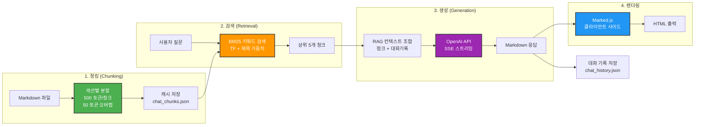
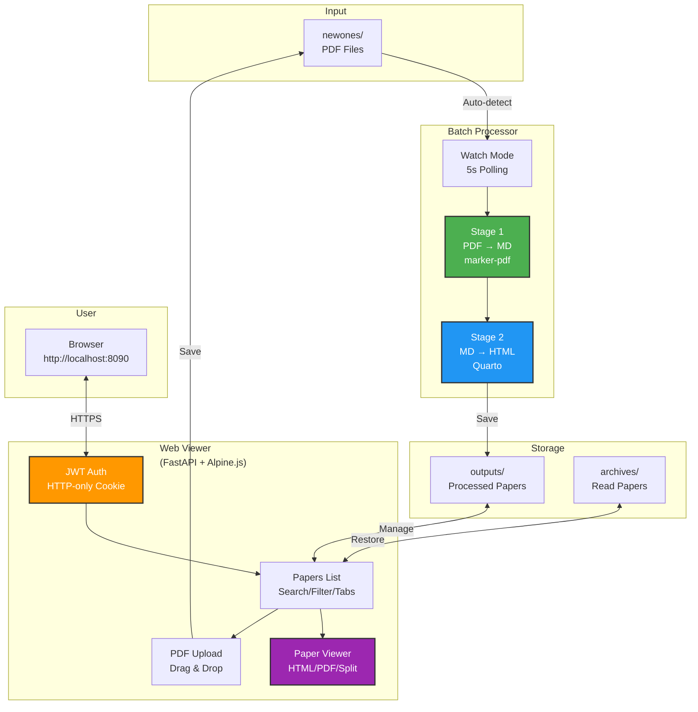
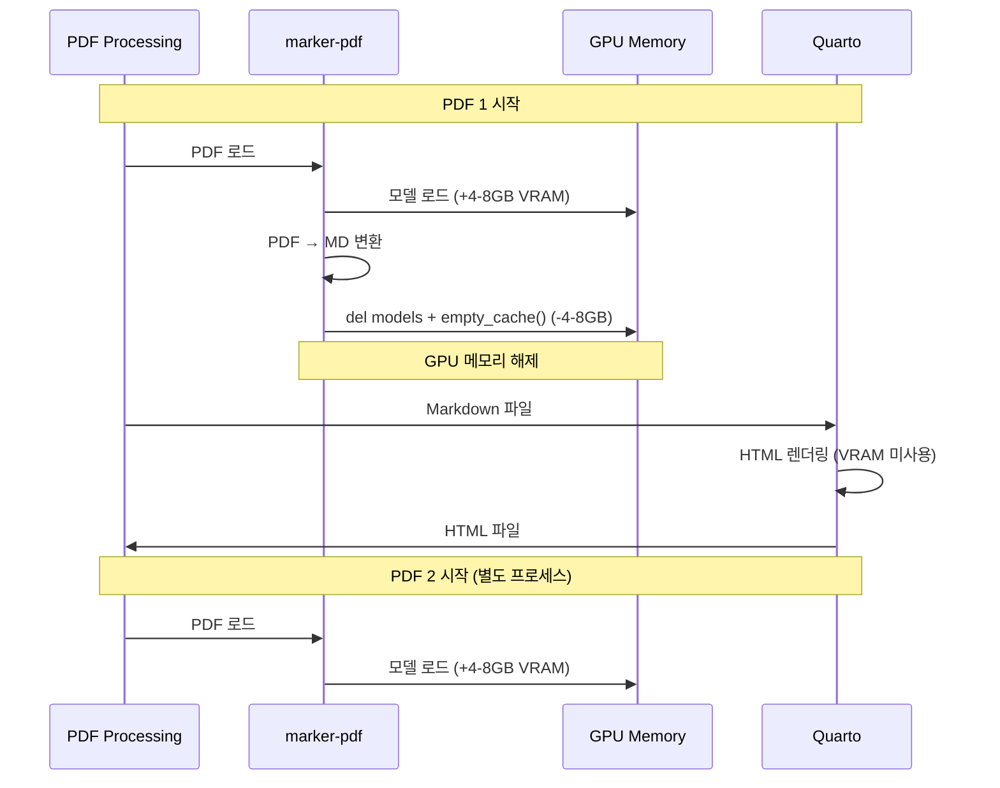
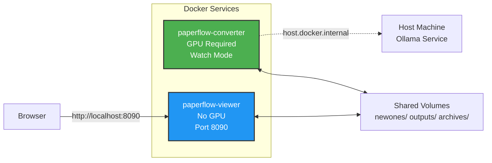

# PaperFlow v2.0

<div align="center">


**학술 논문 PDF를 Markdown과 HTML로 변환하는 GPU 가속 로컬 파이프라인**

[📖 개요](#-프로젝트-개요) • [🎯 특징](#-주요-특징) • [🚀 시작하기](#-빠른-시작) • [🏗️ 아키텍처](#%EF%B8%8F-아키텍처) • [📁 구조](#-프로젝트-구조) • [🔧 문제해결](#-문제-해결)

</div>

---

## 📖 프로젝트 개요

PaperFlow는 학술 논문 PDF를 구조화된 Markdown과 렌더링된 HTML로 변환하는 로컬 자동화 시스템입니다.

### 🎯 핵심 컴포넌트

```mermaid
graph LR
    A[PDF Files] -->|Watch Mode| B[Batch Processor]
    B -->|marker-pdf| C[Markdown]
    C -->|AI Metadata| D[Paper Info]
    D -->|AI Translation| E[Korean MD]
    E -->|Quarto| F[HTML EN/KO]
    F --> G[FastAPI Viewer]
    G -->|RAG Chatbot| H[User]

    style B fill:#4CAF50,stroke:#333,stroke-width:2px,color:#fff
    style D fill:#FF9800,stroke:#333,stroke-width:2px,color:#fff
    style E fill:#9C27B0,stroke:#333,stroke-width:2px,color:#fff
    style G fill:#2196F3,stroke:#333,stroke-width:2px,color:#fff
```



| 컴포넌트 | 파일 | 역할 |
|----------|------|------|
| **📄 Batch Processor** | `main_terminal.py` | PDF → MD → 메타데이터 추출 → 한국어 번역 → HTML |
| **🌐 Web Viewer** | `viewer/` | FastAPI + Alpine.js + RAG 챗봇 기반 UI |

### 🛠️ 기술 스택

**변환 파이프라인**:
- **marker-pdf** - GPU 가속 PDF to Markdown 변환 (CUDA 전용)
- **OpenAI API** - 메타데이터 추출 & 한국어 번역 (병렬 처리)
- **Quarto** - Markdown to HTML 렌더링 엔진

**웹 뷰어**:
- **FastAPI** - 비동기 웹 프레임워크
- **Alpine.js** - 경량 리액티브 프론트엔드
- **TailwindCSS** - 유틸리티 CSS 프레임워크
- **Marked.js** - 클라이언트 사이드 Markdown 렌더링
- **JWT** - HTTPOnly 쿠키 기반 인증

**AI 기능**:
- **RAG (Retrieval-Augmented Generation)** - 논문별 챗봇
- **BM25 Keyword Search** - 청크 기반 문서 검색
- **SSE (Server-Sent Events)** - 실시간 스트리밍 응답

### ✨ v2.0 주요 변경사항

| 항목 | v1.0 (Legacy) | v2.0 (Current) |
|------|---------------|----------------|
| **파이프라인** | PDF → MD → Korean → HTML (4단계) | PDF → MD → 메타데이터 → 번역 → HTML (4단계) |
| **번역 엔진** | Ollama (로컬 LLM) | OpenAI API (병렬 처리, 2-4x 빠름) |
| **AI 기능** | ❌ 없음 | ✅ 메타데이터 추출, RAG 챗봇 |
| **뷰어** | Streamlit (app.py) | FastAPI + Alpine.js (viewer/) |
| **처리 시간** | ~15-40분/PDF | ~10-15분/PDF (병렬 번역) |
| **출력 파일** | `*_ko.md`, `*_ko.html` | `*.md`, `*.html`, `*_ko.md`, `*_ko.html`, `paper_meta.json` |
| **챗봇** | ❌ 없음 | ✅ 논문별 RAG 챗봇 (Markdown 렌더링) |

---

## 🔄 처리 파이프라인

### 4단계 변환 프로세스

```mermaid
flowchart TD
    Start([PDF File]) --> Watch{Watch Mode?}
    Watch -->|Yes| Poll[5초 간격 폴링]
    Watch -->|No| Stage1
    Poll --> Detect{새 PDF 감지}
    Detect -->|Yes| Stage1
    Detect -->|No| Poll

    Stage1[Stage 1: PDF → Markdown]
    Stage1 --> GPU1[marker-pdf 로드<br/>+4-8GB VRAM]
    GPU1 --> Extract[텍스트/이미지/메타데이터 추출]
    Extract --> Cleanup1[GPU 메모리 정리<br/>-4-8GB VRAM]

    Cleanup1 --> Stage2[Stage 2: 메타데이터 추출]
    Stage2 --> AI1[OpenAI API 호출]
    AI1 --> Meta[제목/저자/초록/카테고리]
    Meta --> Rename[폴더명 변경<br/>PDF명 → 논문 제목]

    Rename --> Stage3[Stage 3: 한국어 번역]
    Stage3 --> Parallel{긴 섹션?}
    Parallel -->|Yes| AsyncAPI[병렬 번역<br/>AsyncOpenAI<br/>최대 3 워커]
    Parallel -->|No| SeqAPI[순차 번역]
    AsyncAPI --> Verify[번역 품질 검증]
    SeqAPI --> Verify
    Verify --> KoreanMD[*_ko.md 생성]

    KoreanMD --> Stage4[Stage 4: HTML 렌더링]
    Stage4 --> Quarto[Quarto 렌더링<br/>EN + KO]
    Quarto --> Fallback{YAML 오류?}
    Fallback -->|Yes| Retry[간소화된 헤더로 재시도]
    Fallback -->|No| Success
    Retry --> Success[HTML 생성 완료]

    Success --> Move[PDF를 outputs/로 이동]
    Move --> End([처리 완료])

    End --> Watch

    style Stage1 fill:#4CAF50,stroke:#333,stroke-width:3px,color:#fff
    style Stage2 fill:#FF9800,stroke:#333,stroke-width:3px,color:#fff
    style Stage3 fill:#9C27B0,stroke:#333,stroke-width:3px,color:#fff
    style Stage4 fill:#2196F3,stroke:#333,stroke-width:3px,color:#fff
    style AsyncAPI fill:#E91E63,stroke:#333,stroke-width:2px,color:#fff
    style Success fill:#8BC34A,stroke:#333,stroke-width:2px
    style Cleanup1 fill:#FF5722,stroke:#333,stroke-width:2px
```



### 파이프라인 상세

#### Stage 1: PDF → Markdown
**함수**: `convert_pdf_to_md()` ([main_terminal.py:175](main_terminal.py#L175))

- **입력**: PDF 파일
- **처리**:
  - marker-pdf 라이브러리 (GPU 전용, CUDA)
  - `PdfConverter` 모델 로드 (device="cuda", dtype=torch.float16)
  - 텍스트, 이미지(JPEG), 메타데이터(JSON) 추출
- **출력**: `*.md`, `*.json`, `*.jpeg`
- **GPU 메모리**: 변환 후 모델 삭제 + `torch.cuda.empty_cache()` 호출로 ~4-8GB VRAM 해제

#### Stage 2: 메타데이터 추출 (AI)
**함수**: `extract_paper_metadata()` ([main_terminal.py](main_terminal.py))

- **입력**: `*.md` (영문 마크다운)
- **처리**:
  - OpenAI API 호출로 논문 정보 추출
  - 제목, 저자, 초록, 카테고리 파싱
  - 폴더명 자동 변경: PDF 파일명 → 논문 제목 (sanitized)
- **출력**: `paper_meta.json`
- **설정**: `config.json`의 `extract_metadata` 플래그로 활성화/비활성화

#### Stage 3: 한국어 번역 (AI, 병렬)
**함수**: `translate_md_to_korean_openai()` ([main_terminal.py:1034](main_terminal.py#L1034))

- **입력**: `*.md` (영문 마크다운)
- **처리**:
  - 7단계 번역 파이프라인: YAML 분리 → OCR 정리 → 특수 블록 보호 → 섹션 분류 → 번역 → 복원 → 검증
  - **병렬 처리**: 긴 섹션(3000자+)을 청크로 분할 → AsyncOpenAI로 동시 번역 (최대 3 워커)
  - **품질 검증**: 길이 비율, 헤딩/단락 개수 검증 → 실패 시 재시도 (최대 3회)
  - **컨텍스트 보존**: 섹션 간 마지막 200자 전달로 용어 일관성 유지
- **출력**: `*_ko.md`
- **설정**: `config.json`의 `translate_to_korean` 플래그, `parallel_max_workers`, `max_section_chars`

#### Stage 4: HTML 렌더링
**함수**: `render_md_to_html()` ([main_terminal.py:625](main_terminal.py#L625))

- **입력**: `*.md`, `*_ko.md` (영문/한국어 마크다운)
- **처리**:
  - Quarto CLI로 HTML 렌더링 (영문 + 한국어 각각)
  - `header.yaml` 템플릿 적용 (TOC, 테마, 임베딩)
  - **자동 폴백**: YAML 파싱 오류 시 간소화된 헤더로 재시도
- **출력**: `*.html`, `*_ko.html` (자체 완결형, 이미지/CSS 임베딩)
- **GPU 메모리**: VRAM 미사용

---

## 🎯 주요 특징

### 📄 Batch Processor

- **🤖 AI 메타데이터 추출**: OpenAI API로 제목/저자/초록/카테고리 자동 추출
- **📝 스마트 폴더 명명**: PDF 파일명 → 논문 제목으로 자동 변경
- **🌐 한국어 번역**: OpenAI API 기반 7단계 번역 파이프라인
- **⚡ 병렬 번역**: AsyncOpenAI로 긴 섹션 동시 처리 (최대 3 워커, 2-4x 빠름)
- **✅ 품질 검증**: 자동 번역 검증 + 재시도 로직 (최대 3회)
- **🧠 GPU 메모리 최적화**: 명시적 VRAM 정리로 연속 배치 처리 지원
- **👁️ Watch 모드**: `newones/` 디렉토리 자동 감시 및 처리 (5초 폴링)
- **🔄 자동 폴백**: Quarto YAML 오류 시 간소화된 설정으로 재시도
- **🧹 자동 정리**: 처리 완료 후 PDF를 `newones/`에서 `outputs/`로 자동 이동
- **📊 상세 로깅**: 컬러 터미널 출력 + 타임스탬프 파일 로그

### 🌐 Web Viewer (FastAPI)

- **🎨 모던 UI**: TailwindCSS + Alpine.js 반응형 인터페이스 (빌드 불필요, CDN)
- **🔐 JWT 인증**: HTTP-only 쿠키 기반 30일 세션, 자동 로그인/리다이렉트
- **📚 논문 관리**: Unread/Archived 탭, 검색 필터 (제목/저자/초록/카테고리), 정렬
- **📖 멀티 뷰어**: HTML/PDF/Split 보기, 영문/한국어 전환, 전체화면
- **🤖 RAG 챗봇**: 논문별 AI 챗봇 (BM25 검색 + OpenAI API)
- **💬 실시간 스트리밍**: SSE로 AI 응답 실시간 출력 (Markdown 렌더링)
- **💾 대화 기록**: 자동 저장/로드 (최대 100 메시지), 삭제 기능
- **📁 CRUD 기능**: 아카이브/복원/삭제 (확인 모달), 용량 표시
- **📤 PDF 업로드**: 드래그 앤 드롭, `newones/`에 자동 저장
- **📝 로그 뷰어**: 접이식 터미널 스타일, 최신 로그 표시
- **💡 토스트 알림**: 성공/에러/경고 자동 소멸 메시지
- **🐳 Docker 최적화**: 경량 이미지 (python:3.12-slim), GPU 불필요

---

## 🤖 RAG 챗봇 아키텍처

PaperFlow는 각 논문마다 독립적인 RAG 기반 챗봇을 제공합니다.

### RAG 파이프라인



### 주요 기능

- **📚 자동 청킹**: Markdown을 섹션 단위로 분할 (500 토큰, 50 토큰 오버랩)
- **🔍 키워드 검색**: BM25 알고리즘으로 질문 관련 청크 검색
- **🎯 컨텍스트 보존**: 이전 대화 2턴 포함 (용어 일관성 유지)
- **⚡ 실시간 스트리밍**: SSE로 AI 응답 실시간 출력
- **💎 Markdown 렌더링**: Marked.js로 코드 블록, 수식, 목록 등 렌더링
- **💾 대화 기록**: 자동 저장/로드 (최대 100 메시지)
- **🎨 다크 모드**: TailwindCSS prose-invert로 자동 대응

### 파일 구조

각 논문 디렉토리에 챗봇 관련 파일 생성:
```
outputs/Paper Title/
  ├── your_paper_ko.md         # 청킹 소스 (한국어 우선)
  ├── chat_chunks.json         # 캐시된 청크 (자동 생성)
  └── chat_history.json        # 대화 기록 (자동 저장)
```

---

## 📋 요구사항

### 필수

- **Python 3.12+** (Linux)
- **CUDA GPU** (NVIDIA) - ⚠️ CPU 폴백 없음
- **Quarto** - 문서 렌더링 CLI ([설치 가이드](https://quarto.org/))

### Python 패키지 (자동 설치)

**Batch Processor** (`requirements.txt`):
```
marker-pdf>=0.2.17
torch>=2.0.0
pillow>=10.0.0
markdown-it-py>=3.0.0
requests>=2.32.5
python-dotenv>=1.0.0
pypdf2>=3.0.0
openai>=1.0.0          # AI 메타데이터 추출 & 번역
```

**Web Viewer** (`viewer/requirements.txt`):
```
fastapi>=0.104.0
uvicorn>=0.24.0
jinja2>=3.1.0
python-multipart>=0.0.6
pyjwt>=2.8.0
python-jose[cryptography]>=3.3.0
passlib[bcrypt]>=1.7.4
openai>=1.0.0          # RAG 챗봇
```

---

## 🚀 빠른 시작

### 1️⃣ 설치

```bash
git clone <repository-url>
cd PaperFlow

# 가상환경 설정 및 패키지 설치
./setup_venv.sh
```

### 2️⃣ 환경 설정

`.env` 파일 생성:
```env
# OpenAI API (메타데이터 추출, 번역, RAG 챗봇)
OPENAI_BASE_URL=https://api.openai.com/v1
OPENAI_API_KEY=sk-your-api-key-here
TRANSLATION_MODEL=gpt-4o          # 번역용 모델
CHATBOT_MODEL=gpt-4o              # 챗봇용 모델

# 로그인 인증
LOGIN_ID=your_id
LOGIN_PASSWORD=your_password

# JWT 시크릿 키 (변경 필수)
JWT_SECRET_KEY=your-random-secret-key-change-this
```

### 3️⃣ PDF 변환 실행

**Watch 모드 (권장)** - 새 PDF 자동 감지:
```bash
./run_batch_watch.sh                # 터미널 1: Watch 모드 실행

cp your_paper.pdf newones/          # 터미널 2: PDF 추가 → 자동 처리
# Ctrl+C로 종료
```

**일회성 배치 처리**:
```bash
cp your_paper.pdf newones/
./run_batch.sh
```

### 4️⃣ 웹 뷰어 실행

```bash
cd viewer
pip install -r requirements.txt
uvicorn app.main:app --reload --port 8090

# 브라우저에서 http://localhost:8090 접속
```

**또는 Docker로 실행** (권장):
```bash
docker compose up -d
cp your_paper.pdf newones/          # PDF 추가 → 자동 처리

# 브라우저에서 http://localhost:8090 접속
```

### 📦 출력 구조

```
outputs/Sanitized Paper Title/     # PDF 파일명 → 논문 제목으로 변경
  ├── your_paper.pdf           # 원본 PDF (newones/에서 이동)
  ├── your_paper.md            # 영문 Markdown
  ├── your_paper.html          # 영문 HTML ⭐
  ├── your_paper_ko.md         # 한국어 Markdown (번역)
  ├── your_paper_ko.html       # 한국어 HTML ⭐
  ├── your_paper.json          # marker-pdf 메타데이터
  ├── paper_meta.json          # AI 추출 메타데이터 (제목/저자/초록/카테고리)
  ├── chat_history.json        # RAG 챗봇 대화 기록
  ├── chat_chunks.json         # RAG 청크 캐시
  └── *.jpeg                   # 추출된 이미지

archives/                      # "Archive" 버튼으로 이동된 논문
```

- HTML 파일은 이미지와 CSS가 내장된 자체 완결형 파일 (`embed-resources: true`)
- 폴더명은 AI가 추출한 논문 제목으로 자동 변경 (최대 80자, 특수문자 제거)
- `paper_meta.json`은 웹 뷰어에서 검색/정렬/표시에 사용

---

## ⚙️ 설정

### config.json

```json
{
  "processing_pipeline": {
    "convert_to_markdown": true,
    "extract_metadata": true,
    "translate_to_korean": true,
    "render_to_html": true
  },
  "metadata_extraction": {
    "temperature": 0.0,
    "max_tokens": 2000,
    "timeout_seconds": 60,
    "smart_rename": true,
    "max_folder_name_length": 80
  },
  "translation": {
    "max_retries": 3,
    "retry_delay_seconds": 2,
    "timeout_seconds": 300,
    "max_section_chars": 3000,
    "verify_translation": true,
    "enable_parallel_translation": true,
    "parallel_max_workers": 3,
    "parallel_min_chunks": 2
  }
}
```

#### Processing Pipeline

| 옵션 | 기본값 | 설명 |
|------|--------|------|
| `convert_to_markdown` | `true` | PDF → Markdown 변환 활성화 |
| `extract_metadata` | `true` | AI 메타데이터 추출 활성화 |
| `translate_to_korean` | `true` | 한국어 번역 활성화 |
| `render_to_html` | `true` | Markdown → HTML 렌더링 활성화 |

#### Metadata Extraction

| 옵션 | 기본값 | 설명 |
|------|--------|------|
| `temperature` | `0.0` | AI 추출 온도 (0=결정적) |
| `max_tokens` | `2000` | AI 응답 최대 토큰 |
| `timeout_seconds` | `60` | API 타임아웃 |
| `smart_rename` | `true` | 폴더명 자동 변경 활성화 |
| `max_folder_name_length` | `80` | 폴더명 최대 길이 |

#### Translation

| 옵션 | 기본값 | 설명 |
|------|--------|------|
| `max_retries` | `3` | 번역 재시도 횟수 |
| `retry_delay_seconds` | `2` | 재시도 지연 시간 |
| `timeout_seconds` | `300` | 섹션별 타임아웃 |
| `max_section_chars` | `3000` | 병렬 처리 기준 문자 수 |
| `verify_translation` | `true` | 번역 품질 검증 활성화 |
| `enable_parallel_translation` | `true` | 병렬 번역 활성화 |
| `parallel_max_workers` | `3` | 동시 API 호출 수 (1-5) |
| `parallel_min_chunks` | `2` | 병렬 처리 최소 청크 수 |

### header.yaml

Quarto HTML 렌더링 설정:
```yaml
format:
  html:
    toc: true
    toc-location: left
    toc-depth: 3
    theme: cosmo
    embed-resources: true
```

- **TOC**: 왼쪽 사이드바 목차 (3단계 깊이)
- **테마**: Cosmo (Bootstrap 기반)
- **임베딩**: 이미지/CSS 포함 (자체 완결형)

### .env

OpenAI API, 로그인 인증 및 JWT 설정:
```env
# OpenAI API
OPENAI_BASE_URL=https://api.openai.com/v1
OPENAI_API_KEY=sk-your-api-key-here
TRANSLATION_MODEL=gpt-4o          # 번역용 모델
CHATBOT_MODEL=gpt-4o              # RAG 챗봇용 모델

# 로그인 인증
LOGIN_ID=admin                    # 로그인 ID
LOGIN_PASSWORD=password           # 로그인 비밀번호
JWT_SECRET_KEY=secret             # JWT 시크릿 키 (변경 필수)
```

---

## 🏗️ 아키텍처

### 시스템 구조도



### GPU 메모리 관리 전략



### 웹 뷰어 아키텍처

```mermaid
graph LR
    subgraph "Frontend (Alpine.js)"
        Login[Login Page]
        Papers[Papers List]
        Viewer[Paper Viewer]
    end

    subgraph "Backend (FastAPI)"
        Auth[JWT Auth]
        API[API Router]
        Pages[Pages Router]
        Service[Papers Service]
    end

    subgraph "Storage"
        FS[File System<br/>outputs/ archives/]
    end

    Login -->|POST /api/login| Auth
    Auth -->|Set Cookie| Papers
    Papers -->|GET /api/papers| API
    API --> Service
    Service --> FS
    Papers -->|Click| Viewer
    Viewer -->|GET /api/papers/{name}/html| API

    style Auth fill:#FF9800,stroke:#333,stroke-width:2px
    style Service fill:#4CAF50,stroke:#333,stroke-width:2px
    style FS fill:#2196F3,stroke:#333,stroke-width:2px
```

### API 엔드포인트

| Method | Path | 설명 | 인증 |
|--------|------|------|------|
| `POST` | `/api/login` | 로그인 (JWT 쿠키 설정) | ❌ |
| `POST` | `/api/logout` | 로그아웃 (쿠키 삭제) | ✅ |
| `GET` | `/api/papers` | 논문 목록 (tab=unread/archived, 검색/정렬) | ✅ |
| `GET` | `/api/papers/{name}/info` | 논문 파일 정보 | ✅ |
| `GET` | `/api/papers/{name}/html` | HTML 파일 서빙 | ✅ |
| `GET` | `/api/papers/{name}/pdf` | PDF 파일 서빙 | ✅ |
| `POST` | `/api/papers/{name}/archive` | 아카이브로 이동 | ✅ |
| `POST` | `/api/papers/{name}/restore` | 읽을 논문으로 복원 | ✅ |
| `DELETE` | `/api/papers/{name}` | 영구 삭제 | ✅ |
| `POST` | `/api/papers/{name}/chat` | RAG 챗봇 질문 (SSE 스트리밍) | ✅ |
| `GET` | `/api/papers/{name}/chat/history` | 챗봇 대화 기록 조회 | ✅ |
| `DELETE` | `/api/papers/{name}/chat/history` | 챗봇 대화 기록 삭제 | ✅ |
| `POST` | `/api/upload` | PDF 업로드 (newones/) | ✅ |
| `GET` | `/api/stats` | 논문 개수 통계 | ✅ |
| `GET` | `/api/logs/latest` | 최신 로그 내용 | ✅ |

---

## 📁 프로젝트 구조

```
PaperFlow/
├── main_terminal.py         # Batch Processor (PDF → MD → HTML)
├── config.json              # 파이프라인 설정
├── header.yaml              # Quarto HTML 템플릿
├── requirements.txt         # Python 패키지 (Processor)
├── .env                     # 인증 정보 (gitignore)
│
├── run_batch.sh             # 일회성 배치 처리
├── run_batch_watch.sh       # Watch 모드 (연속 처리)
├── setup_venv.sh            # 설치 스크립트
│
├── viewer/                  # Web Viewer (FastAPI)
│   ├── app/
│   │   ├── main.py          #   FastAPI 앱 팩토리
│   │   ├── config.py        #   환경변수 설정 (pydantic-settings)
│   │   ├── auth.py          #   JWT 생성/검증, 쿠키 관리
│   │   ├── dependencies.py  #   인증 의존성 주입
│   │   ├── routers/
│   │   │   ├── api.py       #   JSON API 엔드포인트 (챗봇 포함)
│   │   │   └── pages.py     #   HTML 페이지 라우트
│   │   ├── services/
│   │   │   ├── papers.py    #   논문 관리 비즈니스 로직
│   │   │   ├── rag.py       #   RAG 파이프라인 (청킹/검색/생성)
│   │   │   └── chat.py      #   챗봇 대화 기록 관리
│   │   ├── models/
│   │   │   └── chat.py      #   챗봇 데이터 모델 (Pydantic)
│   │   └── templates/       #   Jinja2 HTML 템플릿
│   │       ├── base.html    #     레이아웃 (TailwindCSS, Alpine.js, Marked.js)
│   │       ├── login.html   #     로그인 페이지
│   │       ├── papers.html  #     논문 목록 (검색/업로드/로그)
│   │       └── viewer.html  #     논문 뷰어 (HTML/PDF/챗봇)
│   ├── Dockerfile           #   python:3.12-slim
│   └── requirements.txt     #   FastAPI, JWT, Jinja2, OpenAI
│
├── Dockerfile               # Processor Docker 이미지 (CUDA 12.1)
├── docker-compose.yml       # 서비스 구성 (converter + viewer)
├── entrypoint.sh            # Processor 엔트리포인트
│
├── newones/                 # 입력: PDF 파일 업로드
├── outputs/                 # 출력: 처리된 논문 (읽을 논문)
├── archives/                # 출력: 읽은 논문 (아카이브)
├── logs/                    # 처리 로그 (타임스탬프)
└── CLAUDE.md                # 프로젝트 상세 문서 (Claude Code용)
```

---

## 🐳 Docker 배포

### docker-compose.yml

두 개의 서비스로 구성:



| 서비스 | 컨테이너 | 포트 | GPU | 역할 |
|--------|----------|------|-----|------|
| `paperflow-converter` | `paperflow_converter` | - | ✅ 필수 | PDF 변환 (Watch 모드) |
| `paperflow-viewer` | `paperflow_viewer` | 8090 | ❌ 불필요 | 웹 뷰어 (FastAPI) |

### 실행

```bash
# 1. .env 파일 설정
cat > .env << EOF
# OpenAI API
OPENAI_BASE_URL=https://api.openai.com/v1
OPENAI_API_KEY=sk-your-api-key-here
TRANSLATION_MODEL=gpt-4o
CHATBOT_MODEL=gpt-4o

# 로그인 인증
LOGIN_ID=admin
LOGIN_PASSWORD=password
JWT_SECRET_KEY=$(openssl rand -hex 32)
EOF

# 2. Docker Compose 실행
docker compose up -d

# 3. PDF 추가
cp your_paper.pdf newones/

# 4. 브라우저 접속
# http://localhost:8090
```

### 볼륨 마운트

- `newones/` - 입력 PDF 공유
- `outputs/` - 처리 결과 공유
- `archives/` - 아카이브 공유
- `logs/` - 로그 공유

---

## 🔧 문제 해결

### GPU 메모리 부족

```bash
# GPU 상태 모니터링
watch -n 1 nvidia-smi

# 다른 GPU 프로세스 종료 후 재시도
nvidia-smi | grep python
kill <PID>
```

### Quarto 설치

```bash
# Ubuntu/Debian
sudo apt install quarto

# 또는 공식 사이트에서 설치
# https://quarto.org/docs/get-started/
which quarto               # 설치 확인
```

### 처리 실패 디버깅

```bash
# 실시간 로그 확인
tail -f logs/paperflow_*.log

# GPU 메모리 정보 필터링
grep "GPU memory" logs/paperflow_*.log

# 에러/경고 필터링
grep -E "✗|⚠" logs/paperflow_*.log
```

### Docker 포트 충돌

뷰어 포트(8090)가 사용 중이면 `docker-compose.yml` 수정:
```yaml
services:
  paperflow-viewer:
    ports:
      - "원하는포트:8000"  # 예: "9090:8000"
```

### 웹 뷰어 로그인 실패

1. `.env` 파일 확인:
   ```bash
   cat .env
   ```
2. JWT 시크릿 키가 설정되었는지 확인
3. 브라우저 쿠키 삭제 후 재시도

### RAG 챗봇 오류

**증상**: "API 오류" 또는 응답 없음
1. OpenAI API 키 확인:
   ```bash
   grep OPENAI_API_KEY .env
   ```
2. API 연결 테스트:
   ```bash
   curl $OPENAI_BASE_URL/models -H "Authorization: Bearer $OPENAI_API_KEY"
   ```
3. Docker 로그 확인:
   ```bash
   docker compose logs paperflow-viewer
   ```

**증상**: 챗봇 응답이 Markdown으로 표시되지 않음
1. 브라우저 콘솔 확인 (F12 → Console)
2. `Marked.js` 로드 여부 확인
3. Docker 이미지 재빌드:
   ```bash
   docker compose build --no-cache paperflow-viewer
   docker compose up -d paperflow-viewer
   ```

### 번역 실패

**증상**: 영문 HTML만 생성되고 한국어 HTML 없음
1. `config.json`에서 `translate_to_korean: true` 확인
2. OpenAI API 키 확인
3. 로그에서 번역 오류 확인:
   ```bash
   grep "Translation failed" logs/paperflow_*.log
   ```

---

## 📄 라이선스

이 프로젝트는 MIT 라이선스 하에 배포됩니다.

---

## 🙏 Acknowledgments

이 프로젝트는 다음 오픈소스 도구를 활용합니다:

- [Marker-pdf](https://github.com/datalab-to/marker) - PDF to Markdown 변환
- [Quarto](https://quarto.org/) - 문서 렌더링
- [FastAPI](https://fastapi.tiangolo.com/) - 웹 프레임워크
- [TailwindCSS](https://tailwindcss.com/) - CSS 프레임워크
- [Alpine.js](https://alpinejs.dev/) - 경량 JS 프레임워크

---

## 🤝 Contributing

기여를 환영합니다! 다음과 같은 방법으로 기여할 수 있습니다:

1. **이슈 제보**: 버그 발견 시 [GitHub Issues](https://github.com/your-repo/paperflow/issues)에 제보
2. **기능 제안**: 새로운 기능에 대한 아이디어 공유
3. **코드 기여**:
   ```bash
   # Fork 후
   git checkout -b feature/AmazingFeature
   git commit -m 'Add some AmazingFeature'
   git push origin feature/AmazingFeature
   # Pull Request 생성
   ```

---

<div align="center">

**Made with ❤️ for researchers and paper readers**

[⬆ 맨 위로](#paperflow-v20)

</div>
