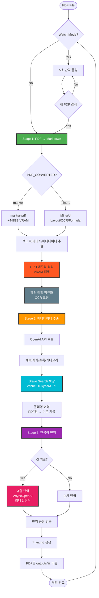
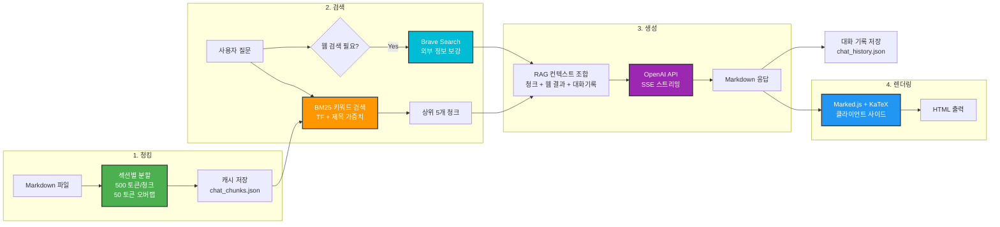
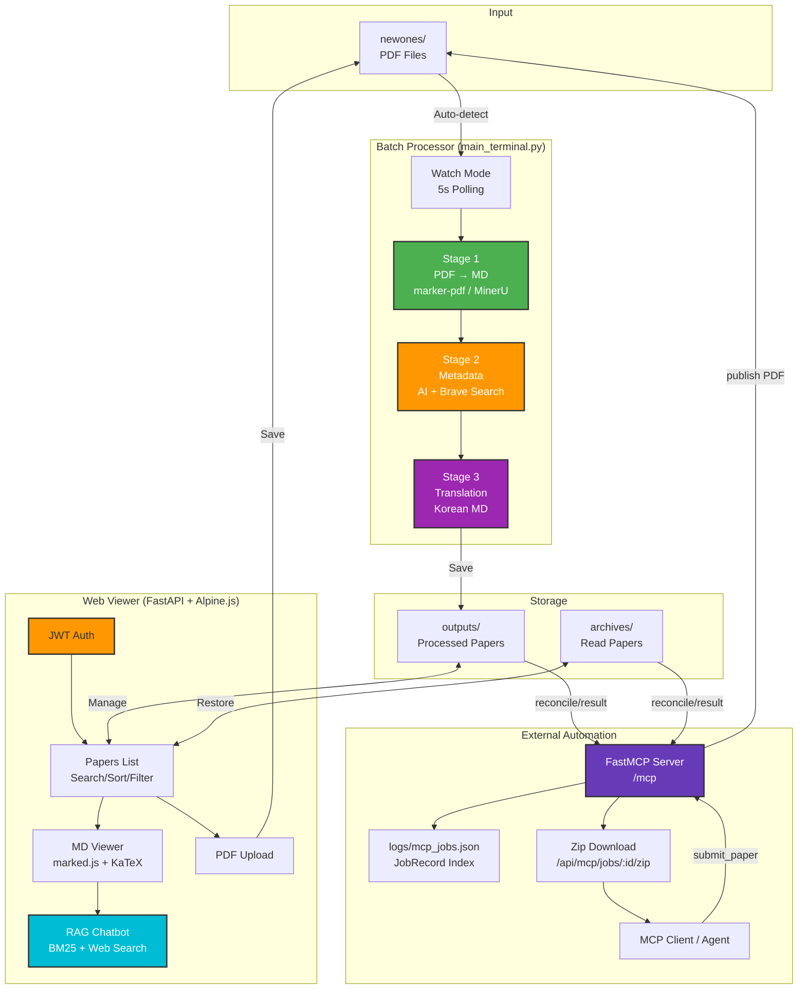
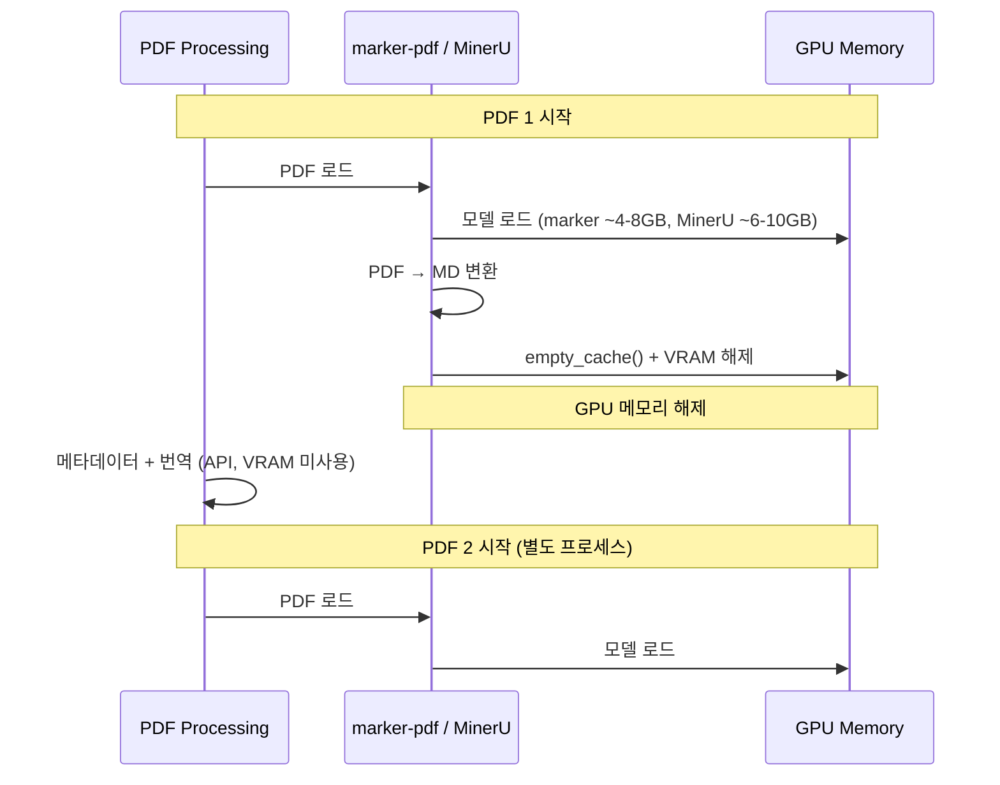
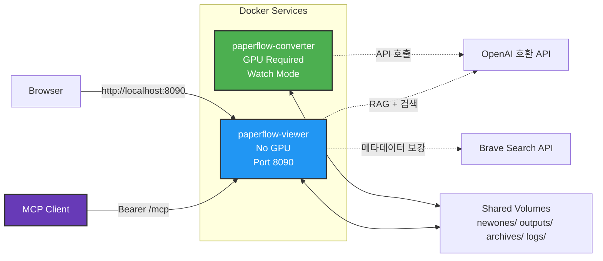

# PaperFlow v2.8

<div align="center">


**GPU 가속 학술 논문 PDF → Markdown 변환 + AI 번역 + 웹 뷰어 + MCP 자동화 서버**

[개요](#-프로젝트-개요) | [파이프라인](#-처리-파이프라인) | [특징](#-주요-특징) | [MCP](#-mcp-서버) | [시작하기](#-빠른-시작) | [아키텍처](#%EF%B8%8F-아키텍처) | [설정](#%EF%B8%8F-설정) | [문제해결](#-문제-해결)

</div>

---

## 프로젝트 개요

PaperFlow는 학술 논문 PDF와 논문 URL을 구조화된 Markdown으로 변환하고, AI로 메타데이터 추출 및 한국어 번역을 수행하는 로컬 자동화 시스템입니다. 웹 뷰어에서 클라이언트 사이드 렌더링(marked.js + KaTeX)으로 논문을 열람하고, MCP(Model Context Protocol) 서버를 통해 외부 에이전트가 논문 제출, 상태 조회, 결과 다운로드를 자동화할 수 있습니다.

### 핵심 컴포넌트


```mermaid
graph LR
    A[PDF Files] -->|Watch Mode| B[Batch Processor]
    M[MCP Client] -->|URL/File Submit| N[FastMCP Server]
    N -->|Queue PDF| A
    B -->|marker-pdf<br/>or MinerU| C[Markdown]
    C -->|AI| D[Metadata + Web Search]
    D -->|AI| E[Korean Translation]
    E --> F[FastAPI Viewer]
    F -->|RAG Chatbot| G[User]
    N -->|Job Status + Zip| M

    style B fill:#4CAF50,stroke:#333,stroke-width:2px,color:#fff
    style D fill:#FF9800,stroke:#333,stroke-width:2px,color:#fff
    style E fill:#9C27B0,stroke:#333,stroke-width:2px,color:#fff
    style F fill:#2196F3,stroke:#333,stroke-width:2px,color:#fff
    style N fill:#673AB7,stroke:#333,stroke-width:2px,color:#fff
```

| 컴포넌트 | 파일 | 역할 |
|----------|------|------|
| **Batch Processor** | `main_terminal.py` | PDF → MD → 메타데이터 추출 → 웹 검색 보강 → 한국어 번역 |
| **Web Viewer** | `viewer/` | FastAPI + Alpine.js 뷰어 + RAG 챗봇 |
| **MCP Server** | `viewer/app/routers/mcp_router.py`, `viewer/app/services/mcp_jobs.py` | 외부 클라이언트용 URL/PDF 제출, 비동기 작업 추적, zip 결과 다운로드 |

### 기술 스택

**변환 파이프라인**:
- **PDF 변환 엔진** (택 1, `.env`에서 선택):
  - **marker-pdf** - 빠른 변환, 일반 문서에 적합
  - **MinerU** - 수식/테이블 인식 우수, 복잡한 학술 논문에 적합
- **OpenAI 호환 API** - 메타데이터 추출 & 한국어 번역
- **Brave Search API** - 논문 메타데이터 웹 검색 보강 (venue, DOI, year)

**웹 뷰어**:
- **FastAPI** - 비동기 웹 프레임워크
- **Alpine.js + TailwindCSS** - 경량 리액티브 프론트엔드 (CDN, 빌드 불필요)
- **marked.js + KaTeX** - 클라이언트 사이드 Markdown + 수식 렌더링
- **JWT** - HTTPOnly 쿠키 기반 인증
- **FastMCP** - `/mcp` streamable HTTP 도구 서버

**AI 기능**:
- **RAG 챗봇** - 논문별 AI 챗봇 (BM25 검색 + OpenAI API + SSE 스트리밍)
- **웹 검색 보강** - Brave Search로 RAG 컨텍스트 및 메타데이터 보강

### v2.8 주요 변경사항

| 항목 | v2.7 | v2.8 (Current) |
|------|------|----------------|
| **MCP 서버** | - | **FastMCP 기반 `/mcp` 서버**: `submit_paper`, `get_job_status`, `get_job_result`, `cancel_job`, `list_jobs` |
| **외부 제출** | 웹 업로드/`newones/` 감시 | **URL 또는 base64 PDF 제출**: arXiv/일반 URL PDF resolve, HTML fallback 지원 |
| **작업 추적** | 처리 상태 파일 중심 | **`logs/mcp_jobs.json` JobRecord 인덱스**: downloading/queued/processing/complete/error/cancelled/stalled |
| **결과 배포** | 웹 뷰어 열람 | **zip 다운로드 API**: PDF/번역 포함 여부 옵션, 이미지/메타데이터 포함 |
| **운영 안정성** | 수동 확인 | **v1.1 reconcile**: 번역 누락/폴더 부재/partial output을 complete로 오판하지 않음 |
| **장문 논문 처리** | 2400초 watch timeout | **7200초 timeout**: DeepSeek-V3 50p/72 sections 60분 E2E 검증 |
| **보안** | JWT 웹 로그인 | **MCP Bearer 인증 + Origin allowlist**, JWT secret 강도 검증 |
| **검증** | 수동/기능 테스트 | **MCP pytest 세트** + 품질 baseline 리포트 스크립트 |

<details>
<summary>v2.7 변경사항 (v2.6 대비)</summary>

| 항목 | v2.6 | v2.7 |
|------|------|----------------|
| **마크다운 편집기** | - | **인라인 편집** (textarea + 실시간 프리뷰, Ctrl+S 저장, 타임스탬프 백업) |
| **해설판 보기** | - | **Easy 토글** (`_ko_explained.md` / `_explained.md` 파일 지원) |
| **Easy 버튼** | - | **3상태 UX**: 회색(비활성) → 검은색(활성화 가능) → 앰버(해설판 보기 중) |
| **편집 백업** | - | **자동 백업**: 저장 시 `_backup_YYYYMMDD_HHMMSS.md` 생성 |
| **RAG 캐시** | 수동 관리 | **편집 저장 시 자동 무효화** (chat_chunks.json 삭제) |

</details>

<details>
<summary>v2.6 변경사항 (v2.5 대비)</summary>

| 항목 | v2.5 | v2.6 |
|------|------|------|
| **PDF 변환** | marker-pdf만 지원 | **marker-pdf / MinerU 선택** (`.env`에서 설정) |
| **MinerU 지원** | - | pipeline/hybrid/vlm 백엔드, 수식/테이블 인식 강화 |
| **설치** | 단일 requirements.txt | **엔진별 분리** (requirements-marker.txt / requirements-mineru.txt) |
| **Docker 빌드** | 고정 | **`PDF_CONVERTER` ARG로 선택적 설치** (이미지 크기 절약) |
| **변환 진행률** | 단계 표시만 | **실시간 세부 진행률** (Layout/OCR/Formula 단계별 %) |
| **이미지 서빙** | 플랫 구조만 | **하위 디렉토리** (MinerU `images/` 폴더) 지원 |

</details>

<details>
<summary>v2.5 변경사항 (v2.0 대비)</summary>

| 항목 | v2.0 | v2.5 |
|------|------|------|
| **파이프라인** | PDF → MD → Metadata → Translation → HTML (4단계) | PDF → MD → Normalize → Metadata + Web Search → Translation (3단계) |
| **렌더링** | Quarto HTML (서버 사이드) | marked.js + KaTeX (클라이언트 사이드) |
| **뷰어 모드** | HTML/PDF/Split | MD-KO/MD-EN/PDF/Split |
| **메타데이터** | AI 추출만 | AI 추출 + Brave Search 보강 (venue, DOI, year, URL) |
| **헤딩 정규화** | 없음 | OCR 헤딩 레벨 자동 교정 |
| **챗봇** | RAG 전용 | RAG + 조건부 웹 검색 보강 |
| **UI** | 기본 | 콘텐츠 폭 조절, 읽기 진행률 (서버 동기화), 연도별 정렬 |
| **출력 파일** | `*.md`, `*.html`, `*_ko.md`, `*_ko.html` | `*.md`, `*_ko.md` (HTML 파일 없음) |

</details>

---

## 처리 파이프라인

### 3단계 변환 프로세스


```mermaid
flowchart TD
    Start([PDF File]) --> Watch{Watch Mode?}
    Watch -->|Yes| Poll[5초 간격 폴링]
    Watch -->|No| Stage1
    Poll --> Detect{새 PDF 감지}
    Detect -->|Yes| Stage1
    Detect -->|No| Poll

    Stage1[Stage 1: PDF → Markdown]
    Stage1 --> Engine{PDF_CONVERTER?}
    Engine -->|marker| GPU1[marker-pdf<br/>+4-8GB VRAM]
    Engine -->|mineru| GPU2[MinerU<br/>Layout/OCR/Formula]
    GPU1 --> Extract[텍스트/이미지/메타데이터 추출]
    GPU2 --> Extract
    Extract --> Cleanup1[GPU 메모리 정리<br/>VRAM 해제]

    Cleanup1 --> Normalize[헤딩 레벨 정규화<br/>OCR 교정]

    Normalize --> Stage2[Stage 2: 메타데이터 추출]
    Stage2 --> AI1[OpenAI API 호출]
    AI1 --> Meta[제목/저자/초록/카테고리]
    Meta --> WebSearch[Brave Search 보강<br/>venue/DOI/year/URL]
    WebSearch --> Rename[폴더명 변경<br/>PDF명 → 논문 제목]

    Rename --> Stage3[Stage 3: 한국어 번역]
    Stage3 --> Parallel{긴 섹션?}
    Parallel -->|Yes| AsyncAPI[병렬 번역<br/>AsyncOpenAI<br/>최대 3 워커]
    Parallel -->|No| SeqAPI[순차 번역]
    AsyncAPI --> Verify[번역 품질 검증]
    SeqAPI --> Verify
    Verify --> KoreanMD[*_ko.md 생성]

    KoreanMD --> Move[PDF를 outputs/로 이동]
    Move --> End([처리 완료])

    End --> Watch

    style Stage1 fill:#4CAF50,stroke:#333,stroke-width:3px,color:#fff
    style Stage2 fill:#FF9800,stroke:#333,stroke-width:3px,color:#fff
    style Stage3 fill:#9C27B0,stroke:#333,stroke-width:3px,color:#fff
    style WebSearch fill:#00BCD4,stroke:#333,stroke-width:2px,color:#fff
    style Normalize fill:#607D8B,stroke:#333,stroke-width:2px,color:#fff
    style AsyncAPI fill:#E91E63,stroke:#333,stroke-width:2px,color:#fff
    style Cleanup1 fill:#FF5722,stroke:#333,stroke-width:2px
```

### 파이프라인 상세

#### Stage 1: PDF → Markdown
**함수**: `convert_pdf_to_md_dispatch()` → `convert_pdf_to_md()` 또는 `convert_pdf_to_md_mineru()`

`.env`의 `PDF_CONVERTER` 값에 따라 변환 엔진이 결정됩니다:

| 엔진 | 설정값 | 특징 | VRAM |
|------|--------|------|------|
| **marker-pdf** | `marker` (기본) | 빠른 변환, 일반 문서에 적합 | ~4-8GB |
| **MinerU** | `mineru` | 수식/테이블 인식 우수, Layout-OCR-Formula 단계별 처리 | ~6-10GB |

- **입력**: PDF 파일
- **처리**:
  - **marker-pdf**: 단일 호출로 텍스트/이미지(JPEG)/메타데이터(JSON) 추출
  - **MinerU**: Layout Predict → Formula Detection → OCR → Post-processing 단계별 실행, 실시간 진행률 표시
  - **헤딩 정규화**: OCR 결과의 불일치 헤딩 레벨 자동 교정
- **출력**: `*.md`, `*.json`, 이미지 (marker: `*.jpeg`, MinerU: `images/*.jpg`)
- **GPU 메모리**: 변환 후 `torch.cuda.empty_cache()`로 VRAM 해제

#### Stage 2: 메타데이터 추출 + 웹 검색 보강 (AI)
**함수**: `extract_paper_metadata()` + `enrich_metadata_with_web_search()`

- **입력**: `*.md` (영문 마크다운)
- **AI 추출**:
  - 제목, 저자, 초록, 카테고리, 발행 연도
  - 한국어 제목/초록 번역
- **웹 검색 보강** (Brave Search API):
  - Venue (학회/저널명), DOI, 발행 연도, 논문 URL
  - URL 도메인 우선 판별 (arxiv.org → arXiv, openreview.net → OpenReview 등)
  - 알려진 학회 목록, DOI 정규식, 연도 패턴으로 정확도 향상
  - 기존 AI 추출 값을 덮어쓰지 않음 (빈 필드만 보강)
- **폴더명 자동 변경**: PDF 파일명 → 논문 제목 (sanitized, 최대 80자)
- **출력**: `paper_meta.json`

#### Stage 3: 한국어 번역 (AI, 병렬)
**함수**: `translate_md_to_korean_openai()`

- **입력**: `*.md` (영문 마크다운)
- **7단계 번역 파이프라인**:
  1. YAML 헤더 분리
  2. OCR 아티팩트 정리 (페이지 번호, 하이픈, 저작권)
  3. 특수 블록 보호 (코드/수식) → 플레이스홀더
  4. 섹션 분류 (본문 번역, References/Appendix 건너뜀)
  5. 섹션별 번역 (컨텍스트 보존: 이전 200자 전달)
  6. 보호 블록 복원
  7. 한국어 마크다운 작성
- **병렬 처리**: 긴 섹션(3000자+) → AsyncOpenAI로 동시 번역 (최대 3 워커)
- **품질 검증**: 길이 비율, 헤딩/단락 개수 → 실패 시 재시도 (최대 3회)
- **출력**: `*_ko.md`

---

## 주요 특징

### Batch Processor

- **AI 메타데이터 추출**: 제목/저자/초록/카테고리/연도 자동 추출
- **웹 검색 보강**: Brave Search로 venue, DOI, 발행 연도, 논문 URL 보강 (URL 도메인 우선 판별)
- **헤딩 정규화**: OCR 헤딩 레벨 불일치 자동 교정
- **스마트 폴더 명명**: PDF 파일명 → 논문 제목으로 자동 변경
- **한국어 번역**: 7단계 번역 파이프라인 (병렬 처리, 2-4x 빠름)
- **품질 검증**: 자동 번역 검증 + 재시도 로직 (최대 3회)
- **GPU 메모리 최적화**: 명시적 VRAM 정리로 연속 배치 처리 지원
- **Watch 모드**: `newones/` 디렉토리 자동 감시 (5초 폴링)
- **처리 상태 추적**: 실시간 진행 단계 표시 (뷰어에서 확인 가능)

### Web Viewer (FastAPI)

- **클라이언트 사이드 렌더링**: marked.js + KaTeX로 Markdown + 수식 렌더링
- **멀티 뷰어**: MD-KO / MD-EN / PDF / Split 보기 모드
- **RAG 챗봇**: 논문별 AI 챗봇 (BM25 검색 + 조건부 웹 검색 보강)
- **실시간 스트리밍**: SSE로 AI 응답 실시간 출력 (Markdown 렌더링)
- **JWT 인증**: HTTP-only 쿠키 기반 30일 세션
- **논문 관리**: Unread/Archived 탭, 검색 (제목/저자/초록/카테고리), 다양한 정렬
- **언어 토글**: EN/KO 버튼으로 UI 전체 및 논문 제목/초록 전환
- **콘텐츠 폭 조절**: S(720px) / M(900px) / L(1200px) 프리셋 (localStorage 저장)
- **글꼴 크기 조절**: 5단계 프리셋 (90%-150%)
- **읽기 진행률**: 서버 동기화로 크로스 브라우저 유지, 카드/목록에 배지 표시
- **클라이언트 사이드 TOC**: 헤딩 기반 자동 생성, IntersectionObserver 스크롤 스파이
- **읽기 위치 기억**: localStorage 기반 스크롤 위치 저장/복원
- **마크다운 편집기**: 인라인 편집 (textarea + 실시간 프리뷰, Ctrl+S 저장, Esc 취소)
- **편집 백업**: 저장 시 타임스탬프 백업 자동 생성 (`_backup_YYYYMMDD_HHMMSS.md`)
- **RAG 캐시 무효화**: 편집 저장 시 chat_chunks.json 자동 삭제
- **해설판 보기 (Easy)**: `_ko_explained.md` / `_explained.md` 파일 지원, 3상태 토글 버튼
- **모바일 최적화**: 스크롤 시 상단바 자동 숨김 (< 768px)
- **다크 모드**: 테마 전환 (localStorage 저장)
- **PDF 업로드**: 드래그 앤 드롭, `newones/`에 자동 저장
- **로그 뷰어**: 접이식 터미널 스타일, 최신 로그 표시
- **토스트 알림**: 성공/에러/경고 자동 소멸 메시지
- **Docker 최적화**: 경량 이미지 (python:3.12-slim), GPU 불필요

### MCP Server

- **5개 MCP 도구**: `submit_paper`, `get_job_status`, `get_job_result`, `cancel_job`, `list_jobs`
- **URL/PDF 제출**: arXiv URL, 직접 PDF URL, 일반 HTML URL fallback, base64 PDF 업로드 지원
- **즉시 반환**: URL 다운로드는 백그라운드 task로 처리하고 `job_id`를 먼저 반환
- **상태 재조정**: 파일시스템과 `processing_status.json`을 검사해 queued/processing/complete/error/stalled를 갱신
- **번역 완료 요구**: `MCP_REQUIRE_TRANSLATION=true`이면 `_ko.md` 누락 결과를 error로 재분류
- **안전한 취소/정리**: smart-renamed outputs 폴더는 정리하되 archives는 삭제하지 않음
- **zip export**: `include_pdf`, `include_translation` 옵션으로 결과 패키징
- **보안 기본값**: Bearer token, Origin allowlist, opt-in mount (`MCP_API_KEY` + `MCP_PUBLIC_BASE_URL`)

---

## RAG 챗봇 아키텍처

각 논문마다 독립적인 RAG 기반 챗봇을 제공합니다.

### RAG 파이프라인


```mermaid
flowchart LR
    subgraph "1. 청킹"
        MD[Markdown 파일] --> Split[섹션별 분할<br/>500 토큰/청크<br/>50 토큰 오버랩]
        Split --> Cache[캐시 저장<br/>chat_chunks.json]
    end

    subgraph "2. 검색"
        Query[사용자 질문] --> BM25[BM25 키워드 검색<br/>TF + 제목 가중치]
        Cache --> BM25
        BM25 --> TopK[상위 5개 청크]
        Query --> WebCheck{웹 검색 필요?}
        WebCheck -->|Yes| Brave[Brave Search<br/>외부 정보 보강]
    end

    subgraph "3. 생성"
        TopK --> Context[RAG 컨텍스트 조합<br/>청크 + 웹 결과 + 대화기록]
        Brave --> Context
        Context --> LLM[OpenAI API<br/>SSE 스트리밍]
        LLM --> Response[Markdown 응답]
    end

    subgraph "4. 렌더링"
        Response --> Marked[Marked.js + KaTeX<br/>클라이언트 사이드]
        Marked --> Display[HTML 출력]
    end

    Response --> History[대화 기록 저장<br/>chat_history.json]

    style Split fill:#4CAF50,stroke:#333,stroke-width:2px,color:#fff
    style BM25 fill:#FF9800,stroke:#333,stroke-width:2px,color:#fff
    style Brave fill:#00BCD4,stroke:#333,stroke-width:2px,color:#fff
    style LLM fill:#9C27B0,stroke:#333,stroke-width:2px,color:#fff
    style Marked fill:#2196F3,stroke:#333,stroke-width:2px,color:#fff
```

### 주요 기능

- **자동 청킹**: Markdown을 섹션 단위로 분할 (500 토큰, 50 토큰 오버랩)
- **BM25 키워드 검색**: TF + 제목 가중치로 관련 청크 검색
- **조건부 웹 검색**: 외부 정보가 필요한 질문 자동 감지 (비교, 최신 연구 등)
- **컨텍스트 보존**: 이전 대화 2턴 포함 (용어 일관성 유지)
- **SSE 스트리밍**: 실시간 AI 응답 출력
- **Markdown 렌더링**: Marked.js + KaTeX로 코드 블록, 수식, 목록 등 렌더링
- **대화 기록**: 자동 저장/로드 (최대 100 메시지)

### 챗봇 파일 구조

```
outputs/Paper Title/
  ├── your_paper_ko.md         # 청킹 소스 (한국어 우선)
  ├── chat_chunks.json         # 캐시된 청크 (자동 생성)
  └── chat_history.json        # 대화 기록 (자동 저장)
```

---

## MCP 서버

MCP 서버는 웹 뷰어 프로세스에 opt-in으로 마운트됩니다. `.env`에 32자 이상 `MCP_API_KEY`와 `MCP_PUBLIC_BASE_URL`을 설정하면 `/mcp`와 `/api/mcp/jobs/{job_id}/zip`이 활성화됩니다.

### 도구

| Tool | 입력 | 설명 |
|------|------|------|
| `submit_paper` | `input_type`, `source`, `file_base64?`, `force_reprocess?` | URL 또는 PDF 파일을 제출하고 `job_id`를 즉시 반환 |
| `get_job_status` | `job_id` | 현재 상태, stage, percent, error 조회 |
| `get_job_result` | `job_id`, `include_pdf`, `include_translation` | 완료된 작업의 논문 메타데이터와 zip 다운로드 URL 반환 |
| `cancel_job` | `job_id`, `delete_file` | 작업 취소, queue 파일/partial outputs 정리 |
| `list_jobs` | `limit`, `status?` | 최근 작업 목록 조회 |

### 상태 모델

| Status | 의미 |
|--------|------|
| `downloading` | URL을 PDF로 resolve/download 중 |
| `queued` | `newones/`에 PDF가 게시되어 converter 감시 대상 |
| `processing` | converter가 현재 파일을 처리 중 |
| `complete` | outputs 또는 archives에서 결과 확인 완료 |
| `error` | 다운로드/변환/번역/검증 실패 |
| `cancelled` | 사용자가 취소 |
| `stalled` | converter가 해당 작업을 오래 떠난 상태 |

### HTTP 엔드포인트

```bash
# MCP streamable HTTP endpoint
curl -H "Authorization: Bearer $MCP_API_KEY" http://localhost:8090/mcp/

# 완료된 작업 zip 다운로드
curl -L \
  -H "Authorization: Bearer $MCP_API_KEY" \
  "http://localhost:8090/api/mcp/jobs/$JOB_ID/zip?include_pdf=false&include_translation=true" \
  -o paperflow-result.zip
```

### Claude Code 등록 예시

```bash
MCP_KEY=$(grep ^MCP_API_KEY= .env | cut -d= -f2)
claude mcp add --transport http paperflow http://localhost:8090/mcp/ \
  --header "Authorization: Bearer $MCP_KEY"
claude mcp list
```

### v1.1 E2E 검증 기록

- arXiv `1706.03762`(Attention Is All You Need): full pipeline + cache hit 검증
- arXiv `2412.19437`(DeepSeek-V3 Technical Report): 50p/72 sections, 약 60분 처리, `_ko.md` 162KB 포함 zip export 검증
- stale complete, translation missing, deleted folder, cancel cleanup, zip re-reconcile 케이스를 pytest와 실전 처리로 확인

---

## 요구사항

### 필수

- **Python 3.12+** (Linux)
- **CUDA GPU** (NVIDIA) - CPU 폴백 없음
- **Docker & Docker Compose** (권장)

### Python 패키지

**Batch Processor** (엔진별 분리 설치):
```
# 공통 (requirements.txt)
torch>=2.0.0             # GPU 가속
openai>=1.12.0           # AI 메타데이터 추출 & 번역
python-dotenv>=1.0.0
pypdf2>=3.0.0

# marker-pdf 선택 시 (requirements-marker.txt)
marker-pdf>=0.2.17

# MinerU 선택 시 (requirements-mineru.txt)
mineru[all]>=2.0.0       # pipeline/hybrid/vlm 백엔드 포함
```

**Web Viewer** (`viewer/requirements.txt`):
```
fastapi>=0.115.0         # 웹 프레임워크
uvicorn[standard]>=0.32.0
jinja2>=3.1.0            # 템플릿 엔진
python-jose[cryptography] # JWT 인증
pydantic-settings>=2.0.0 # 환경변수 관리
sse-starlette==2.1.0     # SSE 스트리밍 (챗봇)
openai>=1.0.0            # RAG 챗봇
httpx>=0.27.0            # Brave Search API
mcp>=1.27,<2             # MCP 도구 서버
pytest>=8                # viewer/MCP 테스트
pytest-asyncio>=0.23
```

---

## 빠른 시작

### 1. Docker Compose (권장)

```bash
git clone <repository-url>
cd PaperFlow

# .env 파일 설정 (.env.example 참고)
cp .env.example .env
vi .env
# PDF_CONVERTER=marker  (기본값, 빠른 변환)
# PDF_CONVERTER=mineru  (수식/테이블 인식 강화)
# JWT_SECRET_KEY=<32자 이상 난수>
# MCP_API_KEY=<32자 이상 난수>              # MCP 사용 시
# MCP_PUBLIC_BASE_URL=http://localhost:8090 # MCP 사용 시

# 빌드 및 실행 (선택한 엔진만 설치됨)
docker compose build && docker compose up -d

# PDF 추가 → 자동 처리
cp your_paper.pdf newones/

# 브라우저에서 http://localhost:8090 접속

# MCP 사용 시
curl -H "Authorization: Bearer $MCP_API_KEY" http://localhost:8090/mcp/
```

> **엔진 변경 시**: `.env`에서 `PDF_CONVERTER` 값을 변경한 뒤 `docker compose build && docker compose up -d`로 재빌드가 필요합니다. Docker 빌드 시 선택된 엔진의 패키지만 설치되므로 이미지 크기가 최적화됩니다.

### 2. 로컬 개발 (Docker 없이)

```bash
# 가상환경 설정 및 패키지 설치
./setup_venv.sh

# Watch 모드 (PDF 자동 감지)
./run_batch_watch.sh          # 터미널 1

# 웹 뷰어
cd viewer
pip install -r requirements.txt
uvicorn app.main:app --reload --port 8090   # 터미널 2

# PDF 추가
cp your_paper.pdf newones/    # 터미널 3
```

### 3. 품질/회귀 확인

```bash
# Viewer + MCP 테스트
cd viewer
pytest

# 처리 결과 품질 baseline 리포트
cd ..
python scripts/quality_baseline_report.py --outputs outputs --save logs/quality_baseline_latest.json
```

### 출력 구조

```
outputs/Sanitized Paper Title/     # PDF 파일명 → 논문 제목으로 변경
  ├── your_paper.pdf           # 원본 PDF (newones/에서 이동)
  ├── your_paper.md            # 영문 Markdown
  ├── your_paper_ko.md         # 한국어 Markdown (번역)
  ├── your_paper_explained.md  # 영문 해설판 (선택)
  ├── your_paper_ko_explained.md # 한국어 해설판 (선택)
  ├── your_paper.json          # 변환 메타데이터
  ├── paper_meta.json          # AI+웹 검색 메타데이터
  │                            #   (title, authors, abstract, categories,
  │                            #    venue, DOI, publication_year, paper_url)
  ├── chat_chunks.json         # RAG 청크 캐시 (자동 생성)
  ├── chat_history.json        # 챗봇 대화 기록
  ├── *_backup_*.md            # 편집 백업 (자동 생성)
  ├── *.jpeg                   # 추출 이미지 (marker-pdf)
  └── images/                  # 추출 이미지 (MinerU)
      └── *.jpg

reading_progress.json            # 읽기 진행률 (서버 동기화, 전체 논문 통합)
archives/                        # "Archive" 버튼으로 이동된 논문
```

---

## 설정

### config.json

```json
{
  "processing_pipeline": {
    "convert_to_markdown": true,
    "normalize_headings": true,
    "extract_metadata": true,
    "enrich_with_web_search": true,
    "check_duplicate": true,
    "translate_to_korean": true
  },
  "converter": {
    "mineru": {
      "backend": "pipeline",
      "parse_method": "auto",
      "lang": "en"
    }
  },
  "metadata_extraction": {
    "temperature": 0.1,
    "max_tokens": 2048,
    "timeout_seconds": 60,
    "smart_rename": true,
    "max_folder_name_length": 80
  },
  "translation": {
    "max_retries": 3,
    "retry_delay_seconds": 2,
    "timeout_seconds": 300,
    "max_section_chars": 3000,
    "verify_translation": true,
    "enable_parallel_translation": true,
    "parallel_max_workers": 3,
    "parallel_min_chunks": 2
  }
}
```

#### Processing Pipeline

| 옵션 | 기본값 | 설명 |
|------|--------|------|
| `convert_to_markdown` | `true` | PDF → Markdown 변환 |
| `normalize_headings` | `true` | OCR 헤딩 레벨 정규화 |
| `extract_metadata` | `true` | AI 메타데이터 추출 |
| `enrich_with_web_search` | `true` | Brave Search로 메타데이터 보강 |
| `translate_to_korean` | `true` | 한국어 번역 |
| `check_duplicate` | `true` | 중복 논문 감지 |

#### Converter (MinerU 전용)

MinerU 엔진 선택 시(`PDF_CONVERTER=mineru`) 적용되는 설정입니다. marker-pdf는 별도 설정 없이 기본값으로 동작합니다.

| 옵션 | 기본값 | 설명 |
|------|--------|------|
| `backend` | `pipeline` | 변환 백엔드 (`pipeline`: CPU+GPU 혼합, `hybrid-auto-engine`: GPU 집중, `vlm-transformers`: VLM 기반) |
| `parse_method` | `auto` | 파싱 방식 (`auto`, `ocr`, `txt`) |
| `lang` | `en` | 문서 언어 (`en`, `zh`, `ja`, `ko` 등) |

#### Metadata Extraction

| 옵션 | 기본값 | 설명 |
|------|--------|------|
| `temperature` | `0.1` | AI 추출 온도 |
| `max_tokens` | `2048` | AI 응답 최대 토큰 |
| `timeout_seconds` | `60` | API 타임아웃 |
| `smart_rename` | `true` | 폴더명 자동 변경 |
| `max_folder_name_length` | `80` | 폴더명 최대 길이 |

#### Translation

| 옵션 | 기본값 | 설명 |
|------|--------|------|
| `max_retries` | `3` | 번역 재시도 횟수 |
| `timeout_seconds` | `300` | 섹션별 타임아웃 |
| `max_section_chars` | `3000` | 병렬 처리 기준 문자 수 |
| `verify_translation` | `true` | 번역 품질 검증 |
| `enable_parallel_translation` | `true` | 병렬 번역 |
| `parallel_max_workers` | `3` | 동시 API 호출 수 (1-5) |
| `parallel_min_chunks` | `2` | 병렬 처리 최소 청크 수 |

### .env

```env
# PDF 변환 엔진 선택 (빌드 시 해당 엔진만 설치됨)
PDF_CONVERTER=marker                 # "marker" 또는 "mineru"

# OpenAI 호환 API (OpenAI, Google Gemini, Anthropic 등)
OPENAI_BASE_URL=https://api.openai.com/v1
OPENAI_API_KEY=sk-your-api-key-here
TRANSLATION_MODEL=gpt-4o            # 번역용 모델
CHATBOT_MODEL=gpt-4o                # RAG 챗봇용 모델

# 웹 검색 보강 (선택 사항, 없으면 자동 건너뜀)
BRAVE_SEARCH_API_KEY=your-brave-api-key

# 로그인 인증
LOGIN_ID=admin
LOGIN_PASSWORD=password
JWT_SECRET_KEY=replace-with-strong-random-secret-at-least-32-chars
COOKIE_SECURE=false

# MCP 서버 (선택, 둘 다 설정해야 활성화)
MCP_API_KEY=replace-with-random-token-at-least-32-chars
MCP_PUBLIC_BASE_URL=http://localhost:8090
MCP_JOB_TTL_DAYS=7
MCP_ALLOWED_ORIGINS=                 # 비우면 base URL + localhost/127.0.0.1 허용
MCP_REQUIRE_TRANSLATION=true         # true면 _ko.md 누락 결과를 error로 처리

# Converter watch timeout (장문 논문 번역 보호)
PROCESS_TIMEOUT_SECONDS=7200
```

### prompt.md (선택)

사용자 정의 번역 프롬프트 파일. 존재하면 기본 학술 번역 프롬프트를 대체합니다.

---

## 아키텍처

### 시스템 구조도


```mermaid
graph TB
    subgraph "Input"
        PDF[newones/<br/>PDF Files]
    end

    subgraph "External Automation"
        Agent[MCP Client / Agent]
        MCP[FastMCP Server<br/>/mcp]
        Jobs[logs/mcp_jobs.json<br/>JobRecord Index]
        Zip[Zip Download<br/>/api/mcp/jobs/:id/zip]

        Agent -->|submit_paper| MCP
        MCP --> Jobs
        MCP -->|publish PDF| PDF
        MCP --> Zip
        Zip --> Agent
    end

    subgraph "Batch Processor (main_terminal.py)"
        Watch[Watch Mode<br/>5s Polling]
        S1[Stage 1<br/>PDF → MD<br/>marker-pdf / MinerU]
        S2[Stage 2<br/>Metadata<br/>AI + Brave Search]
        S3[Stage 3<br/>Translation<br/>Korean MD]

        Watch --> S1
        S1 --> S2
        S2 --> S3
    end

    subgraph "Storage"
        Outputs[outputs/<br/>Processed Papers]
        Archives[archives/<br/>Read Papers]
    end

    subgraph "Web Viewer (FastAPI + Alpine.js)"
        Auth[JWT Auth]
        List[Papers List<br/>Search/Sort/Filter]
        Viewer[MD Viewer<br/>marked.js + KaTeX]
        Chat[RAG Chatbot<br/>BM25 + Web Search]
        Upload[PDF Upload]

        Auth --> List
        List --> Viewer
        Viewer --> Chat
        List --> Upload
    end

    PDF -->|Auto-detect| Watch
    S3 -->|Save| Outputs
    Outputs -->|reconcile/result| MCP
    Archives -->|reconcile/result| MCP
    Outputs <-->|Manage| List
    Archives <-->|Restore| List
    Upload -->|Save| PDF

    style S1 fill:#4CAF50,stroke:#333,stroke-width:2px,color:#fff
    style S2 fill:#FF9800,stroke:#333,stroke-width:2px,color:#fff
    style S3 fill:#9C27B0,stroke:#333,stroke-width:2px,color:#fff
    style Auth fill:#FF9800,stroke:#333,stroke-width:2px
    style Chat fill:#00BCD4,stroke:#333,stroke-width:2px,color:#fff
    style MCP fill:#673AB7,stroke:#333,stroke-width:2px,color:#fff
```

### GPU 메모리 관리


```mermaid
sequenceDiagram
    participant P as PDF Processing
    participant E as marker-pdf / MinerU
    participant G as GPU Memory

    Note over P,G: PDF 1 시작
    P->>E: PDF 로드
    E->>G: 모델 로드 (marker ~4-8GB, MinerU ~6-10GB)
    E->>E: PDF → MD 변환
    E->>G: empty_cache() + VRAM 해제
    Note over E,G: GPU 메모리 해제

    P->>P: 메타데이터 + 번역 (API, VRAM 미사용)

    Note over P,G: PDF 2 시작 (별도 프로세스)
    P->>E: PDF 로드
    E->>G: 모델 로드
```

### API 엔드포인트

| Method | Path | 설명 |
|--------|------|------|
| `POST` | `/api/login` | 로그인 (JWT 쿠키 설정) |
| `POST` | `/api/logout` | 로그아웃 |
| `GET` | `/api/papers` | 논문 목록 (tab, 검색, 정렬) |
| `GET` | `/api/papers/{name}/info` | 논문 메타데이터 |
| `GET` | `/api/papers/{name}/md-ko` | 한국어 Markdown 서빙 |
| `GET` | `/api/papers/{name}/md-en` | 영문 Markdown 서빙 |
| `GET` | `/api/papers/{name}/md-ko-explained` | 한국어 해설판 Markdown 서빙 |
| `GET` | `/api/papers/{name}/md-en-explained` | 영문 해설판 Markdown 서빙 |
| `PUT` | `/api/papers/{name}/markdown/{md_type}` | Markdown 편집 저장 (백업 생성, RAG 캐시 무효화) |
| `GET` | `/api/papers/{name}/pdf` | PDF 파일 서빙 |
| `GET` | `/api/papers/{name}/assets/{file}` | 이미지 등 에셋 서빙 (하위 디렉토리 지원) |
| `POST` | `/api/papers/{name}/archive` | 아카이브로 이동 |
| `POST` | `/api/papers/{name}/restore` | 읽을 논문으로 복원 |
| `DELETE` | `/api/papers/{name}` | 영구 삭제 |
| `POST` | `/api/papers/{name}/chat` | RAG 챗봇 질문 (SSE) |
| `GET` | `/api/papers/{name}/chat/history` | 대화 기록 조회 |
| `DELETE` | `/api/papers/{name}/chat/history` | 대화 기록 삭제 |
| `POST` | `/api/papers/{name}/enrich` | 웹 검색 메타데이터 보강 |
| `POST` | `/api/papers/{name}/progress` | 읽기 진행률 저장 |
| `GET` | `/api/progress` | 전체 읽기 진행률 조회 |
| `GET` | `/api/processing/status` | 처리 큐 상태 |
| `DELETE` | `/api/processing/queue/{file}` | 처리 큐에서 제거 |
| `POST` | `/api/upload` | PDF 업로드 |
| `GET` | `/api/stats` | 논문 통계 |
| `GET` | `/api/logs/latest` | 최신 로그 |
| `ANY` | `/mcp/` | FastMCP streamable HTTP endpoint (Bearer 인증) |
| `GET` | `/api/mcp/jobs/{job_id}/zip` | MCP 작업 결과 zip 다운로드 |

### MCP Tool API

| Tool | 반환 핵심 필드 |
|------|---------------|
| `submit_paper` | `job_id`, `status`, `cached`, `expected_filename` |
| `get_job_status` | `status`, `stage`, `percent`, `error`, `expires_at` |
| `get_job_result` | `paper_name`, `paper_meta`, `files`, `download_url` |
| `cancel_job` | `job_id`, `status`, `cleanup` |
| `list_jobs` | `jobs[]` |

---

## 프로젝트 구조

```
PaperFlow/
├── main_terminal.py         # Batch Processor (PDF → MD → Metadata → Translation)
├── config.json              # 파이프라인 설정
├── requirements.txt         # 공통 Python 패키지
├── requirements-marker.txt  # marker-pdf 전용 패키지
├── requirements-mineru.txt  # MinerU 전용 패키지
├── .env                     # 환경변수 (gitignore, PDF_CONVERTER 설정 포함)
│
├── run_batch.sh             # 일회성 배치 처리
├── run_batch_watch.sh       # Watch 모드 (연속 처리)
├── setup_venv.sh            # 설치 스크립트
├── REPORT_EXPLAINER_BACKFILL_2026-02-24.md # 해설판 backfill 실행 기록
│
├── viewer/                  # Web Viewer (FastAPI)
│   ├── app/
│   │   ├── main.py          #   FastAPI 앱 팩토리
│   │   ├── config.py        #   환경변수 설정 (pydantic-settings)
│   │   ├── auth.py          #   JWT 생성/검증, 쿠키 관리
│   │   ├── dependencies.py  #   인증 의존성 주입
│   │   ├── routers/
│   │   │   ├── api.py       #   JSON API (챗봇, 검색 보강 포함)
│   │   │   ├── pages.py     #   HTML 페이지 라우트
│   │   │   └── mcp_router.py#   FastMCP tools + zip endpoint
│   │   ├── services/
│   │   │   ├── papers.py    #   논문 관리 비즈니스 로직
│   │   │   ├── rag.py       #   RAG 파이프라인 (청킹/검색/생성/웹검색)
│   │   │   ├── chat.py      #   챗봇 대화 기록 관리
│   │   │   ├── web_search.py#   Brave Search 메타데이터 보강
│   │   │   ├── mcp_jobs.py  #   MCP 작업 인덱스/submit/reconcile/cancel
│   │   │   └── mcp_zip.py   #   MCP zip stream builder
│   │   ├── models/
│   │   │   └── chat.py      #   챗봇 데이터 모델 (Pydantic)
│   │   └── templates/       #   Jinja2 HTML 템플릿
│   │       ├── base.html    #     레이아웃 (TailwindCSS, Alpine.js, marked.js, KaTeX)
│   │       ├── login.html   #     로그인 페이지
│   │       ├── papers.html  #     논문 목록 (검색/업로드/로그)
│   │       └── viewer.html  #     논문 뷰어 (MD/PDF/챗봇)
│   ├── tests/               #   viewer/API/MCP pytest
│   ├── pytest.ini           #   pytest-asyncio 설정
│   ├── Dockerfile           #   python:3.12-slim
│   └── requirements.txt     #   FastAPI, JWT, OpenAI, httpx, mcp
│
├── scripts/
│   ├── backfill_doc_type.py
│   ├── fix_ocr_math_batch.py
│   ├── migrate_sidecars_to_meta.py
│   └── quality_baseline_report.py # outputs 품질 baseline 집계
│
├── Dockerfile               # Processor Docker 이미지 (CUDA)
├── docker-compose.yml       # 서비스 구성 (converter + viewer)
├── entrypoint.sh            # Processor 엔트리포인트
│
├── newones/                 # 입력: PDF 파일 업로드
├── outputs/                 # 출력: 처리된 논문 (읽을 논문)
├── archives/                # 출력: 읽은 논문 (아카이브)
└── logs/                    # 처리 로그 (타임스탬프)
```

---

## Docker 배포

### docker-compose.yml


```mermaid
graph LR
    subgraph "Docker Services"
        Conv[paperflow-converter<br/>GPU Required<br/>Watch Mode]
        View[paperflow-viewer<br/>No GPU<br/>Port 8090]
    end

    Vols[Shared Volumes<br/>newones/ outputs/ archives/ logs/]
    API[OpenAI 호환 API]
    Brave[Brave Search API]
    Agent[MCP Client]

    Conv -.->|API 호출| API
    View -.->|RAG + 검색| API
    View -.->|메타데이터 보강| Brave
    Conv <--> Vols
    View <--> Vols

    Browser[Browser] -->|http://localhost:8090| View
    Agent -->|Bearer /mcp| View

    style Conv fill:#4CAF50,stroke:#333,stroke-width:2px,color:#fff
    style View fill:#2196F3,stroke:#333,stroke-width:2px,color:#fff
    style Agent fill:#673AB7,stroke:#333,stroke-width:2px,color:#fff
```

| 서비스 | 컨테이너 | 포트 | GPU | 역할 |
|--------|----------|------|-----|------|
| `paperflow-converter` | `paperflow_converter` | - | 필수 | PDF 변환 (Watch 모드, marker-pdf 또는 MinerU) |
| `paperflow-viewer` | `paperflow_viewer` | 8090 | 불필요 | 웹 뷰어 + MCP 서버 (FastAPI/FastMCP) |

> Converter 이미지는 `.env`의 `PDF_CONVERTER` 값에 따라 빌드됩니다. `docker compose build` 시 `--build-arg PDF_CONVERTER=mineru`가 자동 전달되어 선택한 엔진의 패키지만 설치됩니다. Viewer의 MCP 서버는 `MCP_API_KEY`와 `MCP_PUBLIC_BASE_URL`이 모두 설정될 때만 마운트됩니다.

### 실행

```bash
# 1. .env 파일 설정 (위 "빠른 시작" 참조)
#    PDF_CONVERTER=marker 또는 PDF_CONVERTER=mineru
#    MCP_API_KEY / MCP_PUBLIC_BASE_URL 설정 시 MCP 활성화

# 2. Docker Compose 빌드 및 실행 (선택한 엔진만 설치)
docker compose build && docker compose up -d

# 3. PDF 추가 → 자동 처리
cp your_paper.pdf newones/

# 4. 로그 확인
docker compose logs -f

# 5. 브라우저 접속: http://localhost:8090

# 엔진 변경 시: .env 수정 후 재빌드 필요
docker compose build && docker compose up -d
```

### 볼륨 마운트

| 호스트 경로 | 컨테이너 경로 | 용도 |
|-------------|---------------|------|
| `newones/` | `/app/newones` (converter), `/data/newones` (viewer) | 입력 PDF |
| `outputs/` | `/app/outputs`, `/data/outputs` | 처리 결과 |
| `archives/` | `/data/archives` (viewer only) | 아카이브 |
| `logs/` | `/app/logs`, `/data/logs` | 처리 로그 |
| `model_cache/` | `/root/.cache` (converter) | marker-pdf / MinerU 모델 캐시 |

### 주요 Docker 환경변수

| 변수 | 기본값 | 서비스 | 설명 |
|------|--------|--------|------|
| `PDF_CONVERTER` | `marker` | converter build | `marker` 또는 `mineru` |
| `PROCESS_TIMEOUT_SECONDS` | `7200` | converter | watch 처리 timeout |
| `MCP_API_KEY` | empty | viewer | 32자 이상이면 MCP 활성화 후보 |
| `MCP_PUBLIC_BASE_URL` | empty | viewer | MCP zip URL 생성용 base URL, MCP 활성화 시 필수 |
| `MCP_ALLOWED_ORIGINS` | empty | viewer | CSV Origin allowlist, empty면 base URL + localhost |
| `MCP_REQUIRE_TRANSLATION` | `true` | viewer | `_ko.md` 누락 완료 결과를 error로 재분류 |

---

## 문제 해결

### GPU 메모리 부족

```bash
# GPU 상태 모니터링
watch -n 1 nvidia-smi

# 다른 GPU 프로세스 종료 후 재시도
nvidia-smi | grep python
kill <PID>
```

### 처리 실패 디버깅

```bash
# 실시간 로그 확인
docker compose logs -f paperflow-converter

# 또는 로그 파일 직접 확인
tail -f logs/paperflow_*.log

# GPU 메모리 / 에러 / 경고 필터링
grep -E "GPU memory|✗|⚠" logs/paperflow_*.log
```

### Docker 포트 충돌

뷰어 포트(8090)가 사용 중이면 `docker-compose.yml` 수정:
```yaml
services:
  paperflow-viewer:
    ports:
      - "9090:8000"  # 원하는 포트로 변경
```

### 웹 뷰어 로그인 실패

1. `.env` 파일에서 `LOGIN_ID`, `LOGIN_PASSWORD`, `JWT_SECRET_KEY` 확인
2. 브라우저 쿠키 삭제 후 재시도
3. Docker 이미지 재빌드: `docker compose build && docker compose up -d`

### RAG 챗봇 오류

```bash
# API 연결 확인
curl $OPENAI_BASE_URL/models -H "Authorization: Bearer $OPENAI_API_KEY"

# Docker 로그 확인
docker compose logs paperflow-viewer | grep -i error
```

### MinerU 관련

```bash
# "MinerU library not installed!" 오류
# → .env에 PDF_CONVERTER=mineru 설정 후 재빌드 필요
docker compose build && docker compose up -d

# MinerU 첫 실행 시 모델 다운로드 (수 분 소요)
# → model_cache/ 볼륨에 캐시되므로 이후 빠름
docker compose logs -f paperflow-converter

# MinerU 백엔드 변경
# → config.json의 converter.mineru.backend 수정
# pipeline: CPU+GPU 혼합 (기본, ~6GB VRAM)
# hybrid-auto-engine: GPU 집중 (~10GB VRAM)
```

### 번역 실패

1. `config.json`에서 `translate_to_korean: true` 확인
2. `OPENAI_API_KEY` 설정 확인
3. 로그 확인: `grep "Translation" logs/paperflow_*.log`

### MCP 서버가 보이지 않음

1. `.env`에 `MCP_API_KEY`가 32자 이상인지 확인
2. `.env`에 `MCP_PUBLIC_BASE_URL=http://localhost:8090`이 있는지 확인
3. 컨테이너 재시작: `docker compose up -d --force-recreate paperflow-viewer`
4. 인증 확인:

```bash
curl -i -H "Authorization: Bearer $MCP_API_KEY" http://localhost:8090/mcp/
```

### MCP 작업이 complete인데 zip이 404

v1.1부터 zip endpoint가 다운로드 직전에 `reconcile_job()`을 다시 호출합니다. `_ko.md`가 없거나 결과 폴더가 사라진 stale job은 `error`로 재분류되고 404가 반환됩니다.

```bash
# 상태와 에러 확인
python -m json.tool logs/mcp_jobs.json | less

# partial outputs 정리 후 재처리
# MCP tool: cancel_job(job_id, delete_file=true)
# MCP tool: submit_paper(..., force_reprocess=true)
```

### 테스트 실패

```bash
cd viewer
pytest -q

# MCP 관련 테스트만
pytest -q tests/test_mcp_jobs.py tests/test_mcp_router.py tests/test_mcp_zip.py tests/test_config_mcp.py
```

---

## 라이선스

MIT License

---

## Acknowledgments

- [Marker-pdf](https://github.com/datalab-to/marker) - PDF to Markdown 변환
- [MinerU](https://github.com/opendatalab/MinerU) - 고품질 PDF 파싱 (수식/테이블 강화)
- [FastAPI](https://fastapi.tiangolo.com/) - 웹 프레임워크
- [TailwindCSS](https://tailwindcss.com/) - CSS 프레임워크
- [Alpine.js](https://alpinejs.dev/) - 경량 JS 프레임워크
- [marked.js](https://marked.js.org/) - Markdown 렌더링
- [KaTeX](https://katex.org/) - 수식 렌더링
- [Brave Search API](https://brave.com/search/api/) - 웹 검색
- [Model Context Protocol](https://modelcontextprotocol.io/) - 외부 도구 자동화 인터페이스

---

<div align="center">

**Made with care for researchers and paper readers**

[맨 위로](#paperflow-v28)

</div>
