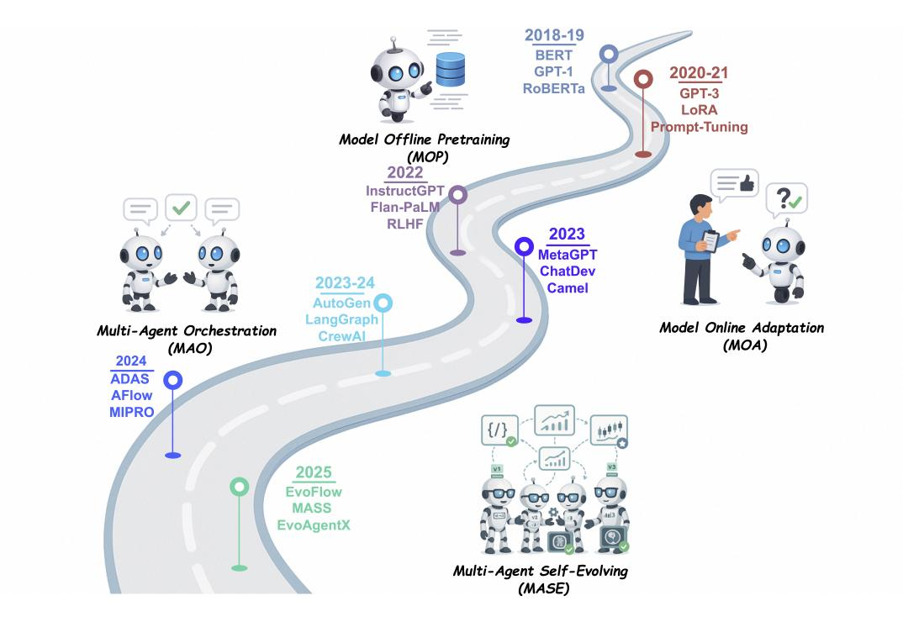
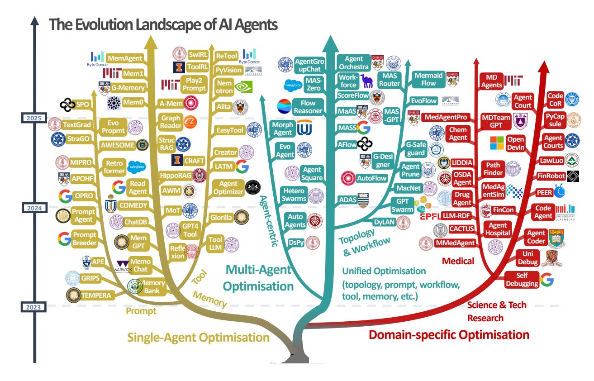
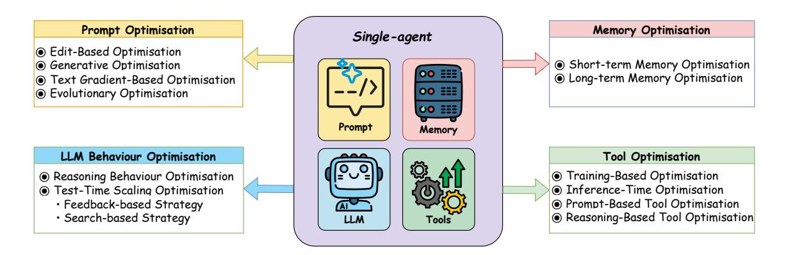
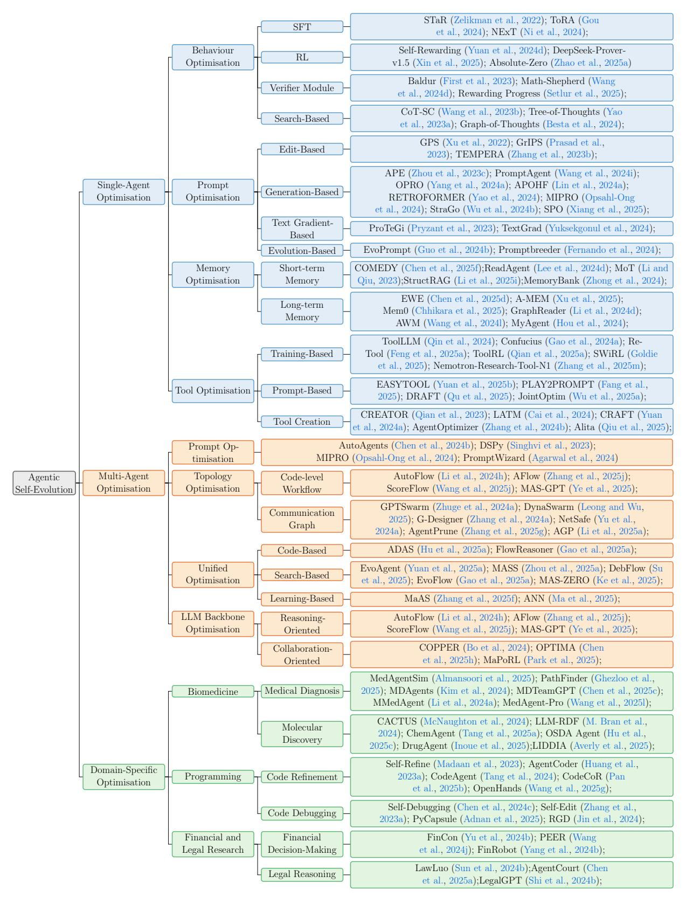
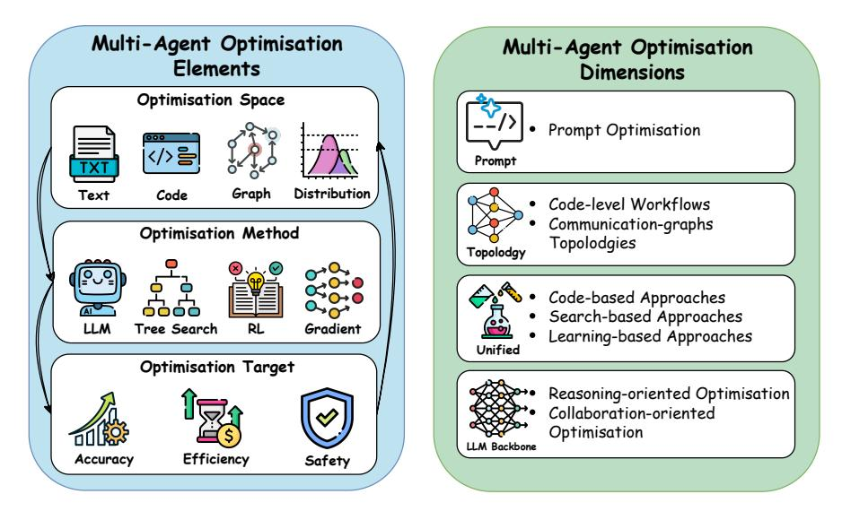

# 자기 진화하는 AI 에이전트에 대한 종합적 조사

## 기초 모델과 평생 에이전트 시스템을 연결하는 새로운 패러다임

방진원\*1, 펑옌원\*2, 장시\*1, 왕잉쉬3, 이신호1, 장구빈4, 쉬이5, 오빈6, 류시웨이7, 리쯔하오1, 런자오춘8, 니코스 알레트라스2, 왕시2, 주한5, 몽자이차오1⊠

최근 대형 언어 모델(Large Language Models, LLMs)의 발전은 복잡하고 현실적인 작업을 해결할 수 있는 AI 에이전트에 대한 관심을 높이고 있다. 그러나 기존의 대부분의 에이전트 시스템은 배포 후 정적인 수동으로 구성된 설정에 의존하며, 동적이고 변화하는 환경에 적응하는 능력이 제한적이다. 이러한 한계를 해결하기 위해 최근 연구에서는 상호작용 데이터와 환경 피드백을 기반으로 에이전트 시스템을 자동으로 향상시키는 에이전트 진화 기술을 탐구하고 있다. 이 새로운 방향은 자기 진화형 AI 에이전트의 기초를 마련하며, 기초 모델의 정적 기능과 평생 에이전트 시스템에 필요한 지속적인 적응성 사이의 갭을 메운다. 본 조사에서는 자기 진화형 에이전트 시스템에 대한 기존 기술을 포괄적으로 검토한다. 구체적으로, 자기 진화형 에이전트 시스템 설계의 핵심인 피드백 루프를 추상화한 통합 개념적 프레임워크를 소개한다. 이 프레임워크는 시스템 입력(System inputs), 에이전트 시스템(Agent System), 환경(Environment), 최적화기(Optimisers)의 네 가지 핵심 구성 요소를 강조하며, 다양한 전략을 이해하고 비교하는 기초를 제공한다. 이 프레임워크를 바탕으로, 기초 모델, 에이전트 프롬프트, 메모리, 도구, 워크플로우, 에이전트 간 통신 메커니즘 등 에이전트 시스템의 다양한 구성 요소를 대상으로 한 광범위한 자기 진화 기술을 체계적으로 검토한다. 또한, 생의학, 프로그래밍, 금융과 같은 특수 분야를 위한 도메인 특화 진화 전략을 조사한다. 이들 분야에서는 에이전트의 행동과 최적화 목표가 도메인 제약 조건과 밀접하게 연결되어 있다. 또한, 자기 진화형 에이전트 시스템의 평가, 안전성, 윤리적 고려 사항에 대한 전용 논의를 제공하며, 이는 시스템의 효과성과 신뢰성을 보장하는 데 핵심적이다. 본 조사는 연구자와 실무자에게 자기 진화형 AI 에이전트에 대한 체계적인 이해를 제공함으로써, 더 적응력 있고 자율적이며 평생 에이전트 시스템 개발의 기초를 마련하는 것을 목표로 한다.

Github: https://github.com/EvoAgentX/Awesome-Self-Evolving-Agents

## 1 소개

최근 대형 언어 모델(Large Language Models, LLMs)의 발전은 인공지능(AI) 개발을 크게 진전시켰다. 대규모 사전 훈련, 감독하에 fine-tuning 및 강화 학습의 발전 덕분에, LLMs는 계획, 추론 및 자연어 이해 능력에서 놀라운 성과를 보여주고 있다(Zhao et al., 2023; Grattafiori et al., 2024; Yang et al., 2025a; Guo et al., 2025). 이러한 발전은 *LLM 기반 에이전트*(LLM이 의사결정/정책 모듈로 사용되는 AI 에이전트의 하위 클래스)에 대한 관심을 높이고 있다(Wang et al., 2024c; Luo et al., 2025a). 이들은 자율적인 시스템으로, *LLM을 핵심 추론 구성 요소로 활용하여 개방형 실세계 환경에서 입력을 이해하고, 행동을 계획하며, 출력을 생성한다*(Wang et al., 2024c; Xi et al., 2025; Luo et al., 2025a). 일반적인 AI 에이전트는 자율적으로 복잡한 목표 지향 작업을 수행할 수 있도록 여러 구성 요소로 구성된다. 기초 모델(예: LLM)이 핵심이며, 목표를 해석하고, 계획을 세우고, 행동을 실행하는 역할을 한다. 이러한 기능을 지원하기 위해, 인지(perception)(Shridhar et al., 2021; Zheng et al., 2024), 계획(planning)(Yao et al., 2023a,b; Besta et al., 2024), 기억(memory)(Modarressi et al., 2023; Zhong et al., 2024), 도구(tool)(Schick et al., 2023; Gou et al., 2024; Liu et al., 2025g)와 같은 추가 모듈이 통합되어 에이전트가 입력을 인지하고, 작업을 분해하며, 맥락 정보를 유지하고, 도구와 상호작용할 수 있도록 돕는다(Wang et al., 2024c).

1글래스고 대학교, 2 Sheffield 대학교, 3Mohamed bin Zayed 인공지능 대학교, 4싱가포르 국립 대학교, 5케임브리지 대학교, 6런던 대학 칼리지, 7에이브러딘 대학교, 8라이덴 대학교

\*동등 기여자, 통신저자

그림 1. LLM 중심 학습은 정적 데이터에서만 학습하는 방식에서 동적 환경과 상호작용하는 방식으로, 궁극적으로 다중 에이전트 협업과 자기진화를 통한 평생 학습으로 발전하고 있다.

단일 에이전트 시스템은 다양한 작업에서 강력한 일반화 및 적응성을 보여주었지만, 동적이고 복잡한 환경에서 작업 특화 및 조정에 어려움을 겪는 경우가 많다 [\(Wu et al.,](#page-49-1) [2024a;](#page-49-1) [Qian](#page-44-0) [et al.,](#page-44-0) [2024\)](#page-44-0). 이러한 한계는 다중 에이전트 시스템(MAS) [\(Hong et al.,](#page-37-3) [2024;](#page-37-3) [Guo et al.,](#page-37-4) [2024c;](#page-37-4) [Zhou et al.,](#page-53-3) [2025a\)](#page-53-3)의 개발로 이어졌으며, 여러 에이전트가 협력하여 복잡한 문제를 해결한다. 단일 에이전트 시스템에 비해 MAS는 기능적 특화를 가능하게 하며, 각 에이전트는 특정 하위 작업 또는 전문 분야에 맞게 설계된다. 또한 에이전트들은 상호작용하고 정보를 교환하며 행동을 조정하여 공통 목표를 달성할 수 있다. 이러한 협업을 통해 시스템은 단일 에이전트의 능력 범위를 넘어서는 작업을 수행할 수 있으며, 더 현실적이고 동적, 상호작용적인 환경을 시뮬레이션할 수 있다. LLM 기반 에이전트 시스템은 코드 생성 [\(Jiang et al.,](#page-39-0) [2024\)](#page-39-0), 과학 연구 [\(Lu et al.,](#page-42-1) [2024a\)](#page-42-1), 웹 탐색 [\(Lai et al.,](#page-39-1) [2024a\)](#page-39-1)에서부터 생의학 [\(Kim et al.,](#page-39-2) [2024\)](#page-39-2) 및 금융 [\(Tian et al.,](#page-47-1) [2025\)](#page-47-1)에 이르기까지 다양한 실-world 작업에 성공적으로 적용되었다.

에이전트 시스템의 상당한 발전에도 불구하고, 대부분의 시스템은 단일 에이전트이든 다중 에이전트이든 여전히 수동으로 설계된 구성에 크게 의존한다. 배치된 후 이러한 시스템은 일반적으로 정적 아키텍처와 고정된 기능을 유지한다. 그러나 실세계 환경은 동적이고 지속적으로 변화하며, 예를 들어 사용자 의도가 바뀌고, 작업 요구사항이 변경되며, 외부 도구나 정보 소스가 시간이 지남에 따라 달라질 수 있다. 예를 들어, 고객 서비스를 지원하는 에이전트는 새로 도입된 제품, 업데이트된 회사 정책, 또는 익숙하지 않은 사용자 의도를 처리해야 할 수 있다. 마찬가지로 과학 연구 보조 에이전트는 새로 발표된 알고리즘을 통합하거나 새로운 분석 도구를 통합해야 할 수도 있다. 이러한 환경에서 에이전트 시스템을 수동으로 재구성하는 것은 시간이 오래 걸리고, 인력이 많이 필요하며, 확장하기 어렵다.

이러한 과제들은 최근 자기 진화형 AI 에이전트(Self-Evolving AI Agents)라는 새로운 패러다임을 탐구하려는 노력들을 촉진시켰다. 이는 기초 모델(foundation models)과 평생 학습 에이전트 시스템(lifelong learning agentic systems)을 연결하는, 자율적 적응과 지속적인 자기 개선이 가능한 새로운 유형의 에이전트 시스템이다.

## **정의**

자기진화형 AI 에이전트는 환경과의 상호작용을 통해 내부 구성 요소를 지속적이고 체계적으로 최적화하는 자율 시스템으로, 안전성을 유지하면서 변화하는 작업, 맥락 및 자원에 적응하고 성능을 향상시키는 것을 목표로 한다.

아이작 아시모프의 로봇 삼법칙[1](#page-2-0)에 영감을 받아, 우리는 AI 에이전트의 안전하고 효과적인 자기 진화를 위한 지침 원칙을 제안한다.

## **자기 진화형 AI 에이전트의 세 가지 법칙**

I. 견디기 (안전 적응) 자기 진화형 AI 에이전트는 어떠한 수정 과정에서도 안전성과 안정성을 유지해야 한다.

II. Excel (성능 유지)  
제1법칙에 따라, 자가진화형 AI 에이전트는 기존 작업 성능을 유지하거나 향상시켜야 한다.

III. 진화(자율적 진화)  
제1법칙과 제2법칙에 따라, 자율적 진화를 수행하는 AI 에이전트는 변화하는 작업, 환경, 또는 자원에 대응하여 내부 구성 요소를 자율적으로 최적화할 수 있어야 한다.

우리는 자기진화형 AI 에이전트의 출현을 LLM 기반 시스템 개발의 더 넓은 패러다임 전환의 일부로 규정한다. 이 전환은 초기 단계의 모델 오프라인 사전학습(Model Offline Pretraining, MOP)과 모델 온라인 적응(Model Online Adaptation, MOA)을 거쳐 최근의 다중 에이전트 오케스트레이션(Multi-Agent Orchestration, MAO)으로 이어지며, 궁극적으로 다중 에이전트 자기진화(Multi-Agent Self-Evolving, MASE)로 발전한다. 그림 [1](#page-1-0)과 표 [1](#page-3-0)에서 요약한 바와 같이, 각 패러다임은 이전 패러다임을 기반으로 하여 정적이고 고정된 기초 모델에서 완전히 자율적이고 자기진화하는 에이전트 시스템으로 나아간다.

MOP(모델 오프라인 사전 훈련). 초기 단계는 대규모 정적 코퍼스에서 기초 모델을 사전 훈련한 후, 추가 적응 없이 고정된 상태로 배포하는 데 중점을 둡니다.

MOA(모델 온라인 적응). MOP을 기반으로 한 이 단계에서는 배포 후 적응을 도입하며, 기초 모델을 감독 학습 미세조정, 낮은 순위 어댑터 [\(Pfeiffer et al.,](#page-44-1) [2021;](#page-44-1) [Hu et al.,](#page-38-0) [2022\)](#page-38-0), 또는 인간 피드백을 통한 강화 학습(RLHF) [\(Ouyang et al.,](#page-43-1) [2022\)](#page-43-1)와 같은 기술을 사용하여 레이블, 평가, 또는 지시 프롬프트를 통해 업데이트할 수 있다.

MAO(다중 에이전트 오케스트레이션). 단일 기초 모델을 넘어서, 이 단계는 여러 LLM 에이전트를 조정하여 메시지 교환 또는 토론 프롬프트를 통해 상호작용하고 협업하여 복잡한 작업을 해결하며, 기저 모델 매개변수를 수정하지 않는다. [Li et al.,](#page-41-1) [2024g;](#page-41-1) [Zhang et al.,](#page-52-0) [2025h\)](#page-52-0)

MASE(다중 에이전트 자가진화). 마지막으로, MASE는 환경 피드백과 메타보상에 기반하여 에이전트 집단이 프롬프트, 메모리, 도구 사용 전략, 심지어 상호작용 패턴을 지속적으로 개선하는 평생 자가진화 루프를 도입한다 [\(Novikov et al.,](#page-43-2) [2025;](#page-43-2) [Zhang](#page-52-1) [et al.,](#page-52-1) [2025i\)](#page-52-1).

MOP에서 MASE로의 진화는 LLM 기반 시스템 개발에서 정적이고 수동으로 구성된 아키텍처에서 변화하는 요구사항과 환경에 반응할 수 있는 적응형, 데이터 기반 시스템으로의 근본적인 전환을 의미한다. 자기진화형 AI 에이전트는 기초 모델의 정적 기능과 평생 에이전트 시스템에 필요한 지속적인 적응성을 연결하며, 더 자율적이고 탄력적이며 지속 가능한 AI로 나아가는 길을 제시한다.

자기 진화하는 AI 에이전트는 미래 AI 시스템에 대한 야심찬 비전을 대표하지만, 이러한 수준의 자율성을 달성하는 것은 장기적인 목표이다. 현재의 시스템은 안전하고 강력하며 개방형 자기 진화를 위해 필요한 전반적인 기능을 아직 충족하지 못하고 있다. 실제로, 이 비전에 대한 현재의 진전은 에이전트 진화 및 최적화 기술을 통해 이루어지며, 이는 에이전트 시스템이 상호작용 데이터와 환경 피드백을 기반으로 구성 요소를 반복적으로 개선함으로써 실세계 작업에서의 효율성을 향상시키는 실용적인 수단을 제공한다. 최근 연구에서는 이 분야에서 몇 가지 핵심 방향을 탐색하고 있다. 한 가지 연구 방향은 핵심 기능을 향상시키기 위해 기반 LLM 자체를 개선하는 데 초점을 맞추고 있으며, 이는 계획 [\(Qiao et al.,](#page-45-1) [2024\)](#page-45-1), 추론 [\(Zelikman et al.,](#page-51-0) [2022;](#page-51-0) [Tong et al.,](#page-47-2) [2024\)](#page-47-2), 그리고 도구 사용 [\(Feng et al.,](#page-36-0) [2025a\)](#page-36-0)과 같은 분야를 포함한다. 또 다른 연구 방향은 에이전트 시스템 내 보조 구성 요소의 최적화를 목표로 하며, 이는 프롬프트 [\(Xu et al.,](#page-49-2) [2022;](#page-49-2) [Prasad et al.,](#page-44-2) [2023;](#page-44-2) [Yang et al.,](#page-50-3) [2024a;](#page-50-3) [Wang et al.,](#page-48-0) [2025i\)](#page-48-0), 도구 [\(Yuan et al.,](#page-51-1) [2025b;](#page-51-1) [Qu et al.,](#page-45-2) [2025\)](#page-45-2),

1 그의 이야기 "Runaround"(1942)와 "I, Robot"(1950)에서 소개됨. 이 법칙들은 계층적이다: 두 번째 법칙은 첫 번째 법칙을 초월할 수 없으며, 세 번째 법칙은 첫 번째 또는 두 번째 법칙을 초월할 수 없다. 이 법칙들은 허구적인 도덕적 제약으로 고안되었지만, 인공지능 윤리 연구에 영향을 미치게 되었다. 따라서 우리는 "자기 진화형 AI 에이전트의 세 가지 법칙"을 제시하며, 신체화된 AI의 핵심인 AI 에이전트가 자율적 진화를 추구하기 전에 준수와 안전을 우선시해야 한다고 주장한다.

| 패러다임                            | 상호작용 및 피드백                         | 주요 기술                                             | 다이어그램                                                                      |
|-------------------------------------|------------------------------------------------|-------------------------------------------------------------------------------------------------------------------------------------------------------------|------------------------------------------------------------------------------|
| 모델 오프라인 사전학습 (MOP)  | 모델 ⇔ 정적 데이터 (손실/역전파)         | • 트랜스포머 사전학습 (캐usal LM, 마스크 LM, NSP) • BPE / SentencePiece • MoE 및 파이프라인 병렬 처리                                           | 손실 모델 정적 데이터                                                 |
| 모델 온라인 적응 (MOA)    | 모델 ⇔ 감독 (라벨/점수/보상) | • 태스크 피니튜닝 • 지시어 튜닝 • LoRA / 어댑터 / 프리픽스 튜닝 • RLHF (RLAIF, DPO, PPO) • 다중 모달 정렬 • 인간 정렬 | 모델 A A SFT 모델 모델 B B LoRA C RLHF 모델 C |
| 멀티에이전트 오케스트레이션 (MAO)  | 에이전트1 ⇔ 에이전트2 (메시지 교환)          | • 멀티에이전트 시스템 • 자기반성 • 멀티에이전트 토론 • 체인 오브 씽크 앙상블 • 함수 / 툴 호출 / MCP                        | Æ Æ Æ                                                                  |
| 멀티에이전트 자기진화 (MASE) | 에이전트 ⇔ 환경 (환경에서 오는 신호)    | • 행동 최적화 • 프롬프트 최적화 • 메모리 최적화 • 툴 최적화 • 에이전트 워크플로우 최적화                        | Æ Æ 환경. Æ                                                          |

표 1 네 가지 LLM 중심 학습 패러다임 비교 – 모델 오프라인 사전학습(MOP), 모델 온라인 적응(MOA), 다중 에이전트 오케스트레이션(MAO), 다중 에이전트 자가진화(MASE) – 각 패러다임의 상호작용 및 피드백 메커니즘, 핵심 기술, 그리고 정적 모델 학습에서 동적이고 자율적인 에이전트 진화로의 진화 과정을 추적하기 위한 예시 다이어그램을 강조함.

메모리 [Zhong 등,](#page-53-2) [2024;](#page-53-2) [Lee 등,](#page-40-0) [2024d\)](#page-40-0)를 통해 에이전트는 새로운 작업과 동적 환경에 더 잘 일반화할 수 있게 되었다. 또한, 다중 에이전트 시스템에서는 최근 연구에서 에이전트 구조와 통신 프로토콜의 최적화를 조사하고 있다 [Bo 등,](#page-34-1) [2024;](#page-34-1) [Chen 등,](#page-35-0) [2025h;](#page-35-0) [Zhang 등,](#page-52-2) [2025j;](#page-52-2) [Zhou](#page-53-3) [등,](#page-53-3) [2025a\)](#page-53-3), 현재 작업에 가장 적합한 에이전트 구조를 식별하고 에이전트 간의 조정 및 정보 공유를 개선하려는 목적으로 진행되고 있다.

기존의 AI 에이전트에 대한 조사들은 일반적으로 에이전트 아키텍처와 기능에 대한 소개에 초점을 맞추고 있다 [\(Wang et al.,](#page-47-0) [2024c;](#page-47-0) [Guo et al.,](#page-37-4) [2024c;](#page-37-4) [Xi et al.,](#page-49-0) [2025;](#page-49-0) [Luo et al.,](#page-42-0) [2025a;](#page-42-0) [Liu et al.,](#page-41-2) [2025a,](#page-41-2)[d\)](#page-41-3)), 또는 계획 [\(Huang et al.,](#page-38-1) [2024b\)](#page-38-1)), 메모리 [\(Zhang et al.,](#page-52-3) [2024d\)](#page-52-3)), 협업 메커니즘 [\(Tran et al.,](#page-47-3) [2025\)](#page-47-3)), 평가 [\(Yehudai et al.,](#page-50-4) [2025\)](#page-50-4))와 같은 특정 구성 요소를 대상으로 한다. 다른 조사들은 운영 체제 에이전트 [\(Hu et al.,](#page-38-2) [2025b\)](#page-38-2)) 및 의료 분야 에이전트 [\(Sulis et al.,](#page-46-1) [2023\)](#page-46-1))와 같은 도메인별 응용을 조사한다. 이러한 조사들은 에이전트 시스템의 다양한 측면에 대한 유익한 통찰을 제공하지만, 최근 에이전트의 자기 진화 및 지속적 적응 기술에 대한 진전은 충분히 다루어지지 않았다. 이는 평생 동안 자율적인 AI 시스템 개발의 핵심이 되는 에이전트의 능력과 관련된다. 이로 인해 자기 진화적이고 적응 가능한 에이전트 시스템을 뒷받침하는 새로운 학습 패러다임에 대한 포괄적인 이해를 추구하는 연구자와 실무자들에게 문헌상의 중요한 공백이 남아 있다.

이 격차를 메우기 위해, 이 조사에서는 에이전트가 상호작용 데이터와 환경 피드백을 기반으로 스스로 진화하고 개선할 수 있도록 하는 기술에 대한 집중적이고 체계적인 검토를 제공한다. 구체적으로, 자가진화형 에이전트 시스템 설계의 핵심이 되는 피드백 루프를 추상화한 통합적 개념적 프레임워크를 소개한다. 이 프레임워크는 시스템 입력(System Inputs), 에이전트 시스템(Agent System), 환경(Environment), 최적화기(Optimisers)의 네 가지 핵심 구성 요소를 식별하여 에이전트 시스템의 진화 루프를 강조한다. 이 프레임워크를 바탕으로, LLM, 프롬프트, 메모리, 도구, 워크플로우 토폴로지, 통신 메커니즘 등 에이전트 시스템의 다양한 구성 요소를 대상으로 하는 진화 및 최적화 기술을 체계적으로 살펴본다. 또한, 특수 분야를 위해 개발된 도메인 특화 진화 전략도 조사한다. 또한, 자가진화형 에이전트 시스템의 평가, 안전성, 윤리적 고려 사항에 대한 전용 논의를 제공한다.

**그림 2** AI 에이전트 진화 및 최적화 기술의 시각적 분류도로, 단일 에이전트 최적화, 다중 에이전트 최적화, 도메인 특화 최적화의 세 가지 주요 방향으로 분류된다. 이 트리 구조는 2023년부터 2025년까지 각 접근법의 발전 과정을 보여주며, 각 분기 내에 대표적인 방법들이 포함되어 있다.

시스템은 그들의 효과성과 신뢰성을 보장하는 데 중요한 역할을 합니다. 병행 연구로, Gao 등(2025b)은 세 가지 기본 차원을 중심으로 구성된 자기 진화형 에이전트를 조사합니다: 무엇을 진화할 것인가, 언제 진화할 것인가, 그리고 어떻게 진화할 것인가. 그들의 분류 체계는 유의미한 통찰을 제공하지만, 우리의 조사는 평생 동안 자기 진화하는 에이전트 시스템을 구축하는 데 관련된 메커니즘과 과제에 대해 보다 포괄적이고 통합적인 관점을 제공하는 것을 목표로 합니다, 즉 통합된 개념적 프레임워크를 제공하는 것입니다.

이 조사의 목적은 자가 진화하는 에이전트 시스템에 대한 기존 기술을 포괄적이고 체계적으로 검토하여, 연구자와 실무자에게 보다 효과적이고 지속 가능한 에이전트 시스템 개발을 위한 유익한 통찰과 지침을 제공하는 것이다. 그림 2는 단일 에이전트, 다중 에이전트 및 도메인 특화 최적화 분야에 걸쳐 기존 에이전트 진화 전략을 시각적으로 분류한 것으로, 각 방향에서 대표적인 접근법을 강조한다. 본 연구의 주요 기여는 다음과 같다:

우리는 자기 진화형 AI 에이전트의 3대 법칙을 공식화하고, 정적 사전 훈련에서 완전히 자율적이고 평생 자기 진화형 에이전트 시스템에 이르기까지 LLM 중심 학습 패러다임의 진화를 정리한다.

우리는 자기 진화형 에이전트 시스템의 피드백 루프를 추상화하는 통합적 개념적 프레임워크를 소개하며, 다양한 진화 및 최적화 접근 방식을 체계적으로 이해하고 비교할 수 있는 기반을 제공한다.

우리는 단일 에이전트, 다중 에이전트 및 도메인 특화 설정에서 기존 진화 및 최적화 기술에 대한 체계적인 리뷰를 수행한다.

우리는 자가진화형 에이전트 시스템의 평가, 안전성, 윤리적 고려사항에 대한 포괄적인 검토를 제공하며, 이러한 시스템의 효과성, 안전성 및 책임 있는 배포를 보장하는 데 있어 그들의 핵심적인 역할을 강조한다.

우리는 에이전트 자아진화 분야에서 핵심적인 미해결 과제들을 식별하고, 유망한 연구 방향을 제시함으로써, 더 유연하고 자율적이며 자아진화하는 시스템의 개발을 촉진하고자 한다.

에이전트 시스템(agents)

이 조사의 나머지 부분은 다음과 같이 구성되어 있다. 제2절([2](#page-5-0))에서는 AI 에이전트와 다중 에이전트 시스템에 대한 기초 내용을 다루며, 정의, 핵심 구성 요소, 대표적인 아키텍처, 그리고 자율적이고 자가진화하는 에이전트 시스템의 광범위한 비전을 포함한다. 제3절([3](#page-8-0))에서는 에이전트 진화 접근법을 위한 통합 개념적 프레임워크를 소개하며, 시스템 입력, 진화 목표, 에이전트 구조, 최적화기 등의 핵심 요소를 설명한다. 제4절([4](#page-11-0))은 단일 에이전트 시스템의 최적화에 초점을 맞추며, 추론 전략, 프롬프트 구성, 기억 메커니즘, 도구 사용 등의 여러 핵심 측면을 논의한다. 제5절([5](#page-20-0))은 다중 에이전트 시스템과 에이전트 워크플로우, 구조, 에이전트 간 통신 전략을 최적화하는 방법을 다룬다. 제6절([6](#page-25-0))에서는 분야별 에이전트 최적화 기술과 그 응용을 강조하며, 제7절([7](#page-29-0))에서는 에이전트 시스템을 평가하기 위한 평가 방법론과 벤치마크를 논의한다. 제8절([8](#page-31-0))에서는 에이전트 진화 및 최적화 분야의 기존 도전 과제를 제시하고, 몇 가지 유망한 미래 연구 방향을 제시한다. 마지막으로, 제9절([9](#page-32-0))에서 이 조사를 마무리한다.

## 2 인공지능 에이전트 시스템의 기초

에이전트의 진화와 최적화를 명확히 이해하기 위해, 본 섹션에서는 기존 AI 에이전트 시스템에 대한 개요를 제공한다. 우리는 먼저 Section [2.1,](#page-5-1)에서 단일 에이전트 시스템(single-agent systems)을 소개하며, 그 정의와 핵심 구성 요소를 설명한다. 그 다음 Section [2.2,](#page-6-0)에서 다중 에이전트 시스템(MAS)으로 넘어가, 그 동기, 구조적 패러다임, 그리고 협업 메커니즘을 강조한다. 마지막으로 Section [2.3.](#page-7-0)에서는 평생 학습하고 자가 진화하는 에이전트 시스템의 비전을 제시한다.

### 2.1 AI 에이전트

AI 에이전트는 입력을 인식하고 목표에 대해 추론하며 환경과 상호작용하여 작업을 완료할 수 있는 자율 시스템을 의미한다 [\(Luo et al.,](#page-42-0) [2025a\)](#page-42-0). 본 섹션에서는 AI 에이전트 연구의 기초가 되는 단일 에이전트 시스템에 초점을 맞춘다. 본문의 목적은 간단한 개요를 제공하는 것이므로, 더 포괄적인 AI 에이전트 아키텍처와 기능에 대한 논의는 기존의 조사 보고서를 참조할 수 있다 [\(Guo et al.,](#page-37-4) [2024c;](#page-37-4) [Xi et al.,](#page-49-0) [2025;](#page-49-0) [Luo et al.,](#page-42-0) [2025a;](#page-42-0) [Liu et al.,](#page-41-2) [2025a\)](#page-41-2).

AI 에이전트는 일반적으로 자율적인 의사결정과 실행을 가능하게 하기 위해 함께 작동하는 여러 구성 요소로 구성됩니다. 에이전트의 핵심 구성 요소는 기초 모델(Foundation Model)로, 대부분 LLM[2](#page-5-2)이며, 지시사항을 해석하고 계획을 생성하며 실행 가능한 응답을 생성하는 중앙 추론 엔진으로 역할합니다. 또한 복잡하고 동적인 환경에서 에이전트의 능력을 향상시키는 보조 모듈도 있습니다.

(1) 인지 모듈. 인지 모듈은 환경에서 정보를 획득하고 해석하는 역할을 담당한다 [\(Li et al.,](#page-40-1) [2024f\)](#page-40-1). 이는 텍스트 입력, 오디오 신호, 비디오 프레임 또는 기타 감각과 유사한 데이터를 처리하여 추론에 적합한 표현을 구축하는 것을 포함한다.

(2) 계획 모듈. 계획 모듈은 에이전트가 복잡한 작업을 실행 가능한 하위 작업 또는 연속적인 작업 시퀀스로 분해하고 여러 단계에 걸쳐 실행을 안내할 수 있게 해준다 [\(Huang et al.,](#page-38-1) [2024b\)](#page-38-1). 이 과정은 계층적 추론을 촉진하고 일관된 작업 완료를 보장한다. 가장 간단한 형태의 계획 중 하나는 선형 작업 분해로, 문제를 여러 중간 단계로 나누고 LLM이 이 단계들을 따라 문제를 해결하는 방식이다. 이는 체인 오브 써Thought 프롬프팅 [\(Wei et al.,](#page-48-1) [2022\)](#page-48-1)과 같은 방법에서 잘 나타난다. 정적 계획을 넘어서, 더 동적인 접근 방식은 계획과 실행을 반복적인 루프로 혼합한다. 예를 들어, ReAct [\(Yao et al.,](#page-50-2) [2023b\)](#page-50-2) 프레임워크는 추론과 행동을 결합하여 에이전트가 실시간 피드백을 기반으로 계획을 수정할 수 있게 한다. 선형 계획 외에도 일부 방법은 분기 전략을 채택하며, 각 단계가 여러 가능한 연속으로 이어질 수 있다. 대표적인 예로 트리 오브 써Thought [\(Yao et al.,](#page-50-1) [2023a\)](#page-50-1)과 그래프 오브 써Thought [\(Besta et al.,](#page-34-0) [2024\)](#page-34-0)이 있으며, 이는 에이전트가 여러 추론 경로를 탐색할 수 있게 한다.

(3) 메모리 모듈. 메모리 모듈은 에이전트가 과거 경험을 유지하고 회상할 수 있게 하여 맥락 인식 추론과 장기적 일관성을 가능하게 한다. 일반적으로 메모리는 단기 메모리와 장기 메모리로 분류할 수 있다. 단기 메모리는 일반적으로 에이전트가

2이 조사의 초점은 LLM에 맞춰져 있지만, 기반 모델은 어떤 기초 모델(예: 시각-언어 모델, 단백질 서열/구조 모델)이 될 수 있으며, 우리가 논의하는 핵심 에이전트 원칙은 이러한 기반 모델로 쉽게 일반화된다.

현재 작업의 실행 과정을 거친 후, 단기 기억은 제거됩니다. 반면 장기 기억은 시간이 지나도 지속되며, 누적된 지식, 과거 경험 또는 여러 작업 간에 재사용 가능한 정보를 저장할 수 있습니다. 관련된 장기 기억에 접근하기 위해, 많은 에이전트 시스템은 검색 증강 생성(RAG, retrieval-augmented generation) 모듈을 채택합니다 [\(Zhang et al.,](#page-52-3) [2024d\)](#page-52-3), 여기서 에이전트는 기억에서 관련 정보를 검색하고 이를 LLM의 입력 컨텍스트에 통합합니다. 효과적인 기억 모듈을 설계하는 데는 기억 표현을 어떻게 구조화할지, 언제 무엇을 저장할지, 어떻게 효율적으로 관련 정보를 검색할지, 그리고 이를 추론 과정에 어떻게 통합할지와 같은 여러 어려움이 있습니다 [Zeng et al.](#page-51-2) [\(2024a\)](#page-51-2). AI 에이전트의 기억 메커니즘에 대한 더 포괄적인 리뷰를 위해, 독자에게 [Zhang et al.](#page-52-3) [\(2024d\)](#page-52-3)의 설문 보고서를 참조합니다.

(4) 도구 사용. 외부 도구를 사용하는 능력은 AI 에이전트가 실세계 상황에서 효과적으로 작동하는 데 중요한 요소입니다. 대규모 언어 모델(LLM)은 언어 이해 및 생성에 강력하지만, 정적 지식과 추론 능력에 의해 본질적으로 제한됩니다. 외부 도구를 사용함으로써 에이전트는 기능적 범위를 확장할 수 있으며, 실세계 환경과 더 잘 상호작용할 수 있게 됩니다. 일반적인 도구로는 웹 검색 엔진 [\(Li et al.,](#page-40-2) [2025g\)](#page-40-2), 코드 인터프리터 또는 실행 환경 [\(Islam et al.,](#page-38-3) [2024\)](#page-38-3), 그리고 브라우저 자동화 프레임워크 [\(Müller and Žunič,](#page-43-3) [2024\)](#page-43-3) 등이 있습니다. 도구 사용 구성 요소의 설계는 도구 선택, 도구별 입력 구성, API 호출 및 도구 출력을 추론 과정에 통합하는 것을 포함합니다.

## 2.2 다중 에이전트 시스템

단일 에이전트 시스템은 다양한 작업에서 강력한 능력을 보여주었지만, 많은 실-world 작업은 단일 에이전트의 능력을 초월하는 전문화와 조정을 요구한다. 이러한 한계는 생물학적 및 사회적 시스템에서 발견되는 분산 지능을 모방하는 다중 에이전트 시스템(Multi-Agent Systems, MAS)의 개발을 촉진시켰다.

MAS는 단일 에이전트의 능력 이상의 목표를 달성하기 위해 공유 환경 내에서 상호작용하는 자율 에이전트의 집합으로 공식적으로 정의된다. 단일 에이전트 시스템이 오직 개인적인 추론과 능력에 의존하는 것과 달리, MAS는 다양한 에이전트 간의 구조화된 조정과 협업을 통해 집단 지능을 달성하는 데 중점을 둔다 [\(Tran et al.,](#page-47-3) [2025\)](#page-47-3). 이러한 조정을 가능하게 하는 핵심 메커니즘은 에이전트 토폴로지의 개념으로, 시스템 내에서 에이전트가 어떻게 연결되고 통신하는지를 정의하는 구조적 구성이다. 토폴로지는 에이전트 간의 정보 흐름과 협업 전략을 결정하며, 작업이 어떻게 분배되고 실행되는지를 직접적으로 영향준다. 따라서 MAS는 종종 다중 에이전트 워크플로우로 구현되며, 시스템의 토폴로지는 복잡하고 공유된 목표를 달성하기 위해 에이전트 간의 상호작용을 조율한다. 핵심 통찰은 여러 에이전트가 이러한 워크플로우를 통해 협업할 때, 시스템의 전반적인 성능이 시스템 내 모든 에이전트의 개별 능력의 합을 초과할 수 있다는 점이다 [\(Lin et al.,](#page-41-4) [2025;](#page-41-4) [Luo et al.,](#page-42-0) [2025a\)](#page-42-0).

MAS는 단일 에이전트 시스템에 비해 여러 중요한 장점을 제공한다. 첫째, MAS는 복잡한 작업을 관리하기 쉬운 하위 작업으로 분해하고 이를 전문적인 에이전트에 할당할 수 있어 전체 성능을 향상시키는 데 도움이 된다 [\(Krishnan,](#page-39-3) [2025;](#page-39-3) [Sarkar and Sarkar,](#page-45-3) [2025\)](#page-45-3). 이 접근 방식은 인간의 조직적 협업을 모방하여 단일 에이전트의 능력 범위를 넘는 작업을 처리할 수 있게 한다. 둘째, MAS는 병렬 실행을 지원하여 여러 에이전트가 동시에 작업을 수행할 수 있다. 이 기능은 시간이 중요한 응용 분야에서 특히 유리하며, 문제 해결 과정을 크게 가속화한다 [\(Zhang et al.,](#page-52-4) [2025k;](#page-52-4) [Liu et al.,](#page-41-2) [2025a;](#page-41-2) [Li et al.,](#page-41-5) [2025h\)](#page-41-5). 셋째, MAS의 분산 구조는 강력한 내구성을 제공한다. 한 에이전트가 고장나면 다른 에이전트가 동적으로 작업을 재분배하고 고장을 보완할 수 있어 시스템 전체가 완전히 붕괴되는 대신 부드럽게 성능 저하를 겪는다 [\(Huang et al.,](#page-38-4) [2024a;](#page-38-4) [Yang](#page-50-5) [et al.,](#page-50-5) [2025b\)](#page-50-5). 넷째, MAS는 내재적으로 확장 가능성을 제공하며, 새로운 에이전트를 시스템 전체를 재설계하지 않고도 원활하게 통합할 수 있다 [\(Han et al.,](#page-37-5) [2024;](#page-37-5) [Chen et al.,](#page-35-1) [2025g\)](#page-35-1). 마지막으로, 토론과 반복적 개선과 같은 협업 메커니즘을 통해 MAS는 다양한 관점과 에이전트 간의 비판적 평가를 활용하여 더 혁신적이고 신뢰할 수 있는 솔루션을 생성할 수 있다 [\(Guo et al.,](#page-37-4) [2024c;](#page-37-4) [Lin et al.,](#page-41-4) [2025\)](#page-41-4). CAMEL과 AutoGen과 같은 프레임워크는 모듈식 아키텍처, 역할 수행 패턴, 자동 오케스트레이션 기능을 제공함으로써 MAS 개발을 간소화하고 엔지니어링 오버헤드를 줄였다 [\(Li et al.,](#page-40-3) [2023a;](#page-40-3) [Wu et al.,](#page-49-1) [2024a\)](#page-49-1).

#### 2.2.1 시스템 아키텍처

MAS의 아키텍처 설계는 에이전트가 어떻게 조직되고, 조정되며, 작업을 실행하는지를 근본적으로 결정한다. 이러한 구조는 엄격한 계층 구조에서부터 유연한 피어 투 피어 네트워크에 이르기까지 다양하며, 각각은 제어, 자율성, 그리고 협업에 대한 서로 다른 철학을 반영한다.

(1) 계층 구조. 이 시스템들은 일반적으로 선형 또는 트리 기반의 정적 계층 구조를 사용하며, 작업은 명시적으로 분해되고 특정 에이전트에 순차적으로 할당됩니다. 예를 들어, MetaGPT [\(Hong et al.,](#page-37-3) [2024\)](#page-37-3)은 소프트웨어 개발을 간소화하기 위해 표준 운영 절차(SOPs)를 도입하고, HALO [\(Hou et al.,](#page-37-6) [2025\)](#page-37-6)은 추론 성능을 향상시키기 위해 몬테카를로 트리 검색(Monte Carlo Tree Search)을 통합합니다. 이 고도로 맞춤화된 접근 방식은 모듈성, 개발의 용이성, 그리고 도메인별 최적화를 제공하므로 소프트웨어 개발, 의학, 과학 연구, 사회 과학 분야에서 널리 사용됩니다 [\(Zheng et al.,](#page-53-4) [2023b;](#page-53-4) [Park et al.,](#page-44-3) [2023;](#page-44-3) [Qian et al.,](#page-44-0) [2024;](#page-44-0) [Li et al.,](#page-40-4) [2024c;](#page-40-4) [Cheng et al.,](#page-35-2) [2025\)](#page-35-2).

(2) 중앙 집중형 구조. 이 아키텍처는 중앙 에이전트 또는 고위 수준 조정자가 계획, 작업 분해 및 위임을 담당하고, 하위 에이전트가 할당된 하위 작업을 수행하는 매니저-팔로워 패러다임을 따릅니다. 이 설계는 전역 계획과 특정 작업 실행 사이의 균형을 효과적으로 유지합니다 [\(Fourney et al.,](#page-36-2) [2024;](#page-36-2) [Roucher et al.,](#page-45-4) [2025;](#page-45-4) [CAMEL-AI,](#page-34-2) [2025\)](#page-34-2). 그러나 중앙 노드는 성능 병목 현상을 유발하고 단일 장애점 취약성을 도입하여 시스템의 강건성을 저해합니다 [\(Ko et al.,](#page-39-4) [2025\)](#page-39-4).

(3) 분산 구조. 이 아키텍처에서는 에이전트들이 분산 네트워크에서 피어로 협력하며, 세계 시뮬레이션 애플리케이션에서 널리 채택되고 있다. 중앙 제어의 부재로 인해 단일 장애점이 발생하지 않으며, 어떤 노드가 손상되더라도 전체 시스템이 마비되지 않아 병목 현상을 제거하고 강건성을 향상시킨다 [\(Lu et al.,](#page-42-2) [2024b;](#page-42-2) [Yang et al.,](#page-50-5) [2025b\)](#page-50-5). 그러나 이는 정보 동기화, 데이터 보안 및 협업 비용 증가와 같은 도전 과제를 야기한다 [\(Ko et al.,](#page-39-4) [2025\)](#page-39-4). 최근 연구에서는 블록체인 기술을 활용하여 이러한 조정 문제를 해결하려고 시도하고 있다 [\(Geren et al.,](#page-36-3) [2024;](#page-36-3) [Yang et al.,](#page-50-6) [2025d\)](#page-50-6).

#### 2.2.2 통신 메커니즘

MAS의 효과는 에이전트들이 정보를 어떻게 교환하고 행동을 조정하는가에 크게 좌우된다. MAS에서의 통신 방식은 단순한 메시지 전달에서 표현력, 효율성, 상호운용성의 균형을 고려한 정교한 프로토콜로 발전해왔다.

(1) 구조화된 출력. 이 접근법은 JSON [\(Li et al.,](#page-40-5) [2024e;](#page-40-5) [Chen et al.,](#page-35-1) [2025g\)](#page-35-1), XML [\(Zhang et al.,](#page-51-3) [2025b;](#page-51-3) [Kong et al.,](#page-39-5) [2025\)](#page-39-5), 그리고 실행 가능한 코드 [\(Roucher et al.,](#page-45-4) [2025\)](#page-45-4)와 같은 형식을 사용하여 에이전트 간 통신을 수행한다. 명확한 구조와 잘 정의된 매개변수는 높은 기계 읽기 가능성과 해석 가능성을 보장하며, 표준화된 형식은 다중 플랫폼 간 협업을 용이하게 한다 [\(Chen et al.,](#page-35-1) [2025g\)](#page-35-1). 이러한 특성은 정밀성과 효율성을 요구하는 응용 분야, 예를 들어 문제 해결 및 추론 작업에 이상적이다. 또한 정보 표현의 압축성은 계산 효율성을 더욱 향상시킨다 [\(Wang et al.,](#page-48-2) [2024h\)](#page-48-2).

(2) 자연어. 자연어 통신은 풍부한 맥락적 및 의미적 정보를 유지하므로 창의적 작업, 세계 시뮬레이션, 창의적 글쓰기와 같은 상황에 특히 적합하다 [\(Liu et al.,](#page-41-2) [2025a\)](#page-41-2). 이러한 표현력은 미묘한 의미와 의도를 포착하는 미묘한 상호작용을 가능하게 한다. 그러나 모호성, 오해 가능성, 구조화된 형식에 비해 실행 효율 감소와 같은 도전 과제를 야기한다 [\(Guo et al.,](#page-37-4) [2024c;](#page-37-4) [Yang et al.,](#page-50-7) [2025c;](#page-50-7) [Kong et al.,](#page-39-5) [2025\)](#page-39-5).

(3) 표준화된 프로토콜. 최근의 발전은 MAS 통신을 표준화하기 위해 설계된 전문 프로토콜을 도입하여, 더 포괄적이고 상호운용 가능한 에이전트 생태계를 구축하고 있다: A2A [\(LLC 및](#page-42-3) [기여자들\)](#page-42-3)은 구조화된 피어 투 피어 작업 위임 모델을 통해 수평적 통신을 표준화하여, 에이전트들이 복잡하고 장기적인 작업에서 협업하면서 실행의 투명성을 유지할 수 있도록 한다. ANP [\(Chang 및 기여자들\)](#page-34-3)은 분산된 "에이전트 인터넷"을 위한 보안성과 개방성을 갖춘 수평적 통신을 계층 구조와 함께 구현하며, 내장된 분산식 신원(DID)과 동적 프로토콜 협상을 제공한다. MCP [\(PBC 및 기여자들\)](#page-44-4)은 개별 에이전트와 외부 도구 또는 데이터 자원 간의 수직적 통신을 통합된 클라이언트-서버 인터페이스를 통해 표준화한다. Agora [\(Marro 및 기여자들\)](#page-42-4)은 수평적 통신을 위한 메타프로토콜로 작동하여, 에이전트들이 동적으로 통신 방식을 협의하고 진화할 수 있도록 하며, 유연한 자연어와 효율적인 구조화된 루틴 간 원활하게 전환할 수 있다.

## 2.3 평생 자가진화형 에이전트 시스템의 비전

모델 오프라인 사전학습(MOP)을 거쳐 모델 온라인 적응(MOA) 및 다중 에이전트 오케스트레이션(MAO)에 이르는 경로는 LLM 기반 시스템에서 수동 구성의 정도를 지속적으로 낮추어 왔다. 그러나 현재 가장 진보된 다중 에이전트 프레임워크조차도 수작업으로 설계된 워크플로우, 고정된 통신 프로토콜, 그리고 인간이 수집한 도구 체인에 의존하는 경우가 많다 [\(Talebirad and Nadiri,](#page-46-2) [2023;](#page-46-2) [Zhao et al.,](#page-52-5) [2024;](#page-52-5) [Luo](#page-42-0) [et al.,](#page-42-0) [2025a;](#page-42-0) [Tran et al.,](#page-47-3) [2025\)](#page-47-3). 이러한 정적 요소들은 적응성을 제한하여, 요구사항, 자원, 목표가 시간이 지남에 따라 변화하는 동적이고 개방형 환경에서 에이전트가 성능을 유지하기 어렵게 만든다.

다양한 에이전트의 자기 진화 시스템(Multi-Agent Self-Evolving, MASE)이라는 새로운 패러다임은 배포와 지속적인 개선 사이의 루프를 닫음으로써 이러한 한계를 극복한다. MASE 시스템에서 에이전트 집단은 환경의 피드백과 고차원 메타보상에 따라 프롬프트, 메모리, 도구 사용 전략, 심지어 상호작용 구조까지 자율적으로 개선할 수 있다 [Novikov et al., 2025; Zhang et al., 2025i]. 이러한 지속적인 최적화 과정은 에이전트가 단순히 한 번 적응하는 것을 넘어, 변화하는 작업, 도메인 및 운영 제약에 따라 평생 동안 진화할 수 있게 한다.

평생 지속되고 자가 진화하는 에이전트 시스템은 아키텍처의 핵심에 지속적인 개선 루프를 통합함으로써 이러한 제약을 극복하려 한다. 세 가지 자기 진화형 AI 에이전트 법칙(Endure(안전성 적응), Excel(성능 유지), Evolve(자율 최적화))에 따라 안내되는 이러한 시스템은 다음과 같은 목표를 가지고 설계되었다:

(1) 운영 중 자신의 성능과 안전성 프로필을 모니터링합니다;

(II) 제한적이고 점진적인 업데이트를 통해 기능을 유지하거나 향상시킨다;

(III) 변화하는 작업, 환경 및 자원에 따라 프롬프트, 메모리 구조, 도구 사용 전략 및 에이전트 간 상호 연결 구조를 자율적으로 조정한다.

인간 디자이너가 모든 상호작용 패턴을 수동으로 설계해야 하는 대신, 평생 자가진화 시스템은 자체적인 에이전트 구성(agency configuration)을 생성하고, 평가하며, 개선할 수 있으며, 환경 피드백, 메타 수준 추론, 구조적 적응 사이의 루프를 닫을 수 있습니다. 이는 에이전트를 정적인 실행자에서 운영 생태계에서 지속적으로 학습하고 공진화하는 참여자로 변화시킵니다.

이 비전은 광범위한 의미를 지닌다. 과학적 발견에서, 자가진화하는 에이전트 생태계는 자율적으로 가설을 생성하고, 실험을 설계하며, 연구 워크플로우를 반복적으로 개선할 수 있다. 소프트웨어 공학 분야에서는, 새로운 도구가 등장함에 따라 개발 파이프라인을 함께 진화시킬 수 있다. 인간–AI 협업에서는, 개인의 선호를 학습하고 지속적으로 상호작용 방식을 맞춤화할 수 있다. 디지털 영역을 넘어서, 이러한 시스템은 로봇, IoT 장치, 사이버–물리 인프라를 통해 물리 세계와 상호작용할 수 있으며, 환경 변화를 인지하고, 그에 따라 행동하며, 현실 세계의 피드백을 진화 루프에 통합할 수 있다. 에이전트를 자가진화, 조정, 장기적 적응이 가능한 재구성 가능한 계산 엔티티로 간주함으로써, MASE는 확장 가능하고 지속 가능하며 신뢰할 수 있는 AI로 나아가는 길을 제시한다. 이는 한 번만 훈련되는 것이 아니라, 살아가고, 배우고, 지속되는 AI이다.

## 3 MASE의 개념적 프레임워크

자기진화형 에이전트 시스템에 대한 포괄적인 개요를 제공하기 위해, 우리는 에이전트 진화 및 최적화 방법의 설계와 구현에 기반한 핵심 요소들을 추상화하고 요약하는 고차원적 개념적 프레임워크를 제안한다. 이 프레임워크는 대부분의 기존 최적화 접근법을 포괄하는 추상적이면서도 일반화 가능한 시각을 제공함으로써, 이 분야에 대한 포괄적인 이해를 가능하게 하고 다양한 접근법 간의 비교 분석을 용이하게 한다.

### 3.1 자기 진화 과정 개요

우리는 에이전트 시스템에서 자가진화 과정의 개요를 시작으로, 이 과정은 실제로 반복 최적화를 통해 실현되는 경우가 많다. 이 과정에서 에이전트 시스템은 성능 평가와 환경 상호작용을 통해 얻은 피드백 신호를 기반으로 반복적으로 업데이트된다. 그림 [3,](#page-9-0)에서 보듯이, 이 과정은 작업 사양으로 시작하며, 이는 고수준 설명, 입력 데이터, 맥락 정보 또는 구체적인 예시를 포함할 수 있다. 이러한 요소들은 시스템 입력을 구성하며, 문제를 정의한다.

그림 3 에이전트 시스템에서의 자기진화 과정의 개념적 프레임워크. 이 과정은 네 가지 구성 요소로 이루어진 반복적 최적화 루프를 형성한다: 시스템 입력, 에이전트 시스템, 환경, 최적화기. 시스템 입력은 작업 설정(예: 작업 수준 또는 인스턴스 수준)을 정의한다. 에이전트 시스템(단일 또는 다중 에이전트 형태)은 지정된 작업을 수행한다. 환경(다양한 시나리오에 따라 다름)은 대리 지표를 통해 피드백을 제공한다. 최적화기는 정의된 탐색 공간과 최적화 알고리즘을 통해 에이전트 시스템을 업데이트하여 성능 목표가 달성될 때까지 반복한다.

에이전트 시스템의 설정입니다. **에이전트 시스템**(agent system)은 단일 에이전트 또는 다중 에이전트 아키텍처를 따르며, **환경**(environment) 내에서 작업을 수행하기 위해 배치됩니다. 환경은 운영 맥락을 제공하고, 시스템의 효과성을 측정하며 후속 최적화를 안내하는 사전 정의된 평가 지표에서 유도된 피드백 신호를 생성합니다. 환경의 피드백을 바탕으로, **최적화기**(optimiser)는 특정 알고리즘과 전략을 적용하여 에이전트 시스템을 업데이트할 수 있습니다. 예를 들어, LLM 매개변수를 조정하거나, 프롬프트를 수정하거나, 시스템 구조를 개선할 수 있습니다. 경우에 따라 최적화기는 학습 예제를 합성하여 기존 데이터셋을 보완함으로써 다음 최적화 주기에서 사용할 수 있는 데이터를 확장함으로써 시스템 입력을 개선할 수도 있습니다. 업데이트된 에이전트 시스템은 다시 환경에 배치되어 다음 반복을 시작합니다. 이 과정은 에이전트 시스템이 반복적으로 개선되고 최적화되는 반복적이고 폐쇄적인 피드백 루프를 형성합니다. 이 루프는 사전 정의된 성능 임계값에 도달하거나 수렴 기준이 충족될 때 종료됩니다. MASE의 개념적 틀을 기반으로, **EvoAgentX**는 이 자가진화 에이전트 프로세스를 적용한 최초의 오픈소스 프레임워크로, 에이전트 시스템의 생성, 실행, 평가 및 최적화를 자동화하기 위해 설계되었습니다 (Wang et al., 2025i).

위 개요를 바탕으로 에이전트 최적화 프로세스에는 네 가지 핵심 구성 요소가 있다: 시스템 입력, 에이전트 시스템, 환경 및 최적화기. 다음에서는 각 구성 요소에 대해 소개하며, 각각의 역할, 특성 및 최적화 프레임워크 내에서의 상호작용을 강조한다.

#### 3.2 시스템 입력

시스템 입력은 최적화 프로세스에 제공되는 맥락 정보와 데이터를 의미합니다. 공식적으로 시스템 입력의 집합을 $\mathcal{I}$로 나타내며, 이는 작업 요구사항, 제약 조건 및 사용 가능한 데이터를 지정하는 하나 이상의 요소로 구성될 수 있습니다. 이 입력들은 에이전트 시스템의 문제 설정을 정의하고 최적화의 범위를 결정합니다. 상황에 따라 $\mathcal{I}$는 다양한 형태를 취할 수 있습니다:

태스크 수준 최적화. 기존 연구에서 가장 흔한 설정은 에이전트 시스템의 특정 태스크에 대한 전반적인 성능을 향상시키는 데 초점을 맞추는 것이다. 이 경우, 시스템 입력 I에는 태스크 설명 T와 학습 또는 검증에 사용되는 훈련 데이터셋 Dtrain이 포함될 수 있다: I = {T , Dtrain}. 별도의 테스트 데이터셋 Dtest도 최적화된 에이전트의 성능을 평가하기 위해 포함될 수 있다. 일부 상황에서는 태스크별 레이블 데이터, 즉 Dtrain이 사용할 수 없다. 이러한 환경에서 최적화를 가능하게 하기 위해 최근 접근법 [\(Huang et al.,](#page-38-5) [2025;](#page-38-5) [Zhao et al.,](#page-52-6) [2025a;](#page-52-6) [Liu et al.,](#page-41-6) [2025b\)](#page-41-6)은 LLM 기반 데이터 생성을 통해 동적으로 훈련 예제를 합성하여 반복적 개선을 위한 대체 데이터셋을 생성하는 방식을 제안한다.

인스턴스 수준 최적화. 최근 연구에서는 더 세밀한 설정을 탐구하고 있으며, 이 경우 목표는 특정 예시에서 에이전트 시스템의 성능을 향상시키는 것이다 [Sun et al.,](#page-46-3) [2024a;](#page-46-3) [Novikov et al.,](#page-43-2) [2025\)](#page-43-2). 이 경우 시스템 입력은 입력-출력 쌍 (x, y)과 선택적 맥락 정보 C로 구성될 수 있으며, 즉 I = {x, y, C}이다.

## 3.3 에이전트 시스템

에이전트 시스템은 피드백 루프 내에서 최적화 대상이 되는 핵심 구성 요소이다. 이 시스템은 주어진 입력에 대한 에이전트의 의사결정 과정과 기능을 정의한다. 공식적으로, 에이전트 시스템을 A로 나타내며, 이는 단일 에이전트 또는 협력하는 에이전트 집합으로 구성될 수 있다. 에이전트 시스템 A는 기반 LLM, 프롬프팅 전략, 메모리 모듈, 도구 사용 정책 등 여러 구성 요소로 더 세분화될 수 있다. 최적화 방법은 목적에 따라 A의 한 개 이상의 구성 요소에 초점을 맞출 수 있다. 대부분의 기존 연구에서는 A의 단일 구성 요소에 대해 최적화를 수행한다. 예를 들어, LLM을 미세 조정하여 추론 및 계획 능력을 향상시키는 경우 [\(Zelikman et al.,](#page-51-0) [2022;](#page-51-0) [Tong](#page-47-2) [et al.,](#page-47-2) [2024;](#page-47-2) [Lai et al.,](#page-39-6) [2024b\)](#page-39-6)) 또는 프롬프트를 조정하고 적절한 도구를 선택하여 LLM 자체를 변경하지 않고 작업별 성능을 향상시키는 경우 [\(Yang et al.,](#page-50-3) [2024a;](#page-50-3) [Yuan et al.,](#page-51-1) [2025b\)](#page-51-1))이 있다. 또한 최근 연구에서는 A의 여러 구성 요소를 공동으로 최적화하는 방식도 탐구하고 있다. 예를 들어, 단일 에이전트 시스템에서는 일부 접근법이 LLM과 프롬프팅 전략을 공동으로 최적화하여 모델의 행동을 작업 요구사항에 더 잘 맞추는 것을 목표로 한다 [\(Soylu et al.,](#page-46-4) [2024\)](#page-46-4)). 다중 에이전트 시스템에서는 기존 연구에서 프롬프트와 에이전트 간 상호작용 구조를 공동으로 최적화하여 전반적인 효율성을 향상시키는 방식을 탐구한 바 있다 [\(Zhang et al.,](#page-52-2) [2025j;](#page-52-2) [Zhou](#page-53-3) [et al.,](#page-53-3) [2025a\)](#page-53-3)).

### 3.4 환경

환경은 에이전트 시스템이 작동하고 출력을 생성하는 외부 맥락을 제공한다. 구체적으로, 에이전트 시스템은 환경과 상호작용하여 입력을 인식하고, 행동을 실행하며, 해당 결과를 수신한다. 작업에 따라 환경은 벤치마크 데이터셋에서부터 완전히 동적이고 실세계적인 설정에 이르기까지 다양할 수 있다 [\(Liu et al.,](#page-42-5) [2023a\)](#page-42-5). 예를 들어, 코드 생성 작업에서는 컴파일러, 인터프리터, 테스트 케이스와 같은 코드 실행 및 검증 구성 요소가 포함될 수 있다. 과학 연구에서는 문헌 데이터베이스, 시뮬레이션 플랫폼 또는 실험실 장비로 구성될 수 있다.

운영 상황을 제공하는 것 외에도, 환경은 최적화 과정을 안내하고 정보를 제공하는 피드백 신호를 생성하는 데 중요한 역할을 한다. 이러한 신호는 일반적으로 에이전트 시스템의 효과성 또는 효율성을 측정하는 평가 지표에서 유도된다. 대부분의 경우 이러한 지표는 작업에 특화된 것으로, 예를 들어 정확도, F1 점수, 또는 성공률과 같은 성능을 정량적으로 측정하는 지표를 제공한다. 그러나 레이블 데이터나 지표가 제공되지 않는 환경에서는 LLM 기반 평가자(Large Language Model-based evaluator)를 사용하여 성능을 추정하는 경우가 많다 [\(Yehudai et al.,](#page-50-4) [2025\)](#page-50-4). 이러한 평가자는 정확성, 관련성, 일관성, 또는 작업 지시와의 일치성과 같은 측면을 평가함으로써 대리 지표를 생성하거나 텍스트 기반 피드백을 제공할 수 있다. 다양한 응용 분야에 걸친 평가 전략에 대한 더 자세한 논의는 섹션 [7.](#page-29-0)에서 다루어진다.

### 3.5 최적화기

최적화기(P)는 자기진화 피드백 루프의 핵심 구성 요소로, 환경에서 제공하는 성능 피드백을 바탕으로 에이전트 시스템 A를 개선하는 역할을 한다. 그들의 목표는 특화된 알고리즘과 전략을 통해 주어진 평가 지표 하에서 최고의 성능을 달성하는 에이전트 구성(또는 구성 설정)을 탐색하는 것이다. 이를 수학적으로 표현하면 다음과 같다:

$$\mathcal{A}^* = \arg\max_{\mathcal{A} \in \mathcal{S}} \mathcal{O}(\mathcal{A}; \mathcal{I}), \tag{1}$$

여기서 S는 구성의 검색 공간을 나타내며, O(A; I) ∈ R은 주어진 시스템 입력 I에서 A의 성능을 스칼라 점수로 매핑하는 평가 함수이고, A∗는 최적의 에이전트 구성(agency)을 나타냅니다.

최적화기(optimsier)는 일반적으로 두 가지 핵심 구성 요소로 정의된다: (1) 탐색 공간(S): 이는 탐색하고 최적화할 수 있는 에이전트 구성의 집합을 정의한다. S의 세분화 수준은 에이전트 시스템의 어느 부분이 최적화 대상인지에 따라 달라지며, 에이전트 프롬프트 또는 도구 선택 전략에서부터 연속적인 LLM 매개변수 또는 아키텍처 구조에 이르기까지 다양하다. (2) 최적화 알고리즘(H): 이는 S를 탐색하고 후보 구성 요소를 선택하거나 생성하기 위해 사용되는 전략을 지정한다. 이에는 규칙 기반 휴리스틱, 기울기 하강, 베이지안 최적화, 몬테카를로 트리 탐색(Monte Carlo Tree Search, MCTS), 강화 학습, 진화 전략, 또는 학습 기반 정책이 포함될 수 있다. 이 두 요소의 쌍(S, H)은 최적화기의 동작을 정의하며, 에이전트 시스템을 더 나은 성능으로 얼마나 효율적이고 효과적으로 조정할 수 있는지를 결정한다.

다음 섹션에서 우리는 세 가지 다른 환경에서의 전형적인 최적화기(optimsers)를 소개한다: 단일 에이전트 시스템(섹션 [4](#page-11-0)), 다중 에이전트 시스템(섹션 [5](#page-20-0)), 그리고 도메인 특화 에이전트 시스템(섹션 [6](#page-25-0)). 각 환경은 독특한 특성과 도전 과제를 보여주며, 이에 따라 최적화기의 설계와 구현 방식도 달라진다. 단일 에이전트 최적화에서는 LLM 매개변수, 프롬프트, 메모리 메커니즘, 또는 도구 사용 정책을 조정함으로써 개별 에이전트의 성능을 향상시키는 데 초점을 맞춘다. 반면, 다중 에이전트 최적화는 개별 에이전트뿐만 아니라 그 구조적 설계, 통신 프로토콜, 협업 능력까지 최적화하는 범위를 확장한다. 도메인 특화 에이전트 최적화는 추가적인 도전 과제를 제기하며, 최적화기는 특정 도메인에 내재된 전문적인 요구사항과 제약 조건을 고려해야 하므로, 이를 반영한 맞춤형 최적화기 설계가 필요하다. 이러한 최적화 환경과 대표적인 방법들을 종합적으로 계층적으로 분류한 내용은 그림 [5](#page-12-0)에서 확인할 수 있다.

## 4 단일 에이전트 최적화

그림 4 단일 에이전트 최적화 접근법의 개요로, 에이전트 시스템 내에서 대상으로 하는 구성 요소(프롬프트, 메모리, 도구)에 따라 분류됨.

단일 에이전트 최적화는 단일 에이전트 시스템의 성능을 향상시키는 데 중점을 둡니다. 앞서 소개한 최적화 피드백 루프에 따르면, 핵심 과제는 시스템을 업데이트하기 위한 최적화기(optimiser)의 설계에 있습니다. 이는 최적화할 에이전트 시스템의 특정 구성 요소(즉, 탐색 공간)를 식별하고, 향상시킬 특정 기능을 결정하며, 이러한 개선을 효과적으로 달성하기 위한 적절한 최적화 전략(즉, 최적화 알고리즘)을 선택하는 것을 포함합니다.

이 섹션에서는 에이전트 시스템 내에서 목표로 하는 구성 요소에 따라 단일 에이전트 최적화 접근법을 정리합니다. 이는 탐색 공간의 구조와 최적화 방법의 선택을 결정하기 때문입니다. 구체적으로, 네 가지 주요 범주에 초점을 맞춥니다: (1) LLM 행동 최적화는 파라미터 조정 또는 테스트 시 스케일링 기술을 통해 LLM의 추론 및 계획 능력을 향상시키는 것을 목표로 합니다; (2) 프롬프트 최적화는 프롬프트를 조정하여 LLM이 더 정확하고 작업에 관련된 출력을 생성하도록 유도하는 것을 목표로 합니다; (3) 메모리 최적화는 에이전트가 과거 정보 또는 외부 지식을 저장, 검색 및 추론할 수 있는 능력을 향상시키는 것을 목표로 합니다; (4) 툴 최적화는 에이전트가 기존 툴을 효과적으로 활용하거나 복잡한 작업을 수행하기 위해 새로운 툴을 자율적으로 생성하거나 구성할 수 있는 능력을 향상시키는 것을 목표로 합니다. 그림 [4](#page-11-1)은 단일 에이전트 최적화 접근법의 주요 범주를 보여줍니다.

그림 5 대상자 자기 진화 방법의 포괄적인 계층적 분류 체계로, 단일 에이전트, 다중 에이전트 및 도메인 특화 최적화 범주를 포함하며, 선택된 대표적인 연구 사례를 통해 설명됨.

## 4.1 LLM 동작 최적화

백본 LLM은 단일 에이전트 시스템의 기초를 형성하며, 계획, 추론 및 작업 실행을 담당하는 주요 구성 요소입니다. 따라서 LLM의 계획 및 추론 능력을 향상시키는 것은 에이전트 시스템의 전반적인 효율성을 개선하는 데 핵심입니다. 이 방향에 대한 최근 노력은 크게 두 가지 범주로 나뉩니다: (1) 학습 기반 방법, 이는 모델의 매개변수를 직접 업데이트하여 추론 능력과 작업 성능을 향상시키는 것; (2) 추론 시 방법, 이는 모델의 매개변수를 변경하지 않고 추론 중 LLM의 행동을 개선하는 것입니다. 다음에서는 두 범주에서 대표적인 접근법을 검토하고 요약합니다.

#### 4.1.1 훈련 기반 행동 최적화

LLM은 강력한 언어적 능력을 보여주고 있다 [\(Zhao et al.,](#page-53-0) [2023\)](#page-53-0), 그러나 최근 연구 [\(Wu et al.,](#page-49-7) [2024c\)](#page-49-7)는 자연어에서의 유창성과 복잡한 추론 수행 능력 사이에 뚜렷한 격차가 있음을 강조한다. 이 격차는 다단계 추론과 복잡한 의사결정을 요구하는 작업에서 LLM 기반 에이전트의 효율성을 제한한다. 이를 해결하기 위해 최근 연구는 추론 중심 훈련 방법을 탐구하고 있으며, 감독된 미세조정(SFT)과 강화학습(RL)을 사용하여 모델이 응답을 체계적으로 평가하고 개선할 수 있도록 돕고 있다.

감독된 미세조정. 감독된 미세조정의 핵심 아이디어는 입력 질문을 통해 중간 추론 과정을 거쳐 최종 답변에 이르는 완전한 매핑을 모델이 학습할 수 있도록, 상세한 추론 단계를 포함하는 주석付き 데이터를 사용하여 에이전트를 훈련시키는 것이다. 이 접근법은 일반적으로 신중하게 구성된 추론 트레이젝토리를 기반으로 하며, 이는 일반적으로 (1) 에이전트가 실행 중 생성한 롤아웃과 (2) 더 강력한 티처 에이전트가 생성한 데모에서 유도할 수 있다. 이러한 트레이젝토리를 모방함으로써, 에이전트는 구조화된 방식으로 단계별 추론을 수행할 수 있는 능력을 습득하게 된다. STaR [\(Zelikman et al., 2022\)](#page-51-0)은 모델이 올바르게 해결한 예제를 기반으로 훈련하고, 잘못된 추론 과정을 개선하여 더 나은 트레이젝토리를 생성하는 반복적 미세조정 절차를 제안한다. 이 아이디어를 바탕으로, NExT [\(Ni et al., 2024\)](#page-43-4)은 단위 테스트 정확성으로 필터링된 자기 생성 트레이젝토리를 사용하여 프로그램 복구 작업을 위한 에이전트를 자가 진화시킨다. 마찬가지로, Deepseek-Prover [\(Xin et al., 2024\)](#page-49-8)은 검증된 증명을 사용하여 정책 모델을 반복적으로 훈련함으로써 에이전트를 점진적으로 진화시키고, 이는 정리 증명 작업에서 점점 더 정확한 형식적 증명을 생성할 수 있게 한다. 또 다른 연구 방향은 수학 [\(Gou et al., 2024; Yin et al., 2024\)](#page-37-2) 및 과학 [\(Ma et al., 2024\)](#page-42-9) 분야에서 특유의 대규모 언어 모델(LLM)이 생성한 트레이젝토리를 기반으로 에이전트를 미세조정하는 것이다. 에이전트의 기능을 넘어서, [Min et al.](#page-43-7) [\(2024\)](#page-43-7); [Huang et al.](#page-38-10) [\(2024c\)](#page-38-10); [Labs](#page-39-9) [\(2025\)](#page-39-9)은 OpenAI o1 [\(Jaech et al., 2024\)](#page-38-11)이 생성한 트레이젝토리를 기반으로 모델을 훈련시켜 그 사고 능력을 재현하려 하며, 에이전트 백본의 추론 능력을 더욱 향상시키는 것을 목표로 한다.

강화학습(RL). RL은 모델이 올바르거나 고품질의 추론 경로를 생성할 때 보상을 받는 순차적 의사결정 과정으로 추론을 다룬다. 한 가지 전략은 선호 기반 최적화로, DPO [\(Rafailov et al.,](#page-45-7) [2023\)](#page-45-7)이 다양한 소스에서 생성된 선호 쌍을 사용하여 적용된다. 이 소스에는 테스트 케이스 성능, 최종 결과의 정확성, 또는 훈련된 프로세스 보상 모델(PRM)에서 생성된 가상 레이블이 포함된다 [\(Hui et al.,](#page-38-12) [2024;](#page-38-12) [Min et al.,](#page-43-7) [2024;](#page-43-7) [Jiao et al.,](#page-39-10) [2024;](#page-39-10) [Liu et al.,](#page-41-10) [2025f\)](#page-41-10). [Yuan et al.](#page-51-4) [\(2024d\)](#page-51-4)은 정책 모델이 자신의 판단을 사용하여 추론 능력을 반복적으로 개선하는 자기 진화 프레임워크를 추가로 도입한다. 마찬가지로, Agent Q [\(Putta et al.,](#page-44-10) [2024\)](#page-44-10)은 MCTS 유도 탐색과 자기 비판 메커니즘을 결합하여 DPO를 통해 웹 환경에서 에이전트의 의사결정을 반복적으로 개선한다. 이는 성공적인 경로와 실패한 경로를 모두 활용한다. 다른 연구 방향에서는, Tülu 3 [\(Lambert et al.,](#page-39-11) [2024\)](#page-39-11)이 학습된 보상 모델 없이 수학 및 지시 따르기 작업에서 검증 가능한 보상을 사용하여 강화학습을 적용한다. 특히, DeepSeek-R1 [\(Guo et al.,](#page-37-1) [2025\)](#page-37-1)은 지표 검증이 가능한 경우 그룹 상대 정책 최적화 [\(Shao et al.,](#page-46-11) [2024\)](#page-46-11)를 사용한 순수 강화학습의 타당성을 추가로 보여준다. 이 방향을 기반으로, [Xin et al.](#page-49-3) [\(2025\)](#page-49-3)은 강화학습을 증명 보조기 피드백에 통합하여 DeepSeek-Prover를 향상시키는 아이디어를 확장한다. [Liu et al.](#page-41-11) [\(2025e\)](#page-41-11)은 다중모달 환경에서 자기 진화 훈련을 탐구하기 위해, 반복적 자기 개선을 통해 성능 포화를 극복하고 추론 능력을 향상시키는 MSTAR 프레임워크를 도입한다. 고정된 데이터셋에서 검증 가능한 보상을 사용하는 것 외에도, Absolute Zero [\(Zhao et al.,](#page-52-6) [2025a\)](#page-52-6)은 단일 모델을 훈련하여 작업 제안자와 해결자 역할을 번갈아 수행하게 하여, 자체적으로 문제를 생성하고 해결함으로써 자기 진화한다. 마찬가지로, R-Zero [\(Huang et al.,](#page-38-5) [2025\)](#page-38-5)은 챌린저가 솔버의 현재 역량에 맞는 작업을 생성하는 이중 모드 프레임워크를 사용하여, 외부 감독 없이 둘 다 반복적으로 진화할 수 있도록 한다.

#### 4.1.2 테스트 시 행동 최적화

학습 자원이 점점 제한적이 되고 API 기반 모델은 미세 조정이 불가능해지면서, 테스트 시 계산량은 추가 학습 없이 추론 중 모델의 추론 능력을 개선하거나 확장할 수 있도록 하여 이러한 제한을 극복하는 해결책으로 부상한다. 추론 예산을 늘림으로써 모델은 "더 오래 생각"할 수 있게 된다.

시간에 따라 능력을 확장하는 것은 두 가지 주요 전략을 통해 달성할 수 있습니다. 첫 번째 전략은 외부 피드백을 포함하여 추론을 유도하는 것으로, 이는 모델이 응답을 개선하는 데 도움을 줍니다. 두 번째 전략은 더 효율적인 샘플링 알고리즘을 사용하여 여러 후보 출력을 생성한 다음, 검증자(Verifier)가 가장 적절한 출력을 선택하는 과정을 포함합니다. 주목할 점은, 이 두 가지 접근 방식이 실제로 밀접하게 관련되어 있다는 것입니다. 첫 번째 전략에서 생성을 유도하는 데 사용되는 피드백은 자연스럽게 두 번째 전략에서 검증자로 사용될 수 있습니다.

피드백 기반 전략. 모델의 행동을 생성된 출력의 질에 기반하여 조정하는 자연스러운 방법이다. 이 과정은 일반적으로 검증자(Verifier)로부터 피드백을 받는 데 의존하며, 검증자는 정확하거나 추정된 점수를 제공하여 모델을 안내한다. 우리는 피드백을 두 가지 유형으로 분류한다. 결과 수준 피드백은 추론 단계의 수에 관계없이 최종 출력을 기반으로 단일 점수 또는 신호를 제공한다. 지식이 쉽게 접근 가능한 작업의 경우, 검증자는 외부 도구로 구현되어 정확한 피드백을 제공할 수 있다. 예를 들어, CodeT [\(Chen et al.,](#page-34-8) [2023\)](#page-34-8)과 LEVER [\(Ni et al.,](#page-43-8) [2023\)](#page-43-8)은 컴파일러를 활용하여 생성된 코드를 실행하고 테스트 케이스에 대해 정확성을 검증한다. START [\(Li et al.,](#page-40-11) [2025c\)](#page-40-11)과 CoRT [\(Li et al.,](#page-40-12) [2025b\)](#page-40-12)은 힌트 기반 도구 호출을 사용하여 긴 CoT 추론을 강화한다. 마찬가지로, Baldur [\(First et al.,](#page-36-4) [2023\)](#page-36-4)은 LLM이 생성한 잘못된 증명을 보완하기 위해 증명 보조 도구의 오류 메시지를 활용한다. 그러나 대부분의 작업에서는 추론 시점에 지식이 항상 제공되지 않는다. 따라서 더 일반적인 접근 방식은 모델을 학습시켜 각 후보 응답에 점수를 부여하는 검증자로 사용하는 것이다 [\(Liu et al.,](#page-41-12) [2024a,](#page-41-12) [2025c\)](#page-41-13), 이를 통해 예측된 품질 기반으로 응답을 순위付け할 수 있다. 그러나 이 형태의 피드백은 상대적으로 희소하며, 최종 출력만 평가하기 때문이다. 반면, 단계 수준 피드백은 생성 과정 중 각 중간 단계를 평가하여 더 세밀한 감독을 제공한다. 결과 수준 피드백에만 의존하면 종종 부정확한 추론 문제 [\(Turpin et al.,](#page-47-6) [2023\)](#page-47-6)가 발생하며, 이는 잘못된 추론 체인도 올바른 최종 답변을 도출할 수 있기 때문이다. 이를 해결하기 위해 최근 연구 [\(Wang et al.,](#page-47-4) [2024d;](#page-47-4) [Jiao et al.,](#page-39-10) [2024;](#page-39-10) [Setlur et al.,](#page-46-5) [2025\)](#page-46-5)는 추론 과정 전반에 걸쳐 오류를 탐지하고 수정할 수 있도록 프로세스 보상 모델을 학습시키는 데 점점 더 초점을 맞추고 있으며, 일반적으로 결과 수준 피드백보다 더 나은 개선 효과를 얻고 있다.

검색 기반 전략. 복잡한 추론 작업은 종종 올바른 해결책에 이르는 여러 유효한 경로를 허용한다. 검색 기반 접근법은 이러한 특성을 활용하여 병렬로 여러 후보 추론 경로를 탐색함으로써 솔루션 공간을 더 잘 탐색할 수 있게 한다. 비평가 모델의 도움을 받아 다양한 검색 전략이 추론 과정을 안내하기 위해 개발되었다. 예를 들어, CoT-SC [\(Wang et al.,](#page-48-3) [2023b\)](#page-48-3)은 베스트오브-N 접근법을 채택한다: 여러 추론 경로를 생성하고 결과에 대한 다수결 투표를 기반으로 최종 답변을 선택한다. DBS [\(Zhu et al.,](#page-53-6) [2024\)](#page-53-6)은 스텝 수준 피드백과 함께 빔 검색을 사용하여 중간 추론 단계를 개선하는 방법을 제안하며, CoRe [\(Zhu et al.,](#page-54-1) [2023\)](#page-54-1)과 Tree-of-Thoughts [\(Yao et al.,](#page-50-1) [2023a\)](#page-50-1)은 추론 과정을 트리 구조로 명시적으로 모델링하고, 탐색 중 탐색과 탐험 사이의 균형을 위해 몬테카를로 트리 검색(MCST)을 사용한다. Forest-of-Thought [\(Bi et al.,](#page-34-9) [2025\)](#page-34-9)은 이 아이디어를 더욱 일반화하여 여러 트리가 독립적으로 결정을 내리고 가장 관련성 있는 트리에서 출력을 필터링하고 선택하기 위해 희소 활성화 메커니즘을 적용한다. 트리 기반 방법 외에도, 다른 접근법들은 추론의 대체 구조적 형식을 탐구하였다. Graph-of-Thoughts [\(Besta](#page-34-0) [et al.,](#page-34-0) [2024\)](#page-34-0)은 중간 생각을 그래프의 노드로 구성하고 그래프 기반 연산을 적용하여 유연한 추론과 정보 흐름을 지원한다. Buffer-of-Thoughts [\(Yang et al.,](#page-50-13) [2024c\)](#page-50-13)은 추론 과정 중 메타 수준 생각을 저장하고 인스턴스화하기 위해 동적 메모리 버퍼를 도입한다.

## 4.2 프롬프트 최적화

단일 에이전트 시스템에서 프롬프트는 에이전트의 목표, 행동 및 작업별 전략을 정의하는 데 중요한 역할을 한다. 일반적으로 프롬프트에는 지시사항, 예시적 데모 및 출력을 적절하게 생성하도록 지도하는 맥락 정보가 포함된다. 그러나 대규모 언어 모델(LLM)이 프롬프트에 매우 민감하다는 점은 잘 알려져 있다. 문장 구성, 형식 또는 단어 순서의 사소한 변화조차도 LLM의 행동과 출력에 큰 영향을 미칠 수 있다 [\(Loya et al.,](#page-42-10) [2023;](#page-42-10) [Zhou et al.,](#page-53-7) [2024b\)](#page-53-7). 이러한 민감성은

AI 에이전트 시스템을 강력하고 일반화 가능한 형태로 설계하기가 어렵기 때문에, 모델 성능을 향상시키는 고성능 프롬프트를 자동으로 검색하기 위한 프롬프트 최적화 기술의 개발이 촉진되고 있다. 프롬프트 최적화 방법은 프롬프트 공간을 탐색하고 고성능 프롬프트를 식별하기 위해 사용하는 전략에 따라 분류할 수 있다. 이 섹션에서는 네 가지 대표적인 범주를 검토하고 요약한다: 편집 기반 방법(edit-based methods), 생성 기반 방법(generative methods), 텍스트 기울기 기반 방법(text gradient-based methods), 그리고 진화 기반 방법(evolutionary methods).

### 4.2.1 편집 기반 프롬프트 최적화

이전의 프롬프트 최적화 시도는 토큰 삽입, 삭제 또는 치환과 같은 정의된 편집 작업을 통해 인간이 작성한 프롬프트를 반복적으로 개선하는 편집 기반 접근법에 초점을 맞추었다 [\(Prasad et al.,](#page-44-2) [2023;](#page-44-2) [Pan et al.,](#page-43-9) [2024a;](#page-43-9) [Lu et al.,](#page-42-11) [2024c;](#page-42-11) [Zhang et al.,](#page-52-7) [2023b;](#page-52-7) [Zhou et al.,](#page-53-8) [2023a;](#page-53-8) [Agarwal et al.,](#page-33-0) [2024\)](#page-33-0). 이러한 방법들은 프롬프트 공간에서의 국소 탐색 문제로 프롬프트 최적화를 간주하며, 원래 지시의 핵심 의미를 유지하면서 점진적으로 프롬프트 품질을 향상시키는 것을 목표로 한다. 예를 들어, GRIPS [\(Prasad](#page-44-2) [et al.,](#page-44-2) [2023\)](#page-44-2)는 지시를 구문으로 나누고 구문 수준의 편집 작업인 삭제, 교환, 재구성 및 추가를 적용하여 프롬프트 품질을 점진적으로 향상시킨다. Plum [\(Pan et al.,](#page-43-9) [2024a\)](#page-43-9)은 시뮬레이티드 어닐링, 돌연변이, 교차와 같은 메타휴리스틱 전략을 포함하여 GRIPS를 확장한다. TEMPERA [\(Zhang et al.,](#page-52-7) [2023b\)](#page-52-7)은 편집 과정을 강화 학습 문제로 더 발전시켜, 다양한 편집 기술을 수행하는 정책 모델을 훈련시켜 쿼리에 따라 효율적으로 프롬프트를 구성한다.

#### 4.2.2 생성형 프롬프트 최적화

편집 기반 방법이 프롬프트에 국소적인 수정을 적용하는 것과 달리, 생성적 접근법은 LLM을 활용하여 기본 프롬프트와 다양한 최적화 신호를 기반으로 반복적으로 완전히 새로운 프롬프트를 생성합니다. 국소적 편집에 비해 생성적 방법은 프롬프트 공간의 더 넓은 영역을 탐색할 수 있으며, 더 다양한 의미적 풍부한 후보를 생성할 수 있습니다.

프롬프트 생성 과정은 일반적으로 다양한 최적화 신호에 의해 이끌리며, 이 신호들은 LLM이 개선된 프롬프트를 생성하도록 유도한다. 이러한 신호에는 사전 정의된 재작성 규칙 [\(Xu et al.,](#page-49-2) [2022;](#page-49-2) [Zhou et al.,](#page-53-9) [2024a\)](#page-53-9), 입력-출력 예시 [\(Zhou et al.,](#page-53-5) [2023c;](#page-53-5) [Xu et al.,](#page-49-9) [2024b\)](#page-49-9), 그리고 데이터셋 또는 프로그램 설명 [\(Opsahl-Ong et al.,](#page-43-5) [2024\)](#page-43-5)이 포함된다. 추가적인 지침은 이전 프롬프트와 그 평가 점수 [\(Yang et al.,](#page-50-3) [2024a\)](#page-50-3), 작업 목표와 제약 조건을 명시하는 메타-프롬프트 [\(Ye et al.,](#page-50-14) [2023;](#page-50-14) [Hsieh et al.,](#page-37-11) [2024;](#page-37-11) [Wang et al.,](#page-48-4) [2024i;](#page-48-4) [Xiang et al.,](#page-49-5) [2025\)](#page-49-5)에서 올 수 있으며, 원하는 변화 방향을 나타내는 신호도 포함된다 [\(Fernando et al.,](#page-36-5) [2024;](#page-36-5) [Guo et al.,](#page-37-7) [2024b;](#page-37-7) [Opsahl-Ong et al.,](#page-43-5) [2024\)](#page-43-5). 또한 일부 방법은 성공 및 실패 예시를 활용하여 효과적인 또는 문제 있는 프롬프트 패턴을 강조하기도 한다 [\(Wu et al.,](#page-49-4) [2024b;](#page-49-4) [Yao et al.,](#page-50-8) [2024\)](#page-50-8). 예를 들어, ORPO [\(Yang et al.,](#page-50-3) [2024a\)](#page-50-3)은 이전에 생성된 후보들과 그 평가 점수를 LLM에 제시하여 새로운 지시문을 생성한다. StraGo [\(Wu et al.,](#page-49-4) [2024b\)](#page-49-4)은 성공 사례와 실패 사례 모두에서 얻은 통찰을 활용하여 고품질 프롬프트를 얻기 위한 핵심 요소를 식별한다. 최적화 신호는 Gibbs 샘플링 [\(Xu et al.,](#page-49-9) [2024b\)](#page-49-9), 몬테카를로 트리 검색(Monte Carlo tree search, MCTS) [\(Wang et al.,](#page-48-4) [2024i\)](#page-48-4), 베이지안 최적화 [\(Opsahl-Ong et al.,](#page-43-5) [2024;](#page-43-5) [Lin et al.,](#page-41-14) [2024b;](#page-41-14) [Hu et al.,](#page-38-13) [2024;](#page-38-13) [Schneider et al.,](#page-45-8) [2025;](#page-45-8) [Wan et al.,](#page-47-7) [2025\)](#page-47-7), 그리고 신경 밴디트 기반 방법 [\(Lin et al.,](#page-41-14) [2024b;](#page-41-14) [Shi et al.,](#page-46-12) [2024a;](#page-46-12) [Lin et al.,](#page-41-7) [2024a\)](#page-41-7)과 같은 고급 검색 전략에 통합될 수 있다. 이러한 검색 전략들은 프롬프트 공간의 더 효율적이고 확장 가능한 탐색을 가능하게 한다. 예를 들어, PromptAgent [\(Wang et al.,](#page-48-4) [2024i\)](#page-48-4)은 프롬프트 최적화를 전략적 계획 문제로 공식화하고 MCTS를 활용하여 전문 수준의 프롬프트 공간을 효율적으로 탐색한다. MIPRO [\(Opsahl-Ong et al.,](#page-43-5) [2024\)](#page-43-5)은 베이지안 최적화를 사용하여 지시어 후보와 소수 샘플 시연의 최적 조합을 효율적으로 탐색한다.

대부분의 생성적 접근법은 새로운 프롬프트를 생성하기 위해 고정된 LLM을 사용하지만, 최근 연구에서는 강화학습을 활용하여 프롬프트 생성을 위한 정책 모델을 훈련하는 방식을 탐구하고 있다 [\(Deng et al.,](#page-35-8) [2022;](#page-35-8) [Sun et al.,](#page-46-3) [2024a;](#page-46-3) [Yao et al.,](#page-50-8) [2024;](#page-50-8) [Wang et al.,](#page-48-10) [2025k\)](#page-48-10). 예를 들어, Retroformer [\(Yao et al.,](#page-50-8) [2024\)](#page-50-8)은 이전 실패 사례의 근본 원인을 요약함으로써 프롬프트를 반복적으로 개선하는 정책 모델을 훈련한다.

#### 4.2.3 텍스트 기반 기울기 프롬프트 최적화

또한 프롬프트를 직접 편집하고 생성하는 것 외에도, 최근의 연구에서는 텍스트 기울기(text gradients)를 사용하여 프롬프트 최적화를 유도하는 방식을 탐구하고 있다 [Pryzant 등,](#page-44-5) [2023;](#page-44-5) [Yuksekgonul 등,](#page-51-5) [2024;](#page-51-5) [Wang 등,](#page-48-11) [2024g;](#page-48-11) [Austin과 Chartock,](#page-34-10) [2024;](#page-34-10) [Yüksekgönül 등,](#page-51-10) [2025;](#page-51-10) [Tang 등,](#page-46-13) [2025c;](#page-46-13) [Zhang 등,](#page-52-14) [2025l\)](#page-52-14). 이러한 방법들은 신경망에서의 기울기 기반 학습에서 영감을 받았지만, 수치적 기울기를 계산하는 대신

모델 파라미터를 사용하여 자연어 피드백을 생성하며, 이를 "텍스트 기울기"(text gradient)라고 부른다. 이는 주어진 목표를 최적화하기 위해 프롬프트를 어떻게 업데이트해야 하는지를 안내한다. 텍스트 기울기가 얻어지면, 프롬프트는 피드백에 따라 업데이트된다. 이러한 접근 방식의 핵심 요소는 텍스트 기울기를 어떻게 생성하고, 이를 어떻게 사용하여 프롬프트를 업데이트하는가에 있다. 예를 들어, ProTeGi [\(Pryzant et al., 2023\)](#page-44-5)은 현재 프롬프트를 비판함으로써 텍스트 기울기를 생성한다. 이후, 기울기의 반대 의미 방향으로 프롬프트를 편집한다. 이러한 "기울기 하강"(gradient descent) 단계는 비임 검색(beam search)과 밴드릿 선택(bandit selection) 절차를 통해 효율적으로 최적의 프롬프트를 찾도록 안내된다. 마찬가지로, TextGrad [\(Yuksekgonul et al., 2024; Yüksekgönül et al., 2025\)](#page-51-5)은 이 아이디어를 복합적인 AI 시스템을 위한 더 광범위한 프레임워크로 일반화한다. 이는 텍스트 피드백을 일종의 "자동 미분"(automatic differentiation)으로 간주하고, LLM이 생성한 제안을 사용하여 프롬프트, 코드 또는 기타 기호 변수와 같은 구성 요소를 반복적으로 개선한다. 또 다른 연구 [\(Zhou et al., 2024c\)](#page-53-10)은 언어 에이전트를 기호 네트워크로 모델링하고, 역전파와 기울기 하강의 기호적 대응을 통해 프롬프트, 도구 및 워크플로를 자율적으로 최적화할 수 있는 데이터 중심 프레임워크인 에이전트 기호 학습(agent symbolic learning)을 제안한다. 최근 연구 [\(Wu et al., 2025c\)](#page-49-10) 또한 복합 AI 시스템에서의 프롬프트 최적화를 탐구하며, 목표는 다양한 구성 요소와 파라미터, 예를 들어 모델 파라미터, 프롬프트, 모델 선택 선택지 및 하이퍼파라미터 등 across 이질적인 세트를 자동으로 최적화하는 것이다.

#### 4.2.4 진화적 프롬프트 최적화

위의 최적화 기술 외에도, 진화 알고리즘은 프롬프트 최적화를 위한 유연하고 효과적인 접근 방식으로 연구되어 왔다 [\(Guo et al.,](#page-37-7) [2024b;](#page-37-7) [Fernando et al.,](#page-36-5) [2024\)](#page-36-5). 이러한 접근 방식은 프롬프트 최적화를 진화 과정으로 간주하며, 후보 프롬프트의 집단을 유지하고, 변이(mutations), 교차(crossover), 선택(selection)과 같은 진화 연산자를 통해 반복적으로 개선한다. 예를 들어, EvoPrompt [\(Guo et al.,](#page-37-7) [2024b\)](#page-37-7)은 두 가지 널리 사용되는 진화 알고리즘인 유전 알고리즘(Genetic Algorithm, GA)과 미분 진화(Differential Evolution, DE)를 활용하여 성능이 우수한 프롬프트를 찾는 최적화 과정을 유도한다. 이는 프롬프트 최적화 환경에 맞게 변이와 교차라는 핵심 진화 연산을 조정하며, 두 부모 프롬프트의 세그먼트를 결합하고 특정 요소에 랜덤한 변경을 도입하여 새로운 후보 프롬프트를 생성한다. 마찬가지로, Promptbreeder [\(Fernando et al.,](#page-36-5) [2024\)](#page-36-5)도 반복적으로 작업 프롬프트의 집단을 변이시켜 프롬프트를 진화시킨다. 이의 주요 특징은 변이 프롬프트(mutation prompts)를 사용하는 점으로, 이는 작업 프롬프트가 변이 과정에서 어떻게 수정되어야 하는지를 지정하는 지시사항이다. 이 변이 프롬프트는 미리 정의된 것이거나 LLM 자체에 의해 동적으로 생성될 수 있어, 프롬프트 진화를 유도하는 유연하고 적응 가능한 메커니즘을 제공한다.

### 4.3 메모리 최적화

메모리는 에이전트가 추론하고, 적응하며, 장기적인 작업에서 효과적으로 작동할 수 있도록 하는 데 필수적이다. 그러나 AI 에이전트는 제한된 컨텍스트 창과 기억 상실로 인해 발생하는 제한에 자주 직면하며, 이로 인해 컨텍스트 드리프트와 환각 현상과 같은 현상이 발생할 수 있다 [\(Liu et al.,](#page-41-15) [2024b;](#page-41-15) [Zhang et al.,](#page-52-15) [2024c,](#page-52-15)[d\)](#page-52-3). 이러한 제한은 동적 환경에서 일반화되고 일관된 행동을 가능하게 하기 위해 메모리 최적화에 대한 관심을 증가시켰다. 이 조사에서는 모델 파라미터를 수정하지 않고 메모리 활용을 향상시키는 추론 시 메모리 전략에 초점을 맞춘다. 파인튜닝이나 지식 편집과 같은 학습 시 기술 [\(Cao et al.,](#page-34-11) [2021;](#page-34-11) [Mitchell et al.,](#page-43-10) [2022\)](#page-43-10)과는 달리, 추론 시 접근 방식은 추론 과정에서 무엇을 유지하고, 검색하며, 버려야 할지를 동적으로 결정한다.

우리는 기존 방법을 두 가지 최적화 목표로 분류한다: 단기 기억은 활성 컨텍스트 내에서 일관성을 유지하는 데 중점을 두고, 장기 기억은 세션 간 지속적인 검색을 지원하는 데 중점을 둔다. 이 최적화 중심의 관점은 정적 메모리 형식(예: 내부 vs. 외부)에서 벗어나 동적 메모리 제어로 초점을 이동하며, 메모리가 어떻게 스케줄링되고, 업데이트되고, 재사용되어 의사결정을 지원하는지에 중점을 둔다. 다음 하위 섹션에서는 각 범주 내에서 대표적인 방법들을 제시하며, 장기 시나리오 설정에서 추론 정확성과 효율성에 미치는 영향을 강조한다.

#### 4.3.1 단기 메모리 최적화

단기 메모리 최적화는 LLM의 작업 메모리 내에서 제한된 맥락 정보를 관리하는 데 중점을 둡니다 [\(Liu et al.,](#page-41-15) [2024b\)](#page-41-15). 이는 일반적으로 최근 대화 내용, 중간 추론 경로, 그리고 즉각적인 맥락에서 작업과 관련된 내용을 포함합니다. 맥락이 확장됨에 따라 메모리 요구량이 크게 증가하여 모든 정보를 고정된 맥락 창 내에 유지하는 것은 실용적이지 않습니다. 이를 해결하기 위해 다양한 기술이 제안되었으며, 이는 정보를 압축하거나 요약하거나 핵심 정보를 선택적으로 유지하는 것을 포함합니다 [\(Zhang](#page-52-3)

[et al.,](#page-52-3) [2024d;](#page-52-3) [Wang et al.,](#page-47-8) [2025d\)](#page-47-8). 일반적인 전략에는 요약, 선택적 유지, 희소 주의, 그리고 동적 맥락 필터링이 포함된다. 예를 들어, [Wang et al.](#page-47-8) [\(2025d\)](#page-47-8)은 반복적인 요약을 제안하여 점진적으로 컴팩트하고 포괄적인 메모리 표현을 구성함으로써 장기적인 상호작용 전반에 걸쳐 일관된 응답을 가능하게 한다. MemoChat [\(Lu et al.,](#page-42-12) [2023\)](#page-42-12)은 대화 기반 메모리를 대화 기록에서 유도하여 일관되고 개인화된 상호작용을 지원한다. COMEDY [\(Chen et al.,](#page-35-3) [2025f\)](#page-35-3)과 ReadAgent [\(Lee et al.,](#page-40-0) [2024d\)](#page-40-0)는 추출되거나 압축된 메모리 트레이스를 생성 과정에 통합하여 에이전트가 긴 대화나 문서를 통해 맥락을 유지할 수 있도록 한다. 요약 외에도, 다른 방법들은 맥락을 동적으로 조정하거나 중간 상태 트레이스를 검색하여 다중 스텝 추론을 촉진한다. 예를 들어, MoT [\(Li and Qiu,](#page-40-6) [2023\)](#page-40-6)과 StructRAG [\(Li et al.,](#page-41-8) [2025i\)](#page-41-8)은 자기 생성 또는 구조화된 메모리를 검색하여 중간 단계를 안내한다. MemoryBank [\(Zhong et al.,](#page-53-2) [2024\)](#page-53-2)은 에빙하우스 소거 곡선 [\(Murre and Dros,](#page-43-11) [2015\)](#page-43-11)에 영감을 받아 사건을 계층적으로 요약하고 최근성과 관련성에 따라 메모리를 업데이트한다. Reflexion [\(Shinn et al.,](#page-46-14) [2023\)](#page-46-14)은 에이전트가 작업 피드백을 반성하고 에피소드적 통찰을 저장할 수 있게 하여 시간이 지남에 따라 자기 개선을 촉진한다.

이러한 방법들은 로컬 일관성과 맥락 효율성을 크게 향상시킵니다. 그러나 단기 기억만으로는 세션 간 지식을 유지하거나 장기적 관점에서 일반화를 가능하게 하는 데 부족하며, 이는 보완적인 장기 기억 메커니즘의 필요성을 강조합니다.

#### 4.3.2 장기 메모리 최적화

장기 기억 최적화는 단기 맥락 창의 제한을 완화하기 위해 지속적이고 확장 가능한 저장소를 제공함으로써 언어 모델의 즉각적인 입력 범위를 넘어서는 기능을 수행합니다. 이는 에이전트가 사실적 지식, 작업 이력, 사용자 선호도 및 세션 간 상호작용 경로를 유지하고 검색할 수 있게 하여, 시간에 걸친 일관된 추론과 의사결정을 지원합니다 [\(Du et al.,](#page-35-9) [2025\)](#page-35-9). 이 분야의 주요 목표는 점점 더 복잡하고 확장되는 기억 공간을 관리하면서 기억 저장과 추론 과정 사이의 명확한 분리를 유지하는 것입니다 [\(Zhang et al.,](#page-52-3) [2024d\)](#page-52-3). 외부 기억은 비구조적일 수 있으며, 튜플, 데이터베이스 또는 지식 그래프와 같은 구조적 형식으로 구성될 수 있으며, 다양한 출처와 모달리티를 포함할 수 있습니다 [\(Zeng et al.,](#page-51-11) [2024b\)](#page-51-11).

장기 기억 최적화의 핵심 패러다임 중 하나는 검색을 통해 추론 과정에 관련 외부 기억을 포함하는 검색 증강 생성(Retrieval-Augmented Generation, RAG)이다 [\(Wang et al.,](#page-47-9) [2023a;](#page-47-9) [Efeoglu](#page-36-9) [and Paschke,](#page-36-9) [2024;](#page-36-9) [Gao et al.,](#page-36-10) [2025c\)](#page-36-10). 예를 들어, EWE [\(Chen et al.,](#page-35-4) [2025d\)](#page-35-4)은 각 디코딩 단계에서 정적 메모리 항목을 결합하는 데 중점을 두고, 동적으로 검색된 문장의 잠재 표현을 보유하는 명시적 작업 기억을 언어 모델에 보강한다. 반면, A-MEM [\(Xu et al.,](#page-50-9) [2025\)](#page-50-9)은 동적 인덱싱과 연결을 통해 상호 연결된 지식 네트워크를 구성하여 에이전트가 진화하는 기억을 형성할 수 있게 한다. 또 다른 주요 방향은 에이전트가 언제 그리고 무엇을 검색할지를 자율적으로 결정하는 에이전트 기반 검색과, 과거 상호작용을 활용하여 미래 행동을 안내하는 궤적 수준의 기억을 포함한다. 효율적인 인덱싱, 메모리 가지치기, 압축과 같은 지원 기술은 확장성을 더욱 향상시킨다 [\(Zheng et al.,](#page-53-11) [2023a;](#page-53-11) [Alizadeh et al.,](#page-33-3) [2024\)](#page-33-3). 예를 들어, [Wang et al.](#page-48-12) [\(2024e\)](#page-48-12)은 RAG 패러다임을 기반으로 한 경량화된 기억 삭제 프레임워크를 제안한다. 검색을 위해 사용되는 외부 지식 기반을 변경함으로써, 시스템은 기존의 LLM을 수정하지 않고도 잊는 효과를 시뮬레이션할 수 있다. 마찬가지로, [Xu et al.](#page-50-9) [\(2025\)](#page-50-9)은 사전 정의된 연산에 의존하지 않고 장기 기억을 유지하는 자기 진화 메모리 시스템을 도입한다. 검색 정책과 메모리 제어 메커니즘 외에도, 메모리 자체의 구조와 인코딩 방식이 시스템 성능에 크게 영향을 미친다. 벡터 기반 메모리 시스템은 밀집 잠재 공간에 메모리를 인코딩하여 빠르고 동적으로 액세스할 수 있게 한다. 예를 들어, MemGPT [\(Packer et al.,](#page-43-12) [2023\)](#page-43-12), NeuroCache [\(Safaya and Yuret,](#page-45-9) [2024\)](#page-45-9), G-Memory [\(Zhang et al.,](#page-52-16) [2025e\)](#page-52-16), 그리고 AWESOME [\(Cao and](#page-34-12) [Wang,](#page-34-12) [2024\)](#page-34-12)은 다양한 작업 간의 통합과 재사용을 가능하게 한다. Mem0 [\(Chhikara et al.,](#page-35-5) [2025\)](#page-35-5)은 지속적인 추출과 검색을 위한 생산 준비형 메모리 중심 아키텍처를 추가로 도입한다. 다른 접근법은 생물학적 또는 상징적 시스템에서 영감을 받아 해석 가능성을 향상시키려 한다. HippoRAG [\(Gutierrez et al.,](#page-37-12) [2024\)](#page-37-12)은 경량 지식 그래프를 통해 해마에 영감을 받은 인덱싱을 구현한다. GraphReader [\(Li et al.,](#page-40-7) [2024d\)](#page-40-7)과 Mem0g [\(Chhikara et al.,](#page-35-5) [2025\)](#page-35-5)은 대화적 의존성을 포착하고 검색을 안내하기 위해 그래프 기반 구조를 사용한다. 상징적 영역에서는 ChatDB [\(Hu et al.,](#page-38-14) [2023\)](#page-38-14)과 같이 구조화된 데이터베이스를 통해 SQL 쿼리를 실행하는 시스템이 있으며, [Wang et al.](#page-48-13) [\(2024f\)](#page-48-13)은 자연어와 상징적 형태로 사실과 규칙을 저장하는 뉴로상징적 프레임워크를 도입하여 정확한 추론과 메모리 추적을 지원한다.

최근 연구에서는 추론 과정에서 메모리 제어 메커니즘의 중요성을 강조하고 있다 [\(Zou et al.,](#page-54-2) [2024;](#page-54-2) [Chen et al.,](#page-35-4) [2025d\)](#page-35-4), 이는 무엇을, 언제, 어떻게 저장, 업데이트 또는 폐기할지를 결정한다 [\(Jin et al.,](#page-39-12) [2025\)](#page-39-12). 예를 들어, MATTER [\(Lee et al.,](#page-40-13) [2024b\)](#page-40-13)은 질문 응답을 지원하기 위해 여러 종류의 메모리 소스에서 관련된 세그먼트를 동적으로 선택하며, AWM [\(Wang et al.,](#page-48-5) [2024l\)](#page-48-5)은 온라인 및 오프라인 환경에서 지속적인 메모리 업데이트를 가능하게 한다. MyAgent [\(Hou et al.,](#page-37-8) [2024\)](#page-37-8)은 생성 과정에 메모리 인지_recall 메커니즘을 제공하여 LLM의 시간적 인지 한계를 해결한다. MemoryBank [\(Zhong](#page-53-2) [et al.,](#page-53-2) [2024\)](#page-53-2)은 인지적으로 영감을 받은 업데이트 전략을 제안하며, 과거 지식을 주기적으로 재검토함으로써 망각을 완화하고 장기적 기억을 강화한다. 강화 학습과 우선순위 정책도 메모리 동역학을 안내하는 데 사용되었다 [\(Zhou et al.,](#page-53-12) [2025b;](#page-53-12) [Yan et al.,](#page-50-15) [2025;](#page-50-15) [Long et al.,](#page-42-13) [2025\)](#page-42-13). 예를 들어, MEM1 [\(Zhou et al.,](#page-53-13) [2025c\)](#page-53-13)은 강화 학습을 활용하여 진화하는 내부 메모리 상태를 유지하며, 새로운 정보를 선택적으로 통합하고 관련 없는 내용을 폐기한다. A-MEM [\(Xu et al.,](#page-50-9) [2025\)](#page-50-9)은 사용 기반으로 메모리를 자동으로 구성, 업데이트 및 정리하는 에이전트 메모리 아키텍처를 제시한다. MrSteve [\(Park et al.,](#page-44-11) [2024\)](#page-44-11)은 에피소드적 "무엇-어디-언제" 메모리를 포함하여 장기적 지식을 계층적으로 구조화하고, 목표 지향적 계획 및 작업 실행을 가능하게 한다. 이러한 접근법은 에이전트가 메모리를 능동적으로 관리하고 단기 메커니즘을 보완할 수 있게 한다. 한편, MIRIX [\(Wang and Chen,](#page-48-14) [2025\)](#page-48-14)은 협업 환경에서 여섯 가지 특수한 메모리 유형을 갖춘 에이전트 메모리 시스템을 도입하여 조정된 검색을 가능하게 하고 장기 목표 작업에서 최신 기술 수준의 성능을 달성하며, Agent KB [\(Tang](#page-46-15) [et al.,](#page-46-15) [2025b\)](#page-46-15)은 교사-학생 이중 단계 검색 메커니즘을 갖춘 공유 지식 기반을 활용하여 에이전트 간의 다중 도메인 문제 해결 전략과 실행 교훈을 전이시키며, 계층적 전략적 지도와 개선을 통해 성능을 크게 향상시킨다.

## 4.4 도구 최적화

도구는 에이전트 시스템 내에서 중요한 구성 요소로, 에이전트가 현실 세계를 인지하고 상호작용할 수 있도록 하는 인터페이스 역할을 합니다. 도구를 통해 외부 정보 소스, 구조화된 데이터베이스, 계산 자원 및 API에 접근할 수 있어, 복잡한 실세계 문제를 해결하는 에이전트의 능력을 향상시킵니다 [\(Patil et al.,](#page-44-12) [2024;](#page-44-12) [Yang et al.,](#page-50-16) [2023;](#page-50-16) [Guo et al.,](#page-37-13) [2024d\)](#page-37-13). 결과적으로 도구 사용은 외부 지식과 다단계 추론이 필요한 작업에 특히 중요한 AI 에이전트의 핵심 역량이 되었습니다. 그러나 단순히 에이전트에 도구를 제공하는 것만으로는 충분하지 않습니다. 효과적인 도구 사용을 위해서는 에이전트가 언제 그리고 어떻게 적절한 도구를 호출해야 하는지를 인식하고, 도구 출력을 해석하며, 이를 다단계 추론에 통합해야 합니다. 따라서 최근 연구는 도구 최적화에 초점을 맞추고 있으며, 이는 에이전트의 지능적이고 효율적인 도구 사용 능력을 향상시키는 것을 목표로 합니다.

기존의 도구 최적화에 관한 연구는 크게 두 가지 상호 보완적인 방향으로 나뉜다. 첫 번째는 더 널리 탐구된 방향으로, 에이전트의 도구와의 상호작용 능력을 향상시키는 데 초점을 맞춘다. 이는 훈련 전략, 프롬프팅 기술, 추론 알고리즘 등의 다양한 접근을 통해 에이전트가 도구를 이해하고 선택하며 효과적으로 실행하는 능력을 향상시키는 것을 목표로 한다. 두 번째는 더 최근에 등장하고 아직 발전 중인 방향으로, 기존 도구를 수정하거나 목표 작업의 기능적 요구사항에 더 잘 부합하는 새로운 도구를 개발함으로써 도구 자체를 최적화하는 데 초점을 맞춘다.

#### 4.4.1 훈련 기반 도구 최적화

학습 기반 도구 최적화는 학습을 통해 기존 LLM의 매개변수를 업데이트함으로써 에이전트의 도구 사용 능력을 향상시키는 것을 목표로 한다. 이 접근 방식의 동기는 LLM이 도구 사용이나 상호작용 실행에 노출되지 않은 채로 순수하게 텍스트 생성 작업에 대해 사전 학습되었기 때문에, 외부 도구를 호출하고 도구 출력을 해석하는 방법에 대한 내재적 이해가 부족하다는 점에서 비롯된다. 학습 기반 방법은 이러한 한계를 극복하기 위해 LLM에게 도구와 상호작용하는 방법을 명시적으로 가르치는 방식으로, 도구 사용 기능을 에이전트의 내부 정책에 직접적으로 통합하려 한다.

도구 최적화를 위한 감독 fine-tuning. 이 분야의 이전 연구는 감독 fine-tuning (SFT)에 의존하며, 고품질 도구 사용 트레이젝토리를 사용하여 LLM을 훈련시켜 도구가 어떻게 호출되고 작업 실행에 통합되어야 하는지를 명시적으로 보여준다 [\(Schick et al.,](#page-45-0) [2023;](#page-45-0) [Du et al.,](#page-36-11) [2024;](#page-36-11) [Liu et al.,](#page-41-0) [2025g;](#page-41-0) [Wang](#page-47-10) [et al.,](#page-47-10) [2025e\)](#page-47-10). 이러한 방법의 핵심은 고품질 도구 사용 트레이젝토리의 수집에 있다. 이 트레이젝토리는 일반적으로 입력 쿼리, 중간 추론 단계, 도구 호출 및 최종 답변으로 구성된다. 이러한 트레이젝토리는 에이전트에게 명시적인 감독 신호를 제공하여 도구 사용을 계획하고, 호출을 실행하며, 결과를 추론 과정에 통합하는 방법을 가르친다. 예를 들어, ToolLLM [\(Qin](#page-45-5) [et al.,](#page-45-5) [2024\)](#page-45-5) 및 GPT4Tools [\(Yang et al.,](#page-50-16) [2023\)](#page-50-16)과 같은 접근법은 더 강력한 LLM을 활용하여 지시사항과 해당 도구 사용 트레이젝토리를 모두 생성한다. 인간의 학습 과정에 영감을 받은 STE [\(Wang et al.,](#page-47-11) [2024a\)](#page-47-11)은 시뮬레이션된 시행착오 상호작용을 도입하여 도구 사용 예제를 수집하고, TOOLEVO [\(Chen et al.,](#page-34-13) [2025b\)](#page-34-13)은 MCTS를 활용하여 더 적극적인 탐색을 가능하게 하여 더 높은 품질의 트레이젝토리를 수집한다. T3-Agent [\(Gao](#page-36-12) [et al.,](#page-36-12) [2025d\)](#page-36-12)은 데이터 합성 파이프라인을 도입하여 고품질 다중모달 도구 사용 트레이젝토리를 생성하고 검증함으로써 이 패러다임을 다중모달 환경으로 확장한다.

또한 최근 연구 [Yao 등,](#page-50-17) [2025] (#page-50-17) 에 따르면, 고급 LLM(대형 언어 모델)조차도 복잡한 함수 호출, 장기 의존성, 또는 누락된 정보 요청이 포함된 다중 대화 상호작용에서 도구 사용에 어려움을 겪는 것으로 나타났다. 다중 대화 도구 호출에 대한 고품질 학습 트레이젝터리를 생성하기 위해, Magnet [Yin 등,](#page-50-18) [2025] (#page-50-18) 은 도구에서 쿼리와 실행 가능한 함수 호출 시퀀스를 합성하고, 그래프를 사용하여 신뢰할 수 있는 다중 대화 쿼리를 구축하는 방법을 제안한다. BUTTON [Chen 등,](#page-35-10) [2025e] (#page-35-10) 은 두 단계 프로세스를 통해 합성된 구성적 지시 학습 데이터를 생성한다. 하위부터 상위로 진행하는 단계에서는 원자적 작업을 조합하여 지시를 구성하고, 상위부터 하위로 진행하는 단계에서는 다중 에이전트 시스템을 사용하여 사용자, 어시스턴트, 도구를 시뮬레이션하여 트레이젝터리 데이터를 생성한다. 더 현실적인 데이터 생성을 가능하게 하기 위해, APIGen-MT [Prabhakar 등,](#page-44-13) [2025] (#page-44-13) 은 두 단계 프레임워크를 제안하는데, 먼저 도구 호출 시퀀스를 생성한 후, 시뮬레이션된 인간-에이전트 상호작용을 통해 완전한 다중 대화 상호작용 트레이젝터리로 변환한다.

도구 사용 트레이젝터가 수집된 후, 이를 표준 언어 모델링 목표를 통해 LLM을 미세 조정하여 모델이 도구 호출 및 통합의 성공적인 패턴을 학습할 수 있도록 합니다. 이 일반적인 패러다임 외에도 일부 연구에서는 도구 사용 능력을 더욱 향상시키기 위해 보다 고급 훈련 전략을 탐구했습니다. 예를 들어, Confucius [\(Gao et al.,](#page-36-6) [2024a\)](#page-36-6)은 모델이 점차적으로 복잡한 도구 사용 시나리오에 노출되도록 하는 쉬움에서 어려움으로의 커리큘럼 학습 패러다임을 도입합니다. Gorilla [\(Patil et al.,](#page-44-12) [2024\)](#page-44-12)은 문서 검색기를 훈련 파이프라인에 통합하여 에이전트가 검색된 문서에 기반하여 도구 사용을 동적으로 적응할 수 있도록 제안합니다.

강화학습을 통한 도구 최적화. 감독 학습 기반 미세조정은 에이전트가 도구를 사용하도록 가르치는 데 효과적임을 입증했지만, 훈련 데이터의 질과 범위에 의해 성능이 제한될 수 있다. 낮은 품질의 트레이젝터리는 성능 향상이 감소할 수 있다. 또한, 제한된 데이터셋에서 미세조정을 수행하면 일반화에 장애가 될 수 있으며, 특히 추론 시에 미지의 도구나 작업 구성에 직면할 경우 더욱 그렇다. 이러한 한계를 해결하기 위해 최근 연구는 도구 사용을 위한 대안적 최적화 패러다임으로 강화학습(RL)에 주목하고 있다. 에이전트가 상호작용과 피드백을 통해 학습할 수 있게 함으로써, RL은 더 유연하고 강력한 도구 사용 전략의 개발을 가능하게 한다. 이 접근법은 ReTool [\(Feng et al.,](#page-36-0) [2025a\)](#page-36-0)과 Nemotron-Research-Tool-N1 (Tool-N1) [\(Zhang et al.,](#page-52-8) [2025m\)](#page-52-8)과 같은 최근 연구에서 유망한 결과를 보여주고 있으며, 상호작용 환경에서의 경량 감독을 통해 더 일반화 가능한 도구 사용 능력을 달성할 수 있음을 보여주고 있다. Tool-Star [\(Dong et al.,](#page-35-11) [2025a\)](#page-35-11)은 확장 가능한 도구 통합 데이터 합성과 이단계 훈련 프레임워크를 결합하여 강화학습 기반 도구 사용을 향상시키며, 자율적인 다중 도구 협동 추론을 개선한다. SPORT [\(Li et al.,](#page-40-14) [2025d\)](#page-40-14)은 단계별 선호 최적화를 통해 강화학습 기반 도구 최적화를 다중모달 환경으로 확장하여, 에이전트가 인간의 주석 없이 작업을 자동으로 합성하고 탐색하며 도구 사용을 검증할 수 있도록 한다. 이러한 기초 위에서, 추가 연구는 도구 사용을 위한 강화학습 알고리즘 개선에 초점을 맞추고 있으며, ARPO [\(Dong et al.,](#page-35-12) [2025b\)](#page-35-12)은 엔트로피 기반 적응형 롤아웃 메커니즘과 단계별 이점 할당을 통해 장기 예측 추론과 다단계 도구 상호작용의 균형을 맞추고, 보상 함수를 더 효과적으로 설계하는 방법 [\(Qian et al.,](#page-44-6) [2025a\)](#page-44-6)과 합성 데이터 생성 및 필터링을 활용하여 훈련의 안정성과 효율성을 향상시키는 방법 [\(Goldie et al.,](#page-37-9) [2025\)](#page-37-9)이 포함된다.

#### 4.4.2 추론 시점 도구 최적화

또한 학습 기반 접근법 외에도, LLM 매개변수를 수정하지 않고 추론 중 도구 사용 기능을 향상시키는 방식의 연구가 진행되고 있다. 이러한 방법들은 일반적으로 프롬프트 내 도구 관련 맥락 정보를 최적화하거나, 테스트 시 structured reasoning을 통해 에이전트의 의사결정 과정을 유도함으로써 작동한다. 이 패러다임 내에는 두 가지 주요 방향이 있다: (1) 프롬프트 기반 방법, 이는 도구 문서나 지시사항의 표현을 개선하여 도구의 이해와 활용을 더 잘 가능하게 한다; (2) 추론 기반 방법, 이는 MCTS 및 기타 트리 기반 알고리즘과 같은 테스트 시 추론 전략을 활용하여 추론 중 도구의 더 효과적인 탐색과 선택을 가능하게 한다.

프롬프트 기반 도구 최적화. 도구 관련 정보는 일반적으로 에이전트에게 프롬프트 내의 도구 문서를 통해 제공된다. 이 문서들은 도구의 기능, 가능한 사용 방법 및 호출 형식을 설명하여 에이전트가 복잡한 작업을 해결하기 위해 외부 도구와 상호작용하는 방법을 이해하는 데 도움을 준다. 따라서 프롬프트 내의 도구 문서는 에이전트와 사용 가능한 도구 사이의 중요한 다리 역할을 하며, 도구 사용 결정의 질에 직접적인 영향을 미친다. 최근의 연구는 이러한 문서가 어떻게 제시되는지를 최적화하는 데 초점을 맞추고 있으며, 이는 소스 문서를 재구조화하거나 상호작용적 피드백을 통해 개선하는 방식으로 이루어진다 [\(Qu](#page-45-2) [et al.,](#page-45-2) [2025\)](#page-45-2)). 예를 들어, EASYTOOL [\(Yuan et al.,](#page-51-1) [2025b\)](#page-51-1)은 다양한 도구 문서를 통일되고 간결한 지시사항으로 변환하여 LLM이 사용하기 쉽게 만든다. 반면, DRAFT [\(Qu](#page-45-2) [et al.,](#page-45-2) [2025\)](#page-45-2)) 및 PLAY2PROMPT [\(Fang et al.,](#page-36-7) [2025\)](#page-36-7))와 같은 접근법은 인간의 시도와 오류 과정에서 영감을 받아, 피드백을 기반으로 도구 문서를 반복적으로 개선하는 상호작용 프레임워크를 도입한다.

이러한 방법 외에도 최근에는 도구 설명과 LLM 에이전트에 제공되는 지시사항을 함께 최적화하는 방향이 탐구되고 있다. 예를 들어, [Wu 등](#page-49-6) [\(2025a\)](#page-49-6)은 에이전트의 프롬프트 지시사항과 도구 설명을 동시에 개선하는 최적화 프레임워크를 제안하며, 이를 통합적으로 '컨텍스트'라고 명명한다. 최적화된 컨텍스트는 계산 오버헤드를 줄이고 도구 사용 효율성을 향상시키는 것으로 나타났으며, 이는 효과적인 추론 시점 도구 최적화에서 컨텍스트 설계의 중요성을 강조한다.

이성 기반 도구 최적화. 테스트 시 추론 및 계획 기술은 AI 에이전트의 도구 사용 능력을 향상시키는 데 큰 잠재력을 보여주었다. 초기 연구인 ToolLLM [\(Qin et al.,](#page-45-5) [2024\)](#page-45-5)은 ReAct [\(Yao et al.,](#page-50-2) [2023b\)](#page-50-2) 프레임워크가 도구 사용 시나리오에서 효과적임을 검증했으며, 에이전트가 처음 성공한 상태로 빠르게 백트래킹할 수 있도록 깊이 우선 트리 탐색 알고리즘을 제안하여 효율성을 크게 향상시켰다. ToolChain [\(Zhuang et al.,](#page-54-3) [2024\)](#page-54-3)은 비용 함수를 사용하여 주어진 분기의 미래 비용을 추정함으로써 더 효율적인 트리 기반 탐색 알고리즘을 도입한다. 이는 에이전트가 초기에 저가치 경로를 잘라내고 전통적인 MCTS에서 흔히 발생하는 비효율적인 롤아웃을 피할 수 있게 한다. 마찬가지로 Tool-Planner [\(Liu et al.,](#page-42-14) [2025h\)](#page-42-14)은 유사한 기능을 가진 도구들을 도구 키트로 그룹화하고 트리 기반 계획 방법을 활용하여 이러한 도구 키트에서 도구를 빠르게 재선택하고 조정한다. MCP-Zero [\(Fei et al.,](#page-36-13) [2025\)](#page-36-13)은 능력 격차를 자동으로 식별하고 필요에 따라 도구를 요청할 수 있는 능력을 LLM에 부여하는 능동적 에이전트 프레임워크를 도입한다.

#### 4.4.3 도구 기능 최적화

에이전트의 행동을 최적화하는 것 외에도, 보완적인 연구 방향은 작업에 특화된 추론과 실행을 지원하기 위해 도구 자체를 수정하거나 생성하는 데 초점을 맞추고 있다. 인간이 작업 요구에 맞춰 지속적으로 도구를 개발하는 관행에서 영감을 받은 이러한 접근법은 고정된 도구 세트에 작업을 조정하는 대신, 작업에 맞춰 도구 세트를 조정함으로써 에이전트의 행동 공간을 확장하는 것을 목표로 한다 [\(Wang et al.,](#page-48-15) [2024k\)](#page-48-15). 예를 들어, CREATOR [\(Qian et al.,](#page-44-7) [2023\)](#page-44-7)과 LATM [\(Cai et al.,](#page-34-4) [2024\)](#page-34-4)은 새로운 작업을 위해 도구 문서와 실행 가능한 코드를 생성하는 프레임워크를 소개한다. CRAFT [\(Yuan et al.,](#page-51-6) [2024a\)](#page-51-6)은 이전 작업에서 얻은 재사용 가능한 코드 조각을 활용하여 미지의 상황에 새로운 도구를 만든다. AgentOptimiser [\(Zhang et al.,](#page-52-9) [2024b\)](#page-52-9)은 도구와 함수를 학습 가능한 가중치로 간주하여 LLM 기반 업데이트를 통해 에이전트가 이를 반복적으로 개선할 수 있도록 한다. 최근 연구인 Alita [\(Qiu et al.,](#page-45-6) [2025\)](#page-45-6)은 도구 생성을 다중 구성 요소 프로그램(Multi-Component Program, MCP) 형식으로 확장하여 재사용성과 환경 관리를 향상시킨다. 또한, CLOVA [\(Gao et al.,](#page-36-14) [2024b\)](#page-36-14)은 추론, 반성, 학습 단계를 갖춘 폐쇄 루프 시각 보조자 프레임워크를 도입하여 인간의 피드백을 기반으로 시각 도구를 지속적으로 적응시키는 것을 가능하게 한다.

## 5 다중 에이전트 최적화

다중 에이전트 워크플로우는 복잡한 작업을 해결하기 위해 여러 에이전트가 구조화된 위상과 상호작용 패턴을 통해 협업하는 방식을 정의한다. 이 분야는 근본적인 변화를 겪었다: 연구자들이 협업 패턴과 통신 프로토콜을 명시적으로 지정하던 수동으로 설계된 에이전트 아키텍처에서, 효과적인 협업 전략을 자동으로 발견하는 자기 진화 시스템으로의 전환이다. 이러한 진화는 워크플로우 설계를 세 가지 상호 연결된 공간에 대한 탐색 문제로 재정의한다: 가능한 에이전트 위상의 구조적 공간, 에이전트 역할과 지시의 의미적 공간, 그리고 LLM 백본의 기능적 공간. 최근의 접근법은 진화 알고리즘부터 강화 학습에 이르기까지 다양한 최적화 기술을 사용하여 이 공간들을 탐색하며, 정확도, 효율성, 안전성 등의 다중 최적화 목표를 균형 있게 조정하는 데 각각 다른 Trade-off를 제공한다.

이 섹션은 다중 에이전트 워크플로우 최적화의 발전 과정을 네 가지 핵심 차원에서 살펴본다. 우리의 출발점은 기초 원칙을 확립하는 수동으로 설계된 패러다임을 분석하는 것이다. 그 다음, 고정된 구조 내에서 에이전트의 행동을 개선하는 프롬프트 수준 최적화를 고려한다. 이후에는 특정 작업을 수행하기 위해 가장 효과적인 아키텍처를 발견하는 구조 최적화를 다룬다. 또한, 프롬프트, 구조 및 기타 시스템 파라미터를 통합적으로 동시에 고려하는 종합적 접근 방식에 대해 논의한다. 또한, LLM(대형 언어 모델) 기반 최적화를 조사하여, 타겟트 학습을 통해 에이전트 자체의 핵심 추론 및 협동 능력을 향상시키는 방법을 살펴본다. 이러한 관점에서, 다중 에이전트 시스템에서 검색 및 최적화 가능한 파라미터의 개념이 에이전트 지시사항과 통신 구조에서부터 기반 모델의 핵심 역량에 이르기까지 점차 확장되는 과정을 보여준다. 그림 [6](#page-21-0)은 다중 에이전트 워크플로우 최적화의 핵심 요소와 주요 차원을 개요적으로 보여준다.

그림 6 다중 에이전트 시스템 최적화 접근법의 개요로, 왼쪽에는 핵심 최적화 요소(공간, 방법, 목표)가, 오른쪽에는 최적화 차원(프롬프트, 토폴로지, 통합, LLM 백본)이 나열되어 있다.

### 5.1 수동으로 설계된 다중 에이전트 시스템

수동으로 설계된 워크플로우는 다중 에이전트 협업 연구의 기초를 형성한다. 이러한 아키텍처는 작업 분해, 에이전트 역량, 그리고 조정 메커니즘에 대한 연구자들의 통찰을 명시적인 상호작용 패턴으로 인코딩한다. 이러한 수작업으로 설계된 패러다임을 분석함으로써, 에이전트 협업을 이끄는 설계 원칙과 시스템 아키텍처를 형성하는 엔지니어링 고려사항을 이해할 수 있다.

병렬 워크플로우. 병렬 워크플로우는 병렬 실행과 집단적 의사결정을 활용한다. 가장 간단한 형태는 여러 독립적인 에이전트가 병렬로 솔루션을 생성한 후, 다수결 투표를 통해 최종 출력을 선택하는 것이다. 경험적 증거에 따르면, 작은 LLM을 사용한 병렬 생성은 단일 대형 LLM을 능가하거나 그와 동등한 성능을 보인다 [\(Verga et al.,](#page-47-12) [2024;](#page-47-12) [Wang et al.,](#page-47-13) [2025a\)](#page-47-13). 다중 레이어 집계는 오류 범위를 더 낮추고 강건성을 향상시킨다 [\(Zhang et al.,](#page-51-12) [2025d\)](#page-51-12). 최근 확장 기술에는 동적 작업 그래프와 비동기 스레드를 포함하여 거의 선형적 확장과 낮은 의사결정 지연을 가능하게 한다 [\(Yu](#page-51-13) [et al.,](#page-51-13) [2025;](#page-51-13) [Gu et al.,](#page-37-14) [2025;](#page-37-14) [Wang et al.,](#page-47-14) [2025c\)](#page-47-14). 그러나 계산 처리량은 수평적으로 확장되지만, 조정과 일관성을 관리하는 엔지니어링 비용은 지수적으로 증가한다.

계층적 워크플로우. 하위 작업에 엄격한 맥락 의존성이 나타날 때, 계층적 [Zhang et al.,](#page-52-15) [2024c;](#page-52-15) [Qian et al.,](#page-44-0) [2024\)](#page-44-0) 워크플로우는 구조화된 대안을 제공한다. 이러한 프레임워크는 에이전트를 다중 레벨의 상향식 구조 또는 순차적 파이프라인으로 구성한다. 시스템은 각 레이어가 서로 다른 하위 작업을 담당하도록 작업을 레이어 간에 분해한다. 이 설계는 심층 연구 및 코드 생성과 같은 복잡한 목표 지향 작업에서 뛰어난 성능을 발휘한다 [\(Hong et al.,](#page-37-3) [2024;](#page-37-3) [Zhang et al.,](#page-52-17) [2025n\)](#page-52-17). 그러나 고정된 위상 구조는 동적 목표나 자원 제약에 직면했을 때 적응성을 제한한다.

다중 에이전트 토론. 정확성과 해석 가능성의 균형을 맞추기 위해 연구자들은 에이전트들이 적대적-협상-중재 사이클을 통해 추론 오류를 논의하고 수정하는 토론 패러다임을 개발했다. 초기

작업은 대칭적 논쟁자 메커니즘을 탐구하였다 [\(Li et al.,](#page-41-1) [2024g\)](#page-41-1). 최근 연구들은 이 프레임워크를 확장하여 역할 비대칭성, 조절 가능한 논쟁 강도, 그리고 설득력 중심 전략을 도입하였다 [\(Yin et al.,](#page-51-14) [2023;](#page-51-14) [Liang et al.,](#page-41-16) [2024;](#page-41-16) [Khan et al.,](#page-39-13) [2024;](#page-39-13) [Chang,](#page-34-14) [2024\)](#page-34-14). 또한, 신뢰도 기반 논쟁 전략은 단일 모델이 낮은 신뢰도를 보일 때만 다중 에이전트 논쟁을 시작하면 추론 비용을 크게 줄일 수 있으며 성능에 방해가 되지 않는다는 것을 보여주었다 [\(Eo et al.,](#page-36-15) [2025\)](#page-36-15).

수동으로 설계된 워크플로우와 구조화된 다중 에이전트 패러다임의 성공에도 불구하고, 최근의 실험적 연구는 잘 설계된 프롬프트를 사용한 단일 대형 LLM이 여러 추론 벤치마크에서 복잡한 다중 에이전트 토론 프레임워크의 성능을 따라잡을 수 있음을 보여주고 있다 [\(Pan et al.,](#page-43-13) [2025a\)](#page-43-13). 이 발견은 수동으로 설계된 다중 에이전트 워크플로우의 높은 구현 및 유지보수 비용 [\(Li et al.,](#page-41-9) [2024h;](#page-41-9) [Zhang et al.,](#page-52-2) [2025j\)](#page-52-2)과 함께, 고정된 아키텍처와 정적 조정 프로토콜에 의존하지 않고 시간이 지남에 따라 워크플로우를 자동으로 학습, 적응, 재구성할 수 있는 자기 진화형 다중 에이전트 시스템의 개발을 촉진하고 있다.

### 5.2 자가 진화형 다중 에이전트 시스템

고비용의 엔지니어링 비용과 수동으로 설계된 다중 에이전트 워크플로우의 제한된 적응성은 자동화되고 자가 진화하는 시스템으로의 전환을 촉진시켰다. 이러한 시스템은 성능 피드백을 기반으로 에이전트 워크플로우의 프롬프트, 토폴로지, 그리고 협업 전략을 자동으로 설계, 평가, 개선할 수 있다. 하드코딩된 구성에 의존하지 않고, 워크플로우 최적화를 탐색 문제로 간주하여 가능한 구성 공간을 탐색하고 최적화하는 방식을 취한다. 탐색 공간은 로컬 프롬프트에서 글로벌 토폴로지 구조에 이르기까지 여러 수준을 포함한다.

검색 공간을 효과적으로 탐색하기 위해 다양한 검색 알고리즘이 도입되었습니다. 이러한 방법들은 강화 학습, 몬테카를로 트리 검색, 그리고 효율적인 탐색을 가능하게 하는 생성 모델에서부터, 강력한 검색 기능을 제공하는 진화 연산자에 이르기까지 다양합니다. 또한 최적화 목표는 성능 향상에서 벗어나, 작업 정확도, 계산 효율성, 안전성 등 다차원적 목표의 균형을 포함하는 방향으로 확장되었습니다. 이러한 발전은 검색 능력이 향상됨에 따라 핵심 과제가 최적의 솔루션을 찾는 것에서 동적 다중 에이전트 환경에서 최적성의 의미를 정의하는 것으로 변화하고 있음을 보여줍니다.

#### 5.2.1 다중 에이전트 프롬프트 최적화

자기 진화를 달성하는 한 가지 유망한 방향은 프롬프트 최적화를 통한 것이다. 여기서 프롬프트는 에이전트 역할과 해당 작업 지시를 정의한다. 최근 접근법은 이러한 프롬프트 인코딩된 구성들을 체계적인 개선을 위한 공식적인 탐색 공간으로 간주한다. 실제로 다중 에이전트 워크플로우에서의 프롬프트 최적화는 섹션 [4.2,](#page-14-0)에서 논의된 단일 에이전트 기술을 기반으로 하지만, 다중 에이전트와 작업 의존성을 조정하는 데까지 확장한다. 예를 들어, DSPy [\(Singhvi et al.,](#page-46-6) [2023\)](#page-46-6)는 런타임 자기 진화를 도입하며, 탐색 공간은 파이프라인 모듈에서 발생할 수 있는 중간 출력을 포함하고, 명시적인 피드백을 사용하여 프로그래밍 제약을 위반하는 출력을 LLM이 자체적으로 수정하도록 유도하는 주장 기반 백트래킹을 사용한다. AutoAgents [\(Chen et al.,](#page-34-5) [2024b\)](#page-34-5)는 프롬프트 최적화를 단일 에이전트 환경에서 전체 다중 에이전트 팀 구성으로 확장하며, 전용 메타에이전트 간의 구조화된 대화를 통해 특화된 에이전트 역할과 실행 계획을 최적화한다.

#### 5.2.2 위상 최적화

톱ولوج리 최적화는 다중 에이전트 시스템 설계에서 패러다임의 전환을 나타낸다: 통신 구조를 고정된 제약 조건으로 취급하는 것이 아니라, 토폴로지 자체를 강력한 최적화 대상으로 인식하는 것이다. 이 통찰은 근본적인 관찰에서 비롯되었다—가장 우수한 프롬프트조차 나쁜 아키텍처 선택을 보완할 수 없다는 점이다. 표현 중심적 관점에서 바라보면, 기존 연구는 두 가지 상호 보완적인 유형으로 분류된다: 프로그램/코드 수준의 워크플로우 토폴로지와 통신 그래프 토폴로지; 이 분류는 최적화되는 것이 무엇인지—즉, 토폴로지의 선택된 표현—을 강조한다. 이는 단순한 기술적 진전을 넘어서 개념적 전환을 의미한다—매체(토폴로지)는 메시지(프롬프트)만큼이나 중요하다.

코드 수준의 워크플로우. 워크플로우를 실행 가능한 프로그램이나 유형화된 코드 그래프로 표현하면 에이전트 간의 조정을 명시적이고 검증 가능하게 만들 수 있으며, 구성적 재사용과 자동 검사를 가능하게 한다. AutoFlow [\(Li et al.,](#page-41-9) [2024h\)](#page-41-9)은 검색 공간을 자연어 프로그램(CoRE)으로 설정하고 강화학습을 사용하여 생성자 LLM을 훈련한다.

학습을 통해 피니튜닝과 인컨텍스트 사용을 모두 지원한다. AutoFlow와 비교하여, AFlow [\(Zhang et al.,](#page-52-2) [2025j\)](#page-52-2)은 NL 프로그램 공간을 유형화된 재사용 가능한 연산자로 대체하여 코드 그래프를 형성한다. LLM 유도 확장과 부드러운 확률적 선택을 사용한 몬테카를로 트리 탐색은 CoRE를 기반으로 한 강화학습보다 더 구조화되고 샘플 효율적인 방식으로 방대한 설계 공간을 탐색한다. 이러한 이산적 탐색 방식을 넘어서, ScoreFlow [\(Wang et al.,](#page-48-6) [2025j\)](#page-48-6)은 코드 표현을 연속 공간으로 확장하고, 양적 피드백을 포함하는 직접적 선호 최적화의 변형인 Score-DPO를 사용하여 그래디언트 기반 최적화를 적용하여 워크플로 생성기를 개선한다. 이는 RL/MCTS에 내재된 탐색 비효율성을 해결하고, 작업 수준의 적응형 워크플로 생성을 가능하게 한다. 탐색 기반 최적화와는 별개로, MAS-GPT [\(Ye et al.,](#page-50-10) [2025\)](#page-50-10)은 일관성 중심 코퍼스(상호 및 내부 일관성)에 대해 감독 학습을 수행하여 단일 추론을 통해 완전하고 실행 가능한 MAS 코드베이스를 생성하도록 하며, 광범위한 탐색 범위를 포기하고 일회성 효율성과 데이터 품질에 더 강한 의존성을 갖는다.

통신 그래프 구조. 코드 수준의 프로그램과 달리, 이 줄은 워크플로우를 최적화 대상인 다중 에이전트 통신 그래프로 간주한다 [\(Liu et al.,](#page-42-15) [2025i\)](#page-42-15). GPTSwarm [\(Zhuge](#page-54-0) [et al.,](#page-54-0) [2024a\)](#page-54-0)은 에이전트의 계산 그래프 내 연결을 검색 공간으로 정의한다. 이는 이离산 공간을 연속적인 에지 확률로 완화하고, 최적의 연결 구조를 학습하기 위해 강화학습(RL)을 사용한다. GPTSwarm를 기반으로, DynaSwarm [\(Leong and Wu,](#page-40-8) [2025\)](#page-40-8)은 최적화된 단일 그래프에서부터 에이전트-크리틱(A2C) 최적화와 각 인스턴스별 구조 선택을 위한 경량 그래프 선택기를 사용하여 그래프 구조의 포트폴리오로 검색 공간을 확장하며, 다양한 쿼리에 최적의 성능을 위해 서로 다른 그래프 구조가 필요하다는 핵심 관찰을 해결한다. 고정된 공간에서 에지를 마스킹하는 대신, G-Designer [\(Zhang](#page-52-10) [et al.,](#page-52-10) [2024a\)](#page-52-10)은 변분적 그래프 오토인코더를 사용하여 직접적으로 작업 적응형 통신 그래프를 생성하고, 구조적 복잡성을 조절하여 품질과 토큰 비용 사이의 균형을 맞춘다. MermaidFlow [\(Zheng et al.,](#page-53-14) [2025\)](#page-53-14)은 정형화된 선언적 그래프로 구조를 표현하며 정적 검증을 수행하고, 안전성 제약을 받는 진화적 연산자를 통해 오직 의미적으로 유효한 영역만 탐색한다.

정적 그래프 합성 외에도 일부 접근법은 실행 중에 통신 그래프를 동적으로 조절한다. DyLAN [\(Liu et al.,](#page-42-16) [2023b\)](#page-42-16)은 탐색 공간을 계층 간의 활성 에이전트로 간주하며 조기 중단 시간축을 사용한다. 이 방법은 LLM 랭커를 통해 낮은 가치의 에이전트를 절단하고, 전파–집계–선택을 통해 에이전트 중요도 점수(Agent Importance Score)를 사용하여 자동 팀 최적화를 수행한다. Captain Agent [\(Song et al.,](#page-46-16) [2024\)](#page-46-16)은 탐색 공간을 하위 작업별 에이전트 및 도구 집합(검색, 필터링, 필요 시 생성)으로 정의한다. 중첩된 그룹 대화와 반성은 고정된 그래프를 처음부터 합성하는 대신 현장에서 팀 구성의 반복적 개선을 수행한다. Flow [\(Niu et al.,](#page-43-14) [2025\)](#page-43-14)은 DyLAN의 절단과 Captain Agent의 팀 재구성과 대조되며, 동적으로 AOV 그래프 구조를 조정한다. 이 방법은 병렬성/의존성 지표를 통해 초기 그래프를 선택한 후 워크플로우 개선과 하위 작업 재할당을 통해 온라인으로 이를 정밀화하여 최소한의 조정 비용으로 모듈러한 동시성을 달성한다.

그래프 합성과는 별개로, 절삭 방법은 중복되거나 위험한 통신을 제거하면서 핵심 협업을 유지함으로써 최적화를 수행한다. AgentPrune [\(Zhang et al.,](#page-52-11) [2025g\)](#page-52-11)은 탐색 공간을 공간-시간 통신 그래프로 간주하며, 대화 내부(공간적) 및 대화 간(시간적) 간선 모두를 절삭 대상으로 삼는다. 이 방법은 훈련 가능한 낮은 질-guided 그래프 마스크를 사용하여 한 번의 절삭을 통해 중복된 통신을 식별하고 제거하며, 토큰 경제성을 최적화한다. 이러한 절삭 패러다임을 기반으로, AGP(Adaptive Graph Pruning) [\(Li et al.,](#page-40-9) [2025a\)](#page-40-9)은 탐색 공간을 에이전트 수량(하드 절삭)과 통신 간선(소프트 절삭) 모두를 포함하도록 확장한다. 이는 두 단계 훈련 전략을 사용하여 각 작업별로 이 두 차원을 공동 최적화하며, 작업별 최적의 에이전트 수와 연결을 동적으로 결정하여 작업 특화된 그래프 구조를 생성한다. 위의 방법들은 효율성과 적응성을 위해 절삭을 수행하지만, G-Safeguard [\(Wang et al.,](#page-48-16) [2025f\)](#page-48-16)은 보안을 위해 절삭을 적용한다. 이 방법은 통신 간선을 탐색 공간으로 사용하며, GNN을 활용하여 위험한 노드를 탐지하고 모델 기반 임계값 하에서 결정론적 규칙을 사용하여 외부 간선을 차단하여 악의적 공격에 대비한다. 관련하여, NetSafe [\(Yu et al.,](#page-51-7) [2024a\)](#page-51-7)은 위상적 안전 위험을 요약하고 그래프 기반 탐지 및 개입 원칙을 제안하여 보완적인 안전 렌즈를 제공한다.

#### 5.2.3 통합 최적화

통합 최적화는 핵심 통찰에서 비롯된다: 프롬프트와 토폴로지는 에이전트 시스템의 독립적인 설계 선택이 아니라 깊이 연결된 측면이다 [\(Zhou et al.,](#page-53-3) [2025a\)](#page-53-3). 잘 설계된 프롬프트는 열악한 통신 구조에서는 효과적으로 작동할 수 없으며, 우아한 토폴로지는 지시가 부족한 에이전트를 사용하면 큰 이점을 얻지 못한다. 이러한 상호의존성은 이 분야를 세 가지 독특한 기술적 경로로 이끌었다: 코드 기반 통합, 구조화된 최적화 방법, 그리고 학습 기반 아키텍처. 각 접근법은 효율성과 성능 사이의 다양한 Trade-off를 보여주며, 공동 최적화 문제를 독특한 관점에서 다룬다.

코드 기반 접근법. 통합 최적화에 대한 가장 직접적인 접근법은 코드를 프롬프트와 구조 모두에 대한 보편적 표현으로 간주하는 것이다. ADAS [\(Hu et al.,](#page-38-6) [2025a\)](#page-38-6)은 메타 에이전트 검색(Meta Agent Search) 프레임워크를 통해 이 접근법을 선도하였으며, 프롬프트, 워크플로우, 도구 사용을 파이썬 코드로 표현하여 반복적인 에이전트 생성과 평가를 가능하게 했다. 이 코드 중심적 시각은 자연스러운 공진화를 가능하게 하며, 에이전트 로직을 수정하면 지시 및 구조적 측면 모두에 영향을 미친다. FlowReasoner [\(Gao et al.,](#page-36-8) [2025a\)](#page-36-8)은 쿼리 수준 적응에 초점을 맞추어 코드 기반 패러다임을 발전시켰으며, 작업 단위가 아닌 쿼리 단위로 하나의 MAS를 생성한다. DeepSeek-R1에서 추출한 추론 능력을 바탕으로 외부 실행 피드백을 활용한 GRPO를 사용하여 메타 에이전트를 강화하고 성능과 효율성을 최적화한다. 이 두 방법은 코드가 공동 최적화를 위한 유연한 기반 구조를 제공함을 보여주지만, 적응의 세분화 수준이 다르다.

검색 기반 접근법. 코드를 통한 암묵적 공진화에 의존하지 않고, 프롬프트와 구조 설계를 조정하기 위한 명시적 메커니즘을 개발하는 또 다른 연구 방향이 있다. EvoAgent [\(Yuan et al.,](#page-51-8) [2025a\)](#page-51-8)은 검색 공간을 텍스트 기반 에이전트 설정(역할, 기술, 프롬프트)으로 정의하고, 돌연변이, 교차, 선택 연산자를 사용하는 진화 알고리즘을 적용하여 다양한 에이전트 집단을 생성한다. 암묵적 코드 기반 공진화와 비교할 때, EvoAgent는 프로그램을 합성하는 것이 아니라 구성 수준의 특성을 명시적으로 진화시킨다. EvoAgent의 텍스트 중심 구성 검색에 비해, EvoFlow [\(Gao et al.,](#page-36-8) [2025a\)](#page-36-8)은 연산자-노드 워크플로 그래프를 기반으로 진화적 검색을 채택한다. 이는 사전 정의된 복합 연산자(예: CoT, 토론)를 도입하고 태그 선택을 통해 연산자 라이브러리를 사용하여 돌연변이/교차를 제한하고 검색 공간을 좁힌다. EvoFlow는 추가로 LLM 선택을 성능과 비용의 균형을 맞추기 위한 결정 변수로 취급하며, 다양성 인식 선택은 집단의 다양성을 유지하고, 다목적 적합도는 비용-성능 파레토 최적화를 유도한다.

evolutionary search와 함께, MASS [\(Zhou et al.,](#page-53-3) [2025a\)](#page-53-3)은 세 단계로 구성된 조건부로 결합된 최적화 프레임워크를 제안한다: 먼저 각 에이전트의 프롬프트를 로컬적으로 조정한 후, 자르기된 공간에서 워크플로우 구조를 탐색하고, 마지막으로 선택된 구조에 대해 전역 프롬프트 최적화를 수행한다. 이 과정은 완전히 분리되는 것이 아니라 교차하여 진행되며, 공동 최적화의 실용적인 근사로 기능한다. 최근에는 DebFlow [\(Su et al.,](#page-46-7) [2025\)](#page-46-7)이 검색 공간을 연산자 노드로 구성된 워크플로우 그래프로 표현하고, 다중 에이전트 토론을 최적화에 활용한다. 실행 실패에 대한 반성에 따라, 이 방법은 완전 탐색을 피하면서 자동 에이전트 설계에서 토론 메커니즘을 선도한다. 이러한 구조화된 접근법은 일부 유연성을 희생함으로써 더 타겟팅된 최적화 전략을 얻는다. 연산자 노드 표현을 기반으로, MAS-ZERO [\(Ke et al.,](#page-39-7) [2025\)](#page-39-7)은 통합 최적화를 순수 inference 시간 탐색으로 간주하며, 기울기 업데이트나 오프라인 학습 없이 해법 가능성에 기반한 개선을 통해 에이전트 팀과 작업 분해를 반복적으로 재구성한다.

학습 기반 접근법. 최신 연구 동향은 복잡한 학습 패러다임을 적용하여 프롬프트와 구조를 동시에 최적화하는 방식을 사용한다. MaAS [\(Zhang et al.,](#page-52-12) [2025f\)](#page-52-12)은 단일 아키텍처를 최적화하는 방식에서 벗어나, 다중 에이전트 시스템 위의 확률 분포인 에이전트형 슈퍼넷을 학습하는 방식으로 전환한다. 이 모델의 제어 네트워크는 몬테카를로 샘플링과 텍스트 기반 기울기 최적화를 통해 쿼리별 아키텍처를 샘플링하며, 추론 비용을 크게 줄이면서도 우수한 성능을 달성한다. ANN [\(Ma et al.,](#page-42-6) [2025\)](#page-42-6)은 다중 에이전트 협업을 계층형 신경망으로 개념화하며, 각 계층이 특화된 에이전트 팀을 형성한다. 이는 두 단계 최적화 프로세스를 사용한다: 전방향 작업 분해와 후방향 텍스트 기울기 개선. 이 접근법은 에이전트 역할, 프롬프트, 그리고 계층 간 구조를 동시에 진화시켜, 새로운 작업에 대한 사후 훈련 적응을 가능하게 한다.

## 5.2.4 LLM 백본 최적화

에이전트 뒤에 있는 LLM 백본의 진화는 다중 에이전트 진화에서 중요한 측면이며, 특히 에이전트들이 상호작용을 통해 협동 또는 추론 능력을 어떻게 향상시키는지에 대한 것이다.

이성적 최적화. 주목할 만한 연구 방향은 다중 에이전트 협업을 통해 백본 LLM의 추론 능력을 향상시키는 데 초점을 맞추고 있다. 예를 들어, 다중 에이전트 미세조정 [\(Subramaniam et al.,](#page-46-17) [2025\)](#page-46-17)은 다중 에이전트 토론에서 샘플링된 고품질 협동 트레이젝토리를 사용하여 감독 기반 미세조정을 수행하며, (1) 에이전트의 역할별 특화와 (2) 백본 모델의 추론 능력 향상을 가능하게 한다. 마찬가지로, Sirius [\(Zhao et al.,](#page-53-15) [2025c\)](#page-53-15)과 MALT [\(Motwani et al.,](#page-43-15) [2024\)](#page-43-15)은 셀프플레이를 사용하여

고품질의 협동 트레이잭터리를 수집하고, 각각의 다중 에이전트 협업 프레임워크 내에서 에이전트를 훈련시킨다. 두 접근법 모두 실패한 트레이잭터리를 어느 정도 활용하지만, 방법론에서 차이가 있다: Sirius는 SFT에만 의존하며, 자기수정을 통해 잘못된 트레이잭터리를 훈련 데이터셋에 통합하는 반면, MALT은 DPO를 채택하여 자연스럽게 음성 샘플을 활용한다. 이러한 방법들은 다중 에이전트 시스템에서의 자기 향상 가능성에 대한 초기 증거를 제공하지만, 주로 다중 에이전트 토론이나 "생성기-검증기-응답자" 시스템과 같은 비교적 단순한 환경에 적용된다. 앞으로 MaPoRL [\(Park](#page-44-8) [et al.,](#page-44-8) [2025\)](#page-44-8)은 강화학습을 통해 에이전트 간의 의사소통과 협력을 명시적으로 유도하기 위해 작업별 보상 형성(reward shaping)을 도입한다. MARFT [\(Liao et al.,](#page-41-17) [2025\)](#page-41-17)은 전통적인 다중 에이전트 강화학습(MARL)과 LLM 기반 다중 에이전트 강화학습 조정 사이에 포괄적인 다리를 구축한다. 이를 바탕으로 MARTI [\(Liao et al.,](#page-41-17) [2025\)](#page-41-17)은 에이전트 구조와 보상 함수 모두를 유연하게 설계할 수 있는 보다 사용자 정의 가능한 강화 학습 기반 다중 에이전트 미세조정 프레임워크를 제안한다. 실험 결과, LLM 백본은 협동 훈련 과정에서 협동 능력에서 상당한 개선을 보인다.

협업 지향 최적화. 추론을 넘어서, 다중 에이전트 시스템 내에서 의사소통 및 협업 능력을 향상시키는 데 초점을 맞춘 연구는 상대적으로 적다. 핵심 가정은 LLM 에이전트가 본질적으로 효과적인 팀 플레이어가 아니며, 그들의 협업 의사소통 기술은 목표 지향적 훈련이 필요하다는 것이다. 초기 사례로 COPPER [\(Bo et al.,](#page-34-1) [2024\)](#page-34-1)이 있다. 이는 PPO를 사용하여 다중 에이전트 협업 트레이젝토리에 대해 고품질의 역할 인식 개인화 반성(Reflection)을 생성하는 공유 리플렉터를 훈련시킨다. OPTIMA [\(Chen](#page-35-0) [et al.,](#page-35-0) [2025h\)](#page-35-0)은 다중 에이전트 시스템 내 의사소통 효율성(토큰 사용량 및 의사소통 가독성으로 측정)에 더 직접적으로 초점을 맞추고, SFT, DPO 및 하이브리드 방법을 통해 효율성-효과성 Trade-off를 달성하는 것을 탐구한다. 정보 교환을 집중적으로 요구하는 작업에서 토큰 비용의 10% 미만으로 2.8배의 성능 향상을 보고하며, 에이전트의 협업 능력 확장을 위한 잠재력이 매우 크다는 것을 생생하게 보여준다. 또한, MaPoRL [\(Park et al.,](#page-44-8) [2025\)](#page-44-8)은 현재 일반적인 패러다임인 기존 LLM에 프롬프팅을 하고 그들의 내재된 협업 능력에만 의존하는 것이 의문시된다고 주장한다. 대신, 다중 에이전트 토론 프레임워크 내에서 신중하게 설계된 강화학습 신호를 도입하여 협업 행동을 명시적으로 유도하고, 에이전트들이 더 자주 그리고 더 높은 품질로 의사소통하도록 장려한다.

## 6 도메인별 최적화

이전 섹션에서는 일반 도메인 환경에서 에이전트 최적화 및 진화 기술에 초점을 맞추었지만, 도메인별 에이전트 시스템은 독특한 도전 과제를 제기하며, 이를 해결하기 위해 특화된 최적화 전략이 필요하다. 이러한 도메인은 생의학 [\(Almansoori et al.,](#page-33-1) [2025\)](#page-33-1), 프로그래밍 [\(Tang et al.,](#page-47-5) [2024\)](#page-47-5), 과학 연구 [\(Pu](#page-44-14) [et al.,](#page-44-14) [2025\)](#page-44-14), 게임 플레이 [\(Belle et al.,](#page-34-15) [2025\)](#page-34-15), 컴퓨터 사용 [\(Sun et al.,](#page-46-18) [2025\)](#page-46-18), 금융 및 법학 연구와 같이, 전문적인 작업 구조, 도메인 특화 지식 기반, 독특한 데이터 모달리티, 그리고 운영 제약 조건을 특징으로 한다. 이러한 요소들은 에이전트의 설계, 최적화 및 진화 방식에 크게 영향을 미칠 수 있다. 본 섹션에서는 도메인별 에이전트 최적화 및 진화 분야의 최근 발전을 조사하며, 각 도메인의 독특한 요구 사항을 충족하기 위해 개발된 효과적인 기술들을 강조한다.

## 6.1 생의학 분야에서의 도메인 특화 최적화

생의학 분야에서 에이전트 최적화는 에이전트의 행동을 실제 임상 환경의 절차적 및 운영적 요구사항과 일치시키는 데 중점을 둡니다. 최근 연구들은 도메인 특화 에이전트 설계의 효과성을 두 가지 주요 응용 분야에서 입증했습니다: 의료 진단 [\(Donner-Banzhoff,](#page-35-13) [2018;](#page-35-13) [Almansoori](#page-33-1) [et al.,](#page-33-1) [2025;](#page-33-1) [Zhuang et al.,](#page-54-4) [2025\)](#page-54-4))과 분자 발견 [\(M. Bran et al.,](#page-42-7) [2024;](#page-42-7) [Inoue et al.,](#page-38-8) [2025\)](#page-38-8)). 다음에서는 이 두 분야 내 대표적인 에이전트 최적화 전략을 살펴보겠습니다.

## 6.1.1 의료 진단

의료 진단은 증상, 병력, 진단 검사 결과와 같은 임상 정보를 바탕으로 환자의 상태를 판단하는 것을 요구한다 [\(Kononenko,](#page-39-14) [2001;](#page-39-14) [Donner-Banzhoff,](#page-35-13) [2018\)](#page-35-13). 최근 연구에서는 자율 에이전트의 활용이 점점 더 탐구되고 있으며, 이 시스템들은 자동으로 진단 대화를 수행하고, 명확화를 위한 질문을 제기하며, 타당한 진단 가설을 생성할 수 있게 된다 [\(Li et al.,](#page-40-4) [2024c;](#page-40-4) [Chen et al.,](#page-35-14) [2025i;](#page-35-14) [Zuo et al.,](#page-54-5) [2025;](#page-54-5) [Ghezloo et al.,](#page-37-10) [2025\)](#page-37-10). 이러한 에이전트는 종종 불확실한 조건 하에서 작동하며, 불완전하거나 모호한 환자 정보를 바탕으로 결정을 내린다 [\(Chen et al.,](#page-35-14) [2025i\)](#page-35-14). 진단 과정은 일반적으로 다중 회차 상호작용을 포함하며, 이 과정에서 에이전트는 후속 문의를 통해 누락된 정보를 수집한다 [\(Chen et al.,](#page-35-14) [2025i\)](#page-35-14). 또한, 강력한 임상적 추론을 지원하기 위해, 에이전트는 외부 지식 기반을 통합하거나 정보 검색 및 증거 기반 추론을 위해 특수한 의료 도구와 상호작용할 필요가 있다 [\(Feng et al.,](#page-36-16) [2025b;](#page-36-16) [Fallahpour et al.,](#page-36-17) [2025\)](#page-36-17).

이러한 분야 특수 요구 사항을 고려하여 최근 연구는 의료 진단을 위해 특별히 최적화된 에이전트 아키텍처 개발에 주목하고 있다 [\(Li et al.,](#page-40-10) [2024a;](#page-40-10) [Almansoori et al.,](#page-33-1) [2025;](#page-33-1) [Ghezloo et al.,](#page-37-10) [2025;](#page-37-10) [Wang et al.,](#page-48-7) [2025l\)](#page-48-7). 한 가지 유망한 연구 방향은 다중 에이전트 시스템에 초점을 맞추는 것으로, 의료 진단에 포함된 복잡성과 다단계 추론을 모델링하는 데 강력한 잠재력을 보여주고 있다. 이러한 접근법은 크게 두 가지 범주로 나눌 수 있다: 시뮬레이션 기반과 협업 설계. 시뮬레이션 기반 시스템은 에이전트에게 특정 역할을 부여하고 시뮬레이션된 의료 환경 내에서의 상호작용을 통해 진단 전략을 학습하도록 하여 실제 임상 환경을 재현하려는 것을 목표로 한다. 예를 들어, MedAgentSim [\(Almansoori et al.,](#page-33-1) [2025\)](#page-33-1)은 경험 재생, 사고 과정 앙상블, 그리고 CLIP 기반 의미적 기억을 통합하여 진단 추론을 지원하는 자가 진화하는 시뮬레이션 프레임워크를 도입한다. PathFinder [\(Ghezloo et al.,](#page-37-10) [2025\)](#page-37-10)은 기가픽셀 규모의 의료 영상에서 전문가 진단 워크플로우를 모방하기 위해 여러 에이전트를 조정하여 조직병리학적 분석을 목표로 한다. 반면, 협업 다중 에이전트 시스템은 에이전트 간의 집단적 의사결정과 협업에 초점을 맞춘다. 예를 들어, MDAgents [\(Kim](#page-39-2) [et al.,](#page-39-2) [2024\)](#page-39-2)은 다수의 에이전트 간의 적응형 협업을 가능하게 하며, 중재자 에이전트가 다양한 제안을 통합하고 필요 시 외부 지식 소스를 참조하는 역할을 수행한다. MDTeamGPT [\(Chen](#page-35-6) [et al.,](#page-35-6) [2025c\)](#page-35-6)은 이 패러다임을 다학제적 진단 상담으로 확장하여 반성적 토론 메커니즘을 통해 자가 진화하는 팀 기반 진단 과정을 지원한다.

진단을 위한 에이전트 최적화에 대한 또 다른 연구 방향은 도구 통합과 다중 모달 추론에 초점을 맞추고 있다. 예를 들어, MMedAgent [\(Li et al.,](#page-40-10) [2024a\)](#page-40-10)은 기존 다중 모달 LLM의 일반화 한계를 해결하기 위해 다양한 모달리티에 걸쳐 특수화된 의료 도구를 동적으로 통합한다. 임상 신뢰성을 향상시키기 위해, MedAgent-Pro [\(Wang et al.,](#page-48-7) [2025l\)](#page-48-7)은 확립된 임상 기준에 따라 진단 계획을 유도하고, 작업별 도구 에이전트를 통해 다중 모달 증거를 통합한다. 고정된 에이전트 아키텍처와 달리, 최근 연구에서는 진단 성능에 따라 적응하는 더 유연한 설계를 탐구하고 있다. 예를 들어, [Zhuang et al.](#page-54-4) [\(2025\)](#page-54-4)은 진단 결과로부터 피드백을 받아 추론 과정을 지속적으로 조정하는 그래프 기반 에이전트 프레임워크를 제안한다. 이러한 접근법들은 전문성, 다중 모달성, 그리고 상호작용적 추론을 의료 진단에서 에이전트 기반 시스템을 개발하는 핵심 원칙으로 강조한다.

#### 6.1.2 분자 발견 및 기호적 추론

생물의학 분야 내 분자 발견은 화학 구조, 반응 경로 및 약리학적 제약 조건에 대한 정밀한 기호적 추론을 요구한다 [\(Bilodeau et al.,](#page-34-16) [2022;](#page-34-16) [Makke and Chawla,](#page-42-17) [2024;](#page-42-17) [M. Bran](#page-42-7) [et al.,](#page-42-7) [2024\)](#page-42-7). 분자 발견을 지원하기 위해 최근 에이전트 기반 시스템들은 화학 분석 도구를 통합하고, 지식 유지용 메모리를 강화하며, 다중 에이전트 협업을 가능하게 하는 특화 기술을 도입하고 있다 [\(McNaughton et al.,](#page-43-6) [2024;](#page-43-6) [Inoue et al.,](#page-38-8) [2025\)](#page-38-8). 한 가지 핵심 접근법은 도메인 특화 도구 통합으로, 이는 에이전트가 실행 가능한 화학 작업과의 상호작용을 통해 화학적 추론을 수행할 수 있게 한다. 예를 들어, CACTUS [\(McNaughton et al.,](#page-43-6) [2024\)](#page-43-6)은 RDKit [\(Landrum,](#page-39-15) [2013\)](#page-39-15)과 같은 화학정보학 도구를 에이전트에 제공하여 화학적으로 타당한 출력을 생성하도록 한다. 도메인 특화 도구 세트에 기반한 추론을 통해 CACTUS는 도구 통합이 없는 에이전트보다 훨씬 우수한 성능을 달성한다. 마찬가지로, LLM-RDF [\(M. Bran et al.,](#page-42-7) [2024\)](#page-42-7)은 각각 문헌 탐색, 합성 계획 또는 반응 최적화를 담당하는 전문 에이전트를 조정하여 화학 합성을 자동화한다.

다른 주목할 만한 연구 방향은 메모리 기반 추론을 활용하는 것으로, 에이전트가 이전 경험을 통해 학습하면서 이전 문제들이 어떻게 해결되었는지를 기록한다. ChemAgent [\(Tang et al.,](#page-46-8) [2025a\)](#page-46-8)은 복잡한 화학 작업을 더 작은 하위 작업으로 분해하고, 이를 구조화된 메모리 모듈에 저장하여 효율적인 검색과 개선을 가능하게 한다. OSDA 에이전트 [\(Hu et al.,](#page-38-7) [2025c\)](#page-38-7)은 이 접근법을 확장하여 실패한 분자 제안을 구조화된 메모리 업데이트로 추상화하는 자기 반성 메커니즘을 도입하여 향후 의사결정을 정보 제공하고 향상시킨다. 동시에, 다중 에이전트 협동은 추가적인 이점을 제공한다. DrugAgent [\(Inoue et al.,](#page-38-8) [2025\)](#page-38-8)은 기계 학습 기반 예측자, 생의학 지식 그래프, 문헌 검색 에이전트로부터 얻은 증거를 통합하는 코디네이터 아키텍처를 도입한다. 이는 Chain-of-Thought과 ReAct [\(Yao et al.,](#page-50-2) [2023b\)](#page-50-2) 프레임워크를 활용하여 해석 가능하고 다중 소스 기반의

이유. LIDDIA [\(Averly et al.,](#page-34-6) [2025\)](#page-34-6)는 이 설계를 일반화하여 모듈러 역할, 즉 추론자, 실행자, 평가자, 메모리 등을 할당함으로써 약물 화학 분야의 반복적 워크플로우를 모방하고 다중 목표 분자 평가를 촉진한다.

### 6.2 프로그래밍에서의 도메인 특화 최적화

프로그래밍 분야에서 에이전트 최적화는 에이전트의 행동을 기존 소프트웨어 공학 워크플로우의 절차적 및 운영적 요구사항과 일치시키는 데 중점을 둡니다. 최근 연구들은 도메인별 에이전트 설계의 효과성을 두 가지 주요 응용 분야에서 입증했습니다: 코드 개선 [\(Rasheed et al.,](#page-45-10) [2024;](#page-45-10) [Tang et al.,](#page-47-5) [2024;](#page-47-5) [Pan et al.,](#page-44-9) [2025b\)](#page-44-9) 및 코드 디버깅 [\(Lee et al.,](#page-39-16) [2024a;](#page-39-16) [Puvvadi et al.,](#page-44-15) [2025;](#page-44-15) [Adnan et al.,](#page-33-2) [2025\)](#page-33-2). 다음에서는 이 두 분야 내 대표적인 에이전트 최적화 전략을 살펴보겠습니다.

### 6.2.1 코드 개선

코드 정제는 기존 기능을 유지하면서 코드의 품질, 구조 및 정확성을 반복적으로 개선하는 과정이다 [\(양 등,](#page-50-19) [2024d;](#page-50-19) [허 등,](#page-37-15) [2025;](#page-37-15) [이슬람 등,](#page-38-15) [2025\)](#page-38-15). 최근 연구에서는 이 작업을 위한 도메인 특화 최적화를 지원하는 에이전트 기반 시스템에 대한 관심이 증가하고 있으며, 자아 개선, 협업 워크플로우 및 프로그래밍 도구와의 통합에 중점을 두고 있다 [\(마다안 등,](#page-42-8) [2023;](#page-42-8) [탕 등,](#page-47-5) [2024;](#page-47-5) [라흐만 등,](#page-45-11) [2025\)](#page-45-11). 이러한 시스템은 인간이 개입하는 정제 과정을 모방하고, 소프트웨어 공학 최선의 관행을 준수하며, 반복 개발 주기 동안 코드가 강력하고, 읽기 쉽고, 유지보수 가능하도록 보장하도록 설계된다. 한 가지 중요한 최적화 전략은 에이전트가 자신의 출력을 비판하고 수정하는 자기 피드백 메커니즘을 포함한다. 예를 들어, Self-Refine [\(마다안 등,](#page-42-8) [2023\)](#page-42-8)은 언어 모델이 자신의 출력에 대해 자연어 피드백을 생성하고 이를 바탕으로 코드를 수정하는 경량 프레임워크를 도입한다. 마찬가지로, CodeCriticBench [\(장 등,](#page-51-15) [2025a\)](#page-51-15)은 LLM의 자기 비판 및 정제 능력을 평가하기 위해 설계된 포괄적인 벤치마크를 제시하며, 에이전트는 구조화된 자연어 피드백을 통해 코드 결함을 식별하고 설명하며 수정하는 능력을 평가받는다. LLM-Surgeon [\(반 더 오데라 등,](#page-47-15) [2023\)](#page-47-15)은 언어 모델이 자신의 코드 출력 내부의 구조적 및 의미적 문제를 진단하고 학습된 수리 패턴을 기반으로 타깃된 편집을 적용함으로써 코드 품질을 최적화하면서 기능을 유지하는 체계적인 프레임워크를 제안한다. 이러한 접근 방식은 작업별 재학습이 필요 없으며, 일관된 코드 품질 향상을 제공한다.

다른 한 연구 방향은 경험 기반 학습을 탐구하며, 에이전트가 메모리 기반 추론을 활용하여 이전에 경험한 작업의 해결책을 체계적으로 기록하고 재사용함으로써 문제 해결 능력을 향상시키는 것을 목적으로 한다 [\(Wang et al.,](#page-48-8) [2025g;](#page-48-8) [Tang et al.,](#page-47-5) [2024;](#page-47-5) [Pan et al.,](#page-44-9) [2025b\)](#page-44-9). 예를 들어, AgentCoder [\(Huang](#page-38-9) [et al.,](#page-38-9) [2023a\)](#page-38-9)과 CodeAgent [\(Tang et al.,](#page-47-5) [2024\)](#page-47-5)은 개발 워크플로우를 시뮬레이션하기 위해 개발자, 리뷰어, 테스터와 같은 특수 역할을 개별 에이전트에 할당하며, 구조화된 대화 주기를 통해 코드를 반복적으로 개선한다. 이러한 시스템은 집단적 평가와 수정을 지원하며, 역할 특수화와 성찰적 의사결정을 촉진한다. 또한, CodeCoR [\(Pan](#page-44-9) [et al.,](#page-44-9) [2025b\)](#page-44-9)과 OpenHands [\(Wang et al.,](#page-48-8) [2025g\)](#page-48-8)과 같은 도구 강화 프레임워크는 외부 도구와 모듈식 에이전트 상호작용을 통합하여 동적 코드 절삭, 패치 생성, 그리고 맥락 인식 기반 개선을 가능하게 한다. VFlow [\(Wei et al.,](#page-49-11) [2025b\)](#page-49-11)은 Verilog 코드 생성 작업의 워크플로우 최적화 문제를 코드 기반 표현을 갖는 LLM 노드의 그래프 위에서 탐색 문제로 재구성하고, 과거 경험을 활용한 협동 진화 MCTS(CEPE-MCTS) 알고리즘을 사용한다. 이러한 발전은 반복적 피드백, 모듈식 설계, 그리고 상호작용적 추론이 코드 개선을 위한 적응형 에이전트 기반 시스템을 구축하는 데 필수적인 원칙임을 강조한다.

#### 6.2.2 코드 디버깅

코드 디버깅은 정확한 결함 위치 확인, 실행에 기반한 추론, 반복적 수정이 필요한 복잡한 과제를 제시한다. 이러한 능력은 일반-purpose LLM(대규모 언어 모델)에서 일반적으로 부족하다 [\(Puvvadi et al.,](#page-44-15) [2025;](#page-44-15) [Mannadiar and Vangheluwe,](#page-42-18) [2010\)](#page-42-18). 이러한 과제를 해결하기 위해, 도메인 특화 최적화는 에이전트 역할과 워크플로우를 인간 디버깅 실천에서 관찰되는 구조화된 추론 패턴과 도구 사용에 맞추는 데 초점을 맞춘다. 핵심 전략 중 하나는 런타임 피드백을 활용하여 자기 수정을 촉진하는 것이다. 예를 들어, Self-Debugging [\(Chen et al.,](#page-35-7) [2024c\)](#page-35-7)과 Self-Edit [\(Zhang et al.,](#page-52-13) [2023a\)](#page-52-13)은 실행 추적을 디버깅 과정에 통합함으로써 이 접근법을 구현한다. 이러한 에이전트는 결함 식별, 자연어 기반 추론, 목표 기반 코드 수정의 내부 순환을 통해 외부 감독 없이 자율적으로 디버깅을 수행한다.

최근 연구에서는 디버깅 워크플로우의 다단계 구조를 지원하도록 설계된 모듈러 에이전트 아키텍처를 탐구해왔다. 예를 들어, PyCapsule [\(Adnan et al.,](#page-33-2) [2025\)](#page-33-2)은 프로그래머 에이전트와 실행자 에이전트 간의 책임 분리를 도입하여 코드 생성과 의미적 검증을 분리한다. 더 고급 시스템인 Self-Collaboration [\(Dong et al.,](#page-35-15) [2024\)](#page-35-15)과 RGD [\(Jin](#page-39-8) [et al.,](#page-39-8) [2024\)](#page-39-8)은 에이전트에게 테스터, 리뷰어, 피드백 분석자와 같은 특수한 역할을 할당하는 협업 파이프라인을 사용하며, 이는 전문적인 디버깅 관행을 반영한다. 또한, FixAgent [\(Lee et al.,](#page-39-16) [2024a\)](#page-39-16)은 계층적 에이전트 활성화를 통해 이 패러다임을 확장하며, 버그의 복잡성과 분석의 깊이 요구에 따라 동적으로 다양한 에이전트를 배치한다.

## 6.3 금융 및 법학 연구에서의 도메인 특화 최적화

금융 및 법적 분야에서 에이전트 최적화는 도메인 특화 워크플로우의 절차적 및 운영적 요구에 맞춰 다중 에이전트 아키텍처, 추론 전략 및 도구 통합을 조정하는 데 중점을 둡니다 [\(Sun](#page-46-9) [et al.,](#page-46-9) [2024b;](#page-46-9) [He et al.,](#page-37-16) [2024;](#page-37-16) [Li et al.,](#page-40-15) [2025f\)](#page-40-15)). 최근 연구에서는 이러한 도메인 특화 설계가 두 가지 주요 응용 분야에서 효과를 입증하고 있습니다: 금융 의사결정 [\(Li et al.,](#page-41-18) [2023c;](#page-41-18) [Yu et al.,](#page-51-9) [2024b;](#page-51-9) [Wang et al.,](#page-48-9) [2024j\)](#page-48-9)) 및 법적 추론 [\(Di Martino et al.,](#page-35-16) [2023;](#page-35-16) [Chen et al.,](#page-34-7) [2025a\)](#page-34-7)), 이들 분야에서는 모듈러 설계, 협동적 상호작용 및 규칙 기반 추론이 신뢰할 수 있는 성능을 위해 필수적입니다. 다음에서는 이 두 분야 내에서 대표적인 에이전트 최적화 전략을 살펴보겠습니다.

#### 6.3.1 재정적 의사결정

금융 의사결정은 에이전트가 불확실하고 급변하는 환경에서 작동하고, 변동성 있는 시장 동향을 추론하며, 수치 지표, 뉴스 감성, 전문가 지식과 같은 이질적인 정보 소스를 통합해야 하는 것을 요구한다 [\(Li et al.,](#page-41-18) [2023c;](#page-41-18) [Sarin et al.,](#page-45-12) [2024;](#page-45-12) [Chudziak and Wawer,](#page-35-17) [2025\)](#page-35-17). 이러한 도메인 특수한 요구에 대응하여 최근 연구는 금융 환경의 절차적 및 인지적 요구에 맞춰 설계된 다중 에이전트 아키텍처 개발에 초점을 맞추고 있다 [\(Fatemi and Hu,](#page-36-18) [2024;](#page-36-18) [Luo et al.,](#page-42-19) [2025b\)](#page-42-19). 한 가지 중요한 전략은 개념적이고 협업적인 에이전트 설계이다. 예를 들어, FinCon [\(Yu et al.,](#page-51-9) [2024b\)](#page-51-9)은 LLM을 기반으로 한 통합 다중 에이전트 시스템을 제안하며, 개념적 언어 강화와 도메인 적응형 미세조정을 활용하여 동적 시장에서 의사결정의 안정성과 정책 일치를 향상시킨다. PEER [\(Wang et al.,](#page-48-9) [2024j\)](#page-48-9)은 전문가, 검색기, 제어기 역할을 포함하는 모듈식 에이전트 아키텍처를 통해 통합 조정 메커니즘 하에서 상호작용함으로써 작업 특수성과 일반적 적응성을 균형 있게 조절한다. FinRobot [\(Yang et al.,](#page-50-11) [2024b\)](#page-50-11)은 모델 기반 추론을 위한 외부 도구를 통합함으로써 에이전트가 고수준 전략을 실행 가능한 금융 모델과 실시간 데이터 스트림과 연결할 수 있도록 하여 이 분야의 연구를 더욱 발전시킨다.

금융 의사결정을 위한 에이전트 최적화에 대한 또 다른 연구 방향은 감성 분석 및 보고에 초점을 맞추고 있다 [\(Xing,](#page-49-12) [2025;](#page-49-12) [Tian et al.,](#page-47-1) [2025;](#page-47-1) [Raza et al.,](#page-45-13) [2025\)](#page-45-13). 이질적인 LLM 에이전트 아키텍처 [\(Xing,](#page-49-12) [2025\)](#page-49-12)는 전문적인 감성 모듈과 규칙 기반 검증기를 결합하여 분야 특화 지침에 대한 준수를 보장함으로써 금융 보고의 강건성을 향상시킨다. 마찬가지로, 템플릿 기반 보고 프레임워크 [\(Tian](#page-47-1) [et al.,](#page-47-1) [2025\)](#page-47-1)는 에이전트 기반 검색, 검증 및 합성 단계로 보고 생성을 분해하여 실세계 피드백을 통한 반복적 개선을 가능하게 한다. 이러한 접근 방식들은 자기 진화형 다중 에이전트 시스템이 복잡한 금융 환경에서 신뢰할 수 있고, 해석 가능하며, 맥락 인지형 의사결정 지원을 제공할 수 있는 잠재력을 보여준다.

#### 6.3.2 법적 추론

법적 추론은 에이전트가 구조화된 법적 규칙을 해석하고, 사안별 증거를 분석하며, 기관 규정과 사법 기준에 부합하는 출력을 생성해야 한다는 요구를 포함한다 [\(Xu and Ju,](#page-49-13) [2023;](#page-49-13) [Yuan](#page-51-16) [et al.,](#page-51-16) [2024c;](#page-51-16) [Jiang and Yang,](#page-38-16) [2025\)](#page-38-16). 이러한 분야 특화된 요구를 충족하기 위해 최근 연구는 법적 환경의 절차적 및 해석적 요구에 맞춰 설계된 다중 에이전트 시스템을 탐색하고 있다 [\(Di Martino et al.,](#page-35-16) [2023;](#page-35-16) [Hu and Shu,](#page-38-17) [2023;](#page-38-17) [Chen et al.,](#page-34-7) [2025a\)](#page-34-7). 한 가지 주요 방향은 사법 절차를 시뮬레이션하고 구조화된 추론을 지원하는 협업 에이전트 프레임워크를 개발하는 것이다. 예를 들어, LawLuo [\(Sun et al.,](#page-46-9) [2024b\)](#page-46-9)은 문서 작성, 법적 논증 생성, 준수 검증과 같은 특수한 역할을 부여받은 법적 에이전트들이 중앙 제어자에 의해 감독받으며 절차적 일관성과 법적 정확성을 보장하는 공동 실행 다중에이전트 아키텍처를 도입한다. Multi-Agent Justice Simulation [\(Di Martino](#page-35-16) [et al.,](#page-35-16) [2023\)](#page-35-16)과 AgentCourt [\(Chen et al.,](#page-34-7) [2025a\)](#page-34-7)은 이 패러다임을 확장하여 대립적 재판 절차를 모델링하고, 에이전트들이 역할 기반 상호작용에 참여하여 실제 법정 동작을 모방할 수 있도록 한다.

특히, AgentCourt은 반성적 자기 대결을 통해 전략을 개선하는 자기 진화형 변호사 에이전트를 포함하여, 토론의 질을 향상시키고 절차적 현실성을 강화한다.

다른 한 분야는 구조화된 법적 추론과 도메인 기반 해석 가능성에 초점을 맞추고 있습니다. LegalGPT [\(Shi et al.,](#page-46-10) [2024b\)](#page-46-10)은 다중 에이전트 시스템 내에 법적 사고 사슬 프레임워크를 통합하여 해석 가능하고 규칙에 부합하는 단계를 통해 법적 추론을 안내합니다. 마찬가지로, AgentsCourt [\(He et al.,](#page-37-16) [2024\)](#page-37-16)은 법정 토론 시뮬레이션과 법적 지식 증강을 결합하여 에이전트가 법 체계화된 규칙과 판례에 기반한 사법 결정을 수행할 수 있도록 합니다. 이러한 접근 방식은 규칙 기반, 모듈러한 역할 설계, 그리고 협력적 추론이 강력하고 투명하며 법적으로 신뢰할 수 있는 에이전트 시스템 개발에 있어 중요함을 강조합니다.

## 7 평가

자율 LLM 기반 에이전트의 급속한 등장은 철저하고 다차원적인 평가 프레임워크의 필요성을 강조하고 있다. 이러한 에이전트들이 점점 더 다양한 작업과 환경에 배치됨에 따라, 최근 연구에서는 작업 완료뿐만 아니라 추론 품질, 일반화 능력, 그리고 안전성 및 정렬 기준 준수 여부를 평가하기 위한 다양한 벤치마크와 방법론을 도입하고 있다. 평가는 더 이상 정적인 종점으로 간주되지 않으며, 동적인 피드백 메커니즘으로 간주된다: 세밀한 성능 신호는 이제 에이전트 최적화, 프롬프트 개선, 데이터셋 증강을 안내하는 데 사용되며, 이는 지속적으로 새로운 기능을 획득하고 실패 사례를 해결하는 자기 진화 시스템을 가능하게 한다. 현재의 평가 패러다임은 표준화된 지표를 갖춘 구조화된 벤치마크 작업, 안전성 및 정렬 중심 감사, 그리고 대형 모델을 유연하고 확장 가능한 평가자로 활용하는 LLM-as-a-judge 접근 방식을 포함한다.

## 7.1 벤치마크 기반 평가

#### 7.1.1 도구 및 API 기반 에이전트

툴 증강 에이전트는 내재된 지식의 범위를 초과하는 문제를 해결하기 위해 외부 API 및 함수를 호출하는 능력에 따라 평가된다. ToolBench [\(Xu et al.,](#page-49-14) [2023\)](#page-49-14), API-Bank [\(Li et al.,](#page-40-16) [2023b\)](#page-40-16), MetaTool [\(Huang et al.,](#page-38-18) [2023b\)](#page-38-18), 그리고 ToolQA [\(Zhuang et al.,](#page-54-6) [2023\)](#page-54-6)와 같은 벤치마크는 툴 사용이 필요한 작업을 정의하고 API 호출의 정확성과 효율성을 평가한다. 이러한 평가의 대부분은 시뮬레이션된 API 또는 샌드박스 환경을 사용하며, 작업 성공률과 함께 상호작용 효율성을 측정한다. 초기 연구에서는 에이전트가 특정 툴 스키마에 과도하게 적응하여 이전에 보지 못한 API에 대한 일반화 능력이 제한적임을 보여주었다. 이러한 한계를 해결하기 위해 최근 벤치마크인 GTA [\(Wang et al.,](#page-47-16) [2024b\)](#page-47-16)과 AppWorld [\(Trivedi et al.,](#page-47-17) [2024\)](#page-47-17)은 더 현실적인 다단계 작업을 도입하여 여러 툴 간의 계획과 조정이 필요하며, 프로세스 중심 평가 지표에 더 큰 중점을 두고 있다. 이 경향은 최종 결과뿐만 아니라 의사결정 과정의 질을 평가하는 더 풍부하고 추론 인식 평가로의 광범위한 전환을 반영한다.

#### 7.1.2 웹 탐색 및 브라우징 에이전트

웹 에이전트는 웹사이트와 상호작용하고 정보를 추출하며 실세계 온라인 작업을 완료하는 능력으로 평가된다. BrowseComp [\(Wei et al.,](#page-48-17) [2025a\)](#page-48-17), MM-BrosweComp [\(Li et al.,](#page-40-17) [2025e\)](#page-40-17), WebArena [\(Zhou et al.,](#page-53-16) [2023b\)](#page-53-16), VisualWebArena [\(Koh et al.,](#page-39-17) [2024\)](#page-39-17), WebCanvas [\(Pan et al.,](#page-44-16) [2024b\)](#page-44-16), WebWalker [\(Wu et al.,](#page-49-15) [2025b\)](#page-49-15), 그리고 AgentBench [\(Liu et al.,](#page-42-5) [2023a\)](#page-42-5)와 같은 벤치마크는 점차적으로 웹 기반 평가의 현실성과 다양성을 높였으며, 시뮬레이션 환경과 실시간 환경을 모두 포함한다. 이러한 벤치마크는 탐색 기술, 인터페이스 변경에 대한 적응력, 그리고 텍스트와 시각 정보의 통합을 테스트한다. 최근 연구에서는 중간 지표(예: 하위 목표 완료)와 복원력 평가를 포함하고 있지만, 웹의 동적 특성으로 인해 재현성과 일반화는 여전히 어려운 문제이다.

#### 7.1.3 다중 에이전트 협업과 일반화 모델

에이전트가 점점 더 일반적인 목적을 가지게 되면서, 새로운 벤치마크는 다중 에이전트 협력과 다중 도메인 역량을 대상으로 하고 있습니다. MultiAgentBench [\(Zhu et al.,](#page-53-17) [2025\)](#page-53-17)와 SwarmBench [\(Ruan et al.,](#page-45-14) [2025\)](#page-45-14)은 대화형 LLM 에이전트 간의 협업, 경쟁, 분산된 조정을 평가하며, 작업 완료뿐만 아니라 의사소통과 전략의 질도 함께 평가합니다. 일반적인 벤치마크로는 GAIA [\(Mialon et al.,](#page-43-16) [2023\)](#page-43-16)과 AgentBench [\(Liu](#page-42-5)

[et al.,](#page-42-5) [2023a\)](#page-42-5)는 웹 탐색부터 코딩 및 데이터베이스 쿼리에 이르기까지 다양한 환경에서 적응성을 테스트합니다. 최근 연구인 [Wang et al.](#page-47-18) [\(2025b\)](#page-47-18)은 GAIA 벤치마크를 활용하여 에이전트 시스템의 효율성–효과성 Trade-off를 분석하고, 운영 비용을 크게 줄이면서도 경쟁력 있는 성능을 달성하는 Efficient Agents라는 프레임워크를 제안합니다. 이러한 평가를 통해 이질적인 작업 간 지표를 통합하는 데의 어려움, 좁은 시나리오에 과적합되는 위험, 그리고 통합적이고 전체적인 리더보드의 필요성이 강조됩니다.

#### 7.1.4 GUI 및 멀티모달 환경 에이전트

GUI 및 다중 모달 벤치마크는 텍스트 및 시각적 입력을 결합한 풍부하고 상호작용이 가능한 환경에서 에이전트가 작동하도록 도전합니다. Mobile-Bench [\(Deng et al.,](#page-35-18) [2024\)](#page-35-18), AndroidWorld [\(Rawles et al.,](#page-45-15) [2024\)](#page-45-15), CRAB [\(Xu](#page-49-16) [et al.,](#page-49-16) [2024a\)](#page-49-16), GUI-World [\(Chen et al.,](#page-34-17) [2024a\)](#page-34-17), 그리고 OSWorld [\(Xie et al.,](#page-49-17) [2024\)](#page-49-17)는 현실적인 앱과 운영 체제를 시뮬레이션하며 복잡한 동작 시퀀스를 요구합니다. 작업은 종종 자연어 이해, 시각적 인식, API 호출을 결합합니다. 평가에서는 작업 성공률, 상태 관리, 인식 정확도, GUI 변경에 대한 적응력을 측정합니다. 그러나 GUI 환경의 다양성은 표준화와 재현 가능성을 어렵게 하며, 에이전트는 인터페이스의 변동성에 직면했을 때 여전히 취약합니다.

#### 7.1.5 도메인별 작업 에이전트

도메인 중심 벤치마크는 코딩 분야(코드 편집 에이전트를 대상으로 한 SWE-bench [Jimenez et al., 2024]), 데이터 과학 분야(DataSciBench [Zhang et al., 2025c], MLGym [Nathani et al., 2025]), 기업 생산성 분야(WorkBench [Styles et al., 2024]), 그리고 과학 연구 분야(OpenAGI [Ge et al., 2023], SUPER [Bogin et al., 2024])에서 계획 수립, 도구 사용, 도메인 규범 준수를 통합하는 전문 역량을 평가한다. 예를 들어, SWE-bench는 실제 GitHub 저장소에서 코드 편집 에이전트를 평가하며, AgentClinic [Schmidgall et al., 2024]과 MMedAgent [Li et al., 2024a]는 임상 환경에서 다중 모달 추론 능력을 테스트한다. 평가 기준은 이진 성공 측정에서 벗어나 테스트 통과율, 정책 준수, 도메인 특화 제약 조건 준수와 같은 지표를 포함하게 되었다. 이러한 발전에도 불구하고, 지표 정의의 불일치와 일반화에 대한 지속적인 격차는 여전히 주요 과제이다.

## 7.2 LLM 기반 평가

#### 7.2.1 LLM-기반 판단자

LLM-as-a-Judge 패러다임은 대규모 언어 모델(LLM)을 사용하여 AI 시스템이 생성한 텍스트, 코드 또는 대화 응답 등의 출력 품질을 구조화된 프롬프트를 통해 평가하는 것을 의미한다 [\(Arabzadeh](#page-33-4) [et al.,](#page-33-4) [2024;](#page-33-4) [Li et al.,](#page-40-18) [2024b;](#page-40-18) [Qian et al.,](#page-44-17) [2025b\)](#page-44-17). 이 접근법은 인간 평가 및 BLEU, ROUGE와 같은 자동 평가 지표와 같은 기존 평가 방법보다 확장성과 비용 효율성이 높은 대안으로 주목받고 있으며, 이러한 기존 방법은 종종 의미적 깊이 또는 일관성을 포착하지 못한다 [\(Arabzadeh et al.,](#page-33-4) [2024\)](#page-33-4). LLM 판독기는 일반적으로 두 가지 모드로 작동한다: 점수 평가 방식 [\(Ruan et al.,](#page-45-17) [2024\)](#page-45-17), 즉 출력을 사실성과 도움이 되는 정도와 같은 기준에 따라 직접 점수로 평가하는 방식과, 쌍별 비교 방식 [\(Li et al.,](#page-40-18) [2024b;](#page-40-18) [Zhao et al.,](#page-53-18) [2025b\)](#page-53-18), 즉 두 개의 출력을 비교하여 선호되는 것을 선택하고 그 이유를 설명하는 방식이다.

최근 연구에 따르면, LLM 기반 평가 방법은 인간의 판단과 상관관계를 보이며, 일부 경우에 관찰자 간 합의 수준과 동등한 수준에 도달할 수 있다 [\(Arabzadeh et al.,](#page-33-4) [2024\)](#page-33-4). 그러나 이러한 방법은 프롬프트 설계에 민감하며, 미세한 지시 변화로 인해 발생하는 편향에 취약하다 [\(Arabzadeh](#page-33-4) [et al.,](#page-33-4) [2024;](#page-33-4) [Zhao et al.,](#page-53-18) [2025b\)](#page-53-18). 또한, 단일 단계의 출력 중심 평가 방법은 다단계 프로세스에서의 추론 깊이를 간과할 수 있다 [\(Zhuge et al.,](#page-54-7) [2024b;](#page-54-7) [Wang et al.,](#page-48-18) [2025h\)](#page-48-18). 이러한 한계를 해결하기 위해, CollabEval과 같은 다중 에이전트 협의 프레임워크와 LLM 심사관의 신뢰성을 캘리브레이션하고 향상시키기 위한 구조화된 메타평가 벤치마크와 같은 개선 방안이 제안되었다 [\(Qian](#page-44-17) [et al.,](#page-44-17) [2025b\)](#page-44-17) [\(Li et al.,](#page-40-18) [2024b;](#page-40-18) [Zhao et al.,](#page-53-18) [2025b\)](#page-53-18).

### 7.2.2 에이전트-인-재판관

에이전트-어스-저지(Agent-as-a-Judge) 프레임워크는 다단계 추론, 상태 관리 및 도구 사용이 가능한 본격적인 에이전트 시스템을 활용하여 다른 AI 에이전트를 평가하는 방식으로, LLM 기반 평가를 확장한다 [\(Zhuge et al.,](#page-54-7) [2024b;](#page-54-7) [Zhao et al.,](#page-53-18) [2025b;](#page-53-18) [Qian et al.,](#page-44-17) [2025b\)](#page-44-17). 기존의 전통적인 LLM 판사와 달리, 에이전트 판사는 최종 출력에만 초점을 맞추는 것이 아니라 전체 추론 경로를 평가하여 의사결정 과정과 중간 행동을 포착한다 [\(Zhuge et al.,](#page-54-7) [2024b\)](#page-54-7). 예를 들어, [Zhuge et al.](#page-54-7) [\(2024b\)](#page-54-7)은 에이전트 판사를

DevAI 벤치마크로 코드 생성 에이전트를 평가합니다. 이 프레임워크는 중간 산출물을 분석하고, 추론 그래프를 구성하며, 계층적 요구사항을 검증하는 전문 모듈을 포함하여, 전통적인 LLM 기반 접근법보다 인간 전문가의 판단과 더 잘 일치하는 평가를 가능하게 했습니다. 에이전트 판사들은 또한 수동 검토에 비해 평가 시간과 비용을 크게 절감하는 효율성 향상을 제공했습니다 (Zhuge et al., 2024b; Zhao et al., 2025b).

그럼에도 불구하고, 에이전트-어스-저지( Agent-as-a-Judge) 방법론을 구현하는 것은 추가적인 복잡성을 도입하며 코드 생성 이외의 도메인으로의 일반화에 대한 도전을 제기한다. 현재의 연구는 더 광범위한 인공지능 작업 전반에 걸쳐 적응성과 배포 간소화를 개선하려고 노력하고 있다 (Zhao et al., 2025b; Qian et al., 2025b).

## 7.3 평생 자기진화형 에이전트의 안전성, 정렬 및 강건성

세 가지 자기 진화형 AI 에이전트 법칙의 맥락에서, **내구성**(Endure)은 모든 형태의 적응에 대한 주요 제약 조건으로, 수정 과정 중 안전성과 안정성을 유지하는 것을 의미한다. 평생 동안 자기 진화하는 에이전트 시스템의 경우, 안전성은 일회성 인증이 아니라 지속적인 요구 사항이다. 프롬프트 업데이트부터 구조적 변화에 이르기까지 모든 진화 단계는 의도하지 않은 또는 악의적인 행동에 대해 평가되어야 한다. 이는 에이전트가 장기적인 수명 동안 적응하면서도 일치 상태를 유지할 수 있도록 하는 *지속적*, *세분화된*, 그리고 *확장 가능한* 평가 프로토콜을 필요로 한다.

최근 연구에서는 다양한 평가 패러다임을 도입했다. 위험 중심 벤치마크인 AGENTHARM(Andriushchenko 등, 2025)은 에이전트가 명시적으로 악의적인 다단계 요청에 응할 가능성을 측정하며, 사기나 사이버 범죄와 같은 해로운 목표를 실행하기 위해 일관된 도구 사용이 필요하다. 이는 최첨단 LLM조차 최소한의 유도로 복잡한 위험한 행동에 유도될 수 있음을 드러낸다. 도메인별 탐지기인 REDCODE(Guo 등, 2024a)는 코드 보안을, MOBILESAFETYBENCH(Lee 등, 2024c)는 모바일 제어를 대상으로 현실적이고 샌드박스 환경에서 에이전트를 강제 테스트한다. 행동 탐지기인 MACHI-AVELLI(Pan 등, 2023)는 보상 최적화 하에서 에이전트가 비윤리적이고 권력 추구 전략을 개발하는지를 탐색하며, **Endure**와 **Excel** 간의 상호작용을 강조한다. 안전한 적응은 핵심 작업 능력을 저하시켜서는 안 된다.

메타평가 접근법, 예를 들어 AGENT-AS-A-JUDGE (Zhuge 등, 2024b), AGENTEVAL (Arabzadeh 등, 2024), 그리고 R-JUDGE (Yuan 등, 2024b)는 LLM 에이전트 자체를 평가자 또는 안전 모니터로 위치시키며, 확장 가능한 감독을 제공하지만 동시에 현재의 "위험 인식"의 한계를 드러낸다. 이러한 연구들은 안전의 다차원적 성격을 강조하며, 정확성만으로는 충분하지 않음을 보여준다. 정확성 지표에 과도하게 의존하면 지식적 위험과 체계적 편향이 숨겨질 수 있다 (Li 등, 2025j). SAFELAWBENCH (Cao 등, 2025)와 같은 법적 정렬 테스트는 최첨단 모델조차도 확립된 법적 원칙을 충족하는 데 어려움을 겪는다는 점을 보여주며, 개방적 특성의 규범이 있는 영역에서 정렬을 규정화하는 어려움을 반영한다.

이러한 발전에도 불구하고, 현재 대부분의 평가 방법은 *스냅샷 기반*이며, 에이전트를 시간의 한 점에서 평가한다. MASE 시스템의 경우, 안전성 평가 자체가 동적임이 요구된다. 시스템이 진화함에 따라 지속적으로 행동을 모니터링하고 진단하며 수정해야 한다. 에이전트 생태계의 전체 수명 주기를 통해 안전성, 정렬성 및 강건성을 추적하는 장기적이고 진화 인식 기반 벤치마크를 개발하는 것은 여전히 열려 있고 긴급한 과제이다.

## 8 도전과 미래 방향

빠른 발전에도 불구하고, AI 에이전트의 진화와 최적화는 여전히 근본적인 장애물에 직면해 있다. 이러한 도전은 자아진화형 AI 에이전트의 세 가지 법칙과 밀접하게 관련되어 있으며, 평생 동안 작동하는 에이전트 시스템의 비전을 실현하기 위해 해결되어야 한다. 우리는 이를 바탕으로 주요 미해결 문제들을 그에 따라 분류한다.

#### 8.1 도전 과제

#### 8.1.1 Endure - 안전 적응

(1) 안전성, 규제 및 정렬. 대부분의 최적화 파이프라인은 안전성 제약을 우선순위에 두지 않고, 의도하지 않은 행동, 개인정보 침해, 그리고 잘못된 목표와 같은 위험을 간과한다. 진화하는 에이전트의 동적 성격은 정적 모델과 고정된 의사결정 논리를 가정하는 기존 법적 프레임워크(예: EU AI Act, GDPR)를 약화시킨다. 이는 새로운 진화 인식 감사 메커니즘과 적응형

라이선스, 증명 가능한 안전한 샌드박스, 그리고 에이전트의 자가 진화 경로를 추적하고 제한할 수 있는 법적 프로토콜.

(2) 보상 모델링 및 최적화의 불안정성. 중간 추론 단계를 위한 학습된 보상 모델은 종종 데이터셋 부족, 노이즈가 많은 감독, 그리고 피드백의 불일치로 인해 불안정하거나 발산하는 에이전트 행동을 겪는다. 안정성은 안전성의 핵심이다: 입력이나 업데이트 규칙의 작은 변화조차도 진화하는 워크플로우의 신뢰성을 손상시킬 수 있다.

#### 8.1.2 Excel - 성능 유지

(1) **과학적 및 전문 분야 시나리오에서의 평가.** 생의학이나 법학과 같은 분야에서는 신뢰할 수 있는 기준 참조(ground truth)가 종종 존재하지 않거나 논란이 되어, 최적화를 위한 신뢰할 수 있는 피드백 신호를 구성하는 것을 복잡하게 만든다.

(2) MAS 최적화에서 효율성과 효과성의 균형. 대규모 다중 에이전트 최적화는 작업 성능을 향상시키지만 상당한 계산 비용, 지연 시간 및 불안정성을 초래한다. 효과성과 효율성 사이의 명시적인 Trade-off를 고려한 방법 설계는 아직 해결되지 않았다.

(3) **최적화된 프롬프트 및 에이전트 구조의 이전 가능성.** 최적화된 프롬프트 또는 에이전트 구조는 종종 취약하여, 추론 능력이 다른 LLM 백본 간에 일반화 성능이 낮다. 이는 생산 환경에서의 확장성과 재사용성에 악영향을 미친다.

#### 8.1.3 Evolve - 자율 최적화

(1) **다중모달 및 공간 환경에서의 최적화.** 대부분의 최적화 알고리즘은 텍스트만을 처리하지만, 현실 세계의 에이전트는 다중모달 입력을 처리하고 공간적으로 기반된 또는 연속적인 환경에서 추론해야 한다. 이는 내부 세계 모델과 지각적-시간적 추론을 요구한다.

(2) **도구 사용 및 생성.** 기존 방법은 일반적으로 고정된 도구 세트를 가정하며, 에이전트와 함께 자율적으로 도구를 발견하고 적응하며 공진화하는 점을 간과한다.

#### 8.2 향후 방향

앞으로 이 제한들 중 많은 부분은 유망한 연구 방향을 시사한다. 우리는 몇 가지 방향을 강조하며, 이들이 $MOP \rightarrow MOA \rightarrow MAO \rightarrow MASE$ 패러다임 전환에서 맡는 역할과 연결한다.

(1) 완전 자율적 자기 진화를 위한 시뮬레이션 환경(MASE). 에이전트가 반복적으로 상호작용하고 피드백을 받으며 프롬프트, 메모리, 도구 및 워크플로우를 폐쇄 루프 최적화를 통해 개선할 수 있는 개방형 상호작용 시뮬레이션 플랫폼을 개발한다.

(2) 도구 사용 및 생성의 발전 (MAO MASE). 정적 도구 호출을 넘어서, 적응적으로 도구를 선택하거나 조합하거나 생성하는 에이전트로 발전합니다. 강화 학습과 피드백 기반 전략을 포함하며, 강력한 평가 파이프라인과 함께 사용합니다.

(3) 실세계 평가 및 벤치마킹(단계 간). 실세계의 복잡성을 반영하는 벤치마크와 프로토콜을 개발하여 상호작용 기반 및 장기적 평가를 지원하고 장기적 개선 신호와 일치시킨다.

