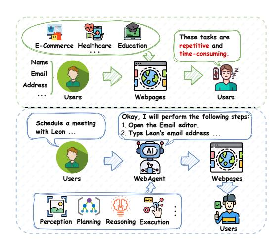
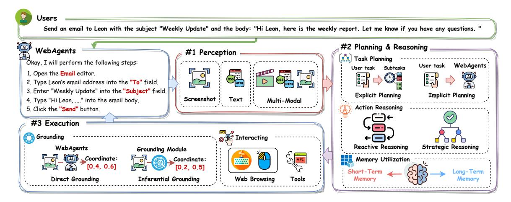

# 웹에이전트에 대한 조사: 대규모 기초 모델을 활용한 웹 자동화를 위한 차세대 AI 에이전트로 향하여

Liangbo Ning∗ 홍콩 과학기술대학 홍콩 특별행정구 BigLemon1123@gmail.com

Ziran Liang∗ 홍콩 과학기술대학 홍콩 SAR ziran.liang@connect.polyu.hk

주호항 강  
홍콩 과기대  
홍콩 특별행정구  
zhuohang.jiang@outlook.com

Qu 하오하오  
홍콩 과기대  
홍콩 특별행정구  
haohao.qu@connect.polyu.hk

Yujuan Ding  
홍콩 과기대  
홍콩 SAR  
dingyujuan385@gmail.com

팬 웬치† 홍콩과학기술대학 홍콩 SAR wenqifan03@gmail.com

웨이 샤오용 홍콩과학기술대학 홍콩특수행정구 cs007.wei@polyu.edu.hk

산루 린 시티 대학 홍콩 특별행정구 홍콩 lllam32316@gmail.com

Hui Liu 미시간 주립대학교 미시간, 미국 liuhui7@msu.edu

필립 S. 유  
일리노이 대학교 시카고 캠퍼스  
시카고, 미국  
psyu@uic.edu

Qing Li  
홍콩 과기대  
홍콩 SAR  
qing-prof.li@polyu.edu.hk

## 초록

웹 기술의 발전으로 인해 사람들의 삶의 다양한 측면이 크게 혁신되었습니다. 웹의 중요성에도 불구하고, 웹에서 수행되는 많은 작업은 반복적이고 시간이 많이 소요되며, 전반적인 삶의 질에 부정적인 영향을 미칩니다. 이러한 지루한 일상 작업을 효율적으로 처리하기 위해 가장 유망한 접근 중 하나는 인공지능(AI) 기술을 기반으로 인간과 유사한 지능을 갖춘 자율 에이전트를 개발하는 것입니다. 이를 AI 에이전트라고 합니다. AI 에이전트는 피로나 성능 저하 없이 지속적으로 작동할 수 있기 때문에 이러한 작업을 처리하는 데 큰 이점을 제공합니다. 따라서 웹 환경에서 웹에이전트(WebAgents)라고 불리는 AI 에이전트를 활용하여 사람들의 지루한 일상 작업을 자동으로 지원할 수 있다면 생산성과 효율성을 크게 향상시킬 수 있습니다. 최근, 수십억 개의 파라미터를 포함하는 대규모 기저 모델(Large Foundation Models, LFMs)은 인간과 유사한 언어 이해 및 추론 능력을 보여주며 다양한 복잡한 작업 수행에 능숙함을 입증하고 있습니다. 이는 자연스럽게 다음과 같은 질문을 제기합니다: '*LFMs를 활용하여 웹 작업을 자동으로 처리할 수 있는 강력한 AI 에이전트를 개발할 수 있을까? 사용자에게 상당한 편의성을 제공할 수 있을까?*' LFMs의 잠재력을 충분히 탐구하기 위해, 사용자 지시에 따라 일상적인 웹 작업을 완료하도록 설계된 웹에이전트에 대한 광범위한 연구가 등장하여 일상적인 인간 생활의 편의성을 크게 향상시키고 있습니다. 이 조사1에서 우리는

∗ 두 저자 모두 이 연구에 동등하게 기여했습니다.

1이 조사의 긴 버전은 다음에서 찾을 수 있습니다: *https://arxiv.org/abs/2503.23350*.

이 작품은 크리에이티브 커먼즈 저작자표시 4.0 국제 라이선스에 따라 라이선스가 부여되었습니다. *KDD '25, 토론토, 온타리오주, 캐나다*

© 2025 저작권은 소유자/저자에게 귀속됨. ACM ISBN 979-8-4007-1454-2/2025/08 https://doi.org/10.1145/3711896.3736555

웹에이전트에 대한 기존 연구를 아키텍처, 훈련, 신뢰성의 세 가지 핵심 측면에서 종합적으로 검토한다. 또한, 더 깊은 통찰을 제공하기 위해 향후 연구를 위한 몇 가지 유망한 방향이 탐색된다.

# CCS 개념

• 계산 방법론 → 지능형 에이전트; • 정보 시스템 → 웹 애플리케이션.

## 키워드

웹에이전트, 대형 기초 모델, AI 에이전트, AI 어시스턴트, 프롬프팅, 사전 훈련, 미세 조정.

#### ACM 참조 형식:

Liangbo Ning, Ziran Liang, Zhuohang Jiang, Haohao Qu, Yujuan Ding, Wenqi Fan, Xiao-yong Wei, Shanru Lin, Hui Liu, Philip S. Yu, 그리고 Qing Li. 2025. 대규모 기초 모델을 활용한 웹 자동화를 위한 차세대 AI 에이전트인 WebAgents에 대한 조사. *제31회 ACM SIGKDD 지식 발견 및 데이터 마이닝 회의 논문집 V.2 (KDD '25), 2025년 8월 3–7일, 캐나다 토론토, ON.* ACM, 뉴욕, 뉴욕, 미국, 11페이지. https://doi.org/10.1145/3711896.3736555

# 1 도입

웹이 급속히 발전하면서 정보 접근 [21, 47, 50], 쇼핑 경험 [9, 43], 그리고 통신 [10, 82] 등 사람들의 삶의 다양한 측면을 근본적으로 변화시켰다. 예를 들어, 웹은 현재까지 가장 큰 지식 저장소 역할을 하며 뉴스 [41, 124], 학술 논문(예: ArXiv [17]) 및 백과사전(예: 위키백과 [96, 105])에 즉각적으로 접근할 수 있게 해 주어 개인들이 원하는 정보를 자유롭게 얻을 수 있도록 한다. 이러한 발전은 지리적 장벽을 제거하여 원격 지역에 있는 사람들에게 교육, 의료, 법적 자원에 접근할 기회를 제공한다. 웹의 중요성에도 불구하고, 우리가 웹에서 수행하는 많은 일상적인 작업은 반복적이며 매우 시간이 오래 걸린다.

†교신저자: 팬원치, 홍콩폴리테크닉대학 컴퓨팅학과 및 경영마케팅학과

그림 1: 기본 웹 작업과 WebAgents의 파이프라인 예시. 사용자 지시를 받은 WebAgents는 환경을 인지하고, 행동 순서를 추론하며, 상호작용을 실행함으로써 자율적으로 작업을 완료한다.

예를 들어, 그림 1과 같이 다양한 플랫폼에 계정을 등록하거나 다양한 신청서를 작성할 때, 종종 이름, 연락처, 주소와 같은 동일한 개인정보를 반복적으로 입력해야 합니다. 마찬가지로 제품을 구매할 때는 수많은 옵션을 비교하고, 평가와 가격을 검토한 후 최종 구매를 결정해야 합니다. 지루한 일상 업무를 효과적으로 수행하기 위해 가장 유망한 기술 중 하나는 인공지능(Artificial Intelligence, AI) 기술을 활용하여 인간의 지능을 내장한 자동 에이전트를 개발하는 것입니다. 이를 AI 에이전트라고 합니다. 또한 AI 에이전트는 피로나 성능 저하 없이 지속적으로 작업을 수행할 수 있어 반복적인 워크플로우에서 신뢰성을 보장합니다[39]. 따라서 웹 환경에서 웹에이전트(WebAgents)라고 불리는 AI 에이전트를 활용하여 사람들의 지루한 일상 업무를 자동으로 처리할 수 있도록 돕는 것은 생산성과 효율성을 크게 향상시킬 수 있으며, 이는 궁극적으로 삶의 질을 향상시킬 수 있습니다.

최근 수십억 개의 매개변수를 가진 대규모 기초 모델(LFMs)은 방대한 데이터로 훈련되어 이해력과 추론과 같은 인간과 유사한 능력을 나타내며, 의료 [21, 29, 79], 전자상거래 [23, 74], AI4Science [22, 33] 등 다양한 분야를 혁신하고 있다. 예를 들어, LFMs는 단백질 데이터와 통합되어 기본적인 단백질 지식을 포착하고, 단백질 구조의 이해와 생성을 개선함으로써 약물 발견 및 질병 메커니즘 연구의 발전을 크게 촉진할 수 있다 [22]. LFMs의 인간과 유사한 추론 능력은 추천 시스템(RecSys)에 활용되어 더 나은 아이템 추천을 제공하고, 사용자의 온라인 경험을 크게 향상시킨다 [107, 128]. 광범위한 오픈 월드 지식, 고급 지시 수행 능력, 언어 이해 및 추론 능력을 활용하여, LFMs는 다양한 복잡한 작업을 수행하기 위해 인간과 유사한 행동을 시뮬레이션하는 데 능숙하다. 이는 자연스럽게 흥미로운 주제를 제기한다: '*LFMs를 활용하여 웹 작업을 자동으로 처리하는 강력한 AI 에이전트를 개발할 수 있을까? 이는 사용자에게 상당한 편의를 제공할 수 있다.*'

LFM의 잠재력을 완전히 탐구하기 위해, 최근에는 사용자 지시에 따라 다양한 웹 작업을 수행할 수 있도록 LFM 기반 웹에이전트(WebAgents)를 발전시키기 위한 노력이 이루어지고 있다 [39]. 예를 들어, 최근 등장한 새로운 AI 에이전트 프레임워크인 *AutoGPT*는 학계와 산업계 모두에서 큰 관심을 받고 있으며, 업무 및 일상 환경에서 복잡한 작업을 자율적으로 처리하는 놀라운 능력을 보여주고 있다 [87]. 챗봇과 달리, AutoGPT는 지속적인 사용자 지시와 감독 없이 복잡한 작업을 계획하고 실행할 수 있으며, 자동 검색 및 다중 단계 작업을 수행할 수 있다. 이 맥락에서 그림 1과 같이 사용자는 자연어 지시, 예를 들어 '*2024년 11월 23일 오후 4시에 스타벅스에서 레온과 이메일로 미팅을 예약해주세요.*'와 같은 지시만 제공하면 된다. 웹에이전트는 자율적으로 '이메일' 애플리케이션을 열고, 레온의 이메일 주소를 가져와 이메일을 작성한 후 보내는 등 전체 예약 과정을 자동화함으로써 일상 생활의 편의성을 크게 향상시킬 수 있다. LFM 기반 웹에이전트 개발의 놀라운 진전과 관련 연구의 증가를 고려할 때, 이 분야의 최근 발전을 체계적으로 검토할 필요가 점점 더 커지고 있다.

이 격차를 메우기 위해, 본 조사에서는 아키텍처, 훈련, 신뢰성의 관점에서 대표적인 웹에이전트(WebAgents) 방법들을 요약함으로써 웹에이전트에 대한 포괄적인 개요를 제공한다. 구체적으로, 제2절에서는 웹에이전트의 세 가지 프로세스인 인지(perception), 계획 및 추론(planning & reasoning), 실행(execution)을 기반으로 기존 연구들을 검토한다. 다음으로, 제3절에서는 웹에이전트 훈련에서 두 가지 중요한 측면(즉, 데이터 및 훈련 전략)을 요약한다. 그 후, 제4절에서는 안전성 및 강건성, 개인정보 보호, 일반화성 등을 포함한 신뢰할 수 있는 웹에이전트에 대한 연구들을 검토한다. 마지막으로, 제5절에서는 웹에이전트 분야에서 유망한 미래 연구 방향을 논의한다.

## 2 웹에이전트 아키텍처

웹에이전트가 사용자 명령을 완수하기 위해 수행해야 하는 세 가지 핵심적이고 연속적인 과정이 있다: 1) 인지(perception)는 웹에이전트가 현재 환경을 정확히 관찰해야 함을 의미하며, 2) 계획 및 추론(planning & reasoning)은 웹에이전트가 현재 환경을 분석하고, 사용자로부터 주어진 작업을 해석하며, 합리적인 다음 행동을 예측해야 함을 요구하며, 3) 실행(execution)은 웹에이전트가 생성된 행동을 수행하고 환경과 효과적으로 상호작용해야 함을 의미한다. 다음 섹션에서 우리는 이 과정들에서 웹에이전트가 사용하는 중요한 기술들을 종합적으로 살펴볼 것이다.

## 2.1 인식

일반적인 LFM은 사용자 지시를 수용하고 추론을 통해 해당 응답을 생성하기만 하면 됩니다. 그러나 복잡한 웹 환경 내에서 작동하는 WebAgents는 외부 환경을 정확히 인식하고, 사용자의 작업과 동적 환경을 결합한 기반으로 행동 추론을 수행할 것으로 기대됩니다. 그림 2에 보여진 바와 같이, 환경이 WebAgents에 제공하는 데이터 모달리티에 따라 기존 연구를 세 가지 유형으로 분류할 수 있습니다: 1) 텍스트 기반, 2) 스크린샷 기반, 3) 다중 모달 WebAgents.

*2.1.1 텍스트 기반 웹에이전트.* 대형 언어 모델(Large Language Models, LLMs)의 발전과 함께, 인간과 유사한 이해 및 추론 능력을 활용하여

그림 2: WebAgents의 전체 프레임워크를 보여주는 도식. 이 프레임워크는 세 가지 핵심 과정을 포함한다: *지각*, *계획 및 추론*, *실행*. 사용자의 명령이 주어지면, WebAgents는 지각 과정에서 환경 정보를 처음으로 관찰한다. 관찰 결과를 바탕으로, 계획 및 추론 과정에서 행동이 생성된다. 마지막으로 WebAgents는 생성된 행동을 실행하여 사용자의 작업을 완료한다.

사용자들이 복잡한 작업을 해결할 수 있도록 돕습니다. LLM은 자연어만 처리할 수 있기 때문에, 이러한 웹에이전트는 일반적으로 웹페이지의 텍스트 메타데이터(예: HTML 및 접근성 트리)를 활용하여 환경을 인식합니다 [45, 67, 69, 129]. 예를 들어, MindAct [18]은 미세 조정된 소형 언어 모델(LM)과 LLM을 결합하는 이단계 프레임워크를 도입하여 대규모 HTML 문서를 효율적으로 처리하며, 중요한 정보를 유지하면서 입력 크기를 크게 줄입니다. 이 접근법은 대상 요소와 해당 동작을 정확하게 예측할 수 있게 하여, 웹 기반 작업에서 효율성과 성능 사이의 균형을 효과적으로 유지합니다. Gur 등 [35]은 자기 경험을 통해 학습하여 실제 웹페이지에서 작업을 완료하는 LLM 기반 에이전트를 소개합니다. 이 에이전트는 긴 HTML 문서를 작업에 관련된 조각으로 요약하여 환경 정보를 추출하고, 사용자 지시를 하위 작업으로 분해하여 효과적인 계획을 수행합니다.

*2.1.2 스크린샷 기반 웹에이전트.* 텍스트 기반 웹에이전트의 놀라운 성공에도 불구하고, 환경의 텍스트 메타데이터를 활용하는 것은 그래픽 사용자 인터페이스(GUI)가 본질적으로 시각적이라는 점에서 인간의 인지 과정과 잘 맞지 않는다는 점에서 한계가 있다 [84, 116]. 또한 텍스트 표현은 다양한 환경에서 다양하게 나타나며, 낭비적인 정보를 포함하여 일반화 능력이 낮고 계산 오버헤드가 증가하는 문제가 있다 [127]. 최근 대형 시각-언어 모델(VLMs)의 기술 발전은 AI 시스템이 복잡한 시각적 인터페이스를 처리하는 능력을 크게 향상시켰다. VLM의 시각적 이해 능력을 활용하기 위해, 여러 연구에서 웹에이전트에 VLM을 통합하여 스크린샷을 사용하여 환경을 인식하는 방식을 도입했다 [27, 31, 44, 127]. 예를 들어, SeeClick [15]은 다음 동작을 예측하기 위해 스크린샷만을 관측으로 사용하며, 그라운딩 사전 학습 과정을 도입하여 스크린샷 내에서 관련 시각적 요소를 찾는 능력을 향상시킨다. OmniParser [68]은 사용자 인터페이스 스크린샷을 구조화된 요소로 파싱하는 효과적인 방법을 도입하고, GPT-4V [119]의 동작을 화면의 특정 영역에 정확히 그라운딩하는 능력을 향상시킨다.  
*2.1.3 다중 모달 웹에이전트.* 환경을 이해하기 위해 단순히 텍스트 메타데이터나 스크린샷만을 사용하는 것 외에도, 많은 연구에서 다중 모달 데이터를 활용하여 서로 보완적인 강점을 결합하여 웹에이전트에게 더 포괄적인 환경 인식 능력을 제공한다 [42, 52, 99]. 예를 들어, MMAC-Copilot [91]은 GPT-4V를 사용하여 스크린샷의 시각적 정보를 해석하고, Gemini Vision [59]을 활용하여 비디오 콘텐츠를 처리하고 분석함으로써 다중 모달 데이터 처리 능력을 크게 향상시킨다. WebVoyager [37]은 스크린샷과 상호작용 웹 요소의 텍스트 콘텐츠를 모두 처리하여 웹 작업을 종단에서 자율적으로 완료하는 다중 모달 웹에이전트이다. 이는 Set-of-Mark Prompting [117]을 활용하여 웹페이지에 상호작용 요소의 경계 상자(bounding box)를 오버레이함으로써 에이전트의 의사결정 능력을 크게 향상시키고, 정확한 동작 예측 및 실행을 가능하게 한다.

## 2.2 계획 및 추론

환경 정보를 인식한 후, WebAgents는 일반적으로 사용자 명령을 수행하기 위해 적절한 작업을 결정하는 임무를 수행합니다. 이는 현재 환경 상태를 분석하고 LFMs의 추론 능력을 활용하는 것을 포함합니다. 그림 2에 보여진 바와 같이, 이 과정에는 세 가지 하위 작업이 포함됩니다: 1) 작업 계획(Task Planning), 사용자 지시를 재구성하고 하위 목표를 설정하여 WebAgents가 복잡한 사용자 질의를 효과적으로 처리할 수 있도록 돕는 작업; 2) 행동 추론(Action Reasoning), WebAgents가 사용자 명령을 완수하기 위해 적절한 행동을 생성하도록 안내하는 작업; 3) 기억 활용(Memory Utilization), WebAgents에 이전 작업과 같은 내부 정보 또는 웹 검색에서 얻은 오픈 월드 지식과 같은 외부 정보를 제공하여 더 적절한 행동을 예측할 수 있도록 하는 작업입니다.

*2.2.1 작업 계획.* 웹에이전트의 맥락에서 작업 계획의 목적은 사용자가 정의한 작업을 효율적이고 효과적으로 완료하기 위해 에이전트가 수행해야 할 단계의 순서를 결정하는 것이다 [112]. 웹에이전트가 명시적으로 포함되는지 여부에 따라

