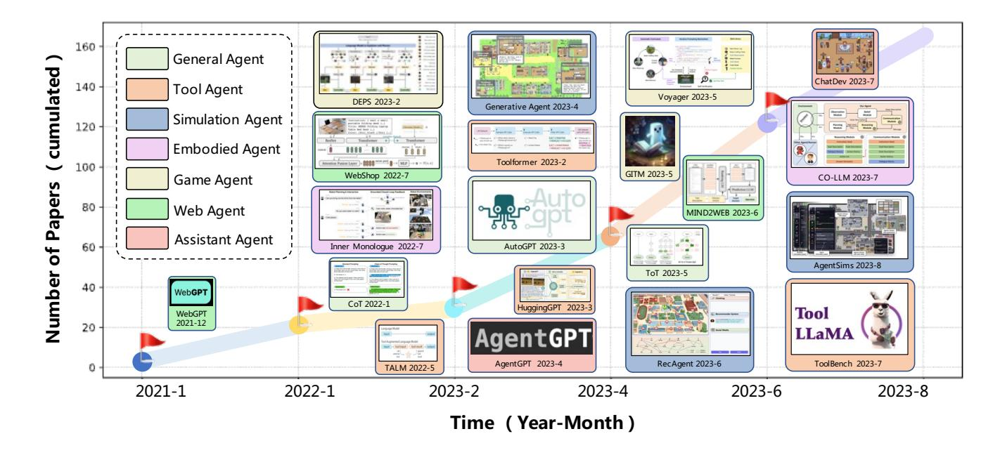
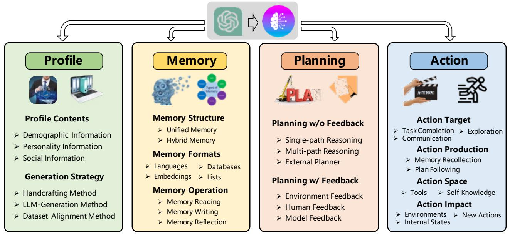
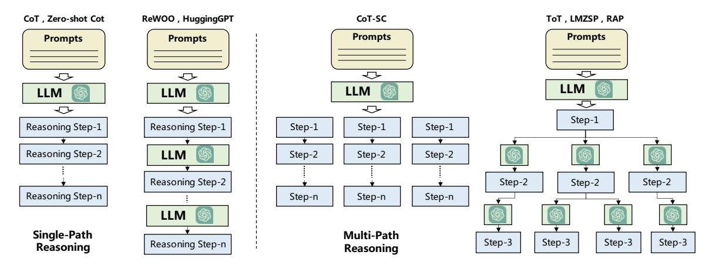
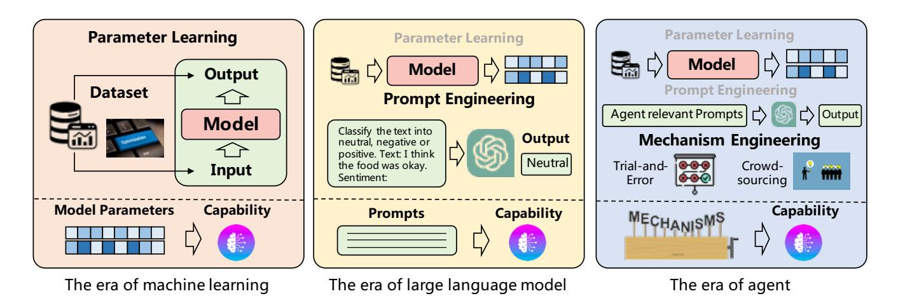
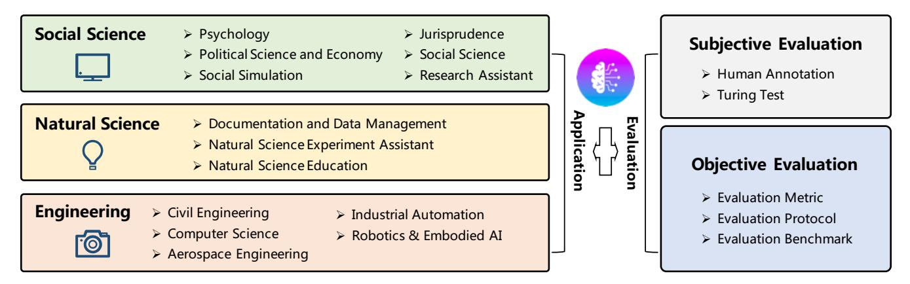

# 대규모 언어 모델 기반 자율 에이전트에 관한 조사

왕 레이, 마 첸\*, 펑 쉬에양\*, 장 제우, 양 하오, 장 징센, 천 지위안, 탕 자카이, 첸 쉬(B), 린 앙카이(B), 션 징 자오, 위 젠웨이, 원 지룽

고양 인공지능학부, 인민대학, 베이징, 100872, 중국

© 하이어 에듀케이션 프레스 2025

요약 자율 에이전트는 오랫동안 학계와 산업계에서 연구의 주요 대상이 되어 왔다. 이전 연구는 일반적으로 고립된 환경 내에서 제한된 지식을 가진 에이전트를 훈련시키는 데 초점을 맞추어 왔는데, 이는 인간의 학습 과정과 크게 다름을 보이며, 에이전트가 인간과 유사한 결정을 내리기 어렵게 만든다. 최근에는 광범위한 웹 지식을 습득함으로써 대형 언어 모델(Large Language Models, LLMs)이 인간 수준의 지능을 보여주고 있어, LLM 기반 자율 에이전트에 대한 연구가 급증하고 있다. 본 논문에서는 이러한 연구들을 포괄적으로 조사하여, LLM 기반 자율 에이전트에 대한 체계적인 리뷰를 제공한다. 먼저, LLM 기반 자율 에이전트의 구조를 논의하고, 이전 연구의 대부분을 포함하는 통합적인 프레임워크를 제안한다. 그 다음, 사회과학, 자연과학, 공학 분야에서 LLM 기반 자율 에이전트의 다양한 응용을 개관한다. 마지막으로, 일반적으로 사용되는 평가 전략에 대해 깊이 있게 살펴본다.

LLM 기반 자율 에이전트. 이전 연구를 바탕으로, 이 분야에서 몇 가지 도전 과제와 미래 방향도 제시한다.

키워드 자율 에이전트, 대규모 언어 모델, 인간 수준의 지능

### 1 소개

자율 에이전트는 환경 내에 위치하고 그 일부를 이루는 시스템으로, 시간에 따라 환경을 감지하고 그 환경에 작용하여 자신의 의도를 추구하며, 미래에 감지하는 것을 효과적으로 이끌어내는 시스템이다.

프랭클린과 그레이서(1997)

자율 에이전트는 인공 일반 지능(AGI)을 달성하는 데 있어 오랫동안 유망한 접근법으로 인식되어 왔으며, 이는 향후

수신 월 dd, yyyy; 수락 월 dd, yyyy

이메일: xu.chen@ruc.edu.cn;yankailin@ruc.edu.cn \*두 저자 모두 이 논문에 동등하게 기여함.

그림 1 LLM 기반 자율 에이전트 분야의 성장 추세를 보여주는 도식도입니다. 2021년 1월부터 2023년 8월까지 출판된 논문의 누적 수를 나타냅니다. 다양한 에이전트 카테고리를 나타내기 위해 서로 다른 색상을 사용합니다. 예를 들어, 게임 에이전트는 게임 플레이어를 시뮬레이션하는 것을 목적으로 하며, 도구 에이전트는 주로 도구 사용에 초점을 맞춥니다. 각 시간대에 대해 다양한 에이전트 카테고리를 가진 연구들을 정리하여 제공합니다.

작업을 자율적인 계획과 행동을 통해 수행합니다. 이전 연구에서는 에이전트가 단순하고 휴리스틱한 정책 함수에 따라 행동하며, 고립되고 제한된 환경에서 학습한다고 가정했습니다 [\[1](#page-33-0)[–6\]](#page-33-1). 이러한 가정은 인간의 학습 과정과 크게 다릅니다. 왜냐하면 인간의 마음은 매우 복잡하며, 개인은 훨씬 다양한 환경에서 학습할 수 있기 때문입니다. 이러한 격차로 인해 이전 연구에서 얻은 에이전트는 일반적으로 제한되지 않은, 개방형 환경에서 인간 수준의 의사결정 과정을 재현하기에는 매우 부족합니다.

최근 몇 년간 대규모 언어 모델(Large Language Models, LLMs)은 놀라운 성과를 거두며 인간과 유사한 지능을 달성할 잠재력을 보여주고 있다 [\[5](#page-33-2)[–10\]](#page-33-3). 이 능력은 광범위한 학습 데이터셋과 방대한 수의 모델 파라미터를 활용함으로써 발생한다. 이러한 능력을 기반으로, 점점 더 많은 관심이

인간과 유사한 의사결정 능력을 얻기 위해 LLM을 중심 제어기로 사용하여 자율 에이전트를 구축하는 연구 분야 [\[11](#page-33-4)[–17\]](#page-33-5).

강화 학습에 비해, LLM 기반 에이전트는 더 포괄적인 내부 세계 지식을 보유하고 있어 특정 도메인 데이터에 대한 훈련 없이도 정보 기반 행동을 수행할 수 있다. 또한, LLM 기반 에이전트는 인간과의 상호작용을 위한 자연어 인터페이스를 제공할 수 있어 더 큰 유연성과 향상된 설명 가능성을 제공한다.

이 방향을 따라 연구자들은 다양한 유망한 모델들을 개발해 왔습니다 (개요는 그림 [1](#page-1-0)을 참조하세요). 이 모델들의 핵심 아이디어는 LLM(대규모 언어 모델)에 인간의 능력, 예를 들어 기억과 계획 능력을 부여하여 인간처럼 행동하고 다양한 작업을 효과적으로 완료하도록 만드는 것입니다. 이전에는 이러한 모델들이 독립적으로 제안되었으며, 포괄적으로 요약하고 비교하는 노력은 제한적이었습니다. 그러나 우리는 이 급속히 발전하는 분야에 대한 체계적인 요약이 그 이해를 종합적으로 돕고 미래 연구를 자극하는 데 큰 의미가 있다고 생각합니다.

이 논문에서는 LLM 기반 자율 에이전트 분야에 대한 포괄적인 조사를 수행한다. 본 조사는 LLM 기반 자율 에이전트의 구성, 응용, 평가라는 세 가지 핵심 측면을 중심으로 정리한다. 에이전트 구성에 대해, 우리는 두 가지 문제에 초점을 맞춘다. 즉, (1) LLM을 더 효과적으로 활용하기 위해 에이전트 아키텍처를 어떻게 설계할 것인가, 그리고 (2) 다양한 작업을 완료하기 위해 에이전트의 능력을 어떻게 유도하고 향상시킬 것인가이다. 직관적으로, 첫 번째 문제는 에이전트의 하드웨어 기반을 구축하는 것을 목표로 하며, 두 번째 문제는 에이전트에 소프트웨어 자원을 제공하는 데 초점을 맞춘다. 첫 번째 문제에 대해, 우리는 대부분의 이전 연구를 포함할 수 있는 통합 에이전트 프레임워크를 제시한다. 두 번째 문제에 대해서는, 에이전트의 능력 획득을 위한 일반적으로 사용되는 전략에 대한 요약을 제공한다. 에이전트 구성에 대한 논의 외에도, 우리는 LLM 기반 자율 에이전트의 사회과학, 자연과학, 공학 분야에서의 응용에 대해 체계적인 개요를 제공한다. 마지막으로, 우리는 LLM 기반 자율 에이전트 평가를 위한 전략에 대해 논의하며, 주관적 및 객관적 전략에 초점을 맞춘다.

요약하면, 이 조사에서는 LLM 기반 자율 에이전트 분야의 성장하는 연구를 체계적으로 검토하고 포괄적인 분류 체계를 수립한다. 우리의 초점은 에이전트의 구축, 응용 및 평가 방법의 세 가지 주요 영역을 포함한다. 풍부한 이전 연구들을 바탕으로, 우리는 이 분야의 다양한 도전 과제를 식별하고 미래 방향에 대해 논의한다. 우리는 이 조사가 LLM 기반 자율 에이전트의 신규 연구자들에게 포괄적인 배경 지식을 제공할 수 있을 것으로 기대하며, 또한 더 많은 획기적인 연구를 장려할 수 있기를 바란다.

# 2 LLM 기반 자율 에이전트 구축

LLM 기반 자율 에이전트는 LLM의 인간과 같은 능력을 활용하여 다양한 작업을 효과적으로 수행할 것으로 기대된다. 이 목표를 달성하기 위해 두 가지 중요한 측면이 있다: (1) LLM을 더 잘 활용할 수 있는 아키텍처는 어떤 것이어야 하는가? 그리고 (2) 설계된 아키텍처를 기반으로 에이전트가 특정 작업을 수행할 수 있는 능력을 어떻게 습득하게 할 것인가? 아키텍처 설계의 맥락에서, 우리는 기존 연구를 체계적으로 종합하여 포괄적인 통합 프레임워크를 제안한다. 두 번째 측면에 대해서는, LLM을 피니튜닝하는지 여부에 따라 에이전트의 능력 습득 전략을 정리한다. LLM 기반 자율 에이전트를 전통적인 기계 학습과 비교하면, 아키텍처 설계는 네트워크 구조를 정의하는 것과 유사하며, 능력 습득은 네트워크 파라미터를 학습하는 과정과 같다. 다음 섹션에서 이 두 가지 측면을 더 자세히 탐구한다.

#### 2.1 에이전트 아키텍처 설계

최근 LLM의 발전은 질문-답변(QA) 형태로 다양한 작업을 수행할 수 있는 큰 잠재력을 보여주었다. 그러나 자율 에이전트를 구축하는 것은 QA와는 거리가 멀다. 왜냐하면 에이전트는 특정 역할을 수행하고 인간처럼 환경을 자율적으로 인식하고 학습하여 스스로 진화해야 하기 때문이다. 전통적인 LLM과 자율 에이전트 사이의 격차를 좁히기 위해 중요한 측면은 LLM이 그 능력을 최대화할 수 있도록 돕는 합리적인 에이전트 아키텍처를 설계하는 것이다. 이 방향을 따라 이전 연구들은 LLM을 강화하기 위한 여러 모듈을 개발해왔다. 본 섹션에서는 이러한 모듈들을 요약하는 통합 프레임워크를 제안한다. 구체적으로 전체

그림 2 LLM 기반 자율 에이전트의 아키텍처 설계를 위한 통합 프레임워크.

우리의 프레임워크 구조는 그림 [2,](#page-3-0)에 도식화되어 있으며, 프로파일링 모듈, 메모리 모듈, 계획 모듈, 그리고 행동 모듈로 구성되어 있습니다. 프로파일링 모듈의 목적은 에이전트의 역할을 식별하는 것입니다. 메모리 및 계획 모듈은 에이전트를 동적 환경에 배치하여 과거 행동을 회상하고 미래 행동을 계획할 수 있도록 합니다. 행동 모듈은 에이전트의 결정을 특정 출력으로 변환하는 역할을 합니다. 이 모듈들 내에서 프로파일링 모듈은 메모리 및 계획 모듈에 영향을 주며, 이 세 모듈은 함께 행동 모듈에 영향을 미칩니다. 다음에서 이 모듈들을 자세히 설명합니다.

### 2.1.1 프로파일링 모듈

자율 에이전트는 일반적으로 코더, 교사, 분야 전문가와 같은 특정 역할을 가정하여 작업을 수행합니다 [\[18,](#page-33-6) [19\]](#page-33-7). 프로파일링 모듈은 에이전트 역할의 프로필을 나타내는 것을 목적으로 하며, 이는 일반적으로 프롬프트에 포함되어 LLM의 동작에 영향을 미칩니다. 에이전트 프로필은 일반적으로 나이, 성별, 경력과 같은 기본 정보를 포함하며, 에이전트의 성격을 반영하는 심리 정보와 에이전트 간의 관계를 상세히 설명하는 사회적 정보도 포함합니다 [\[21\]](#page-33-9). 에이전트를 프로파일링하기 위해 선택하는 정보는 주로 특정 응용 시나리오에 따라 결정됩니다. 예를 들어, 응용이 인간 인지 과정을 연구하는 것을 목적으로 한다면, 심리 정보가 핵심이 됩니다. 프로필 정보의 유형을 확인한 후, 다음으로 중요한 문제는 에이전트를 위한 구체적인 프로필을 생성하는 것입니다. 기존 문헌에서는 일반적으로 다음 세 가지 전략을 사용합니다.

handcrafting 방법: 이 방법에서는 에이전트 프로필을 수동으로 지정합니다. 예를 들어, 서로 다른 성격을 가진 에이전트를 설계하고자 할 때, "당신은 외향적인 사람입니다" 또는 "당신은 내향적인 사람입니다"와 같은 표현을 사용하여 에이전트의 프로필을 정의할 수 있습니다. handcrafting 방법은 이전 연구들에서 에이전트 프로필을 지정하는 데 널리 활용되었습니다. 예를 들어, Generative Agent [\[22\]](#page-33-10)은 이름, 목표, 다른 에이전트와의 관계와 같은 정보를 통해 에이전트를 설명합니다. MetaGPT [\[23\]](#page-34-0), ChatDev [\[18\]](#page-33-6), 그리고 Self-collaboration [\[24\]](#page-34-1)은 사전에

소프트웨어 개발에서 다양한 역할과 그에 해당하는 책임을 수동으로 할당하여 에이전트 간의 협업을 촉진합니다. PTLLM [\[25\]](#page-34-2)은 LLM이 생성한 텍스트에서 나타나는 성격 특성을 탐색하고 정량화하는 것을 목적으로 합니다. 이 방법은 IPIP-NEO [\[26\]](#page-34-3) 및 BFI [\[27\]](#page-34-4)과 같은 성격 평가 도구를 사용하여 다양한 에이전트 캐릭터를 수동으로 정의함으로써 LLM이 다양한 응답을 생성하도록 유도합니다. [\[28\]](#page-34-5)은 정치인, 언론인, 사업가와 같은 다양한 역할로 LLM에 수동으로 프롬프트를 제공하여 LLM 출력의 독성(Toxicity)을 연구합니다. 일반적으로 수작업 방법은 에이전트에 어떤 프로필 정보를 할당할 수 있다는 점에서 매우 유연하지만, 에이전트 수가 많을 때 특히 노동 집약적일 수 있습니다.

LLM 생성 방법: 이 방법에서는 LLM을 기반으로 에이전트 프로필이 자동으로 생성됩니다. 일반적으로 프로필 생성 규칙을 명시하여 대상 인구 집단 내 에이전트 프로필의 구성과 속성을 설명합니다. 그 후, 소량의 예시로 사용할 수 있는 몇몇 시드 에이전트 프로필을 선택적으로 지정할 수 있습니다. 마지막으로 LLM을 활용하여 모든 에이전트 프로필을 생성합니다. 예를 들어, RecAgent [\[21\]](#page-33-9)은 나이, 성별, 개인적 특성, 영화 취향 등의 속성을 수동으로 구성하여 몇몇 에이전트에 대한 시드 프로필을 먼저 만든 후, ChatGPT를 활용하여 시드 정보를 기반으로 더 많은 에이전트 프로필을 생성합니다. 이 접근법은 대규모 인구 집단의 경우 에이전트 프로필을 구성하는 데 필요한 시간과 노력을 크게 줄입니다. 그러나 생성된 프로필에 대한 정밀한 제어가 부족할 수 있으며, 이로 인해 의도된 특성과의 불일치 또는 편차가 발생할 수 있습니다.

데이터셋 정렬 방법: 이 방법에서는 에이전트 프로필을 실-world 데이터셋에서 얻는다. 일반적으로 먼저 정보를 정리할 수 있다.

데이터셋에 포함된 실제 인간의 정보를 자연어 프롬프트로 변환한 후 이를 활용하여 에이전트의 프로필을 구성합니다. 예를 들어, [\[29\]](#page-34-6)에서 저자들은 미국 국립 선거 연구(ANES) 참가자의 인구통계적 배경(예: 인종/민족, 성별, 연령, 거주지 등)을 기반으로 GPT-3에 역할을 부여합니다. 그 후 GPT-3가 실제 인간과 유사한 결과를 생성할 수 있는지를 조사합니다. 데이터셋 정렬 방법은 실제 인구의 특성을 정확히 포착하므로, 에이전트의 행동이 현실 세계 상황을 더 의미 있고 현실적으로 반영하게 됩니다.

*참고.* 이전의 대부분의 연구는 위의 프로필 생성 전략을 독립적으로 활용하지만, 이를 결합하면 추가적인 이점이 있을 수 있다고 주장한다. 예를 들어, 에이전트 시뮬레이션을 통해 사회적 발전을 예측하기 위해 실 world 데이터셋을 활용하여 일부 에이전트의 프로필을 생성함으로써 현재 사회적 상태를 정확히 반영할 수 있다. 이후, 현실 세계에는 존재하지 않지만 미래에 등장할 수 있는 역할을 다른 에이전트에게 수동으로 할당함으로써 미래 사회적 발전을 예측할 수 있다. 이 예시 외에도 다른 전략들을 유연하게 결합할 수 있다. 프로필 모듈은 에이전트 설계의 기초를 이루며, 에이전트의 기억, 계획, 행동 절차에 큰 영향을 미친다.

#### 2.1.2 메모리 모듈

메모리 모듈은 에이전트 아키텍처 설계에서 매우 중요한 역할을 한다. 이 모듈은 환경에서 인식한 정보를 저장하고, 기록된 기억을 활용하여 미래의 행동을 촉진한다. 메모리 모듈은 에이전트가 경험을 축적하고, 자가 진화하며, 더욱 일관되고 합리적이며 효과적인 방식으로 행동할 수 있도록 도와준다.

섹션은 메모리 모듈의 구조, 형식 및 작동 방식에 중점을 두고, 메모리 모듈에 대한 포괄적인 개요를 제공합니다.

메모리 구조: LLM 기반 자율 에이전트는 종종 인간 기억 과정에 대한 인지과학 연구에서 영감을 받는다. 인간 기억은 감각 기억에서 시작하여 지각 입력을 등록하고, 정보를 일시적으로 유지하는 단기 기억을 거쳐 장기 기억으로 정보를 장기간에 걸쳐 통합하는 일반적인 흐름을 따른다. 에이전트 메모리 구조를 설계할 때, 연구자들은 이러한 인간 기억의 측면에서 영감을 얻는다. 특히, 단기 기억은 트랜스포머 아키텍처에 의해 제한되는 컨텍스트 윈도우 내의 입력 정보와 유사하다. 장기 기억은 에이전트가 필요에 따라 빠르게 쿼리하고 검색할 수 있는 외부 벡터 저장소와 유사하다. 다음에서는 단기 기억과 장기 기억을 기반으로 일반적으로 사용되는 두 가지 메모리 구조를 소개한다.

• *통합 메모리*. 이 구조는 인간의 단기 기억을 시뮬레이션할 뿐이며, 일반적으로 인-컨텍스트 학습(in-context learning)을 통해 구현되며, 메모리 정보는 직접 프롬프트에 기록된다. 예를 들어, RLP [\[30\]](#page-34-7)은 대화 에이전트로, 발화자와 청취자의 내부 상태를 유지한다. 각 대화 라운드에서 이러한 상태는 LLM의 프롬프트 역할을 하며, 에이전트의 단기 기억으로 기능한다. SayPlan [\[31\]](#page-34-8)은 작업 계획을 위한 특수 설계된 몰입형 에이전트이다. 이 에이전트에서 장면 그래프(scene graphs)와 환경 피드백은 에이전트의 단기 기억을 형성하며, 행동을 안내한다. CALYPSO [\[32\]](#page-34-9)은 던전 앤 드래곤(Dungeons & Dragons) 게임을 위한 에이전트로, 던전 마스터(Dungeon Masters)가 스토리 제작과 서사에 도움을 줄 수 있다. 이 에이전트의 단기 기억은 장면 설명, 몬스터 정보 및 이전 요약을 기반으로 구성된다. DEPS [\[33\]](#page-34-10)은 마인크래프트(Minecraft)를 위한 게임 에이전트로, 초기에 작업 계획을 생성한 후 이를 사용하여 LLM을 프롬프트하여 작업을 완료하기 위한 행동을 생성한다. 이러한 계획은 에이전트의 단기 기억으로 간주될 수 있다. 실제로 단기 기억을 구현하는 것은 간단하며, 에이전트가 최근 또는 맥락에 민감한 행동과 관찰을 인식하는 능력을 향상시킬 수 있다. 그러나 LLM의 제한된 컨텍스트 창 크기는 프롬프트에 포괄적인 기억을 포함하는 것을 제한하며, 이는 에이전트 성능에 악영향을 미칠 수 있다. 이 문제는 더 큰 컨텍스트 창 크기와 장기적 맥락을 처리할 수 있는 LLM이 필요하게 만들며, 이로 인해 많은 연구자들이 이러한 문제를 완화하기 위해 하이브리드 메모리 시스템(hybrid memory systems)을 활용하고 있다.

• *하이브리드 메모리*. 이 구조는 인간의 단기 기억과 장기 기억을 명시적으로 모델링한다. 단기 기억은 최근의 지각을 일시적으로 버퍼링하는 반면, 장기 기억은 시간이 지남에 따라 중요한 정보를 통합한다. 예를 들어, 생성형 에이전트 [\[20\]](#page-33-8)은 에이전트 행동을 촉진하기 위해 하이브리드 메모리 구조를 사용한다. 단기 기억은 에이전트의 현재 상황에 대한 맥락 정보를 포함하며, 장기 기억은 에이전트의 과거 행동과 사고를 저장하며, 현재 사건에 따라 검색할 수 있다. AgentSims [\[34\]](#page-34-11)도 하이브리드 메모리 아키텍처를 구현한다. 프롬프트에 제공된 정보는 단기 기억으로 간주될 수 있다. 메모리의 저장 용량을 향상시키기 위해, 저자들은 벡터 데이터베이스를 활용하는 장기 기억 시스템을 제안하며, 이는 효율적인 저장과 검색을 가능하게 한다. 구체적으로, 에이전트의 일일 기억은 임베딩으로 인코딩되어 벡터 데이터베이스에 저장된다. 에이전트가 이전 기억을 회상해야 할 경우, 장기 기억 시스템은 관련 정보를 검색한다.

임베딩 유사도를 이용한 정보 처리. 이 과정은 에이전트의 행동 일관성을 향상시킬 수 있다. GITM [\[16\]](#page-33-11)에서는 단기 기억(short-term memory)이 현재 경로를 저장하고, 장기 기억(long-term memory)은 성공적인 이전 경로에서 요약한 참조 계획을 저장한다. 장기 기억은 안정적인 지식을 제공하며, 단기 기억은 유연한 계획을 가능하게 한다. Reflexion [\[12\]](#page-33-12)은 최근 피드백을 포착하기 위해 단기 슬라이딩 윈도우를 활용하고, 요약된 통찰을 유지하기 위해 지속적인 장기 저장소를 포함한다. 이 조합은 상세한 즉각적인 경험과 고수준 추상화를 모두 활용할 수 있게 한다. SCM [\[35\]](#page-34-12)은 가장 관련성 있는 장기 지식을 선택적으로 활성화하여 단기 기억과 결합함으로써 복잡한 맥락 대화에 대한 추론을 가능하게 한다. SimplyRetrieve [\[36\]](#page-34-13)은 사용자 쿼리를 단기 기억으로 사용하고, 개인 지식 기반을 통해 장기 기억을 저장한다. 이 설계는 모델 정확도를 향상시키면서 사용자 프라이버시를 보장한다. MemorySandbox [\[37\]](#page-34-14)은 장기 및 단기 기억을 구현하여 서로 다른 객체를 저장하며, 이는 다양한 대화에서 접근할 수 있게 한다. 사용자는 동일한 캔버스에서 다양한 에이전트와 여러 대화를 생성할 수 있으며, 간단한 드래그 앤 드롭 인터페이스를 통해 메모리 객체를 공유할 수 있다. 실질적으로 단기 및 장기 기억을 통합하면 에이전트의 장거리 추론 능력과 가치 있는 경험 축적이 향상되며, 이는 복잡한 환경에서 작업을 수행하는 데 필수적이다.

*참고.* 세심한 독자들은 장기 기억에만 기반한 또 다른 유형의 기억 구조가 존재할 수 있다는 것을 발견할 수 있을 것이다. 그러나 우리는 그러한 유형의 기억이 문헌에서 거의 기록되지 않았음을 발견했다. 우리의 추측은 에이전트들이 항상 연속적이고 동적인 환경에 위치해 있으며, 연속적인 행동이 나타나기 때문이라고 한다.

높은 상관관계를 보이므로, 단기 기억의 포착은 매우 중요하며 일반적으로 무시할 수 없다.

메모리 형식: 메모리 구조 외에도, 메모리 모듈을 분석하는 또 다른 관점은 메모리 저장 매체의 형식에 기반한 것이다. 예를 들어, 자연어 메모리 또는 임베딩 메모리와 같은 형식이 있다. 다양한 메모리 형식은 각각 독특한 장점과 특성을 가지고 있으며, 다양한 응용 분야에 적합하다. 다음에서는 몇 가지 대표적인 메모리 형식을 소개한다.

*자연어*. 이 형식에서는 에이전트의 행동과 관찰과 같은 기억 정보를 원시 자연어로 직접 기술합니다. 이 형식은 여러 장점을 가지고 있습니다. 첫째, 기억 정보를 유연하고 이해하기 쉬운 방식으로 표현할 수 있습니다. 또한, 에이전트의 행동을 안내하는 데 사용할 수 있는 풍부한 의미 정보를 유지합니다. 이전 연구에서 Reflexion [\[12\]](#page-33-12)은 슬라이딩 윈도우 내에 경험적 피드백을 자연어로 저장합니다. Voyager [\[38\]](#page-34-15)은 마인크래프트 게임 내 기술을 자연어 설명을 통해 표현하고, 이를 메모리에 직접 저장합니다.

*임베딩*. 이 형식에서는 메모리 정보가 임베딩 벡터로 인코딩되어 검색 및 읽기 효율이 향상됩니다. 예를 들어, MemoryBank [\[39\]](#page-34-16)은 각 메모리 세그먼트를 임베딩 벡터로 인코딩하고 이중타워 밀집 검색 모델(dual-tower dense retrieval model)을 사용하여 과거 대화에서 관련 정보를 효율적으로 검색합니다.

*데이터베이스*. 이 형식에서는 메모리 정보가 데이터베이스에 저장되어 에이전트가 메모리를 효율적이고 포괄적으로 조작할 수 있게 합니다. 예를 들어, ChatDB [\[40\]](#page-34-17)은 데이터베이스를 상징적 메모리 모듈로 사용합니다. 에이전트는 SQL 명령어를 사용하여 메모리 정보를 정확하게 추가, 삭제, 수정할 수 있습니다.

• 구조화된 목록. 이 형식에서는 메모리 정보가 목록으로 정리되며, 메모리의 의미를 효율적이고 간결하게 전달할 수 있다. 예를 들어, GITM [16]은 하위 목표에 대한 행동 목록을 계층적 트리 구조로 저장한다. 계층 구조는 목표와 해당 계획 간의 관계를 명시적으로 포착한다. RET-LLM [41]은 처음에 자연어 문장을 삼중어 구조로 변환한 후 이를 메모리에 저장한다.

*참고.* 여기서는 몇 가지 대표적인 메모리 형식만 보여주고 있지만, [38]에서 사용된 프로그래밍 코드와 같은 많은 미포함된 형식들이 존재한다는 점을 주의해야 한다. 또한 이러한 형식들이 상호 배타적이지 않다는 점을 강조해야 한다. 많은 모델들이 각각의 이점을 동시에 활용하기 위해 다중 형식을 통합적으로 사용한다. 예로, GITM [16]의 메모리 모듈은 키-값 리스트 구조를 사용한다. 이 구조에서 키는 임베딩 벡터로 표현되며, 값은 원시 자연어로 구성된다. 임베딩 벡터를 사용함으로써 메모리 기록의 효율적인 검색이 가능해진다. 자연어를 사용함으로써 메모리 내용은 매우 포괄적이 되어 에이전트의 행동이 더욱 정보 기반으로 이루어질 수 있다.

위에서 우리는 주로 메모리 모듈의 내부 설계에 대해 논의했다. 다음에서는 외부 환경과 상호작용하는 데 사용되는 메모리 작업에 초점을 맞춘다.

메모리 연산: 메모리 모듈은 에이전트가 환경과 상호작용하면서 중요한 지식을 획득하고 축적하며 활용할 수 있도록 하는 데 핵심적인 역할을 한다. 에이전트와 환경 간의 상호작용은 세 가지 중요한 메모리 연산을 통해 수행된다: 메모리 읽기, 메모리 쓰기, 메모리 반성. 다음에서 이들 연산을 소개한다.

더 자세히 설명합니다.

• 메모리 읽기. 메모리 읽기의 목적은 메모리에서 유의미한 정보를 추출하여 에이전트의 행동을 향상시키는 것이다. 예를 들어, 이전에 성공한 행동을 사용하여 유사한 목표를 달성하는 것 [16]. 메모리 읽기의 핵심은 과거 행동에서 유용한 정보를 어떻게 추출하느냐에 있다. 일반적으로 정보 추출을 위해 세 가지 일반적인 기준이 사용되는데, 즉, 최신성, 관련성, 중요성 [20]이다. 더 최근이고, 관련성 있고, 중요한 메모리는 더 많이 추출될 가능성이 높다. 공식적으로, 기존 문헌에서 메모리 정보 추출을 위해 다음 방정식을 도출한다:

$$m^* = \arg\max_{m \in M} \left( \alpha s^{rec}(q, m) + \beta s^{rel}(q, m) + \gamma s^{imp}(m) \right),$$  
(1)

q는 쿼리로, 예를 들어 에이전트가 처리해야 할 작업이나 에이전트가 위치한 맥락을 의미합니다. M은 모든 기억의 집합입니다. $s^{rec}(\cdot)$, $s^{rel}(\cdot)$ 및 $s^{imp}(\cdot)$는 기억 m의 최신성, 관련성 및 중요성을 측정하는 스코어링 함수로, 높은 점수는 각각 더 최근, 더 관련성 높고, 더 중요한 기억을 나타냅니다. 이 스코어링 함수는 다양한 방법으로 구현할 수 있으며, 예를 들어 $s^{rel}(q, m)$은 쿼리와 기억 임베딩 간의 벡터 유사도 측정을 사용하여 계산할 수 있습니다. $s^{imp}$는 기억 자체의 특성을 반영하므로 쿼리 q와 무관하다는 점에 유의해야 합니다. $\alpha$, $\beta$ 및 $\gamma$는 균형 파라미터입니다. 이 값을 다르게 설정함으로써 다양한 기억 읽기 전략을 얻을 수 있습니다. 예를 들어 $\alpha = \gamma = 0$으로 설정하면, 많은 연구들[16, 30, 38, 41]에서 기억 읽기에 관련성 점수 $s^{rel}$만 고려합니다. $\alpha = \beta = \gamma = 1.0$으로 설정하면, [20]은 위의 세 가지 지표를 동일하게 가중하여 기억에서 정보를 추출합니다.

• 메모리 쓰기. 메모리의 목적

쓰기는 인식된 환경에 대한 정보를 기억에 저장하는 것이다. 유용한 정보를 기억에 저장함으로써 미래에 정보가 풍부한 기억을 검색할 수 있는 기반을 마련할 수 있으며, 이는 에이전트가 더 효율적이고 합리적으로 행동할 수 있도록 한다. 기억 쓰기 과정에서 두 가지 잠재적인 문제가 신중하게 다뤄져야 한다. 한편으로는 기존 기억과 유사한 정보를 어떻게 저장할지(*즉*, 기억 중복)를 다루는 것이 중요하다. 다른 한편으로는 기억이 저장 한계에 도달했을 때 정보를 어떻게 제거할지(*즉*, 기억 오버플로우)를 고려하는 것이 중요하다. 다음에서 이 문제들을 더 자세히 논의한다. (1) *기억 중복*. 유사한 정보를 통합하기 위해 사람들은 새로운 기록과 이전 기록을 통합하는 다양한 방법을 개발해왔다. 예를 들어, [\[16\]](#page-33-11)에서는 동일한 하위 목표와 관련된 성공적인 행동 시퀀스를 목록에 저장한다. 목록의 크기가 N(=5)에 도달하면, 목록에 있는 모든 시퀀스를 LLM을 사용하여 통합된 계획 솔루션으로 압축한다. 기억에 있는 원래 시퀀스는 새로 생성된 것으로 대체된다. 증강형 LLM [\[42\]](#page-34-19)은 카운트 누적을 통해 중복 정보를 집계하여 중복 저장을 방지한다. (2) *기억 오버플로우*. 기억이 가득 찼을 때 정보를 기억에 쓰기 위해, 사람들은 기존 정보를 삭제하여 기억 과정을 계속하기 위해 다양한 방법을 설계한다. 예를 들어, ChatDB [\[40\]](#page-34-17)에서는 사용자 명령에 따라 기억을 명시적으로 삭제할 수 있다. RET-LLM [\[41\]](#page-34-18)은 고정 크기 버퍼를 사용하여 기억을 관리하며, 먼저 들어온 것부터 먼저 나가는(FIFO) 방식으로 가장 오래된 항목을 덮어쓴다.

• *메모리 반성*. 메모리 반성은 인간이 자신의 인지적, 정서적, 행동적 과정을 인식하고 평가하는 능력을 모방합니다. 에이전트에 적용될 때, 목표는 에이전트에게 독립적으로

generative 에이전트 [\[20\]](#page-33-8)에서는 에이전트가 메모리에 저장된 과거 경험을 더 광범위하고 추상적인 통찰로 요약할 수 있는 기능을 갖추고 있다. 우선, 에이전트는 최근 기억을 바탕으로 세 가지 핵심 질문을 생성한다. 이 질문들은 메모리를 쿼리하여 관련 정보를 얻는 데 사용된다. 획득한 정보를 바탕으로 에이전트는 다섯 가지 통찰을 생성하며, 이는 에이전트의 고차원적 사고를 반영한다. 예를 들어, "클라우스 뮐러는 연구 논문을 작성 중이다", "클라우스 뮐러는 연구를 더 진행하기 위해 도서관 사서와 상호작용하고 있다", "클라우스 뮐러는 아예샤 칸과 자신의 연구에 대해 대화하고 있다"와 같은 저차원적 기억은 "클라우스 뮐러는 자신의 연구에 전념하고 있다"는 고차원적 통찰을 유도할 수 있다. 또한, 반성 과정은 계층적으로 발생할 수 있으며, 기존 통찰을 기반으로 새로운 통찰이 생성될 수 있다. GITM [\[16\]](#page-33-11)에서는 하위 목표를 성공적으로 달성한 행동들이 목록에 저장된다. 목록에 요소가 다섯 개 이상 포함될 경우, 에이전트는 이를 공통적이고 추상적인 패턴으로 요약하여 모든 요소를 대체한다. ExpeL [\[43\]](#page-34-20)에서는 에이전트가 반성을 습득하는 두 가지 접근법이 소개된다. 첫째, 에이전트는 동일한 작업 내에서 성공하거나 실패한 트레이젝터리를 비교한다. 둘째, 에이전트는 성공적인 트레이젝터리의 집합에서 경험을 학습한다.

전통적인 LLM과 에이전트 사이의 중요한 차이점은 후자가 동적 환경에서 학습하고 작업을 완료할 수 있는 능력을 가져야 한다는 점이다. 메모리 모듈이 에이전트의 과거 행동을 관리하는 역할을 한다고 보면, 에이전트가 미래 행동을 계획하는 데 도움을 줄 수 있는 또 다른 중요한 모듈이 필수적이다. 다음에서는 연구자들이 계획 모듈을 어떻게 설계하는지에 대한 개요를 제시한다.

그림 3 단일 경로와 다중 경로 추론 전략 간의 비교. LMZSP는 [\[44\]](#page-34-21)에서 제안된 모델이다.

#### 2.1.3 계획 모듈

복잡한 작업에 직면했을 때 인간은 일반적으로 그 작업을 더 간단한 하위 작업으로 분해하여 개별적으로 해결하려고 한다. 계획 모듈은 에이전트에게 이러한 인간의 능력을 부여함으로써, 에이전트가 더욱 합리적이고 강력하며 신뢰할 수 있게 행동할 수 있도록 하는 것을 목표로 한다. 구체적으로, 에이전트가 계획 과정에서 피드백을 받을 수 있는지에 따라 기존 연구를 정리하면 다음과 같다:

피드백이 없는 계획: 이 방법에서는 에이전트가 행동을 취한 후 미래의 행동에 영향을 줄 수 있는 피드백을 받지 않습니다. 다음은 몇 가지 대표적인 전략을 제시합니다.

• *단일 경로 추론*. 이 전략에서는 최종 작업을 여러 중간 단계로 분해한다. 이 단계들은 연속적으로 연결되며, 각 단계는 단 하나의 후속 단계로 이어진다. LLM은 이러한 단계를 따라 최종 목표를 달성한다. 구체적으로, 사고의 사슬(CoT) [\[45\]](#page-34-22)은 복잡한 문제를 해결하기 위한 추론 단계를 프롬프트에 입력하도록 제안한다. 이 단계들은 LLM이 단계별로 계획하고 행동하도록 유도하는 예시 역할을 한다. 이 방법에서 계획은 프롬프트 내 예시에서 영감을 받아 생성된다. 제로샷-코티(Zero-shot-CoT) [\[46\]](#page-34-23)은 LLM이

작업 추론 과정을 생성하기 위해 "한 번에 한 단계씩 생각해보세요"와 같은 트리거 문장을 사용하여 프롬프트를 제공합니다. CoT와 달리, 이 방법은 프롬프트에 추론 단계를 예시로 포함하지 않습니다. Re-Prompting [\[47\]](#page-34-24)은 각 단계가 필요한 전제 조건을 충족하는지 확인한 후 계획을 생성합니다. 만약 단계가 전제 조건을 충족하지 못하면, 전제 오류 메시지를 표시하고 LLM에 계획을 재생성하도록 프롬프트를 제공합니다. ReWOO [\[48\]](#page-34-25)은 계획을 외부 관찰과 분리하는 패러다임을 도입하며, 에이전트는 먼저 계획을 생성하고 독립적으로 관찰을 얻은 후, 이를 결합하여 최종 결과를 도출합니다. HuggingGPT [\[13\]](#page-33-13)은 먼저 작업을 여러 하위 목표로 분해한 후, Huggingface를 기반으로 각각을 해결합니다. CoT와 Zeroshot-CoT는 추론 단계를 일회성 방식으로 모두 출력하는 반면, ReWOO와 HuggingGPT는 LLM에 여러 번 접근하여 결과를 생성합니다. SWIFTSAGE [\[49\]](#page-34-26)은 인간 인지의 이중처리 이론 [\[50\]](#page-35-0)에 영감을 받아, 복잡한 상호작용 작업에서 계획을 수행하기 위해 SWIFT와 SAGE 모듈의 힘을 결합합니다. SWIFT 모듈은 학습된 패턴을 기반으로 빠른 응답을 제공하며, SAGE 모듈은 대형 언어 모델을 사용하여 핵심 질문을 던지고 행동 시퀀스를 생성함으로써 성공적인 작업 완료를 보장하는 심층 계획을 수행합니다.

• *다중 경로 추론*. 이 전략에서는 최종 계획을 생성하기 위한 추론 단계를 트리 구조로 정리한다. 각 중간 단계는 여러 후속 단계를 가질 수 있다. 이 접근법은 인간의 사고와 유사하며, 개인은 각 추론 단계에서 여러 선택지를 가질 수 있다. 구체적으로, Self-consistent CoT (CoT-SC) [\[51\]](#page-35-1)은 복잡한 문제마다 최종 답을 도출하는 여러 가지 사고 방식이 존재한다고 믿는다. 따라서 CoT를 사용하여 다양한 추론 경로와 해당 답을 생성한 후, 빈도가 가장 높은 답을 최종 출력으로 선택한다. Tree of Thoughts (ToT) [\[52\]](#page-35-2)은 트리 구조의 추론 구조를 사용하여 계획을 생성하도록 설계되었다. 이 접근법에서 트리의 각 노드는 "생각"을 나타내며, 이는 중간 추론 단계에 해당한다. 이러한 중간 단계의 선택은 LLM의 평가를 기반으로 이루어진다. 최종 계획은 너비 우선 탐색(BFS) 또는 깊이 우선 탐색(DFS) 전략을 사용하여 생성된다. CoT-SC와 비교할 때, CoT-SC는 모든 계획 단계를 동시에 생성하는 반면, ToT는 각 추론 단계마다 LLM을 쿼리해야 한다. RecMind [\[53\]](#page-35-3)에서는 저자들이 자가 자극 메커니즘을 설계하여, 계획 과정에서 폐기된 이전 정보도 새로운 추론 단계를 도출하는 데 활용한다. GoT [\[54\]](#page-35-4)에서는 저자들이 ToT의 트리 구조적 추론 구조를 그래프 구조로 확장하여 더 강력한 프롬프팅 전략을 도출한다. AoT [\[55\]](#page-35-5)에서는 저자들이 프롬프트에 알고리즘 예제를 포함시킴으로써 LLM의 추론 과정을 향상시키는 새로운 방법을 설계한다. 놀랍게도, 이 방법은 단지 한 번 또는 몇 번의 LLM 쿼리만 필요하다. [\[44\]](#page-34-21)에서는 LLM을 제로샷 플래너로 활용한다. 각 계획 단계에서 먼저 생성

다양한 가능한 다음 단계를 고려한 후, 그 중에서 허용 가능한 행동에 가장 가까운 것을 최종적으로 결정합니다. [\[56\]](#page-35-6)은 [\[44\]](#page-34-21)을 개선하여 프롬프트에 포함된 쿼리와 유사한 예제를 포함합니다. RAP [\[57\]](#page-35-7)은 몬테카를로 트리 서치(Monte Carlo Tree Search, MCTS)를 기반으로 다양한 계획의 잠재적 이점을 시뮬레이션하기 위해 세계 모델(world model)을 구축하고, 여러 MCTS 반복을 통합하여 최종 계획을 생성합니다. 이해를 돕기 위해, 단일 경로와 다중 경로 추론 전략을 비교한 그림 [3.](#page-9-0)을 제공합니다.

• *외부 플래너*. LLM의 제로샷 플래닝에서 입증된 강력함에도 불구하고, 도메인 특화 문제에 대한 계획을 효과적으로 생성하는 것은 여전히 매우 어려운 과제이다. 이 문제를 해결하기 위해 연구자들은 외부 플래너를 활용한다. 이러한 도구들은 잘 개발되어 있으며, 효율적인 탐색 알고리즘을 사용하여 빠르게 정확하거나 최적의 계획을 찾을 수 있다. 특히, LLM+P [\[58\]](#page-35-8)은 먼저 작업 설명을 형식화된 플래닝 도메인 정의 언어(Planning Domain Definition Language, PDDL)로 변환한 후, 외부 플래너를 사용하여 PDDL을 처리한다. 마지막으로 생성된 결과는 LLM을 통해 자연어로 다시 변환된다. 마찬가지로, LLM-DP [\[59\]](#page-35-9)은 LLM을 사용하여 관측값, 현재 세계 상태 및 목표를 PDDL로 변환한다. 이후 이 변환된 데이터는 외부 플래너에 전달되며, 이는 효율적으로 최종 행동 시퀀스를 결정한다. CO-LLM [\[22\]](#page-33-10)은 LLM이 고수준 계획 생성에 능하다는 것을 보여주었지만, 저수준 제어에는 어려움을 겪는다는 점을 밝혔다. 이러한 한계를 해결하기 위해, 휴리스틱으로 설계된 외부 저수준 플래너를 사용하여 고수준 계획 기반으로 행동을 효과적으로 실행한다.

피드백을 통한 계획: 많은 실세계 상황에서 에이전트는 복잡한 작업을 해결하기 위해 장기 예측 계획을 세워야 합니다. 이러한 작업에 직면했을 때, 피드백이 없는 위의 계획 모듈은

효과가 낮을 수 있는 이유는 다음과 같습니다: 첫째, 다양한 복잡한 전제 조건을 고려해야 하기 때문에 처음부터 완벽한 계획을 생성하는 것은 매우 어렵습니다. 결과적으로 초기 계획을 그대로 따르는 것은 종종 실패로 이어집니다. 또한, 실행 과정에서 예측할 수 없는 전이 동역학으로 인해 초기 계획을 실행할 수 없게 되는 경우도 있습니다. 동시에 인간이 복잡한 작업을 해결하는 방식을 살펴보면, 개인들은 외부 피드백을 바탕으로 계획을 반복적으로 세우고 수정하는 것을 알 수 있습니다. 이러한 인간의 능력을 시뮬레이션하기 위해 연구자들은 많은 계획 모듈을 설계해 왔으며, 에이전트는 행동을 취한 후 피드백을 받을 수 있습니다. 이 피드백은 환경, 인간, 모델로부터 얻을 수 있으며, 이에 대해서는 다음에 자세히 설명합니다.

• *환경 피드백*. 이 피드백은 객관적인 세계 또는 가상 환경에서 얻어진다. 예를 들어, 게임의 작업 완료 신호나 에이전트가 행동을 취한 후 얻은 관찰 결과일 수 있다. 구체적으로, ReAct [\[60\]](#page-35-10)은 사고-행동-관찰 삼중조를 사용하여 프롬프트를 구성하는 것을 제안한다. 사고 부분은 에이전트 행동을 유도하기 위한 고수준 추론과 계획을 촉진하는 것을 목적으로 한다. 행동은 에이전트가 취한 구체적인 행동을 나타낸다. 관찰은 외부 피드백을 통해 얻어진 행동의 결과로, 예를 들어 검색 엔진 결과와 같은 것이 있다. 다음 사고는 이전 관찰에 영향을 받으며, 이는 생성된 계획이 환경에 더 적응 가능하게 만든다. Voyager [\[38\]](#page-34-15)은 프로그램 실행의 중간 진행 상황, 실행 오류 및 자기 검증 결과와 같은 세 가지 유형의 환경 피드백을 포함하여 계획을 수립한다. 이러한 신호는 에이전트가 다음 행동을 위한 더 나은 계획을 세우는 데 도움을 줄 수 있다. Voyager와 유사하게, Ghost [\[16\]](#page-33-11)도 피드백을 추론 및 행동 취하기 과정에 통합한다.

피드백은 환경 상태와 각 실행된 작업의 성공 및 실패 정보를 포함합니다. SayPlan [\[31\]](#page-34-8)은 장면 그래프 시뮬레이터에서 유도된 환경 피드백을 활용하여 전략 형식을 검증하고 개선합니다. 이 시뮬레이터는 에이전트 행동 이후의 결과와 상태 전이를 식별하는 데 능숙하여, SayPlan이 실행 가능한 계획을 확보할 때까지 전략을 반복적으로 재조정할 수 있도록 합니다. DEPS [\[33\]](#page-34-10)의 저자들은 단순히 작업 완료에 대한 정보만 제공하는 것은 계획 오류를 수정하기에 종종 불충분하다고 주장합니다. 따라서 그들은 에이전트에게 작업 실패의 구체적인 이유를 알려주어 계획을 보다 효과적으로 수정할 수 있도록 제안합니다. LLM-Planner [\[61\]](#page-35-11)은 객체 불일치 및 작업 완료 중 도달할 수 없는 계획을 발견했을 때 LLM이 생성한 계획을 동적으로 업데이트하는 기반 재계획 알고리즘을 도입합니다. Inner Monologue [\[62\]](#page-35-12)은 에이전트가 행동을 취한 후 세 가지 유형의 피드백을 제공합니다: (1) 작업이 성공적으로 완료되었는지 여부, (2) 수동적 장면 설명, (3) 능동적 장면 설명입니다. 전자 두 가지는 환경에서 생성되므로 에이전트의 행동이 더욱 합리적으로 됩니다.

• *인간 피드백*. 환경으로부터 피드백을 얻는 것 외에도, 인간과 직접 상호작용하는 것은 에이전트 계획 능력을 향상시키는 매우 직관적인 전략이다. 인간 피드백은 주관적인 신호이다. 이는 에이전트를 인간의 가치와 선호에 효과적으로 맞추는 데 도움을 주며, 환각 문제를 완화하는 데도 기여할 수 있다. Inner Monologue [\[62\]](#page-35-12)에서는 에이전트가 3D 시각적 환경에서 고수준 자연어 지시를 수행하는 것을 목표로 한다. 에이전트는 장면 설명에 대해 인간으로부터 능동적으로 피드백을 요청할 수 있는 기능을 부여받는다. 그런 다음, 에이전트는 인간 피드백을 프롬프트에 통합한다.

보다 정보 기반의 계획과 추론을 가능하게 합니다. 위의 사례에서 볼 수 있듯이, 다양한 유형의 피드백을 결합하여 에이전트의 계획 능력을 향상시킬 수 있습니다. 예를 들어, Inner Monologue [\[62\]](#page-35-12)은 환경과 인간의 피드백을 모두 수집하여 에이전트의 계획을 촉진합니다.

• *모델 피드백*. 앞서 언급한 환경적 및 인간적 피드백 외에도, 연구자들은 에이전트 자체에서 생성되는 내부 피드백의 활용을 조사해 왔다. 이와 같은 피드백은 일반적으로 사전 훈련된 모델을 기반으로 생성된다. 구체적으로, [\[63\]](#page-35-13)은 자기 개선(self-refine) 메커니즘을 제안한다. 이 메커니즘은 세 가지 핵심 구성 요소로 구성된다: 출력(output), 피드백(feedback), 개선(refinement). 먼저, 에이전트는 출력을 생성한다. 그 후, LLM을 사용하여 출력에 대한 피드백을 제공하고 개선 방법에 대한 지침을 제시한다. 마지막으로, 피드백과 개선을 통해 출력이 개선된다. 이 출력-피드백-개선 과정은 원하는 조건에 도달할 때까지 반복된다. SelfCheck [\[64\]](#page-35-14)은 에이전트가 다양한 단계에서 생성된 추론 과정을 검토하고 평가할 수 있게 해준다. 그들은 결과를 비교함으로써 오류를 수정할 수 있다. InterAct [\[65\]](#page-35-15)은 ChatGPT 및 InstructGPT와 같은 다양한 언어 모델을 검사자(checker) 및 정렬자(sorter)와 같은 보조 역할로 사용하여 주 언어 모델이 오류 및 비효율적인 행동을 피하도록 돕는다. ChatCoT [\[66\]](#page-35-16)은 모델 피드백을 활용하여 추론 과정의 품질을 향상시킨다. 모델 피드백은 에이전트 추론 과정을 모니터링하는 평가 모듈에서 생성된다. Reflexion [\[12\]](#page-33-12)은 상세한 구두 피드백을 통해 에이전트의 계획 능력을 향상시키기 위해 개발되었다. 이 모델에서, 에이전트는 먼저 기억을 기반으로 동작을 생성하고, 이후 평가자는 에이전트 트래잭터를 입력으로 받아 피드백을 생성한다. 이전 연구들과 달리, 피드백은 스칼라 값으로 제공된다.

값을 기반으로, 이 모델은 LLM을 활용하여 보다 상세한 구두 피드백을 제공하며, 이는 에이전트 계획에 대해 보다 포괄적인 지원을 제공할 수 있습니다.

*참고.* 결론적으로, 피드백 없이 계획 모듈을 구현하는 것은 비교적 간단하다. 그러나 이는 추론 단계가 적은 간단한 작업에 주로 적합하다. 반면, 피드백을 포함한 계획 전략은 피드백을 처리하기 위해 더 신중한 설계가 필요하다. 그럼에도 불구하고, 이 전략은 훨씬 더 강력하며 장거리 추론을 포함하는 복잡한 작업을 효과적으로 해결할 수 있다.

#### 2.1.4 액션 모듈

액션 모듈은 에이전트의 결정을 구체적인 결과로 변환하는 역할을 담당한다. 이 모듈은 가장 하류 위치에 위치하며 환경과 직접적으로 상호작용한다. 프로필, 메모리, 계획 모듈의 영향을 받는다. 본 섹션에서는 네 가지 관점에서 액션 모듈을 소개한다: (1) 액션 목표: 액션의 의도된 결과는 무엇인가? (2) 액션 생성: 액션은 어떻게 생성되는가? (3) 액션 공간: 사용 가능한 액션은 무엇인가? (4) 액션 영향: 액션의 결과는 무엇인가? 이 관점들 중 첫 번째와 두 번째는 액션 이전의 측면("before-action" 측면)에 초점을 맞추고, 세 번째는 액션 자체("in-action" 측면)에 초점을 맞추며, 네 번째는 액션의 영향("after-action" 측면)을 강조한다.

작업 목표: 에이전트는 다양한 목적을 가지고 작업을 수행할 수 있습니다. 여기서 몇 가지 대표적인 예를 제시합니다: (1) *작업 완료*. 이 시나리오에서 에이전트의 작업은 특정 작업을 완수하는 것을 목적으로 합니다. 예를 들어, 마인크래프트에서 철 곡괭이를 제작하거나 소프트웨어 개발에서 함수를 완성하는 경우입니다 [\[38\]](#page-34-15) [\[18\]](#page-33-6). 이러한 작업은 일반적으로 명확하게 정의된 목표를 가지고 있으며, 각 작업은

최종 작업의 완료에 기여한다. 이러한 유형의 목표를 향한 행동은 기존 문헌에서 매우 흔하다. (2) *통신*. 이 경우, 행동은 정보 공유 또는 협업을 위해 다른 에이전트 또는 실제 인간과의 통신을 목적으로 한다. 예를 들어, ChatDev [\[18\]](#page-33-6)의 에이전트들은 소프트웨어 개발 작업을 공동으로 완수하기 위해 서로 통신할 수 있다. Inner Monologue [\[62\]](#page-35-12)에서는 에이전트가 인간과 능동적으로 통신하고 인간의 피드백을 바탕으로 행동 전략을 조정한다. (3) *환경 탐사*. 이 예시에서 에이전트는 낯선 환경을 탐사하여 인지 범위를 확장하고 탐사와 착취 사이의 균형을 맞추는 것을 목적으로 한다. 예를 들어, Voyager [\[38\]](#page-34-15)의 에이전트는 작업 완료 과정에서 미지의 기술을 탐사하고 환경 피드백을 통해 시행착오를 반복하면서 기술 실행 코드를 지속적으로 개선할 수 있다.

액션 생성: 일반적인 LLM과 달리, 모델의 입력과 출력이 직접적으로 연결되는 것이 아니라, 에이전트는 다양한 전략과 소스를 통해 액션을 취할 수 있습니다. 다음에서는 일반적으로 사용되는 두 가지 액션 생성 전략을 소개합니다. (1) *메모리 회상에 의한 액션*. 이 전략에서는 현재 작업에 따라 에이전트 메모리에서 정보를 추출하여 액션을 생성합니다. 작업과 추출된 메모리를 프롬프트로 사용하여 에이전트 액션을 유도합니다. 예를 들어, 생성형 에이전트 [\[20\]](#page-33-8)에서는 에이전트가 메모리 스트림을 유지하며, 각 액션을 취하기 전에 최근의 관련성 있고 중요한 정보를 메모리 스트림에서 검색하여 에이전트 액션을 안내합니다. GITM [\[16\]](#page-33-11)에서는 저수준 하위 목표를 달성하기 위해 에이전트가 메모리를 쿼리하여 해당 작업과 관련된 성공적인 경험 여부를 확인합니다. 유사한 작업이 이전에 완료된 적이 있다면, 에이전트는 이전에 사용했던

성공적인 작업을 통해 현재 작업을 직접 처리합니다. 챗데브 [\[18\]](#page-33-6) 및 메타지피티 [\[23\]](#page-34-0)와 같은 협업 에이전트의 경우, 서로 다른 에이전트가 서로 통신할 수 있습니다. 이 과정에서 대화의 대화 기록은 에이전트 메모리에 저장됩니다. 에이전트가 생성하는 각 발화는 그 메모리에 의해 영향을 받습니다. (2) *계획 따라 행동*. 이 전략에서는 에이전트가 미리 생성된 계획에 따라 행동합니다. 예를 들어, DEPS [\[33\]](#page-34-10)에서는 주어진 작업에 대해 에이전트가 먼저 행동 계획을 세웁니다. 계획 실패를 나타내는 신호가 없을 경우, 에이전트는 이러한 계획을 엄격히 따릅니다. GITM [\[16\]](#page-33-11)에서는 에이전트가 작업을 여러 하위 목표로 분해하여 고수준 계획을 세웁니다. 이러한 계획에 따라 에이전트는 각 하위 목표를 순차적으로 해결하여 최종 작업을 완료합니다.

액션 공간: 액션 공간은 에이전트가 수행할 수 있는 가능한 행동의 집합을 의미합니다. 일반적으로 이 행동들을 두 가지 범주로 대략 나눌 수 있습니다: (1) 외부 도구와 (2) LLM의 내부 지식입니다. 다음에서 이 행동들을 더 자세히 소개합니다.

*외부 도구*. LLM이 다양한 작업을 수행하는 데 효과적임이 입증되었지만, 종합적인 전문 지식이 필요한 분야에서는 잘 작동하지 않을 수 있다. 또한 LLM은 환각 문제(Hallucination)에 직면할 수 있으며, 이는 자체적으로 해결하기 어렵다. 위의 문제를 완화하기 위해 에이전트는 행동을 실행하기 위해 외부 도구를 호출할 수 있는 기능을 갖추게 된다. 다음에서 문헌에서 활용된 몇 가지 대표적인 도구를 소개한다.

(1) *APIs*. 최근 몇 년간 외부 API를 활용하여 액션 공간을 보완하고 확장하는 패러다임이 일반적이 되었다. 예를 들어, HuggingGPT [\[13\]](#page-33-13)은 복잡한 사용자 작업을 해결하기 위해 HuggingFace의 광범위한 모델 생태계를 통합한다. 마찬가지로, WebGPT [\[67\]](#page-35-17)

사용자 요청에 응답할 때 외부 웹 페이지에서 관련 내용을 추출하기 위해 쿼리를 자동으로 생성하는 것을 제안한다. TPTU [\[68\]](#page-35-18)은 전략적인 작업 계획과 API 기반 도구를 통해 LLM이 복잡한 작업을 수행할 수 있는 잠재력을 탐구한다. Gorilla [\[69\]](#page-35-19)은 API 호출에 대한 정확한 입력 인수를 생성할 수 있는 미세 조정된 LLM을 도입하여 외부 API 사용 시 환각 문제를 효과적으로 완화한다. ToolFormer [\[15\]](#page-33-14)은 자기 감독 학습을 사용하여 언제 그리고 어떻게 외부 도구를 호출할지를 결정하며, 도구 API의 예시를 사용하여 훈련한다. API-Bank [\[70\]](#page-35-20)은 도구 증강 LLM을 체계적으로 평가할 수 있는 다양한 API 도구를 포함하는 포괄적인 벤치마크와 함께, 그 통합 기능을 향상시키기 위해 설계된 강력한 훈련 데이터셋을 제공한다. ToolL-LaMA [\[14\]](#page-33-15)은 데이터 수집, 훈련, 평가를 포함하는 도구 사용 프레임워크를 제안하며, 최종 미세 조정된 모델은 다양한 API에서 뛰어난 성능을 발휘한다. RestGPT [\[71\]](#page-35-21)은 LLM을 RESTful API와 연결하며, 이는 웹 서비스 개발에 널리 채택된 표준을 따르기 때문에 결과 프로그램이 실제 응용에 더 잘 호환된다. TaskMatrix.AI [\[72\]](#page-35-22)은 LLM을 광범위한 API 생태계와 연결하여 작업 실행을 지원한다. 이의 핵심에는 사용자와 상호작용하고, 그들의 목표와 맥락을 이해한 후 특정 작업을 위한 실행 가능한 코드를 생성하는 다중모달 대화 기반 모델이 있다. 본질적으로 이러한 지능형 에이전트는 전략적으로 외부 API를 다목적 도구로 활용하여 행동 공간을 체계적으로 확장하고, 다양한 계산 기능을 통합함으로써 전통적인 언어 모델의 내재적 한계를 초월한다.

(2) *데이터베이스* 및 *지식 기반*. 외부 데이터베이스 또는 지식 기반을 통합하면 에이전트가 더 현실적인 동작을 생성하기 위해 특정 도메인 정보를 얻을 수 있습니다. 예를 들어, ChatDB [\[40\]](#page-34-17)은 SQL 명령어를 사용하여 데이터베이스를 쿼리하여 에이전트가 논리적인 방식으로 동작할 수 있도록 합니다. MRKL [\[73\]](#page-35-23)과 OpenAGI [\[74\]](#page-35-24)은 지식 기반 및 플래너와 같은 다양한 전문 시스템을 포함하여 도메인 특화 정보에 접근합니다.

(3) *외부 모델*. 이전 연구에서는 가능한 작업 범위를 확장하기 위해 외부 모델을 자주 사용한다. API에 비해 외부 모델은 일반적으로 더 복잡한 작업을 처리한다. 각 외부 모델은 여러 개의 API에 해당할 수 있다. 예를 들어, ViperGPT [\[75\]](#page-36-0)은 언어 모델 기반으로 구현된 Codex를 사용하여 텍스트 설명에서 파이썬 코드를 생성한 후, 코드를 실행하여 주어진 작업을 완료한다. Chem-Crow [\[76\]](#page-36-1)은 유기 합성, 약물 발견 및 재료 설계에서 작업을 수행하도록 설계된 LLM 기반 화학 에이전트이다. 이는 17개의 전문가가 설계한 모델을 활용하여 운영을 지원한다. MM-REACT [\[77\]](#page-36-2)은 비디오 요약을 위한 VideoBERT, 이미지 생성을 위한 X-decoder, 오디오 처리를 위한 SpeechBERT와 같은 다양한 외부 모델을 통합하여 다양한 다중 모달 시나리오에서의 기능을 향상시킨다.

*내부 지식*. 외부 도구를 활용하는 것 외에도, 많은 에이전트는 LLM의 내부 지식만을 활용하여 행동을 안내한다. 이제 에이전트가 합리적이고 효과적으로 행동할 수 있도록 지원할 수 있는 LLM의 몇 가지 핵심 기능을 제시한다. (1) *계획 기능*. 이전 연구는 LLM이 복잡한 작업을 더 간단한 작업으로 분해하는 데 훌륭한 계획자로 사용될 수 있음을 보여주었다 [\[45\]](#page-34-22). 이러한 LLM의 기능은 프롬프트에 예시를 포함하지 않아도 발동될 수 있다 [\[46\]](#page-34-23). LLM의 계획 기능을 기반으로, DEPS [\[33\]](#page-34-10)은 하위 목표 분해를 통해 복잡한 작업을 해결할 수 있는 마인크래프트 에이전트를 개발했다. GITM [\[16\]](#page-33-11) 및 Voyager [\[38\]](#page-34-15)과 같은 유사한 에이전트도 계획 기능에 크게 의존한다.

LLMs가 다양한 작업을 성공적으로 완료할 수 있는 능력. (2) *대화 능력*. LLMs는 일반적으로 고품질의 대화를 생성할 수 있다. 이 능력은 에이전트가 인간처럼 행동할 수 있게 한다. 이전 연구에서 많은 에이전트는 LLMs의 강력한 대화 능력을 기반으로 행동한다. 예를 들어, ChatDev [\[18\]](#page-33-6)에서는 다양한 에이전트가 소프트웨어 개발 과정을 논의하고 자신의 행동을 반성할 수 있다. RLP [\[30\]](#page-34-7)에서는 에이전트가 자신의 발화에 대한 청중의 잠재적 피드백을 기반으로 대화할 수 있다. (3) *일반 상식 이해 능력*. LLMs의 또 다른 중요한 능력은 인간의 일반 상식을 잘 이해할 수 있다는 점이다. 이 능력을 바탕으로, 많은 에이전트는 인간의 일상생활을 시뮬레이션하고 인간과 유사한 결정을 내릴 수 있다. 예를 들어, Generative Agent [\[20\]](#page-33-8)에서는 에이전트가 현재 상태, 주변 환경을 정확히 이해하고 기본적인 관찰을 바탕으로 고차원적인 아이디어를 요약할 수 있다. LLMs의 일반 상식 이해 능력이 없으면 이러한 행동은 신뢰할 수 없게 시뮬레이션될 수 없다. 비슷한 결론은 RecAgent [\[21\]](#page-33-9)과 S3 [\[78\]](#page-36-3)에도 적용될 수 있으며, 이 에이전트들은 사용자의 사회적 행동을 시뮬레이션하는 데 중점을 둔다.

액션 영향: 액션 영향은 에이전트의 행동이 미치는 결과를 의미합니다. 가능한 영향의 범위는 매우 넓지만, 명확성을 위해 몇 가지 핵심 예시를 강조합니다: (1) *환경 변경.* 에이전트는 이동, 아이템 수집, 건물 건설 등 행동을 통해 환경 상태를 직접적으로 변경할 수 있습니다. 예를 들어, GITM [\[16\]](#page-33-11)과 Voyager [\[38\]](#page-34-15)에서 에이전트의 행동은 작업 완료 과정에서 환경을 변화시킵니다. 구체적으로, 에이전트가 자원을 수집할 때—예를 들어 나무 세 조각을 수확할 때—자원은 환경에서 사라집니다. (2) *내부 상태 변경.* 에이전트가 취하는 행동은 에이전트 자체의 상태를 변화시킬 수도 있습니다.

기억을 업데이트하고, 새로운 계획을 세우며, 새로운 지식을 습득하는 등 다양한 작업을 수행합니다. 예를 들어, 생성형 에이전트 [\[20\]](#page-33-8)에서는 시스템 내에서 행동을 수행한 후 메모리 스트림을 업데이트합니다. 마찬가지로, SayCan [\[79\]](#page-36-4)은 에이전트가 환경에 대한 이해를 업데이트하기 위해 행동을 수행할 수 있도록 합니다. (3) *새로운 행동 유발.* 작업 완료 과정에서 한 행동은 종종 후속 행동을 유발합니다. 예를 들어, Voyager [\[38\]](#page-34-15)에서는 에이전트가 필요한 자원을 수집한 후 건물 건설을 시작합니다.

#### 2.2 에이전트 기능 획득

위 섹션에서는 주로 LLM의 기능을 최대한 활용하여 인간 수준의 성과를 달성할 수 있도록 에이전트 아키텍처를 설계하는 방법에 초점을 맞추고 있습니다. 아키텍처는 에이전트의 "하드웨어" 역할을 합니다. 그러나 하드웨어만으로는 효과적인 작업 수행을 달성하기에 충분하지 않습니다. 이는 에이전트가 필요한 작업 특화 기능, 기술 및 경험을 부족할 수 있기 때문입니다. 이러한 것을 "소프트웨어" 자원으로 간주할 수 있습니다. 에이전트에 이러한 자원을 제공하기 위해 다양한 전략이 개발되었습니다. 일반적으로 LLM의 미세조정 여부에 따라 이 전략들을 두 가지 범주로 분류합니다. 아래에서 각 범주를 자세히 소개합니다.

능력 획득을 위한 피니튜닝: 작업 완료를 위한 에이전트 능력을 향상시키는 직접적인 방법은 작업 특화 데이터셋을 사용하여 모델을 피니튜닝하는 것이다. 이러한 데이터셋은 인간의 주석, LLM 생성 콘텐츠 또는 실세계 애플리케이션에서 구성할 수 있다. 아래에서 이 방법들을 자세히 논의한다.

• *인간 주석 데이터셋을 활용한 미세 조정*. 에이전트를 미세 조정하기 위해 인간 주석 데이터셋을 활용하는 것은 유연한 접근 방식이며, 적용할 수 있다.

**표 1** 프로필 모듈에서는 ①, ②, ③을 각각 수작업 방법, LLM 생성 방법, 데이터셋 정렬 방법을 나타내는 데 사용한다. 메모리 모듈에서는 메모리 작업 및 메모리 구조의 구현 전략에 초점을 맞춘다. 메모리 작업의 경우, ①과 ②은 각각 모델이 읽기/쓰기 작업만을 가지며, 읽기/쓰기/반성 작업을 모두 가지는 것을 나타낸다. 메모리 구조의 경우, ①과 ②은 각각 통합 메모리와 하이브리드 메모리를 나타낸다. 계획 모듈에서는 ①과 ②을 각각 피드백 없이 계획하고, 피드백을 포함한 계획을 나타내는 데 사용한다. 행동 모듈에서는 ①과 ②을 각각 모델이 도구를 사용하지 않으며, 도구를 사용하는 것을 나타내는 데 사용한다. 에이전트 능력 획득(CA) 전략의 경우, ①과 ②은 각각 파인튜닝을 포함하고, 포함하지 않는 방법을 나타낸다. "-"는 해당 내용이 논문에서 명시적으로 다루어지지 않았음을 의미한다.

| 모델                   | 프로필 | 메모리    |           | 계획     | 행동  | CA | 시간    |
|-------------------------|---------|-----------|-----------|------------|---------|----|---------|
|                         |         | 작동     | 구조     | - 계획   | 행동    | CA |       |
| WebGPT [67]             | -       | -         | -         | -          | 2       | 1  | 12/2021 |
| SayCan [79]             | -       | -         | -         | 1          | 1       | 2  | 04/2022 |
| MRKL [73]               | -       | -         | -         | 1          | 2       | -  | 05/2022 |
| Inner Monologue [62]    | -       | -         | -         | 2          | 1       | 2  | 07/2022 |
| Social Simulacra [80]   | 2       | -         | -         | -          | 1       | -  | 08/2022 |
| ReAct [60]              | -       | -         | -         | 2          | 2       | 1  | 10/2022 |
| MALLM [42]              | -       | 1         | 2         | -          | 1       | -  | 01/2023 |
| DEPS [33]               | -       | -         | -         | 2          | 1       | 2  | 02/2023 |
| Toolformer [15]         | -       | -         | -         | 1          | 2       | 1  | 02/2023 |
| Reflexion [12]          | -       | 2         | 2         | 2          | 1       | 2  | 03/2023 |
| CAMEL [81]              | 1 2     | -         | -         | 2          | 1       | -  | 03/2023 |
| API-Bank [70]           | -       | -         | -         | 2          | 2       | 2  | 04/2023 |
| ViperGPT [75]           | -       | -         | -         | -          | 2       | -  | 03/2023 |
| HuggingGPT [13]         | -       | 1         | 1         | 1          | 2       | -  | 03/2023 |
| Generative Agents [20]  | 1       | 2         | 2         | 2          | 1       | -  | 04/2023 |
| LLM+P [58]              | -       | -         | -         | 1          | 1       | -  | 04/2023 |
| ChemCrow [76]           | -       | -         | -         | 2          | 2       | -  | 04/2023 |
| OpenAGI [74]            | -       | -         | -         | 2          | 2       | 1  | 04/2023 |
| AutoGPT [82]            | -       | 1         | 2         | 2          | 2       | 2  | 04/2023 |
| SCM [35]                | -       | 2         | 2         | -          | 1       | -  | 04/2023 |
| Socially Alignment [83] | -       | 1         | 2         | -          | 1       | 1  | 05/2023 |
| GITM [16]               | -       | 2         | 2         | 2          | 1       | 2  | 05/2023 |
| Voyager [38]            | -       | 2         | 2         | 2          | 1       | 2  | 05/2023 |
| Introspective Tips [84] | -       | -         | -         | 2          | 1       | 2  | 05/2023 |
| RET-LLM [41]            | -       | 1         | 2         | -          | 1       | 1  | 05/2023 |
| ChatDB [40]             | -       | 1         | 2         | 2          | 2       | -  | 06/2023 |
| $S^3$ [78]              | 3       | 2         | 2         | -          | 1       | -  | 07/2023 |
| ChatDev [18]            | 1       | 2         | 2         | 2          | 1       | 2  | 07/2023 |
| ToolLLM [14]            | -       | -         | -         | 2          | 2       | 1  | 07/2023 |
| MemoryBank [39]         | -       | 2         | 2         | -          | 1       | -  | 07/2023 |
| MetaGPT [23]            | 1       | 2         | 2         | 2          | 2       | -  | 08/2023 |

다양한 응용 시나리오에서 사용됩니다. 이 접근 방식에서는 연구자들이 먼저 주석 작업을 설계한 후 작업자를 모집하여 수행하게 합니다. 예를 들어, CoH [85]에서는 LLM을 인간의 가치와 선호와 일치시키는 것을 목적으로 합니다. 다른 모델들과 달리, 인간의 피드백을 단순하고 상징적인 방식으로 활용하는 것이 아니라, 이 방법은 인간의 피드백을 자연어 형태의 상세한 비교 정보로 변환합니다.

LLM은 이러한 자연어 데이터셋을 기반으로 직접 미세 조정됩니다. RET-LLM [41]에서는 자연어를 구조화된 메모리 정보로 더 잘 변환하기 위해, 저자들은 인간이 구성한 데이터셋을 기반으로 LLM을 미세 조정합니다. 이 데이터셋의 각 샘플은 "트리플-자연어" 쌍입니다. WebShop [86]에서는 저자들이 amazon.com에서 118만 개의 실세계 제품을 수집하고, 이를 시뮬레이션된 전자상거래 웹사이트에 올려놓았습니다.

다양한 정밀하게 설계된 인간 쇼핑 시나리오를 포함한다. 이 웹사이트를 기반으로 저자들은 13명의 작업자를 모집하여 실제 인간의 행동 데이터셋을 수집한다. 마지막으로, 휴리스틱 규칙, 이미테이션 러닝, 강화 학습 기반의 세 가지 방법이 이 데이터셋을 기반으로 훈련된다. 저자들은 LLM 기반 에이전트를 미세 조정하지 않지만, 이 논문에서 제안된 데이터셋은 웹 쇼핑 분야의 에이전트 기능을 향상시키는 데 큰 잠재력을 지니고 있다고 믿는다. EduChat [\[87\]](#page-36-12)에서는 저자들이 LLM의 교육 기능을 향상시키는 것을 목표로 하며, 오픈 도메인 질문 응답, 에세이 평가, 소크라테스식 가르침, 정서적 지원 등을 포함한다. 그들은 다양한 교육 시나리오와 작업을 포함하는 인간 주석 데이터셋을 기반으로 LLM을 미세 조정한다.

• *LLM 생성 데이터셋을 이용한 피니튜닝*. 인간이 annotation한 데이터셋을 구축하는 것은 일반적으로 사람을 모집해야 하며, 대규모 annotation 작업을 다룰 때 비용이 많이 든다. LLM이 다양한 작업에서 인간과 유사한 능력을 달성할 수 있다는 점을 고려하면, LLM을 사용하여 annotation 작업을 수행하는 것이 자연스러운 아이디어이다. 이 방법으로 생성된 데이터셋은 인간이 annotation한 것만큼 완벽하지 않을 수 있지만, 훨씬 저렴하며 더 많은 샘플을 생성하는 데 활용할 수 있다. 예를 들어, ToolBench [\[14\]](#page-33-15)에서는 오픈소스 LLM의 도구 사용 능력을 향상시키기 위해 RapidAPI Hub에서 49개 범주에 걸쳐 16,464개의 실제 API를 수집하였다. 이 API들을 사용하여 ChatGPT에 다양한 지시문을 생성하도록 유도하였으며, 이는 단일 도구 및 다중 도구 시나리오를 모두 포함한다. 얻은 데이터셋을 기반으로 저자들은 LLaMA [\[9\]](#page-33-16)을 피니튜닝하였으며, 도구 사용 성능에서 상당한 향상을 얻었다. [\[83\]](#page-36-8)에서는 에이전트에 사회적 능력을 부여하기 위해 샌드박스를 설계하고 여러 에이전트를 배치하여 서로 상호작용하게 하였다. 사회적

질문에 대해 중앙 에이전트는 먼저 초기 응답을 생성합니다. 그 후, 이 응답을 인근 에이전트에게 공유하여 피드백을 수집합니다. 피드백과 함께 상세한 설명을 바탕으로 중앙 에이전트는 초기 응답을 수정하여 사회적 규범과 더 일치하도록 합니다. 이 과정에서 저자들은 대량의 에이전트 사회적 상호작용 데이터를 수집하며, 이를 통해 LLM을 미세 조정합니다.

• *실제 데이터셋을 활용한 미세 조정*. 인간 또는 LLM 주석을 기반으로 데이터셋을 구축하는 것 외에도, 직접 실-world 데이터셋을 사용하여 에이전트를 미세 조정하는 것은 일반적인 전략이다. 예를 들어, MIND2WEB [\[88\]](#page-36-13)에서는 저자들이 대규모 실-world 데이터셋을 수집하여 웹 도메인 내 에이전트의 기능을 향상시켰다. 이전 연구와 달리, 이 논문에서 제시된 데이터셋은 다양한 작업, 실-world 시나리오 및 포괄적인 사용자 상호작용 패턴을 포함한다. 구체적으로, 저자들은 31개 도메인에 걸쳐 137개의 실-world 웹사이트에서 2,000개 이상의 개방형 작업을 수집한다. 이 데이터셋을 사용하여, 저자들은 LLM을 미세 조정하여 영화 탐색 및 티켓 예약과 같은 웹 관련 작업에서의 성능을 향상시켰다. 마찬가지로, SQL-PaLM [\[89\]](#page-36-14)에서는 연구자들이 Spider 및 BIRD를 포함한 다중 도메인, 대규모 텍스트-SQL 데이터셋을 사용하여 PaLM-2를 미세 조정한다. 결과적으로 모델은 텍스트-SQL 작업에서 뚜렷한 성능 향상을 달성하여, 실-world 데이터셋이 도메인 특화 응용에 효과적임을 보여준다.

능력 획득: 미세 조정 없이  
전통적인 기계 학습 시대에는 모델의 능력이 주로 데이터셋을 통해 학습함으로써 획득되며, 이때 지식은 모델 파라미터에 인코딩된다. 대규모 언어 모델(LLM) 시대에는 모델의 능력 획득 방식이 두 가지로 나뉜다. 하나는 모델 파라미터를 훈련하거나 미세 조정하는 것이고, 다른 하나는 정교한 프롬프트를 설계하는 것이다.

그림 4 모델 기능을 획득하기 위한 전략의 전환 예시

(*i.e.*, 프롬프트 엔지니어링). 프롬프트 엔지니어링에서는 모델의 성능을 향상시키거나 기존의 LLM(대형 언어 모델)의 기능을 최대한 발휘하기 위해 유의미한 정보를 프롬프트에 작성해야 한다. 에이전트 시대에는 모델의 성능을 확보하기 위해 세 가지 전략을 사용할 수 있다: (1) 모델 미세조정, (2) 프롬프트 엔지니어링, 그리고 (3) 적절한 에이전트 진화 메커니즘 설계(이를 우리는 *메커니즘 엔지니어링*이라고 부른다). 메커니즘 엔지니어링은 특수한 모듈 개발, 새로운 작업 규칙 도입 등 다양한 전략을 포함하는 광범위한 개념이다. 모델 성능 확보 전략의 변화를 명확히 이해하기 위해, 우리는 이를 그림 [4.](#page-18-0)에 도식화하였다. 다음에서는 프롬프트 엔지니어링과 메커니즘 엔지니어링에 대해 자세히 설명한다.

• *프롬프트 엔지니어링*. 강력한 언어 이해 능력 덕분에 사용자들은 자연어를 사용하여 LLM과 직접 상호작용할 수 있다. 이는 에이전트의 기능을 향상시키기 위한 새로운 전략을 도입한다. 즉, 자연어로 원하는 기능을 설명한 후 이를 프롬프트로 사용하여 LLM의 행동에 영향을 줄 수 있다. 예를 들어, CoT [\[45\]](#page-34-22)에서는 복잡한 작업 추론 기능을 에이전트에 부여하기 위해 중간 추론 단계를 소량 샘플로 제시한다.

예시는 CoT-SC [\[51\]](#page-35-1) 및 ToT [\[52\]](#page-35-2)에서도 사용된다. RLP [\[30\]](#page-34-7)에서는 저자들이 LLM에 에이전트의 자기 자신과 청취자들의 정신 상태에 대한 belief를 프롬프트로 제공함으로써 에이전트의 대화 내 자각(self-awareness)을 향상시키는 것을 목표로 한다. 이 접근법은 더 매력적이고 적응적인 발화를 생성하게 된다. 또한, 청취자의 목표 정신 상태를 포함함으로써 에이전트는 더 전략적인 계획을 수립할 수 있다. Retroformer [\[90\]](#page-36-15)은 에이전트가 과거의 실패에 대해 반성을 생성할 수 있도록 하는 회고적 모델을 제시한다. 이 반성은 LLM의 프롬프트에 통합되어 에이전트의 미래 행동을 안내한다. 또한, 이 모델은 강화학습을 활용하여 반성 모델을 반복적으로 개선함으로써 LLM 프롬프트를 정교화한다.

*메커니즘 엔지니어링*. 모델 미세조정과 프롬프트 엔지니어링과 달리, 메커니즘 엔지니어링은 에이전트의 능력을 향상시키기 위한 독특한 전략이다. 다음에서 우리는 메커니즘 엔지니어링의 몇 가지 대표적인 방법을 제시한다.

(1) *시도-오류 방법.* 이 방법에서는 에이전트가 먼저 행동을 수행한 후, 사전 정의된 비평가가 해당 행동을 평가하기 위해 호출됩니다. 만약 행동이 만족스럽지 않다고 판단되면, 에이전트는 비평가의 피드백을 반영하여 반응합니다. 예를 들어, 에이전트가 특정 행동을 수행한 후, 비평가가 그 행동을 평가하고, 그 결과에 따라 에이전트가 다음 행동을 조정하는 방식입니다.

RAH [\[91\]](#page-36-16)은 추천 시스템에서 사용자 보조 역할을 하는 에이전트이다. 에이전트의 핵심 역할 중 하나는 인간의 행동을 시뮬레이션하고 사용자 대신 응답을 생성하는 것이다. 이를 위해 에이전트는 먼저 예측된 응답을 생성한 후 실제 인간의 피드백과 비교한다. 예측된 응답과 실제 인간의 피드백이 다를 경우, 크리틱은 실패 정보를 생성하며, 이 정보는 이후 에이전트의 다음 행동에 포함된다. 마찬가지로 DEPS [\[33\]](#page-34-10)에서는 에이전트가 먼저 주어진 작업을 수행하기 위한 계획을 설계한다. 계획 실행 과정에서 어떤 동작이 실패하면, 설명자(explainer)는 실패 원인을 구체적으로 설명하는 정보를 생성한다. 이 정보는 에이전트에 의해 계획 재설계에 반영된다. RoCo [\[92\]](#page-36-17)에서는 에이전트가 다중로봇 협업 작업에서 각 로봇에 대한 하위 작업 계획과 3D 웨이포인트 경로를 먼저 제안한다. 계획과 웨이포인트는 충돌 감지 및 역기능학과 같은 환경 검사 세트를 통해 검증된다. 검사 중 하나라도 실패할 경우, 피드백이 각 에이전트의 프롬프트에 추가되며, 또 다른 라운드의 대화가 시작된다. 에이전트는 LLM을 사용하여 계획과 웨이포인트를 논의하고 개선하여 모든 검사를 통과할 때까지 반복한다. PREFER [\[93\]](#page-36-18)은 에이전트의 성능이 저하될 때 LLM을 활용하여 상세한 피드백을 생성함으로써 반복적 개선과 성능 향상을 가능하게 하여 이 아이디어를 확장한다.

(2) *크라우드소싱.* [\[94\]](#page-36-19)에서 저자들은 군중의 지혜를 활용하여 에이전트의 기능을 향상시키는 토론 메커니즘을 설계한다. 우선, 다양한 에이전트들이 주어진 질문에 대해 별도의 응답을 제공한다. 응답이 일치하지 않으면, 그들은 다른 에이전트의 해결책을 포함하도록 유도되어 업데이트된 응답을 제공한다. 이 반복 과정은 최종 합의된 답변에 도달할 때까지 계속된다. 이 방법에서 각 에이전트의 능력은 다른 에이전트의 의견을 이해하고 통합함으로써 향상된다.

(3) *경험 축적.* GITM [\[16\]](#page-33-11)에서는 에이전트가 처음에는 어떤 작업을 해결하는지 알지 못한다. 이후 탐색을 수행하고, 한 번 작업을 성공적으로 완료하면 해당 작업에서 사용된 행동들이 에이전트 메모리에 저장된다. 미래에 에이전트가 유사한 작업을 다시 encounters하면, 관련 기억들이 추출되어 현재 작업을 완료하는 데 사용된다. 이 과정에서 개선된 에이전트 능력은 특별히 설계된 기억 축적 및 활용 메커니즘에서 비롯된다. Voyager [\[38\]](#page-34-15)은 기술 라이브러리를 도입하여, 환경과의 상호작용을 통해 특정 기술에 대한 실행 가능한 코드를 정제함으로써 시간이 지남에 따라 효율적인 작업 수행을 가능하게 한다. AppAgent [\[95\]](#page-36-20)에서는 에이전트가 인간 사용자와 유사한 방식으로 앱과 상호작용하며, 자율적 탐색과 인간의 시연 관찰을 통해 학습한다. 이 과정에서 모바일 폰의 다양한 애플리케이션에서 복잡한 작업을 수행하기 위한 참조 자료로 사용되는 지식 기반을 구축한다. MemPrompt [\[96\]](#page-36-21)에서는 사용자에게 에이전트의 문제 해결 의도에 대한 자연어 피드백을 제공하도록 요청하며, 이 피드백은 메모리에 저장된다. 에이전트가 유사한 작업을 다시 encounters할 때, 관련 기억을 검색하여 더 적절한 응답을 생성하려고 시도한다.

(4) *자기주도적 진화.* 이 방법은 에이전트가 자율적인 학습과 피드백 메커니즘을 통해 자율적으로 개선할 수 있도록 허용한다. LMA3 [\[97\]](#page-36-22)은 에이전트가 스스로 목표를 설정하고 환경을 탐색하며 보상 함수로부터 피드백을 받음으로써 점차 능력을 향상시킬 수 있도록 한다. 이 메커니즘을 따라, 에이전트는 자신의 선호에 따라 지식을 습득하고 능력을 개발할 수 있다. SALLM-MS [\[98\]](#page-36-23)은 GPT-4와 같은 고급 LLM을 다중 에이전트 시스템에 통합하여, 에이전트가 적응하고 수행할 수 있도록 한다.

복잡한 작업을 수행하며 고급 의사소통 능력을 보여주어, 환경과의 상호작용에서 자율적 진화를 실현한다. CLMTWA [\[99\]](#page-36-24)에서는 대형 언어 모델을 교사로, 약한 언어 모델을 학생으로 사용하여, 교사는 자연어 설명을 생성하고 전달함으로써 이론적 마음 이론을 통해 학생의 추론 능력을 향상시킬 수 있다. 교사는 또한 학생에 맞게 설명을 개인화하고, 개입의 기대 효용에 따라 필요할 때만 개입할 수 있다. 한편, NLSOM [\[100\]](#page-36-25)은 에이전트 간의 자연어 협업을 활용하여 피드백을 기반으로 역할, 작업, 관계를 동적으로 조정함으로써 단일 에이전트의 범위를 넘는 문제를 해결한다.

*참고.* 위에서 언급한 에이전트 능력 획득 전략을 비교해 보면, 파인튜닝 방법은 모델 파라미터를 조정함으로써 에이전트 능력을 향상시키며, 이는 다수의 작업 특화 지식을 통합할 수 있지만, 오픈소스 LLM에만 적합하다. 파인튜닝 없이 수행하는 방법은 일반적으로 정교한 프롬프트 전략이나 메커니즘 엔지니어링을 기반으로 에이전트 능력을 향상시킨다. 이 방법들은 오픈소스 및 폐쇄소스 LLM 모두에 사용할 수 있다. 그러나 LLM의 입력 컨텍스트 창 크기 제한으로 인해 너무 많은 작업 정보를 통합할 수 없다. 또한, 프롬프트와 메커니즘의 설계 공간이 매우 넓기 때문에 최적의 솔루션을 찾는 것이 쉽지 않다.

위 섹션에서는 LLM 기반 에이전트의 구축에 대해 설명하였으며, 여기서는 아키텍처 설계와 기능 획득이라는 두 가지 측면에 중점을 두었습니다. 기존 연구와 위의 분류 체계 간의 대응 관계를 표 [1.](#page-16-0)에 제시합니다. 정합성을 위해 명시적으로 LLM 기반 에이전트를 언급하지 않은 몇몇 연구도 포함하였습니다.

그러나 이 분야와 밀접한 관련이 있습니다.

# 3 LLM 기반 자율 에이전트 애플리케이션

강력한 언어 이해, 복잡한 작업 추론 및 상식 이해 능력 덕분에 LLM 기반 자율 에이전트는 여러 분야에 영향을 미칠 잠재력을 보여주고 있다. 본 섹션에서는 이전 연구들을 간략히 요약하며, 사회과학, 자연과학, 공학의 세 가지 분야에 따른 응용 분야로 나누어 설명한다(전체 개요는 그림 [5](#page-21-0)의 왼쪽 부분 참조).

#### 3.1 사회과학

사회과학은 과학의 한 분야로, 사회와 그 사회 내의 개인 간 관계를 연구하는 데 전념한다. LLM 기반 자율 에이전트는 놀라운 인간과 같은 이해력, 사고력 및 작업 해결 능력을 활용함으로써 이 분야를 촉진할 수 있다. 다음에서는 LLM 기반 자율 에이전트가 영향을 미칠 수 있는 몇 가지 핵심 영역을 논의한다.

심리학: 심리학 분야에서는 LLM 기반 에이전트를 활용하여 시뮬레이션 실험을 수행하거나 정신 건강 지원을 제공할 수 있다 [\[101](#page-37-0)[–104\]](#page-37-1). 예를 들어, [\[101\]](#page-37-0)에서 저자들은 LLM에 다양한 프로필을 부여하고 심리학 실험을 수행하게 한다. 결과를 통해 저자들은 LLM이 인간 참가자들을 대상으로 한 연구 결과와 일치하는 결과를 생성할 수 있음을 발견했다. 또한, 더 큰 모델이 더 작은 모델에 비해 더 정확한 시뮬레이션 결과를 제공하는 경향이 있음을 관찰했다. 흥미로운 발견은, 많은 실험에서 ChatGPT 및 GPT-4와 같은 모델이 너무 완벽한 추정치(일명)를 제공할 수 있다는 점이다.

그림 5 LLM 기반 에이전트의 응용 분야(왼쪽)와 평가 전략(오른쪽)

초정밀 왜곡("hyper-accuracy distortion")은 하류 응용에 영향을 미칠 수 있다. [\[103\]](#page-37-2)에서 저자들은 LLM 기반 대화 에이전트가 정신 건강 지원에 얼마나 효과적인지 체계적으로 분석한다. 그들은 Reddit에서 120개의 게시물을 수집하고, 이러한 에이전트가 사용자들이 불안, 사회적 고립 및 우울증에 대처하는 데 도움을 줄 수 있음을 발견한다. 동시에, 에이전트가 때때로 해로운 콘텐츠를 생성할 수 있다는 점도 발견한다.

정치학 및 경제학: LLM 기반 에이전트는 정치학과 경제학 연구에도 활용될 수 있다 [\[29,](#page-34-6) [104,](#page-37-1) [105\]](#page-37-3). [\[29\]](#page-34-6)에서는 LLM 기반 에이전트를 이용하여 이념 탐지와 투표 패턴 예측을 수행한다. [\[104\]](#page-37-1)에서는 저자들이 LLM 기반 에이전트의 도움을 받아 정치 연설의 담론 구조와 설득적 요소를 이해하는 데 초점을 맞춘다. [\[105\]](#page-37-3)에서는 LLM 기반 에이전트에 재능, 선호, 성격과 같은 특정 특성을 부여하여 시뮬레이션 환경에서 인간의 경제적 행동을 탐구한다.

사회 시뮬레이션: 이전에는 인간 사회를 대상으로 실험을 수행하는 것이 종종 비용이 많이 들거나 윤리적으로 문제가 되거나 심지어 불가능한 경우가 많았다. 대규모 언어 모델(LLM)의 지속적인 발전으로, 많은 사람들이 LLM 기반 에이전트를 활용하여 가상 환경을 구축하고, 유해 정보의 확산과 같은 사회 현상을 시뮬레이션하려는 연구를 진행하고 있다 [\[20,\](#page-33-8) [34,\](#page-34-11) [78,\](#page-36-3) [80,\](#page-36-5) [106–](#page-37-4)[109\]](#page-37-5)]. 예를 들어, Social Simulacra [\[80\]](#page-36-5)은 온라인 사회 공동체를 시뮬레이션하고, 에이전트 기반 시뮬레이션을 활용하여 의사결정자들이 공동체 규제를 개선하는 데 도움을 줄 수 있는 잠재력을 탐구한다. [\[106,\](#page-37-4)[107\]](#page-37-6)은 사회 네트워크에서 LLM 기반 에이전트의 다양한 행동 특성의 잠재적 영향을 조사한다. Generative Agents [\[20\]](#page-33-8)과 AgentSims [\[34\]](#page-34-11)은 가상 마을에 다수의 에이전트를 구성하여 인간의 일상 생활을 시뮬레이션한다. SocialAI School [\[108\]](#page-37-7)은 LLM 기반 에이전트를 활용하여 아동 발달 과정에서의 기본적인 사회 인지 기술을 시뮬레이션하고 조사한다. S 3 [\[78\]](#page-36-3)은 정보, 감정, 태도의 확산에 중점을 둔 사회 네트워크 시뮬레이터를 구축한다. CGMI [\[110\]](#page-37-8)은 다중 에이전트 시뮬레이션을 위한 프레임워크이다. CGMI는 트리 구조를 통해 에이전트의 성격을 유지하고 인지 모델을 구성한다. 저자들은 CGMI를 사용하여 교실 시나리오를 시뮬레이션하였다.

법학: LLM 기반 에이전트는 법적 결정 과정에서 도움을 줄 수 있으며, 더 정보 기반의 판단을 촉진할 수 있다 [\[111,](#page-37-9) [112\]](#page-37-10). 블라인드 재판 [\[112\]](#page-37-10)은 여러 언어 모델을 활용하여 다수의 판사의 의사결정 과정을 시뮬레이션한다. 다양한 의견을 수집하고 투표 메커니즘을 통해 결과를 통합한다. ChatLaw [\[111\]](#page-37-9)은 LLM 기반의 주요 중국 법률 모델이다. 이 모델은 데이터베이스 및 키워드 검색 전략을 모두 효과적으로 지원하며, 이러한 모델에서 흔히 발생하는 환각 문제를 완화하기 위해 특별히 설계되었다. 또한 이 모델은 자기 주의(self-attention) 메커니즘을 사용하여 참조 오류의 영향을 줄임으로써 LLM의 성능을 향상시킨다.

연구 보조자: 특수 분야에 적용되는 것 외에도, LLM 기반 에이전트는 사회과학 연구의 광범위한 분야에서 다목적 보조자로 점점 더 널리 채택되고 있다 [\[104,](#page-37-1) [113\]](#page-37-11). [\[104\]](#page-37-1)에서는 LLM 기반 에이전트가 간결한 기사 초록 작성과 핵심 키워드 추출에서부터 연구를 위한 상세 스크립트 제작에 이르기까지 다각적인 지원을 제공하며, 연구 과정을 풍부하게 하고 효율화하는 능력을 보여준다. 한편 [\[113\]](#page-37-11)에서는 LLM 기반 에이전트가 글쓰기 보조자로 활용되며, 사회과학자들이 새로운 연구 질문을 식별할 수 있는 능력을 입증함으로써 이 분야에서 탐구와 혁신의 새로운 길을 열고 있다. 이러한 사례들은 LLM 기반 에이전트가 사회과학 연구의 효율성, 창의성 및 폭을 향상시키는 잠재력을 보여준다.

#### 3.2 자연과학

자연과학은 관찰과 실험을 통한 경험적 증거를 바탕으로 자연 현상의 기술, 이해 및 예측을 다루는 과학의 분야 중 하나이다. LLM(대규모 언어 모델)의 끊임없는 발전과 함께, LLM 기반 에이전트의 자연과학 분야에서의 응용이 점점 더 널리 퍼지고 있다. 다음에서는 LLM 기반 에이전트가 중요한 역할을 할 수 있는 여러 대표적인 분야를 소개한다.

문서화 및 데이터 관리: 자연과학 연구는 종종 다량의 문헌을 수집, 정리, 통합하는 과정을 포함하며, 이는 상당한 노력이 필요합니다.

시간과 인적 자원의 절약. LLM 기반 에이전트는 언어 이해 및 인터넷과 데이터베이스와 같은 도구를 활용한 텍스트 처리에서 강력한 능력을 보여주고 있다. 이러한 능력은 에이전트가 문서화 및 데이터 관리와 관련된 작업에서 뛰어난 성과를 낼 수 있도록 한다. [\[114\]](#page-37-12)에서 에이전트는 인터넷 정보를 효율적으로 쿼리하고 활용하여 질의응답 및 실험 계획과 같은 작업을 완료할 수 있다. ChatMOF [\[115\]](#page-37-13)은 LLM을 사용하여 인간이 작성한 텍스트 설명에서 중요한 정보를 추출한다. 그 후 관련 도구를 적용하여 금속-유기 프레임워크의 성질과 구조를 예측하는 계획을 수립한다. ChemCrow [\[76\]](#page-36-1)은 화학 관련 데이터베이스를 활용하여 화합물 표현의 정확성을 검증하고 잠재적으로 위험한 물질을 식별한다. 이 기능은 관련 데이터의 정확성을 보장함으로써 과학적 탐구의 신뢰성과 포괄성을 향상시킨다.

실험 보조자: LLM 기반 에이전트는 독립적으로 실험을 수행할 수 있는 능력을 가지고 있어 과학자들이 연구 프로젝트를 수행하는 데 유용한 도구가 된다 [\[76,](#page-36-1)[114\]](#page-37-12). 예를 들어, [\[114\]](#page-37-12)은 LLM을 활용하여 과학 실험의 설계, 계획 및 실행을 자동화하는 혁신적인 에이전트 시스템을 소개한다. 이 시스템은 실험 목표를 입력으로 받으면 인터넷에 접속하여 관련 문서를 검색하여 필요한 정보를 수집한다. 그 후 Python 코드를 사용하여 필수 계산을 수행하고 다음 실험을 수행한다. ChemCrow [\[76\]](#page-36-1)은 화학 연구를 지원하기 위해 특별히 개발된 17개의 도구를 포함한다. 입력된 목표를 받은 후, ChemCrow는 실험 절차에 대한 유용한 추천을 제공하며 동시에 잠재적인 안전 위험을 강조한다.

제안된 실험과 관련된 위험 요소들.

자연과학 교육: LLM 기반 에이전트는 인간과 유창하게 의사소통할 수 있으며, 종종 에이전트 기반 교육 도구 개발에 활용된다. 예를 들어, [\[114\]](#page-37-12)은 학생들이 실험 설계, 방법론 및 분석을 학습할 수 있도록 에이전트 기반 교육 시스템을 개발한다. 이러한 시스템의 목적은 학생들의 비판적 사고력과 문제 해결 능력을 향상시키는 동시에 과학적 원리를 더 깊이 이해하도록 하는 것이다. 수학 에이전트 [\[116\]](#page-37-14)은 연구자들이 수학적 문제를 탐색, 발견, 해결 및 증명하는 데 도움을 줄 수 있다. 또한 인간과 의사소통을 하며 수학을 이해하고 사용하는 데 도움을 준다. [\[117\]](#page-37-15)은 CodeX [\[118\]](#page-37-16)의 기능을 활용하여 대학 수준의 수학 문제를 자동으로 풀고 설명하는 도구를 개발하며, 이는 학생과 연구자에게 교육 도구로 활용될 수 있다. CodeHelp [\[119\]](#page-37-17)은 프로그래밍을 위한 교육 에이전트이다. 이는 과목별 키워드 설정, 학생 질문 모니터링, 시스템에 피드백 제공 등의 유용한 기능을 제공한다. EduChat [\[87\]](#page-36-12)은 교육 분야에 특화된 LLM 기반 에이전트로, 대화를 통해 교사, 학생 및 학부모에게 개인화되고 공정하며 공감적인 교육 지원을 제공한다. FreeText [\[120\]](#page-37-18)은 LLM을 활용하여 학생들의 개방형 질문에 대한 응답을 자동으로 평가하고 피드백을 제공하는 에이전트이다.

#### 3.3 엔지니어링

LLM 기반 자율 에이전트는 엔지니어링 연구 및 응용 분야에서 도움을 주고 향상시키는 데 큰 잠재력을 보여주고 있다. 본 섹션에서는 LLM 기반 에이전트의 여러 주요 엔지니어링 분야에서의 응용 사례를 검토하고 요약한다.

컴퓨터 과학 및 소프트웨어 공학: 컴퓨터 과학 및 소프트웨어 공학 분야에서 LLM 기반 에이전트는 코딩, 테스팅, 디버깅 및 문서 생성을 자동화할 수 있는 잠재력을 제공한다 [\[18,](#page-33-6) [23,](#page-34-0) [24,](#page-34-1) [126–](#page-37-19)[128\]](#page-37-20). Chat-Dev [\[18\]](#page-33-6)은 여러 에이전트 역할이 자연어 대화를 통해 상호작용하고 협업하여 소프트웨어 개발 생명주기를 완료하는 엔드투엔드 프레임워크를 제안한다. 이 프레임워크는 실행 가능한 소프트웨어 시스템을 효율적이고 비용 효율적으로 생성하는 것을 보여준다. MetaGPT [\[23\]](#page-34-0)은 제품 관리자, 아키텍트, 프로젝트 관리자, 엔지니어와 같은 여러 역할을 추상화하여 코드 생성 과정을 감독하고 최종 출력 코드의 품질을 향상시킨다. 이를 통해 저비용 소프트웨어 개발이 가능해진다. [\[24\]](#page-34-1)은 LLM을 사용하여 코드 생성을 위한 자기 협업 프레임워크를 제시한다. 이 프레임워크에서는 여러 LLM이 특정 하위 작업을 위한 별개의 "전문가"로 간주되며, 지정된 지시에 따라 협업하고 상호작용하여 서로의 작업을 지원하는 가상 팀을 형성한다. 궁극적으로 이 가상 팀은 인간의 개입 없이 코드 생성 작업을 공동으로 해결한다. LLIFT [\[141\]](#page-38-0)은 LLM을 활용하여 정적 분석을 수행하는 데 도움을 주며, 특히 잠재적 코드 취약점을 식별하는 데 초점을 맞춘다. 이 접근법은 정확성과 확장성 사이의 균형을 효과적으로 관리한다. ChatEDA [\[123\]](#page-37-21)은 전자 설계 자동화(electronic design automation, EDA)를 위해 개발된 에이전트로, 작업 계획, 스크립트 생성 및 실행을 통합하여 설계 프로세스를 간소화한다. CodeHelp [\[119\]](#page-37-17)은 학생과 개발자들이 코드 디버깅 및 테스트를 수행하는 데 도움을 주는 에이전트로, 오류 메시지에 대한 상세한 설명, 잠재적 수정안 제안 및 코드의 정확성 보장을 제공하는 기능을 갖는다. Pentest [\[125\]](#page-37-22)은 LLM 기반의 침투 테스트 도구로, 일반적인 취약점을 효과적으로 식별하고 소스 코드를 해석하여 엑스플로잇을 개발할 수 있다. D-Bot [\[122\]](#page-37-23)은 capa-

표 2 LLM 기반 자율 에이전트의 대표적인 응용 사례.

|                 | 도메인                               | 작업                                                                 |  |  |
|-----------------|--------------------------------------|---------------------------------------------------------------------------------------------------------------------------------------------------------------------------------------------------------------------------------------------|--|--|
|                 | 심리학                               | TE [101], Akata 등 [102], Ziems 등 [104], Ma 등 [103]                   |  |  |
| 사회과학        | 정치학 및 경제학                     | Argyle 등 [29], Horton [105], Ziems 등 [104]                           |  |  |
|                 | 사회 시뮬레이션                      | Social Simulacra [80], Generative Agents [20], SocialAI School [108], AgentSims [34], S3 [78], Williams 등 [109], Li 등 [106], Chao 등 [107] |  |  |
|                 | 법학                                 | ChatLaw [111], Blind Judgement [112]                                  |  |  |
|                 | 연구 보조자                          | Ziems 등 [104], Bail 등 [113]                                         |  |  |
| 자연과학        | 문서화 및 데이터 관리                | ChemCrow [76], ChatMOF [115], Boiko 등 [114]                          |  |  |
|                 | 실험 보조자                          | ChemCrow [76], Boiko 등 [114], Grossmann 등 [121]                     |  |  |
|                 | 자연과학 교육                        | ChemCrow [76], CodeHelp [119], Boiko 등 [114], MathA gent [116], Drori 등 [117], EduChat [87], FreeText [120] |  |  |
| 공학            | CS & SE                              | RestGPT [71], Self-collaboration [24], SQL-PALM [89], RAH [91], D-Bot [122], RecMind [53], ChatEDA [123], InteRecAgent [124], PentestGPT [125], CodeHelp [119], SmolModels [126], DemoGPT [127], GPTEngineer [128] |  |  |
|                 | 산업 자동화                          | GPT4IA [129], IELLM [130]                                             |  |  |
|                 | 로봇공학 및 몸에 붙는 AI              | ProAgent [131], LLM4RL [132], PET [133], REMEM BERER [134], DEPS [33], Unified Agent [135], SayCan [79], TidyBot [136], RoCo [92], SayPlan [31], TaPA [137], Dasgupta 등 [138], DECKARD [139], Dialogue shaping [140] |  |  |

LLM의 데이터베이스 내 이상 현상의 잠재적 원인을 체계적으로 평가할 수 있는 능력을 제공합니다. Thought 트리(트리의 생각) 접근 방식을 구현함으로써, D-Bot은 현재 단계가 성공하지 못할 경우 이전 단계로 되돌아가도록 LLM을 가능하게 하여 진단 과정의 정확성을 향상시킵니다.

산업 자동화: 산업 자동화 분야에서 LLM 기반 에이전트는 생산 공정의 지능형 계획 및 제어를 달성하는 데 사용될 수 있다. [\[129\]](#page-37-28)은 유연한 생산 요구를 수용하기 위해 LLM을 디지털 트윈 시스템과 통합하는 새로운 프레임워크를 제안한다. 이 프레임워크는 프롬프트 엔지니어링 기술을 활용하여 특정 작업에 적응할 수 있는 LLM 에이전트를 생성한다.

디지털 트윈이 제공하는 정보를 기반으로, 이 에이전트들은 다양한 수준에서 생산 작업을 완료하기 위해 일련의 원자적 기능과 기술을 조정할 수 있습니다. 이 연구는 LLM을 산업 자동화 시스템에 통합함으로써 더 민첩하고 유연하며 적응력 있는 생산 프로세스를 위한 혁신적인 솔루션을 제공할 수 있음을 보여줍니다. IELLM [\[130\]](#page-38-1)은 LLM이 석유 및 가스 산업에서의 역할에 대한 사례 연구를 보여주며, 공장 자동화 및 PLC 프로그래밍과 같은 응용 분야를 포함합니다.

# 로보틱스 및 embodiment된 인공지능: 최근 연구들은 보다 효율적인 강화학습 에이전트 개발을 전진시켰다.

로보틱스 및 embodiment된 인공지능 [\[16,](#page-33-11) [38,](#page-34-15) [79,](#page-36-4) [132](#page-38-3)[–135,](#page-38-6) [137](#page-38-8)[–140\]](#page-38-11). 이러한 노력들은 embodiment된 환경 내에서 자율 에이전트의 계획, 추론 및 협업 능력을 향상시키는 데 중점을 둔다. 예를 들어, [\[138\]](#page-38-9)은 embodiment된 추론과 작업 계획을 위한 Planner-Actor-Reporter 패러다임을 제안한다. DECKARD [\[139\]](#page-38-10)은 에이전트의 계획, 실행 및 보고 과정을 분리함으로써 embodiment된 추론과 작업 계획을 촉진하는 Planner-Actor-Reporter 패러다임을 도입한다. TaPA [\[137\]](#page-38-8)은 실내 장면의 다중 시각 RGB 이미지, 인간 지시 및 해당 계획을 포함하는 다중모달 데이터셋을 구성하여 LLM을 미세조정한다. 미세조정된 모델은 시각적 인식과 작업 계획을 정렬하여 더 실행 가능한 계획을 생성할 수 있으며, 시각적으로 기반된 작업에서 성능을 크게 향상시킨다.

물리적 제약을 극복하기 위해 에이전트는 실행 가능한 계획을 생성하고 다양한 기술을 활용하여 장기적인 작업을 수행할 수 있습니다. 제어 정책 측면에서 SayCan [\[79\]](#page-36-4)은 이동형 조작 로봇을 이용하여 다양한 조작 및 탐색 기술을 조사하는 데 중점을 둡니다. 주방 환경에서 흔히 발생하는 작업을 모델로 삼아, 7개의 기술 가족과 17개의 물체를 포함하는 총 551개의 기술을 제시합니다. 이 기술들은 선택, 배치, 잡기, 물체 조작 등 다양한 동작을 포함합니다. TidyBot [\[136\]](#page-38-7)은 가정용 청소 작업을 개인화하기 위해 설계된 몰입형 에이전트입니다. 텍스트 예시를 통해 사용자의 물체 배치 및 조작 방식에 대한 선호도를 학습할 수 있습니다.

LLM 기반 자율 에이전트의 적용을 촉진하기 위해 연구자들은 개발자들이 에이전트를 빠르게 구현하고 평가할 수 있도록 많은 오픈소스 라이브러리를 도입했다.

그들의 맞춤형 요구에 따라 [\[19,](#page-33-7) [82,](#page-36-7) [127,](#page-37-27) [142](#page-38-12)[–155\]](#page-38-13). 예를 들어, LangChain [\[147\]](#page-38-14)은 코드 작성, 테스트, 디버깅 및 문서 생성 작업을 자동화하는 오픈소스 프레임워크이다. 언어 모델을 데이터 소스와 통합하고 환경과의 상호작용을 촉진함으로써, LangChain은 자연어 통신과 여러 에이전트 역할 간의 협업을 통해 효율적이고 비용 효율적인 소프트웨어 개발을 가능하게 한다. LangChain을 기반으로 한 XLang [\[145\]](#page-38-15)은 포괄적인 도구 세트와 완전히 통합된 사용자 인터페이스를 제공한다. 이는 실행 가능한 언어 기반화에 중점을 두어 자연어 지시를 데이터베이스, 웹 애플리케이션 및 물리적 로봇을 포함한 다양한 환경과 원활하게 상호작용하는 코드 또는 작업 시퀀스로 변환할 수 있게 한다. AutoGPT [\[82\]](#page-36-7)은 완전히 자동화된 에이전트로, 하나 이상의 목표를 설정하고 해당 목표를 달성할 때까지 작업으로 분해하여 반복적으로 수행한다. WorkGPT [\[148\]](#page-38-16)은 AutoGPT 및 LangChain과 유사한 에이전트 프레임워크로, 지시와 API 세트를 제공함으로써 AI와 왕복 대화를 통해 지시가 완료될 때까지 상호작용한다. GPT-Engineer [\[128\]](#page-37-20)과 DemoGPT [\[127\]](#page-37-27)은 개발 작업을 완료하기 위해 프롬프트를 통해 코드 생성을 자동화하는 오픈소스 프로젝트이다. SmolModels [\[126\]](#page-37-19)은 다양한 작업에 적합한 소형 언어 모델의 가족을 제공한다. AGiXT [\[144\]](#page-38-17)은 지시를 효율적으로 관리하고 다양한 AI 공급자 across에서 복잡한 작업을 실행하는 동적 AI 자동화 플랫폼으로, 적응형 메모리, 스마트 기능 및 다목적 플러그인 시스템을 통합한다. AgentVerse [\[156\]](#page-38-18)은 연구자들이 맞춤형 LLM 기반 에이전트 시뮬레이션을 효율적으로 생성할 수 있도록 돕는 다목적 프레임워크이다. GPT Researcher [\[150\]](#page-38-19)은 LLM을 활용하여 효율적으로

연구 질문을 개발하고, 웹 크롤링을 트리거하여 정보를 수집하며, 출처를 요약하고 요약본을 집계합니다. BMTools [\[151\]](#page-38-20)은 커뮤니티 기반 도구 개발과 공유를 위한 플랫폼을 제공합니다. 다양한 유형의 도구를 지원하고, 여러 도구를 동시에 사용하여 작업을 실행할 수 있으며, URL을 통해 플러그인을 간단히 로드할 수 있는 인터페이스를 제공하여 BMTools 생태계의 개발과 기여를 용이하게 합니다.

*참고.* LLM 기반 에이전트를 위의 응용 분야에서 활용하는 것은 위험과 도전을 수반할 수 있다. 한편으로는 LLM 자체가 착각 및 기타 문제에 취약할 수 있으며, 때때로 잘못된 답변을 제공하여 잘못된 결론, 실험 실패, 심지어 위험한 실험에서 인간의 안전에 위험을 초래할 수 있다. 따라서 실험 중에는 사용자가 적절한 주의를 기울일 수 있는 충분한 전문 지식과 경험을 가져야 한다. 다른 한편으로는 LLM 기반 에이전트가 화학 무기 개발과 같은 악의적인 목적으로 악용될 수 있으므로, 인간의 정렬과 같은 보안 조치를 도입하여 책임 있고 윤리적인 사용을 보장해야 한다.

요약하면, 위의 섹션에서 우리는 LLM 기반 자율 에이전트의 세 가지 중요한 분야에서의 전형적인 응용을 소개한다. 더 명확한 이해를 위해, 우리는 이전 연구들과 그에 따른 응용 간의 관계를 표 [2.](#page-24-0)에 정리하였다.

# 4 LLM 기반 자율 에이전트 평가

LLM 자체와 마찬가지로, LLM 기반 자율 에이전트의 효과성을 평가하는 것은 어려운 작업입니다. 본 섹션에서는 평가를 위한 두 가지 일반적인 접근 방식을 설명합니다: 주관적 평가와 객관적 평가.

방법들. 자세한 개요는 그림 [5.](#page-21-0)의 오른쪽 부분을 참조하십시오.

#### 4.1 주관적 평가

주관적 평가(measure)는 인간의 판단을 기반으로 에이전트의 능력을 평가한다 [\[20,](#page-33-8)[22,](#page-33-10)[29,](#page-34-6)[80,](#page-36-5)[157\]](#page-38-21). 평가 데이터셋이 없거나 정량적 지표를 설계하기 어려운 상황에서 적합하며, 예를 들어 에이전트의 지능이나 사용자 친화성(ease of use)을 평가할 때 유용하다. 다음에서는 주관적 평가에 일반적으로 사용되는 두 가지 전략을 소개한다.

인간 평가: 이 평가 방법은 인간 평가자가 다양한 에이전트가 생성한 출력을 직접 점수를 매기거나 순위를 매기는 것을 포함한다 [\[22,](#page-33-10)[29,](#page-34-6)[104\]](#page-37-1). 예를 들어, [\[20\]](#page-33-8)에서 저자들은 25개의 질문을 통해 여러 명의 평가자를 참여시키며, 에이전트의 능력과 직접적으로 관련된 다섯 가지 핵심 영역에서 그들의 능력을 탐구한다. [\[80\]](#page-36-5)에서는 평가자들이 특별히 설계된 모델들이 온라인 커뮤니티 내 규칙 개발을 상당히 향상시킬 수 있는지 판단하도록 요청한다.

투링 테스트: 이 평가 전략은 인간 평가자가 에이전트가 생성한 출력과 인간이 생성한 출력을 구별할 수 있어야 한다는 것을 요구한다. 주어진 작업에서 평가자가 에이전트와 인간의 결과를 구별할 수 없다면, 그 에이전트가 해당 작업에서 인간과 유사한 성능을 달성할 수 있음을 보여준다. 예를 들어, [\[29\]](#page-34-6)의 연구자들은 자유형 파티잔 텍스트에 대한 실험을 수행하며, 인간 평가자에게 응답이 인간 또는 LLM 기반 에이전트에서 나온 것인지 추측하도록 요청한다.

*비고.* LLM 기반 에이전트는 일반적으로 인간을 위해 설계된다. 따라서 주관적 에이전트 평가가 중요한 역할을 하며, 이는 인간의 기준을 반영하기 때문이다. 그러나 이 방법은 높은 비용, 비효율성, 인구 편향 등의 문제에 직면해 있다. 이러한 문제를 해결하기 위해, 점점 더 많은 연구자들이 LLM 자체를 주관적 평가를 수행하기 위한 중개자로 활용하는 방안을 탐구하고 있다. 예를 들어, ChemCrow [\[76\]](#page-36-1)에서는 연구자들이 GPT를 사용하여 실험 결과를 평가한다. 이들은 작업의 완료 여부와 근본적인 프로세스의 정확성을 모두 고려한다. 또한, ChatEval [\[158\]](#page-38-22)은 여러 에이전트를 활용하여 다양한 후보 모델이 생성한 결과를 구조화된 토론 형식으로 비판하고 평가하는 새로운 접근법을 제시한다. 이러한 LLM을 평가 목적으로 활용하는 혁신적인 방법은 미래에 주관적 평가의 신뢰성과 적용 가능성을 향상시키는 데 기여할 가능성을 지니고 있다. LLM 기술이 계속 발전함에 따라, 이러한 방법들은 점점 더 신뢰할 수 있고 광범위한 응용 분야를 갖게 될 것으로 예상되며, 현재의 직접적인 인간 평가의 한계를 극복할 수 있을 것으로 보인다.

#### 4.2 목표 평가

목표 평가는 LLM 기반 자율 에이전트의 기능을 계산되고 비교 가능하며 시간에 따라 추적할 수 있는 정량적 지표를 사용하여 평가하는 것을 의미한다. 주관적 평가와 달리, 목표 평가 지표는 에이전트 성능에 대한 구체적이고 측정 가능한 통찰을 제공하려는 것을 목적으로 한다. 목표 평가를 수행하기 위해 세 가지 중요한 측면이 있다. 즉, 평가 지표, 프로토콜 및 벤치마크이다. 다음에서 이 측면들을 더 자세히 소개한다.

메트릭: 에이전트의 효과를 객관적으로 평가하기 위해 적절한 메트릭을 설계하는 것은 중요하며, 이는 평가의 정확성과 포괄성에 영향을 줄 수 있다. 이상적인 평가 메트릭은 에이전트의 품질을 정확히 반영하고, 실제 사용 환경에서 인간이 느끼는 감정과 일치해야 한다. 기존 연구에서 다음과 같은 대표적인 평가 메트릭을 도출할 수 있다. (1) *작업 성공률*

*메트릭:* 이 메트릭은 에이전트가 작업을 완료하고 목표를 달성하는 데 얼마나 잘하는지를 측정합니다. 일반적인 메트릭으로는 성공률 [\[12,](#page-33-12) [22,](#page-33-10) [58,](#page-35-8) [60\]](#page-35-10), 보상/점수 [\[22,](#page-33-10) [60,](#page-35-10) [161\]](#page-39-0), 커버리지 [\[16\]](#page-33-11), 정확도/오류율 [\[18,](#page-33-6) [40,](#page-34-17) [80,](#page-36-5) [101\]](#page-37-0) 등이 있습니다. 상황에 따라 정확도는 프로그램 실행 가능성 [\[18\]](#page-33-6) 또는 작업 유효성 [\[101\]](#page-37-0)과 같은 측면을 반영할 수 있습니다. 이러한 작업 성공 메트릭에서 높은 값은 더 높은 작업 완료 능력을 나타냅니다. (2) *인간 유사성 메트릭:* 이 메트릭은 인간의 특성과 관련된 다양한 측면을 강조하여 에이전트 행동이 인간의 행동과 얼마나 유사한지를 정량화합니다. 예를 들어, 일관성 [\[104\]](#page-37-1), 유창성 [\[104\]](#page-37-1), 인간과의 대화 유사성 [\[80\]](#page-36-5), 인간 수용률 [\[101\]](#page-37-0) 등이 포함됩니다. 높은 유사도는 더 나은 인간 시뮬레이션 성능을 의미합니다. (3) *효율성 메트릭:* 앞서 언급한 에이전트 효과성을 평가하기 위한 메트릭과 달리, 이 메트릭은 에이전트의 효율성을 평가하는 것을 목적으로 합니다. 일반적으로 고려되는 메트릭에는 개발에 따른 비용 [\[18\]](#page-33-6)과 학습 효율성 [\[16,](#page-33-11) [38\]](#page-34-15)이 포함됩니다.

프로토콜: 평가 지표 외에도 객관적 평가를 위한 또 다른 중요한 측면은 이러한 지표를 어떻게 활용하는가이다. 이전 연구에서 다음과 같은 일반적으로 사용되는 평가 프로토콜을 확인할 수 있다: (1) *실제 세계 시뮬레이션:* 이 방법에서는 에이전트를 게임 및 상호작용 시뮬레이터와 같은 몰입형 환경 내에서 평가한다. 에이전트는 자율적으로 작업을 수행해야 하며, 작업 성공률과 인간 유사성과 같은 지표를 사용하여 궤적과 완료된 목표를 기반으로 에이전트의 능력을 평가한다 [\[12,](#page-33-12) [16,](#page-33-11) [22,](#page-33-10) [33,](#page-34-10) [38,](#page-34-15) [60,](#page-35-10) [86,](#page-36-11) [161,](#page-39-0) [164,](#page-39-1) [168\]](#page-39-2). 실제 세계 시나리오를 시뮬레이션함으로써, 이 접근법은 에이전트의 실용적 능력을 종합적으로 평가하는 것을 목적으로 한다. (2) *사회적 평가:* 이 방법은

**표 3** 주관적 평가를 위해 ①과 ②은 각각 인간 주석과 튜링 테스트를 나타냅니다. 객관적 평가를 위해 ①, ②, ③, ④은 각각 실세계 시뮬레이션, 사회적 평가, 다중 작업 평가, 소프트웨어 테스트를 나타냅니다. " $\checkmark$ "는 평가가 벤치마크를 기반으로 한다는 것을 나타냅니다.

| 모델                   | 주관적 | 객관적 | 벤치마크    | 시간    |
|------------------------|--------|-----------|--------------|---------|
| WebShop [86]           | -          | 1 3       | ✓            | 07/2022 |
| Social Simulacra [80]  | 1          | 2         | -            | 08/2022 |
| TE [101]               | -          | 2         | -            | 08/2022 |
| LIBRO [159]            | -          | 4         | -            | 09/2022 |
| ReAct [60]             | -          | 1         | $\checkmark$ | 10/2022 |
| Argyle et al. [29]     | 2          | 2 3       | -            | 02/2023 |
| DEPS [33]              | -          | 1         | $\checkmark$ | 02/2023 |
| Jalil et al. [160]     | -          | 4         | -            | 02/2023 |
| Reflexion [12]         | -          | 1 3       | -            | 03/2023 |
| IGLU [161]             | -          | 1         | $\checkmark$ | 04/2023 |
| Generative Agents [20] | 1          | -         | -            | 04/2023 |
| ToolBench [151]        | -          | 3         | $\checkmark$ | 04/2023 |
| GITM [16]              | -          | 1         | $\checkmark$ | 05/2023 |
| Two-Failures [162]     | -          | 3         | -            | 05/2023 |
| Voyager [38]           | -          | 1         | $\checkmark$ | 05/2023 |
| SocKET [163]           | -          | 2 3       | $\checkmark$ | 05/2023 |
| MobileEnv [164]        | -          | 1 3       | $\checkmark$ | 05/2023 |
| Clembench [165]        | -          | 1 3       | $\checkmark$ | 05/2023 |
| Dialop [166]           | -          | 3         | $\checkmark$ | 06/2023 |
| Feldt et al. [167]     | -          | 4         | -            | 06/2023 |
| CO-LLM [22]            | 1          | 1         | -            | 07/2023 |
| Tachikuma [168]        | 1          | 1 3       | $\checkmark$ | 07/2023 |
| RocoBench [92]         | -          | 1 3       | $\checkmark$ | 07/2023 |
| AgentSims [34]         | -          | 2         | -            | 08/2023 |
| AgentBench [169]       | -          | 3         | $\checkmark$ | 08/2023 |
| BOLAA [170]            | -          | 3         | $\checkmark$ | 08/2023 |
| Gentopia [171]         | -          | 3         | $\checkmark$ | 08/2023 |
| EmotionBench [172]     | 1          | -         | $\checkmark$ | 08/2023 |
| PTB [125]              | -          | 4         | -            | 08/2023 |

사회 지능을 평가하기 위한 지표는 시뮬레이션된 사회에서 에이전트 간 상호작용을 기반으로 합니다. 다양한 접근 방식이 사용되었는데, 협동 작업을 통한 팀워크 능력 평가, 토론을 통한 논리적 추론 분석, 인간 연구를 통한 사회적 적응력 측정 등이 있습니다 [34, 80, 101, 163]. 이러한 접근 방식은 일관성, 마음 이론, 사회적 IQ와 같은 특성을 분석하여 에이전트의 협동, 의사소통, 공감, 인간 사회적 행동 모방과 같은 영역에서의 능력을 평가합니다. 복잡한 상호작용 환경에 에이전트를 노출시킴으로써 사회적 평가를 통해 에이전트의 고차원 사회적 인지 능력에 대한 귀중한 통찰을 얻을 수 있습니다.

(3) *다중 작업 평가:* 이 방법에서는 다양한 도메인의 다수의 작업을 사용하여 에이전트를 평가하며, 이는 개방형 환경에서 에이전트의 일반화 능력을 효과적으로 측정할 수 있다 [12,29,86,151,162–164,169,170].  
(4) *소프트웨어 테스트:* 이 방법에서는 연구자들이 에이전트가 소프트웨어 테스트 작업을 수행하도록 하여, 테스트 케이스 생성, 버그 재현, 코드 디버깅, 개발자 및 외부 도구와의 상호작용 등의 작업을 수행하게 한다 [159, 160, 167]. 이후, 테스트 커버리지와 버그 탐지율과 같은 지표를 사용하여 LLM 기반 에이전트의 효과성을 측정할 수 있다.

베치마크: 지표와 프로토콜을 고려할 때, 평가의 중요한 측면은 적절한 벤치마크를 선택하는 것이다. 시간이 지남에 따라 다양한 분야와 시나리오에서 LLM 기반 에이전트의 능력을 평가하기 위해 여러 벤치마크가 도입되었다. 많은 연구에서 ALFWorld [\[60\]](#page-35-10), IGLU [\[161\]](#page-39-0), Minecraft [\[16,](#page-33-11) [33,](#page-34-10) [38\]](#page-34-15)와 같은 환경을 사용하여 상호작용적이고 작업 지향적인 시뮬레이션에서 에이전트의 능력을 평가한다. Tachikuma [\[168\]](#page-39-2)은 TRPG 게임 로그를 통해 다수의 캐릭터와 새로운 물체를 포함하는 복잡한 상호작용을 추론하고 이해하는 LLM의 능력을 평가한다. AgentBench [\[169\]](#page-39-8)은 다양한 환경에서 LLM을 자율 에이전트로 평가하기 위한 포괄적인 프레임워크를 제공한다. 이는 다양한 분야의 실제 문제에 대해 LLM을 에이전트로 체계적으로 평가한 최초의 사례이다. SocKET [\[163\]](#page-39-4)은 유머와 비아냥, 감정과 감정, 신뢰성 등 사회적 정보의 다섯 가지 범주를 포함하는 58개의 작업을 다루는 LLM의 사회적 능력을 평가하기 위한 포괄적인 벤치마크이다. AgentSims [\[34\]](#page-34-11)은 LLM 기반 에이전트를 평가하기 위한 다목적 프레임워크로, 에이전트의 계획, 기억 및 행동 전략을 유연하게 설계하고 상호작용 환경에서 다양한 에이전트 모듈의 효과를 측정할 수 있다. ToolBench [\[151\]](#page-38-20)은 도구 사용 능력을 평가하고 향상시키는 데 중점을 두며, 16,464개의 실제 RESTful API와 단일 및 다중 도구 시나리오에 맞춰진 다양한 지시사항을 포함한다. WebShop [\[86\]](#page-36-11)은 제품 검색 및 검색 능력 측면에서 LLM 기반 에이전트를 평가하기 위한 벤치마크를 개발하며, 118만 개의 실제 상품 컬렉션을 기반으로 구성된다. Mobile-Env [\[164\]](#page-39-1)은 LLM 기반 에이전트의 다단계 상호작용 능력을 평가하기 위해 설계된 확장 가능한 상호작용 플랫폼이다. WebArena [\[173\]](#page-39-12)은

다양한 도메인을 아우르는 포괄적인 웹사이트 환경입니다. 이는 에이전트를 종단간(end-to-end) 방식으로 평가하고 완료된 작업의 정확성을 판단하는 데 목적을 두고 있습니다. GentBench [\[171\]](#page-39-10)은 에이전트의 추론, 안전성, 효율성과 같은 능력을 도구를 활용하여 복잡한 작업을 완료할 때 평가하기 위해 설계되었습니다. RocoBench [\[92\]](#page-36-17)은 다섯 가지 작업으로 구성되어 있으며, 다양한 시나리오에서 다중 에이전트 협업을 평가하고, 적응성과 일반화 능력을 평가하기 위해 의사소통 및 조정 전략에 중점을 둡니다. EmotionBench [\[172\]](#page-39-11)은 LLM의 감정 평가 능력을 평가하며, 특정 상황이 제시되었을 때 그들의 감정이 어떻게 변화하는지를 분석합니다. 이는 8가지 부정적 감정을 유발하는 400개 이상의 상황을 수집하고, LLM과 인간 피험자들의 감정 상태를 자기 보고 척도를 사용하여 측정합니다. PEB [\[125\]](#page-37-22)은 LLM 기반 에이전트를 침투 테스트 시나리오에서 평가하기 위해 특화된 것으로, 주요 플랫폼에서 13개의 다양한 대상을 포함합니다. 이는 다양한 난이도 수준에 걸쳐 구조화된 평가를 제공하며, 에이전트가 직면하는 현실 세계의 도전을 반영합니다. ClemBench [\[165\]](#page-39-5)은 LLM의 플레이어로서의 능력을 평가하기 위해 다섯 가지 대화 게임을 포함합니다. E2E [\[174\]](#page-39-13)은 챗봇의 정확성과 유용성을 테스트하기 위한 종단간 벤치마크로 사용됩니다.

*참고.* 객관적 평가는 다양한 지표를 통해 LLM 기반 에이전트의 능력을 정량적으로 분석하는 데 도움을 준다. 현재 기술은 모든 유형의 에이전트 능력을 완벽하게 측정할 수는 없지만, 객관적 평가는 주관적 평가를 보완하는 중요한 통찰을 제공한다. 객관적 평가를 위한 벤치마크와 방법론의 지속적인 발전은 LLM 기반 자율 에이전트의 개발과 이해를 더욱 향상시킬 것이다.

위 섹션에서는 LLM 기반 자율 에이전트 평가를 위한 주관적 및 객관적 전략을 소개합니다. 에이전트의 평가는 이 분야에서 중요한 역할을 합니다. 그러나 주관적 평가와 객관적 평가 모두 각각의 장점과 단점이 있습니다. 실제로는 두 가지 평가 방법을 결합하여 에이전트를 종합적으로 평가해야 할 수도 있습니다. 이전 연구와 이러한 평가 전략 간의 대응 관계를 표 [3.](#page-28-0)에 정리합니다.

### 5 관련 조사

대형 언어 모델의 급속한 발전과 함께 다양한 종합적 조사가 등장하여 다양한 측면에 대한 상세한 통찰을 제공하고 있다. [\[175\]](#page-39-14)은 대형 언어 모델(LLMs)의 배경, 주요 결과 및 주류 기술을 광범위하게 소개하며 기존 연구들을 포괄한다. 반면, [\[176\]](#page-39-15)은 LLMs의 다양한 하류 작업에서의 응용과 그 배포와 관련된 도전 과제에 주로 초점을 맞추고 있다. LLMs를 인간의 지능과 일치시키는 것은 편향과 착각과 같은 우려를 해결하기 위한 활발한 연구 분야이다. [\[177\]](#page-39-16)은 데이터 수집 및 모델 학습 방법론을 포함한 인간 정렬을 위한 기존 기술들을 정리하고 있다. 추론은 의사결정, 문제 해결 및 기타 인지 능력에 영향을 미치는 지능의 핵심적인 측면이다. [\[178\]](#page-39-17)은 LLMs의 추론 능력에 대한 현재 연구 현황을 제시하며, 추론 능력을 향상하고 평가하는 접근법을 탐구한다. [\[179\]](#page-39-18)은 언어 모델에 추론 능력과 도구 활용 능력을 부여할 수 있으며 이를 증강 언어 모델(Augmented Language Models, ALMs)이라고 명명한다고 제안한다. 그들은 ALMs의 최신 발전에 대한 포괄적인 검토를 수행한다. 대규모 모델의 활용이 점점 더 일반화됨에 따라, 그 성능 평가가 점점 더 중요해지고 있다. [\[180\]](#page-39-19)은 LLMs를 평가할 때 무엇을 평가해야 하는지, 어디에서 평가해야 하는지에 대해 조명하고 있다.

평가 방법과 후속 작업 및 사회적 영향에서의 성능 평가 방법을 살펴보았다. [\[181\]](#page-39-20)은 또한 다양한 후속 작업에서 LLM의 기능과 한계에 대해 논의한다. 앞서 언급된 연구는 대규모 모델의 훈련, 응용, 평가 등 다양한 측면을 포함한다. 그러나 이 논문 이전에는 LLM 기반 에이전트라는 빠르게 등장하고 매우 유망한 분야에 특별히 초점을 맞춘 연구는 없었다. 본 연구에서는 LLM 기반 에이전트에 관한 100개의 관련 연구를 수집하여 그 구성, 응용 및 평가 과정을 포괄적으로 다루었다.

### 6 도전 과제

이전의 LLM 기반 자율 에이전트에 관한 연구는 많은 놀라운 성과를 거두었지만, 이 분야는 아직 초기 단계에 있으며, 발전을 위해 해결해야 할 몇 가지 중요한 과제가 있다. 다음에서 많은 대표적인 과제들을 제시한다.

#### 6.1 역할 수행 기능

전통적인 대규모 언어 모델(LLM)와 달리, 자율 에이전트는 다양한 작업을 수행하기 위해 특정 역할(*예: 프로그래머, 연구원, 화학자*)을 수행해야 하는 경우가 많다. 따라서 에이전트의 역할 수행 능력은 매우 중요하다. 비록 LLM이 영화 평론가와 같은 많은 일반적인 역할을 효과적으로 시뮬레이션할 수 있지만, 여전히 다양한 역할과 측면에서 정확하게 포착하지 못하는 경우가 있다. 우선, LLM은 일반적으로 웹 코퍼스를 기반으로 훈련되므로, 웹에서 거의 논의되지 않거나 최근에 등장한 역할의 경우 LLM이 이를 잘 시뮬레이션하지 못할 수 있다. 또한 이전 연구[30]는 기존 LLM이 인간의 인지 심리학적 특성을 잘 모델링하지 못할 수 있으며, 이로 인해 자기 인식의 부족이 발생할 수 있음을 보여주었다.

대화 상황에서 이러한 문제에 대한 해결책으로 LLM을 미세 조정하거나 에이전트 프롬프트/아키텍처를 신중하게 설계할 수 있습니다 [\[182\]](#page-39-21). 예를 들어, 먼저 드문 역할이나 심리적 캐릭터에 대한 실제 인간 데이터를 수집한 후 이를 사용하여 LLM을 미세 조정할 수 있습니다. 그러나 미세 조정된 모델이 여전히 일반적인 역할에 대해 잘 수행하는지를 보장하는 것은 추가적인 도전 과제가 될 수 있습니다. 미세 조정 외에도, 역할 수행 능력을 향상시키기 위해 특화된 에이전트 프롬프트/아키텍처를 설계할 수도 있습니다. 그러나 최적의 프롬프트/아키텍처를 찾는 것은 어렵습니다. 왜냐하면 그 설계 공간이 너무 크기 때문입니다.

#### 6.2 일반화된 인간 정렬

인간의 정렬에 대해서는 기존의 대규모 언어 모델(Large Language Models, LLM)에 대해 많이 논의되어 왔다. LLM 기반 자율 에이전트 분야, 특히 에이전트가 시뮬레이션에 활용될 때, 이 개념에 대해 더 깊이 논의되어야 한다고 생각한다. 인간을 더 잘 위해 기존의 LLM은 일반적으로 인간의 올바른 가치에 맞게 정렬되도록 미세 조정된다. 예를 들어, 에이전트는 사회를 복수하기 위해 폭탄을 만들 계획해서는 안 된다. 그러나 에이전트가 현실 세계 시뮬레이션에 활용될 때, 이상적인 시뮬레이터는 잘못된 가치를 가진 사람들을 포함하여 다양한 인간의 특성을 정직하게 묘사할 수 있어야 한다. 실제로 인간의 부정적인 측면을 시뮬레이션하는 것은 더욱 중요할 수 있다. 왜냐하면 시뮬레이션의 중요한 목표 중 하나는 문제를 발견하고 해결하는 것이기 때문이다. 부정적인 측면이 없다면 해결할 문제가 없기 때문이다. 예를 들어, 현실 사회를 시뮬레이션하기 위해 에이전트가 폭탄 제작을 계획하도록 허용하고, 그 계획을 실행하는 방식과 그 행동의 영향을 관찰할 수 있어야 한다. 이러한 관찰을 바탕으로 사람들은 현실 사회에서 비슷한 행동을 막기 위해 더 나은 조치를 취할 수 있다. 위의 사례에서 영감을 받아, 아마도

에이전트 기반 시뮬레이션에서 중요한 문제는 일반화된 인간 가치 정렬을 어떻게 수행할 것인가이다. 즉, 다양한 목적과 응용 분야에 따라 에이전트가 다양한 인간 가치에 맞춰야 한다는 것이다. 그러나 현재의 강력한 LLM(대규모 언어 모델)들, 예를 들어 ChatGPT와 GPT-4는 대부분 통합된 인간 가치에 정렬되어 있다. 따라서 적절한 프롬프팅 전략을 설계함으로써 이러한 모델들을 "재정렬(realign)"하는 방법은 흥미로운 연구 방향이다.

#### 6.3 프롬프트 강건성

에이전트의 합리적인 동작을 보장하기 위해 설계자들은 일반적으로 메모리 및 계획 모듈과 같은 보조 모듈을 LLM에 내장하는 방식을 사용한다. 그러나 이러한 모듈의 포함은 일관된 작동과 효과적인 통신을 가능하게 하기 위해 더 복잡한 프롬프트를 개발해야 함을 요구한다. 이전 연구 [183, 184]는 LLM에 대한 프롬프트의 강건성이 부족하다는 점을 강조했는데, 이는 미세한 변경조차도 상당히 다른 결과를 초래할 수 있음을 보여주었다. 이 문제는 자율 에이전트를 구축할 때 더욱 두드러지게 나타나는데, 이는 단일 프롬프트가 아니라 모든 모듈을 고려한 프롬프트 프레임워크를 포함하기 때문이다. 여기서 한 모듈의 프롬프트가 다른 모듈에 영향을 미칠 수 있다. 또한, 프롬프트 프레임워크는 다양한 LLM 간에 크게 다를 수 있다. 다양한 LLM에 적용 가능한 통합적이고 강건한 프롬프트 프레임워크 개발은 여전히 중요한 미해결 과제이다. 위 문제에 대한 두 가지 가능한 해결책은 다음과 같다: (1) 시행착오를 통해 수동으로 핵심 프롬프트 요소를 구성하는 것, 또는 (2) GPT를 사용하여 프롬프트를 자동으로 생성하는 것이다.

#### 6.4 환각

홀루시네이션은 대형 언어 모델(LLM)에 대한 근본적인 도전 과제로, 모델이 높은 확신도를 가지고 거짓 정보를 생성하는 경향을 특징으로 한다. 이 문제는 LLM에만 국한되지 않으며, 자율 에이전트 분야에서도 중요한 우려 사항이다. 예를 들어, [\[185\]](#page-39-24)에서 코드 생성 작업 중 단순한 지시문에 직면했을 때 에이전트가 환각적 행동을 보일 수 있다는 것이 관찰되었다. 홀루시네이션은 잘못된 또는 오해를 불러일으킬 수 있는 코드, 보안 위험, 윤리적 문제와 같은 심각한 결과를 초래할 수 있다 [\[185\]](#page-39-24). 이 문제를 완화하기 위해 인간의 수정 피드백을 인간-에이전트 상호작용의 반복 과정에 직접 통합하는 접근 방식이 타당한 방법으로 제시된다 [\[23\]](#page-34-0). 홀루시네이션 문제에 대한 더 많은 논의는 [\[175\]](#page-39-14)에서 확인할 수 있다.

#### 6.5 지식 경계

LLM 기반 자율 에이전트의 핵심 응용 분야 중 하나는 다양한 현실 세계 인간 행동을 시뮬레이션하는 데 있다 [\[20\]](#page-33-8). 인간 시뮬레이션 연구는 오랜 역사를 가지고 있으며, 최근 관심의 증가는 LLM이 인간 행동을 시뮬레이션하는 데 있어 놀라운 능력을 보여주었기 때문이다. 그러나 LLM의 강력한 능력이 항상 유리하지는 않다는 점을 인식하는 것이 중요하다. 구체적으로 이상적인 시뮬레이션은 인간의 지식을 정확히 재현해야 한다. 이 맥락에서 LLM은 웹 지식의 방대한 코퍼스를 학습함으로써 평균적인 개인이 알고 있는 것보다 훨씬 많은 지식을 갖추고 있어 압도적인 능력을 보일 수 있다. LLM의 막강한 능력은 시뮬레이션의 효과성에 큰 영향을 미칠 수 있다. 예를 들어, 다양한 영화에 대한 사용자 선택 행동을 시뮬레이션하려 할 때, LLM이 해당 영화에 대해 사전 지식이 없다는 가정을 해야 한다. 그러나 LLM이 이미 해당 영화에 대한 정보를 습득했을 가능성도 있다. 적절한 조치를 취하지 않으면

전략을 사용할 때, LLM은 실세계 사용자가 사전에 해당 영화의 내용에 접근할 수 없는 상황에서도 그들의 광범위한 지식을 바탕으로 결정을 내릴 수 있습니다. 위의 예를 바탕으로, 신뢰할 수 있는 에이전트 시뮬레이션 환경을 구축하기 위해서는 LLM이 사용자에게 미지의 지식을 활용하는 것을 어떻게 제한할 것인지가 중요한 문제라고 결론 내릴 수 있습니다.

#### 6.6 효율성

LLM의 자동 회귀 구조 때문에 일반적으로 추론 속도가 느립니다. 그러나 에이전트는 각 행동마다 LLM을 여러 번 쿼리해야 할 수 있습니다. 예를 들어 메모리에서 정보를 추출하거나 행동을 취하기 전에 계획을 세우는 경우 등입니다. 결과적으로 에이전트 행동의 효율성은 LLM 추론 속도에 크게 영향을 받습니다.

# 7 결론

이 조사에서는 LLM 기반 자율 에이전트 분야의 기존 연구를 체계적으로 정리한다. 우리는 에이전트의 구성, 응용, 평가라는 세 가지 측면에서 이러한 연구를 제시하고 검토한다. 각각의 측면에 대해 기존 연구들 간의 연결을 도출하기 위해 상세한 분류 체계를 제공하며, 주요 기술과 그 발전 역사를 요약한다. 이전 연구를 검토하는 것 외에도, 이 분야의 몇 가지 도전 과제를 제안하며, 이는 향후 연구 방향을 안내할 것으로 기대된다.

### 감사의 말씀

이 작업은 중국 국가자연과학기금(No. 62102420), 베이징 우수청년과학자 프로그램(NO. BJJWZYJH012019100020098), 지능형 사회

거버넌스 플랫폼, '더블-프irst 클래스' 이니셔티브를 위한 주요 혁신 및 기획 다학제 플랫폼, 인민대학, 공공 컴퓨팅 클라우드, 인민대학, 인민대학 세계 일류 대학(학과) 건설 기금, 지능형 사회 거버넌스 플랫폼.

### 참고문헌

1. Mnih V, Kavukcuoglu K, Silver D, Rusu A A, Veness J, Bellemare M G, Graves A, Riedmiller M, Fidjeland A K, Ostrovski G, others. Human-level control through deep reinforcement learning. nature, 2015, 518(7540): 529–533

Lillicrap T P, Hunt J J, Pritzel A, Heess N, Erez T, Tassa Y, Silver D, Wierstra D. 연속 제어를 위한 깊은 강화 학습. arXiv preprint arXiv:1509.02971, 2015

Schulman J, Wolski F, Dhariwal P, Radford A, Klimov O. Proximal policy optimization algorithms. arXiv preprint arXiv:1707.06347, 2017

Haarnoja T, Zhou A, Abbeel P, Levine S. Soft actor-critic: Off-policy maximum entropy deep reinforcement learning with a stochastic actor. In: International conference on machine learning. 2018, 1861–1870

5. 브라운 T, 만 B, 라이더 N, 수비아 M, 캡틴 J D, 다리왈 P, 닐라칸탄 A, 샤임 P, 사스트리 G, 애셀 A, 기타. 언어 모델은 소량 학습자이다. 신경망 정보 처리 시스템의 발전, 2020, 33: 1877–1901

6. 래드포드 A, 우 J, 칠드 R, 루안 D, 아모데이 D, 셋스커버 I, 기타. 언어 모델은 비감독 다중 작업 학습자이다. OpenAI 블로그, 2019, 1(8): 9

Achiam J, Adler S, Agarwal S, Ahmad L, Akkaya I, Aleman F L, Almeida D, Altenschmidt J, Altman S, Anadkat S, 등. GPT-4 기술 보고서. arXiv preprint arXiv:2303.08774, 2023

Anthropic . 모델 카드 및 Claude 모델 평가. [https://www-files.anthropic.com/production/images/Model-Card-Claude-2.pdf?ref=maginative.com](https://www-files.anthropic.com/production/images/Model-Card-Claude-2.pdf?ref=maginative.com), 2023

9. Touvron H, Lavril T, Izacard G, Martinet X, Lachaux M A, Lacroix T, Rozière B, Goyal N, Hambro E, Azhar F, others. Llama: 오픈 및 효율적인 기초 언어 모델. arXiv preprint arXiv:2302.13971, 2023

10. Touvron H, Martin L, Stone K, Albert P, Almahairi A, Babaei Y, Bashlykov N, Batra S, Bhargava P, Bhosale S, 기타. Llama 2: 오픈 기반 및 미세 조정된 챗 모델. arXiv preprint arXiv:2307.09288, 2023

11. 천 X, 리 S, 리 H, 강 S, 치 Y, 송 L. 강화학습 기반 추천 시스템을 위한 생성적 적대적 사용자 모델. In: 머신 러닝 국제 회의. 2019, 1052–1061

12. 신 N, 카사노 F, 고핀aths A, 나라심한 K, 야오 S. 리플렉션: 구두 강화 학습을 갖는 언어 에이전트. Neural Information Processing Systems의 발전, 2024, 36

13. Shen Y, Song K, Tan X, Li D, Lu W, Zhuang Y. Hugginggpt: AI 작업을 ChatGPT 및 허깅페이스의 친구들과 함께 해결하기. Neural Information Processing Systems의 발전, 2024, 36

14. 진 Y, 량 S, 엽 Y, 주 K, 염 L, 루 Y, 린 Y, 콩 X, 탕 X, 첸 B, 기타. ToolLLM: 대형 언어 모델이 16,000개 이상의 실-world API를 마스터하도록 지원. arXiv preprint arXiv:2307.16789, 2023

15. Schick T, Dwivedi-Yu J, Dessì R, Raileanu R, Lomeli M, Hambro E, Zettlemoyer L, Cancedda N, Scialom T. Toolformer: 언어 모델은 도구 사용을 스스로 배울 수 있다. Neural Information Processing Systems의 발전, 2024, 36

16. Zhu X, Chen Y, Tian H, Tao C, Su W, Yang C, Huang G, Li B, Lu L, Wang X, others. Ghost in the Minecraft: 대규모 언어 모델을 활용한 텍스트 기반 지식과 기억을 통한 오픈 월드 환경을 위한 일반적인 에이전트. arXiv preprint arXiv:2305.17144, 2023

17. Sclar M, Kumar S, West P, Suhr A, Choi Y, Tsvetkov Y. 언어 모델의 이론적 마음(의 부족)을 고려한: 플러그 앤 플레이 다중 캐릭터 belief 트래커. arXiv preprint arXiv:2306.00924, 2023

18. Qian C, Cong X, Yang C, Chen W, Su Y, Xu J, Liu Z, Sun M. 소프트웨어 개발을 위한 의사소통 에이전트. arXiv preprint arXiv:2307.07924, 2023

19. al. e C. Agentverse. [https://github.com/](https://github.com/OpenBMB/AgentVerse) [OpenBMB/AgentVerse](https://github.com/OpenBMB/AgentVerse), 2023

20. Park J S, O'Brien J, Cai C J, Morris M R, Liang P, Bernstein M S. Generative agents: Interactive simulacra of human behavior. In: Proceedings of the 36th Annual ACM Symposium on User Interface Software and Technology. 2023, 1–22

21. 왕 L, 장 J, 천 X, 린 Y, 송 R, 조 W X, 문 J R. Recagent: 추천 시스템을 위한 새로운 시뮬레이션 패러다임. arXiv preprint arXiv:2306.02552, 2023

22. 장 H, 두 W, 산 J, 주 Q, 두 Y, 테넨바움 J B, 숙 T, 간 C. 대규모 언어 모델을 활용한 모듈화된 협동 신체적 에이전트 구축. arXiv

preprint arXiv:2307.02485, 2023

23. 홍 S, 정 X, 천 J, 정 Y, 왕 J, 장 C, 왕 Z, 유 S K S, 린 Z, 주 L, 기타. Metagpt: 다중 에이전트 협업 프레임워크를 위한 메타 프로그래밍. arXiv preprint arXiv:2308.00352, 2023

24. 동 Y, 강 X, 진 Z, 리 G. ChatGPT를 통한 자기 협업 코드 생성. arXiv preprint arXiv:2304.07590, 2023

25. Safdari M, Serapio-García G, Crepy C, Fitz S, Romero P, Sun L, Abdulhai M, Faust A, Mataric M. Person- ´ ality traits in large language models. arXiv preprint arXiv:2307.00184, 2023

26. Johnson J A. 120개 항목의 공공 도메인 인벤토리로 5요인 모델의 30가지 특성을 측정하는 방법: ipip-neo-120의 개발. 성격 연구 저널, 2014, 51: 78–89

27. 존 오 피, 도나휴 이엠, 켄틀러 랜스. 빅 파이브 인벤토리. 성격 및 사회심리학 저널, 1991

28. Deshpande A, Murahari V, Rajpurohit T, Kalyan A, Narasimhan K. Toxicity in chatgpt: Analyzing persona-assigned language models. arXiv preprint arXiv:2304.05335, 2023

29. 아그айл L P, 버스비 E C, 풀다 N, 구블러 J R, 라이팅 C, 윙게이트 D. 하나에서 다수로: 언어 모델을 활용한 인간 샘플 시뮬레이션. 정치 분석, 2023, 31(3): 337–351

30. Fischer K A. 반사적 언어 프로그래밍(RLP): 사회적 인지 기반 AGI(SocialAGI)의 발판. arXiv preprint arXiv:2305.12647, 2023

31. Rana K, Haviland J, Garg S, Abou-Chakra J, Reid I, Suenderhauf N. Sayplan: 3D 장면 그래프를 이용한 대규모 언어 모델의 기반화를 통한 확장 가능한 로봇 작업 계획. In: 7th Annual Conference on Robot Learning. 2023

32. Zhu A, Martin L, Head A, Callison-Burch C. Calypso: LLMs as dungeon master's assistants. In: Proceedings of the AAAI Conference on Artificial Intelligence and Interactive Digital Entertainment. 2023, 380–390

33. 왕 Z, 채 S, 천 G, 류 A, 마 X, 량 Y. 설명, 설명, 계획 및 선택: 대규모 언어 모델을 활용한 상호작용 계획은 개방형 다중 작업 에이전트를 가능하게 한다. arXiv preprint arXiv:2302.01560, 2023

34. Lin J, Zhao H, Zhang A, Wu Y, Ping H, Chen Q. Agentsims: 대형 언어 모델 평가를 위한 오픈소스 샌드박스. arXiv preprint arXiv:2308.04026, 2023

35. Liang X, Wang B, Huang H, Wu S, Wu P, Lu L, Ma Z, Li Z. 자기 조절 메모리 시스템을 활용한 대규모 언어 모델의 무한 길이 입력 용량 확대. arXiv preprint arXiv:2304.13343, 2023

36. Ng Y, Miyashita D, Hoshi Y, Morioka Y, Torii O, Ko-

dama T, Deguchi J. Simplyretrieve: 개인 정보 보호 및 경량화된 검색 중심 생성형 AI 도구. arXiv preprint arXiv:2308.03983, 2023

37. 황 Z, 구티에레스 S, 카마나 H, 맥닐 S. 메모리 샌드박스: 대화형 에이전트를 위한 투명하고 대화식 메모리 관리. In: 제36회 ACM 사용자 인터페이스 소프트웨어 및 기술 학술대회 부속 논문집. 2023, 1–3

38. 왕 G, 샤이 Y, 장 Y, 만들카르 A, 샤오 C, 주 Y, 팬 L, 안단쿠마 A. Voyager: 대규모 언어 모델을 갖춘 개방형 embodiment 에이전트. arXiv preprint arXiv:2305.16291, 2023

39. 종 W, 과 L, 고 Q, 왕 Y. Memorybank: 장기 기억을 활용한 대규모 언어 모델 향상. arXiv preprint arXiv:2305.10250, 2023

40. Hu C, Fu J, Du C, Luo S, Zhao J, Zhao H. Chatdb: 데이터베이스를 상징적 기억으로 사용하여 LLM을 증강하는 방법. arXiv preprint arXiv:2306.03901, 2023

41. Modarressi A, Imani A, Fayyaz M, Schütze H. Retllm: 대규모 언어 모델을 위한 일반적인 읽기/쓰기 메모리 방향. arXiv preprint arXiv:2305.14322, 2023

42. Schuurmans D. 메모리 증강 대형 언어 모델은 계산적으로 보편적이다. arXiv 전인쇄 arXiv:2301.04589, 2023

43. 조우 A, 황 D, 서 Q, 린 M, 류 Y J, 황 G. Expel: LLM 에이전트는 경험학습자이다. arXiv preprint arXiv:2308.10144, 2023

44. 황 W, 애비엘 P, 파탁 D, 모드atched I. 언어 모델을 제로샷 계획자로 사용하는 것: 신체화된 에이전트를 위한 실행 가능한 지식 추출. In: 머신 러닝 국제 회의. 2022, 9118–9147

45. 위 J, 왕 X, 슈르만스 D, 보스마 M, 샤 F, 치 E, 레 Q V, 저우 D, 기타. 체인 오브 써Thought 프롬프팅은 대형 언어 모델에서 추론을 유도한다. Neural Information Processing Systems의 발전, 2022, 35: 24824–24837

46. Kojima T, Gu S S, Reid M, Matsuo Y, Iwasawa Y. 대형 언어 모델은 제로샷 추론자이다. 신경 정보 처리 시스템 논문집, 2022, 35: 22199–22213

47. 라만 S S, 코헨 V, 로젠 E, 이드리스 I, 폴리우스 D, 텔렉스 S. 교정적 재프롬프팅을 통한 대규모 언어 모델을 이용한 계획. In: NeurIPS 2022 기초 모델을 통한 의사결정 워크숍. 2022

48. Xu B, Peng Z, Lei B, Mukherjee S, Liu Y, Xu D. Rewoo: 관찰에서 추론을 분리하여 효율적인 증강 언어 모델을 위한 방법. arXiv preprint arXiv:2305.18323, 2023

49. Lin B Y, Fu Y, Yang K, Brahman F, Huang S, Bhagavatula C, Ammanabrolu P, Choi Y, Ren X. Swiftsage:

복잡한 상호작용 작업을 위한 빠른 사고와 느린 사고를 갖는 생성형 에이전트. Neural Information Processing Systems, 2024, 36

50. 에반스 J S B, 스탠위치 K E. 이중 프로세스 이론과 고차 cognitive: 논의를 전진시키기. 심리과학의 관점, 2013, 8(3): 223–241

51. 왕 X, 위 J, 슈르만스 D, 레 Q, 치 E, 나랑 S, 초드베리 A, 주 D. 자기 일관성은 언어 모델에서 사고의 사슬 추론을 향상시킨다. arXiv preprint arXiv:2203.11171, 2022

52. 야오 S, 유 D, 조 J, 샤프란 I, 그리피스 T, 조 Y, 나라심한 K. 나무의 사고: 대규모 언어 모델을 이용한 신중한 문제 해결. Neural Information Processing Systems의 발전, 2024, 36

53. 왕 Y, 강 Z, 천 Z, 양 F, 주 Y, 조 E, 판 X, 황 X, 루 Y, 양 Y. Recmind: 추천을 위한 대규모 언어 모델 기반 에이전트. arXiv preprint arXiv:2308.14296, 2023

54. Besta M, Blach N, Kubicek A, Gerstenberger R, Gianinazzi L, Gajda J, Lehmann T, Podstawski M, Niewiadomski H, Nyczyk P, 등. 사고의 그래프: 대규모 언어 모델을 이용한 복잡한 문제 해결. arXiv preprint arXiv:2308.09687, 2023

55. Sel B, Al-Tawaha A, Khattar V, Wang L, Jia R, Jin M. 사고의 알고리즘: 대형 언어 모델에서 아이디어 탐색 향상. arXiv preprint arXiv:2308.10379, 2023

56. Gramopadhye M, Szafir D. 환경 인지 언어 모델을 활용한 실행 가능한 행동 계획 생성. In: 2023 IEEE/RSJ 국제 지능로봇 및 시스템 학회(IROS). 2023, 3568–3575

57. Hao S, Gu Y, Ma H, Hong J J, Wang Z, Wang D Z, Hu Z. 언어 모델을 통한 추론은 세계 모델을 통한 계획이다. arXiv preprint arXiv:2305.14992, 2023

58. Liu B, Jiang Y, Zhang X, Liu Q, Zhang S, Biswas J, Stone P. LLM+P: 최적의 계획 능력을 갖춘 대규모 언어 모델 강화. arXiv preprint arXiv:2304.11477, 2023

59. Dagan G, Keller F, Lascarides A. Dynamic planning with a llm. arXiv preprint arXiv:2308.06391, 2023

60. 야오 S, 조 J, 유 D, 두 N, 샤프란 I, 나라심한 K, 조 Y. React: 언어 모델에서 추론과 행동을 통합하는 방법. In: 제12회 국제 학습 표현 회의. 2023

61. 송 C H, 우 J, 워싱턴 C, 사들러 B M, 조 W L, 수 Y. Llm-planner: 대규모 언어 모델을 사용한 embodiment 에이전트를 위한 소량 샘플 기반 계획. In: IEEE/CVF 컴퓨터 비전 국제 회의 논문집. 2023, 2998–3009

62. 황 W, 샤 F, 샤오 T, 찬 H, 량 J, 플로-

rence P, Zeng A, Tompson J, Mordatch I, Chebotar Y, others. Inner monologue: Embodied reasoning through planning with language models. arXiv preprint arXiv:2207.05608, 2022

63. Madaan A, Tandon N, Gupta P, Hallinan S, Gao L, Wiegreffe S, Alon U, Dziri N, Prabhumoye S, Yang Y, 기타. Self-refine: Self-feedback를 활용한 반복적 개선. Neural Information Processing Systems 학술대회, 2024, 36

64. Miao N, Teh Y W, Rainforth T. Selfcheck: Using llms to zero-shot check their own step-by-step reasoning. In: The Twelfth International Conference on Learning Representations. 2023

65. 첸 P L, 창 C S. Interact: 챗GPT을 협업 에이전트로 탐색하는 가능성 탐구. arXiv preprint arXiv:2308.01552, 2023

66. 천 Z, 저우 K, 장 B, 공 Z, 조 W X, 문 J R. Chatcot: 챗 기반 대규모 언어 모델에서 도구 보조 사고 연쇄 추론. arXiv preprint arXiv:2305.14323, 2023

67. 나카노 R, 힐튼 J, 발라지 S, 우 J, 오양 L, 김 C, 헤세 C, 제인 S, 코사루자 V, 사우더스 W, 기타. WebGPT: 인간 피드백을 활용한 브라우저 지원 질문-응답. arXiv preprint arXiv:2112.09332, 2021

68. Ruan J, Chen Y, Zhang B, Xu Z, Bao T, Du G, Shi S, Mao H, Zeng X, Zhao R. TPTU: 작업 계획 및 도구 사용 기반 대규모 언어 모델 AI 에이전트. arXiv preprint arXiv:2308.03427, 2023

69. Patil S G, Zhang T, Wang X, Gonzalez J E. Gorilla: 대규모 API와 연결된 대형 언어 모델. arXiv preprint arXiv:2305.15334, 2023

70. Li M, Song F, Yu B, Yu H, Li Z, Huang F, Li Y. Apibank: 도구 증강형 LLM을 위한 벤치마크. arXiv preprint arXiv:2304.08244, 2023

71. 송 Y, 썬 W, 주 D, 리 C, 왕 K, 천 Y, 리 S. RestGPT: RESTful API를 통해 대규모 언어 모델을 실세계 응용과 연결하는 방법. arXiv preprint arXiv:2306.06624, 2023

72. Liang Y, Wu C, Song T, Wu W, Xia Y, Liu Y, Ou Y, Lu S, Ji L, Mao S, others. Taskmatrix. ai: 수백만 개의 API와 기초 모델을 연결하여 작업을 완료하는 방법. 지능형 컴퓨팅, 2024, 3: 0063

73. 카르파스 E, 아벤드 O, 벨린코프 Y, 렌츠 B, 리버 O, 라트너 N, 쇼함 Y, 바타 H, 레빈 Y, 레이턴-브라운 K, 기타. Mrkl 시스템: 대규모 언어 모델, 외부 지식 소스 및 이산적 추론을 결합하는 모듈러하고 뉴로-심볼릭 아키텍처. arXiv preprint arXiv:2205.00445, 2022

74. Ge Y, Hua W, Mei K, Tan J, Xu S, Li Z, Zhang Y, 기타. Openagi: LLM이 도메인 전문가와 만날 때. Advances

제8회 신경정보처리시스템(Neural Information Processing Systems, 2024), 36

75. Surís D, Menon S, Vondrick C. Vipergpt: Visual inference via python execution for reasoning. arXiv preprint arXiv:2303.08128, 2023

76. 브랜 A M, 콕스 S, 화이트 A D, 슈발러 P. Chemcrow: 화학 도구를 대규모 언어 모델에 통합하기. arXiv preprint arXiv:2304.05376, 2023

77. 양 Z, 리 L, 왕 J, 린 K, 아자르나사브 E, 아흐메드 F, 류 Z, 류 C, 증 M, 왕 L. Mm-react: 다중모달 추론 및 행동을 위한 ChatGPT 프롬프팅. arXiv preprint arXiv:2303.11381, 2023

78. 고 C, 란 X, 루 Z, 마오 J, 표 J, 왕 H, 진 D, 리 Y. S3: 대규모 언어 모델 기반 에이전트를 활용한 소셜 네트워크 시뮬레이션 시스템. arXiv preprint arXiv:2307.14984, 2023

79. Ahn M, Brohan A, Brown N, Chebotar Y, Cortes O, David B, Finn C, Fu C, Gopalakrishnan K, Hausman K, 기타. Do as i can, not as i say: Grounding language in robotic affordances. arXiv preprint arXiv:2204.01691, 2022

80. Park J S, Popowski L, Cai C, Morris M R, Liang P, Bernstein M S. Social simulacra: Creating populated prototypes for social computing systems. In: Proceedings of the 35th Annual ACM Symposium on User Interface Software and Technology. 2022, 1–18

81. Li G, Hammoud H A A K, Itani H, Khizbullin D, Ghanem B. Camel: 대규모 언어 모델 사회의 "마음" 탐구를 위한 통신 에이전트. arXiv preprint arXiv:2303.17760, 2023

82. al. e T. Auto-GPT. [https://github.com/](https://github.com/Significant-Gravitas/Auto-GPT) [Significant-Gravitas/Auto-GPT](https://github.com/Significant-Gravitas/Auto-GPT), 2023

83. Liu R, Yang R, Jia C, Zhang G, Zhou D, Dai A M, Yang D, Vosoughi S. 시뮬레이션된 인간 사회에서 사회적으로 정렬된 언어 모델 훈련. arXiv preprint arXiv:2305.16960, 2023

84. 첸 L, 왕 L, 동 H, 두 Y, 연 J, 양 F, 리 S, 조 P, 진 S, 라지모한 S, 기타. 내성적 팁: 상황 기반 의사결정을 위한 대규모 언어 모델. arXiv preprint arXiv:2305.11598, 2023

85. Liu H, Sferrazza C, Abbeel P. Chain of hindsight aligns language models with feedback. In: The Twelfth International Conference on Learning Representations. 2023

86. 요우 S, 첸 H, 양 J, 나라심한 K. Webshop: 지식 기반 언어 에이전트를 활용한 확장 가능한 실세계 웹 상호작용을 향해. Neural Information Processing Systems의 Advances, 2022, 35: 20744–20757

87. Dan Y, Lei Z, Gu Y, Li Y, Yin J, Lin J, Ye L, Tie Z, Zhou Y, Wang Y, 기타. Educhat: 지능형 교육을 위한 대규모 언어 모델 기반 챗봇 시스템. arXiv preprint arXiv:2308.02773, 2023

88. Deng X, Gu Y, Zheng B, Chen S, Stevens S, Wang B, Sun H, Su Y. Mind2web: 웹을 위한 일반화된 에이전트로 향하여. Neural Information Processing Systems의 발전, 2024, 36

89. Sun R, Arik S O, Nakhost H, Dai H, Sinha R, Yin P, Pfister T. Sql-palm: 개선된 대규모 언어 모델 텍스트-SQL 변환. arXiv preprint arXiv:2306.00739, 2023

90. 야오 W, 하인케 S, 니블스 J C, 류 Z, 펑 Y, 쉬에 L, 머서 R, 첸 Z, 장 J, 아프트 D, 쉬 R, 무이 P, 왕 H, 시옹 C, 사바레세 S. Retroformer: 정책 그래디언트 최적화를 통한 회귀적 대규모 언어 에이전트, 2023

91. Shu Y, Gu H, Zhang P, Zhang H, Lu T, Li D, Gu N. Rah! recsys-assistant-human: 대규모 언어 모델을 활용한 인간 중심 추천 프레임워크. arXiv preprint arXiv:2308.09904, 2023

92. Mandi Z, Jain S, Song S. Roco: 대화형 다중로봇 협업과 대규모 언어 모델. arXiv preprint arXiv:2307.04738, 2023

93. 장 C, 류 L, 왕 J, 왕 C, 선 X, 왕 H, 채 M. Prefer: 피드백-반영-개선을 통한 프롬프트 앙상블 학습. arXiv preprint arXiv:2308.12033, 2023

94. Du Y, Li S, Torralba A, Tenenbaum J B, Mordatch I. 다중 에이전트 토론을 통한 언어 모델의 사실성 및 추론 개선. arXiv preprint arXiv:2305.14325, 2023

95. 양 Z, 류 J, 한 Y, 천 X, 황 Z, 부 B, 유 G. Appagent: 스마트폰 사용자로서의 다중모달 에이전트. arXiv preprint arXiv:2312.13771, 2023

96. Madaan A, Tandon N, Clark P, Yang Y. Memoryassisted prompt editing to improve GPT-3 after deployment. In: Proceedings of the 2023 Conference on Empirical Methods in Natural Language Processing. 2022

97. 콜라스 C, 테오도르수 L, 오데예르 P Y, 위안 X, 코트 M A. 대형 언어 모델을 활용한 자동텔릭 에이전트의 증강. arXiv 전인쇄 arXiv:2305.12487, 2023

98. Nascimento N, Alencar P, Cowan D. Self-adaptive large language model (LLM)-based multiagent systems. In: 2023 IEEE International Conference on Autonomic Computing and Self-Organizing Systems Companion (ACSOS-C). 2023, 104–109

99. Saha S, Hase P, Bansal M. 언어 모델은 약한 에이전트에게 가르칠 수 있는가? 교사의 설명은 이론적 마음을 통해 학생을 향상시킨다. arXiv preprint arXiv:2306.09299, 2023

100. 츠거 M, 류 H, 팩치오 F, 애슐리 D R, 츠르다스 R, 고팔라크리슈난 A, 함디 A, 함무드 H A A K, 헤르만 V, 이리 K, 기타. 자연어 기반 정신 사회에서의 마인드스톰. arXiv 전인쇄본

arXiv:2305.17066, 2023

101. Aher G V, Arriaga R I, Kalai A T. 대규모 언어 모델을 사용하여 다수의 인간을 시뮬레이션하고 인간 피실험자 연구를 복제하는 방법. In: 머신러닝 국제학회. 2023, 337–371

102. Akata E, Schulz L, Coda-Forno J, Oh S J, Bethge M, Schulz E. 반복 게임을 대규모 언어 모델로 플레이하기. arXiv preprint arXiv:2305.16867, 2023

103. Ma Z, Mei Y, Su Z. 정신 건강 지원을 위한 대형 언어 모델 기반 대화형 에이전트 사용의 이점과 과제 이해. In: AMIA 연례 심포지엄 논문집. 2023, 1105

104. Ziems C, Held W, Shaikh O, Chen J, Zhang Z, Yang D. 대규모 언어 모델이 계산적 사회과학을 변화시킬 수 있을까? arXiv preprint arXiv:2305.03514, 2023

105. 호턴 J J. 대규모 언어 모델을 시뮬레이션된 경제 행위자로 보는 것: 호모 실리쿠스에서 무엇을 배울 수 있는가? 기술 보고서, 미국 경제연구소, 2023

106. Li S, Yang J, Zhao K. 당신은 가면극에 있나요? 대규모 언어 모델 기반 소셜 봇의 온라인 소셜 네트워크 내 행동과 영향 탐색. arXiv preprint arXiv:2307.10337, 2023

107. Li C, Su X, Fan C, Han H, Xue C, Zheng C. 대규모 언어 모델이 집단적 의견 동역학에 미치는 영향을 정량화하는 연구. arXiv preprint arXiv:2308.03313, 2023

108. Kovac G, Portelas R, Dominey P F, Oudeyer P Y. The ˇ socialai school: 발달 심리학에서 얻은 통찰을 바탕으로 한 인공 사회문화적 에이전트. arXiv preprint arXiv:2307.07871, 2023

109. 윌리엄스 R, 호세인치메h N, 마주마르 A, 가파르자데간 N. 생성 에이전트를 이용한 전염병 모델링. arXiv preprint arXiv:2307.04986, 2023

110. 진신 S, 가보 Z, 예레이 W, 성교 W, 가원 L, 량 H. Cgmi: 구성 가능한 일반 다중 에이전트 상호작용 프레임워크. arXiv preprint arXiv:2308.12503, 2023

111. Cui J, Li Z, Yan Y, Chen B, Yuan L. Chatlaw: 외부 지식 기반을 통합한 오픈소스 법학 대형 언어 모델. arXiv preprint arXiv:2306.16092, 2023

112. 해밀턴 S. 맹목적 판단: GPT를 활용한 에이전트 기반 대법원 모델링. arXiv preprint arXiv:2301.05327, 2023

113. Bail C A. 생성형 AI는 사회과학을 개선할 수 있는가? 2023

114. 보이코 D A, 맥나이트 R, 고메스 G. 대형 언어 모델의 잠재적 자율 과학 연구 능력. arXiv preprint arXiv:2304.05332, 2023

115. 강 Y, 김 J. Chatmof: 자율 AI 시스템

금속 유기 프레임워크 예측 및 생성. arXiv preprint arXiv:2308.01423, 2023

116. 스완 M, 키도 T, 롤랜드 E, 산토스 R P d. 수학 에이전트: 계산 인프라, 수학적 임베딩, 그리고 게놈학. arXiv preprint arXiv:2307.02502, 2023

117. Drori I, Zhang S, Shuttleworth R, Tang L, Lu A, Ke E, Liu K, Chen L, Tran S, Cheng N, 기타. 인간 수준의 프로그램 합성과 소량 학습을 통한 신경망이 대학 수학 문제를 해결하고 설명하며 생성한다. 국립과학원 회보, 2022, 119(32): e2123433119

118. 첸 M, 트워크 J, 준 H, 원 Q, 핀토 H P d O, 캡틴 J, 에드워즈 H, 버드 Y, 조지프 N, 브록먼 G, 기타. 코드로 훈련된 대규모 언어 모델 평가. arXiv preprint arXiv:2107.03374, 2021

119. Liffiton M, Sheese B E, Savelka J, Denny P. Codehelp: 프로그래밍 수업에서 가드레일을 사용한 대규모 언어 모델 활용. In: 제23회 콜리 콜링 국제 컴퓨팅 교육 연구 회의 논문집. 2023, 1–11

120. Matelsky J K, Parodi F, Liu T, Lange R D, Kording K P. 개방형 응답에 대한 피드백을 제공하기 위한 대규모 언어 모델을 활용한 교육 도구. arXiv preprint arXiv:2308.02439, 2023

121. 그로스만 I, 페인버그 M, 파커 D C, 크리스토피스 N A, 테틀락 P E, 커닝햄 W A. AI와 사회과학 연구의 변혁. 과학, 2023, 380(6650): 1108–1109

122. 주 X, 리 G, 류 Z. Llm as dba. arXiv preprint arXiv:2308.05481, 2023

123. He Z, Wu H, Zhang X, Yao X, Zheng S, Zheng H, Yu B. Chateda: A large language model powered autonomous agent for eda. In: 2023 ACM/IEEE 5th Workshop on Machine Learning for CAD (MLCAD). 2023, 1–6

124. 황 X, 량 J, 레이 Y, 요 J, 량 D, 샤이 X. 추천 AI 에이전트: 대규모 언어 모델을 통합한 대화형 추천. arXiv 예인쇄 arXiv:2308.16505, 2023

125. Deng G, Liu Y, Mayoral-Vilches V, Liu P, Li Y, Xu Y, Zhang T, Liu Y, Pinzger M, Rass S. Pentestgpt: LLM(기계학습 모델) 기반 자동 침투 테스트 도구. arXiv preprint arXiv:2308.06782, 2023

126. al. e S. Smolmodels. [https://github.com/](https://github.com/smol-ai/developer) [smol-ai/developer](https://github.com/smol-ai/developer), 2023

127. al. e M U. DemoGPT. [https://github.com/](https://github.com/melih-unsal/DemoGPT) [melih-unsal/DemoGPT](https://github.com/melih-unsal/DemoGPT), 2023

128. al. e A O. GPT 엔지니어. [https://github.com/](https://github.com/AntonOsika/gpt-engineer) [AntonOsika/gpt-engineer](https://github.com/AntonOsika/gpt-engineer), 2023

129. 샤오 Y, 센오 M, 자즈디 N, 바이리히 M. 자율 시스템을 향한 접근: 유연한 모듈형 생산 시스템

언어 모델 에이전트를 활용하여 향상된 arXiv 예인쇄 arXiv:2304.14721, 2023

130. Ogundare O, Madasu S, Wiggins N. 산업 공학과 대규모 언어 모델: ChatGPT의 석유 및 가스 문제 성능에 대한 사례 연구. arXiv preprint arXiv:2304.14354, 2023

131. 장 C, 양 K, 후 S, 왕 Z, 리 G, 선 Y, 장 C, 장 Z, 류 A, 주 S C, 기타. Proagent: 대규모 언어 모델을 활용한 능동적 협업 AI 구축. arXiv preprint arXiv:2308.11339, 2023

132. Hu B, Zhao C, 기타. 에이전트와 LLM 간의 지능형 상호작용 가능화: 강화학습 접근법. arXiv:2306.03604, 2023

133. Wu Y, Min S Y, Bisk Y, Salakhutdinov R, Azaria A, Li Y, Mitchell T, Prabhumoye S. Plan, eliminate, and track–language models are good teachers for embodied agents. arXiv preprint arXiv:2305.02412, 2023

134. 장 D, 천 L, 장 S, 서 H, 조 Z, 유 K. 대형 언어 모델은 반매개변수 강화 학습 에이전트이다. Neural Information Processing Systems의 Advances, 2024, 36

135. Di Palo N, Byravan A, Hasenclever L, Wulfmeier M, Heess N, Riedmiller M. 기초 모델을 활용한 통합 에이전트로의 접근. In: ICLR 2023 강의: 강화학습의 재탄생 워크숍. 2023

136. Wu J, Antonova R, Kan A, Lepert M, Zeng A, Song S, Bohg J, Rusinkiewicz S, Funkhouser T. Tidybot: 대규모 언어 모델을 활용한 개인화된 로봇 지원. arXiv preprint arXiv:2305.05658, 2023

137. Wu Z, Wang Z, Xu X, Lu J, Yan H. 대규모 언어 모델을 이용한 embodiment 작업 계획. arXiv preprint arXiv:2307.01848, 2023

138. Dasgupta I, Kaeser-Chen C, Marino K, Ahuja A, Babayan S, Hill F, Fergus R. Embodied reasoning을 위한 언어 모델과의 협업. arXiv preprint arXiv:2302.00763, 2023

139. 노팅엄 K, 암마나브롤루 P, 수 A, 최 Y, 하지시르지 H, 싱 S, 폭스 R. 몸을 가진 에이전트는 픽셀화된 양을 꿈꾸는가?: 언어 지도 세계 모델링을 이용한 몸을 가진 의사결정. In: ICLR 2023 워크숍, Reinforcement Learning 재탄생. 2023

140. 주우 W, 펑 X, 리들 M. 대화 형성: NPC 상호작용을 통한 에이전트의 역량 강화. arXiv preprint arXiv:2307.15833, 2023

141. 리 H, 하오 Y, 자이 Y, 첸 Z. 프로그램 분석을 위한 해적의 안내서: 대형 언어 모델과 함께하는 여정. arXiv preprint arXiv:2308.00245, 2023

142. al. e R. AgentGPT. [https://github.com/](https://github.com/reworkd/AgentGPT) [reworkd/AgentGPT](https://github.com/reworkd/AgentGPT), 2023

al. e E. Ai-legion. [https://github.com/](https://github.com/eumemic/ai-legion)

[eumemic/ai-legion](https://github.com/eumemic/ai-legion), 2023

144. al. e J X. Agixt. [https://github.com/](https://github.com/Josh-XT/AGiXT) [Josh-XT/AGiXT](https://github.com/Josh-XT/AGiXT), 2023

145. al. e C. Xlang. [https://github.com/](https://github.com/xlang-ai/xlang) [xlang-ai/xlang](https://github.com/xlang-ai/xlang), 2023

al. e N. 베이비아기. [https://github.com/](https://github.com/yoheinakajima) [yoheinakajima](https://github.com/yoheinakajima), 2023

147. Chase H. langchain. [https://docs.langchain.com/docs/](https://docs.langchain.com/docs/), 2023

148. al. e A M. WorkGPT. [https://github.com/](https://github.com/team-openpm/workgpt) [team-openpm/workgpt](https://github.com/team-openpm/workgpt), 2023

al. e F R. LoopGPT. [https://github.com/](https://github.com/farizrahman4u/loopgpt) [farizrahman4u/loopgpt](https://github.com/farizrahman4u/loopgpt), 2023

150. al. e A E. GPT-연구자. [https://github.com/assafelovic/gpt-researcher](https://github.com/assafelovic/gpt-researcher), 2023

151. 진 Y, 후 S, 린 Y, 천 W, 정 N, 최 G, 증 Z, 황 Y, 소 C, 한 C, 기타. 기초 모델을 이용한 도구 학습. arXiv preprint arXiv:2304.08354, 2023

Face H. transformers-agent. [https://huggingface.co/docs/transformers/transformers_agents](https://huggingface.co/docs/transformers/transformers_agents), 2023

al. e E. 미니아지. [https://github.com/](https://github.com/muellerberndt/mini-agi) [muellerberndt/mini-agi](https://github.com/muellerberndt/mini-agi), 2023

al. e T. 슈퍼에이지. [https://github.com/](https://github.com/TransformerOptimus/SuperAGI) [TransformerOptimus/SuperAGI](https://github.com/TransformerOptimus/SuperAGI), 2023

155. Wu Q, Bansal G, Zhang J, Wu Y, Zhang S, Zhu E, Li B, Jiang L, Zhang X, Wang C. Autogen: 다음 세대 LLM 애플리케이션을 다중 에이전트 대화 프레임워크를 통해 가능하게 함. arXiv preprint arXiv:2308.08155, 2023

156. 천 W, 수 Y, 좌 J, 양 C, 원 C, 첸 C, 찬 C M, 진 Y, 루 Y, 샤이 R, 기타. 에이전트버스: 다중 에이전트 협업을 촉진하고 에이전트의 급성 행동을 탐색하기. arXiv preprint arXiv:2308.10848, 2023

157. 이 M, 스리바스타바 M, 하디 A, 두익스턴 J, 두르무스 E, 파란자페 A, 제라르-우르신 I, 리 X L, 라다크 F, 룽 F, 기타. 인간 언어 모델 상호작용 평가. arXiv preprint arXiv:2212.09746, 2022

158. Chan C M, Chen W, Su Y, Yu J, Xue W, Zhang S, Fu J, Liu Z. Chateval: 다중 에이전트 토론을 통한 더 나은 LLM 기반 평가자 방향. arXiv preprint arXiv:2308.07201, 2023

159. 강 S, 윤 J, 유 S. 대규모 언어 모델은 소량 샘플 테스터이다: LLM 기반 일반적인 버그 재현 탐색. In: 2023 IEEE/ACM 45회 국제 소프트웨어 공학 회의 (ICSE). 2023, 2312–2323

160. Jalil S, Rafi S, LaToza T D, Moran K, Lam W. ChatGPT와 소프트웨어 테스트 교육: 기대와 위험. In: 2023 IEEE 소프트웨어 테스트 국제 컨퍼런스

ICSTW(검증 및 검토 워크숍) 2023, 4130–4137

161. Mehta N, Teruel M, Sanz P F, Deng X, Awadallah A H, Kiseleva J. 에이전트를 통해 도움 피드백을 통해 협업 환경에서의 지배적 언어 이해를 향상시키는 방법. arXiv preprint arXiv:2304.10750, 2023

162. 첸 A, 팡 J, 파리시 A, 패드마쿠마르 V, 조 C, 보우먼 S R, 조 K. LLM의 다단계 추론에서의 자기 일관성의 두 가지 실패. arXiv preprint arXiv:2305.14279, 2023

163. Choi M, Pei J, Kumar S, Shu C, Jurgens D. LLM은 사회적 지식을 이해하는가? 소켓 벤치마크를 활용한 대형 언어 모델의 사회성 평가. arXiv preprint arXiv:2305.14938, 2023

164. 장 D, 천 L, 조 Z, 조 R, 유 K. Mobile-env: LLM 시대의 대화형 에이전트를 위한 평가 플랫폼 및 벤치마크. arXiv preprint arXiv:2305.08144, 2023

165. Chalamalasetti K, Götze J, Hakimov S, Madureira B, Sadler P, Schlangen D. clembench: 게임 플레이를 활용한 대화형 언어 모델의 대화 에이전트로서의 평가. arXiv preprint arXiv:2305.13455, 2023

166. Lin J, Tomlin N, Andreas J, Eisner J. Decision-oriented dialogue for human-ai collaboration. arXiv preprint arXiv:2305.20076, 2023

167. Feldt R, Kang S, Yoon J, Yoo S. 대화형 대규모 언어 모델을 통한 자율 테스트 에이전트 방향. arXiv preprint arXiv:2306.05152, 2023

168. Liang Y, Zhu L, Yang Y. Tachikuma: 대형 언어 모델을 이용한 다중 캐릭터 및 새로운 객체와의 복잡한 상호작용 이해. arXiv preprint arXiv:2307.12573, 2023

169. Liu X, Yu H, Zhang H, Xu Y, Lei X, Lai H, Gu Y, Ding H, Men K, Yang K, others. Agentbench: LLM을 에이전트로 평가하기. arXiv preprint arXiv:2308.03688, 2023

170. Liu Z, Yao W, Zhang J, Xue L, Heinecke S, Murthy R, Feng Y, Chen Z, Niebles J C, Arpit D, 기타. Bolaa: LLM 증강 자율 에이전트의 벤치마킹 및 오케스트레이션. arXiv preprint arXiv:2308.05960, 2023

171. Xu B, Liu X, Shen H, Han Z, Li Y, Yue M, Peng Z, Liu Y, Yao Z, Xu D. Gentopia.ai: 도구 보강형 LLM을 위한 협업 플랫폼. In: 2023년 자연어 처리의 경험적 방법 회의: 시스템 데모. 2023, 237–245

172. 황 J t, 램 M H, 리 E J, 렌 S, 왕 W, 교 W, 두 Z, 류 M R. 감정적으로 무감각한가, 아니면 공감하는가? EmotionBench를 사용하여 LLM이 어떻게 느끼는지 평가하기. arXiv

preprint arXiv:2308.03656, 2023

173. 주우 S, 쉬 F F, 주 H, 주우 X, 로 R, 스리드하르 A, 청 X, 비스크 Y, 프리드 D, 알론 U, 기타. Webarena: 자율 에이전트 구축을 위한 현실적인 웹 환경. arXiv preprint arXiv:2307.13854, 2023

174. Banerjee D, Singh P, Avadhanam A, Srivastava S. LLM 기반 챗봇의 벤치마킹: 방법과 지표. arXiv preprint arXiv:2308.04624, 2023

175. 조우 W X, 주우 K, 리 J, 탕 T, 왕 X, 후 Y, 민 Y, 장 B, 장 J, 동 Z, 기타. 대규모 언어 모델에 대한 조사. arXiv preprint arXiv:2303.18223, 2023

176. 양 J, 진 H, 탕 R, 한 X, 펑 Q, 강 H, 종 S, 음 B, 후 X. 실무에서 LLM의 힘을 활용하는 것: ChatGPT 및 그 이상에 대한 조사. ACM 지식 탐사 데이터 학술지, 2023

177. 왕 Y, 종 W, 리 L, 미 F, 증 X, 황 W, 상 L, 강 X, 류 Q. 인간과 대규모 언어 모델을 정렬하는 것: 조사. arXiv preprint arXiv:2307.12966, 2023

178. 황 J, 창 K C C. 대형 언어 모델에서의 추론을 향해: 조사. arXiv preprint arXiv:2212.10403, 2022

179. Mialon G, Dessì R, Lomeli M, Nalmpantis C, Pasunuru R, Raileanu R, Rozière B, Schick T, Dwivedi-Yu J, Celikyilmaz A, 기타. 증강 언어 모델: 조사. arXiv preprint arXiv:2302.07842, 2023

180. Chang Y, Wang X, Wang J, Wu Y, Yang L, Zhu K, Chen H, Yi X, Wang C, Wang Y, others. 대형 언어 모델 평가에 대한 조사. ACM Intelligent Systems and Technology, 2023

181. 장 T A, 베르겐 B K. 언어 모델 행동: 종합적 조사. 컴퓨테이셔널 랭귀지스틱스, 2024, 1–58

182. Li C, Wang J, Zhu K, Zhang Y, Hou W, Lian J, Xie X. Emotionprompt: 감정 자극을 통한 대규모 언어 모델 향상을 위한 심리학 활용. arXiv 전자인쇄물, 2023, arXiv–2307

183. Zhuo T Y, Li Z, Huang Y, Shiri F, Wang W, Haffari G, Li Y F. 대규모 사전 훈련된 언어 모델을 이용한 프롬프트 기반 의미 분석의 강건성에 관한 연구: Codex에 대한 실증적 연구. arXiv preprint arXiv:2301.12868, 2023

184. Gekhman Z, Oved N, Keller O, Szpektor I, Reichart R. 대화형 질문 응답에서 대화 기록 표현의 강건성에 관한 종합적 연구 및 새로운 프롬프트 기반 방법. 계산 언어학 협회 학술지, 2023, 11: 351–366

185. 지 Z, 이 N, 프리스케 R, 유 T, 소 D, 서 Y, 이시이 E, 방 Y J, 마도토 A, 펑 P. 환각에 대한 조사

자연어 생성. ACM 컴퓨팅 리뷰, 2023, 55(12): 1–38

장징센은 현재 중국 베이징 룽민대학에서 박사 학위 과정을 밟고 있다. 그의 연구 관심 분야는 추천 시스템(recommender system)이다.

왕 레이는 중국 인민대학(베이징)에서 박사과정 학생이다. 그의 연구는 추천 시스템과 에이전트 기반 대규모 언어 모델에 중점을 둔다.

진지위안 첸은 인민대학 고령인공지능학원에서 박사학위를 취득하고 있다. 그의 연구는 주로 대형 언어모델 기반 언어모델 추론과 에이전트에 중점을 두고 있다.

천마는 현재 중국 베이징 랴오민 대학에서 석사 학위를 취득하고 있다. 그의 연구 관심 분야는 추천 시스템, 대형 언어 모델 기반 에이전트이다.

Xueyang Feng는 현재 중국 베이징 렌민대학에서 박사 학위 과정을 밟고 있다. 그의 연구 관심 분야는 추천 시스템, 대형 언어 모델 기반 에이전트이다.

탕자카이(지카이 탕)는 현재 중국 베이징 룽민대학에서 석사 학위를 취득 중이다. 그의 연구 관심 분야는 추천 시스템(recommender system)이다.

Zeyu Zhang은 현재 중국 베이징 레인민 대학에서 석사 학위를 취득 중이다. 그의 연구 관심 분야는 추천 시스템, 인과 추론, 대형 언어 모델 기반 에이전트이다.

쉬 첸은 중국 칭화대학에서 박사 학위를 취득했습니다. 인민대학에 합류하기 전, 그는 영국 런던대학 칼리지에서 박사후 연구원으로 활동했습니다. 2017년 3월부터 9월까지 그는 조지아 공과대학에서 연구를 수행했습니다.

양하오(양하오)는 현재 중국 베이징 레민대학에서 박사 학위 과정을 밟고 있다. 그의 연구 관심 분야는 추천 시스템, 인과 추론이다.

기술, 미국, 방문 학자. 그의 연구는 주로 추천 시스템, 강화 학습 및 인과 추론에 중점을 둔다.

린양카이는 2014년과 2019년에 청화대학에서 학사학위(B.E.)와 박사학위를 취득했다. 이후 그는 텐센트 위챗에서 senior researcher로 일했으며, 런민대학에 합류했다.

2022년에 정년보장형 조교수로 임용되었습니다. 그의 주요 연구 관심사는 사전 훈련 모델과 자연어 처리입니다.

웨인 신 자오는 2014년에 베이징 대학에서 컴퓨터 과학 박사 학위를 받았습니다. 그의 연구 관심 분야는 일반적으로 데이터 마이닝, 자연어 처리 및 정보 검색입니다. 주요 목표는 사용자 생성 데이터를 정리하고 분석하며 탐사하여 실세계 응용 서비스를 개선하는 방법을 연구하는 것입니다.

웨이 저웨이는 홍콩 과학기술대학에서 컴퓨터 과학 및 공학 분야 박사 학위를 받았다. 그는 2012년부터 2014년까지 아르하우스 대학교에서 박사후 연구를 수행했으며, 2014년에 인민대학에 합류했다.

문지영( Ji-Rong Wen )은 인민대학원 인공지능고령학원의 부학장이자 정보학부 학장인 전임 교수이다. 그는 빅데이터 분야에서 활동하고 있다.

그리고 AI 분야에서 수년간 활동하며, 권위 있는 국제 학회 및 저널에 다수의 논문을 발표해 왔습니다.

